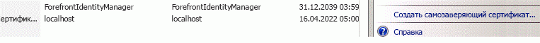
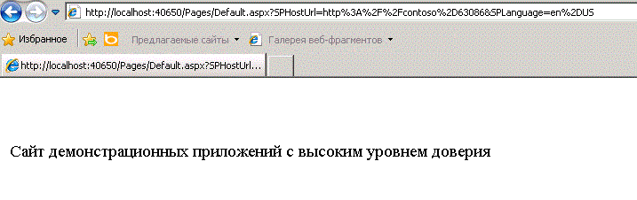

# Создание надстроек с высоким уровнем доверия для SharePoint
Узнайте, как создать надстройку для SharePoint с высоким уровнем доверия. Надстройка с высоким уровнем доверия использует цифровые сертификаты, чтобы установить доверие между удаленным веб-приложением и SharePoint 2013. Надстройки с высоким уровнем доверия могут быть установлены только на локальную версию SharePoint, а не на Microsoft SharePoint Online, и в первую очередь предназначены для использования локально, а не для веб-приложений на базе облака.
## Предварительные требования для создания надстроек с высоким уровнем доверия
<a name="Prereqs"> </a>

Для выполнения действий, приведенных в данной статье, необходимо следующее.
  
    
    

- Локальная среда разработки SharePoint 2013. См. раздел  [Настройка локальной среды разработки надстроек SharePoint](set-up-an-on-premises-development-environment-for-sharepoint-add-ins.md) для получения инструкций по установке. В частности убедитесь, что завершили действия в разделе [Настройка служб в SharePoint для межсерверного использования надстройки](set-up-an-on-premises-development-environment-for-sharepoint-add-ins.md#Servertoserver).
    
  
- Создание приложения для SharePoint с размещением у поставщика. См. раздел  [Знакомство с созданием надстроек SharePoint с размещением у поставщика](get-started-creating-provider-hosted-sharepoint-add-ins.md).
    
  
- Среда Visual Studio установлена удаленно или на компьютере с SharePoint 2013.
    
  
- Инструменты разработчика Microsoft Office для Visual Studio.
    
  
- Представление о том, что такое цифровые сертификаты и как их использовать.
    
  
Прочтите следующие статьи, чтобы больше узнать о надстройках для SharePoint с высоким уровнем доверия и цифровых сертификата.
  
    
    

**Таблица 1. Основные принципы настройки SharePoint 2013 для выполнения надстроек с высоким уровнем доверия**


|**Название статьи**|**Описание**|
|:-----|:-----|
| [Знакомство с созданием надстроек SharePoint с размещением у поставщика](get-started-creating-provider-hosted-sharepoint-add-ins.md) <br/> |Узнайте, как создать простейшую надстройку для SharePoint, размещаемую у поставщика, с помощью Инструменты разработчика Office для Visual Studio, как взаимодействовать с сайтами SharePoint 2013 с помощью SharePoint CSOM.  <br/> |
| [Digital Certificates](http://msdn.microsoft.com/library/e523b335-0156-4f47-b55c-b80495587c4f.aspx) и [Working with Certificates](http://msdn.microsoft.com/library/6ffb8682-8f07-4a45-afbb-8d2487e9dbc3.aspx) <br/> |Основы работы с цифровыми сертификатами.  <br/> |
   

## Общие сведения о запуске надстроек с высоким уровнем доверия
<a name="Intro"> </a>

Надстройка с высоким уровнем доверия — это Надстройка SharePoint, которая размещается у поставщика и использует сертификаты для установки высокого уровня доверия между веб-приложением и SharePoint. Высокий уровень доверия — это не то же самое, что полное доверие. Надстройка с высоким уровнем доверия должна запрашивать разрешение надстройки. Высокий уровень доверия означает, что надстройка может использовать любое необходимое удостоверение пользователя, так как она ответственна за создание той части маркера доступа, которую передает SharePoint.
  
    
    
Надстройка SharePoint с высоким уровнем доверия в первую очередь предназначена для использования в локальной среде. Надстройки с высоким уровнем доверия не могут быть установлены в Microsoft SharePoint Online, и удаленные компоненты обычно тоже устанавливаются локально с использованием корпоративного брандмауэра. Таким образом, экземпляры надстроек SharePoint уникальны для каждой конкретной компании.
  
    
    
Надстройка с высоким уровнем доверия использует сертификат для установления доверия вместо маркера контекста. (Надстройку, размещаемую поставщиком для использования Служба контроля доступа Microsoft Azure (ACS) в качестве доверенного брокера, необходимо изменить, чтобы она работала как приложение с высоким уровнем доверия.) Надстройку с высоким уровнем доверия необходимо настроить на ферме SharePoint и на сервере, где размещается удаленное веб-приложение. В этом разделе указаны шаги настройки, которые необходимо предпринять для работы отладки Visual Studio ( **F5**). Настройка тестовой, промежуточной и продуктивной среды имеет свои отличия и описана в разделе  [Упаковка и публикация надстроек с высоким уровнем доверия для SharePoint](package-and-publish-high-trust-sharepoint-add-ins.md). 
  
    
    
В SharePoint 2013 служба маркеров безопасности S2S предоставляет маркеры доступа для проверки подлинности по протоколу S2S. Эти временные маркеры обеспечивают доступ к другим службам приложения, например Exchange 2013, Lync 2013 и надстройкам для SharePoint 2013. Отношение доверия между службами приложения (например, SharePoint доверяет удаленной надстройке, которая, в свою очередь, доверяет SharePoint) устанавливается с помощью командлетов Windows PowerShell и сертификата.
  
    
    

> **Примечание**
> Служба маркеров безопасности S2S не предназначена для проверки подлинности пользователей. Поэтому она не указывается на странице входа для пользователей, в разделе **Служба проверки подлинности** в центре администрирования или в средстве выбора людей в SharePoint 2013.
  
    
    

В этой статье рассматриваются инструкции по созданию надстроек с высоким уровнем доверия и их настройке для запуска в Visual Studio при нажатии на кнопку **F5**. Вы научитесь выполнять следующие действия.
  
    
    

- настройка надстройки для использования в качестве надстройки с высоким уровнем доверия;
    
  
- настройка SharePoint 2013 для использования надстроек с высоким уровнем доверия;
    
  
- создание простейшей надстройки с высоким уровнем доверия.
    
  

## Получение или создание общего и закрытого тестовых сертификатов
<a name="Cert2"> </a>

Для удаленного веб-приложения вашей надстройки с высоким уровнем доверия необходим цифровой сертификат X.509. Чтобы можно было полностью протестировать надстройку для SharePoint, требуется сертификат, выданный доменом, или коммерческий сертификат, выданный в центре сертификации. Тем не менее, для начальной фазы отладки можно использовать самозаверяющий сертификат. Следующая процедура описывает создание и экспорт тестового сертификата с помощью IIS. Сведения о том, как изменить самозаверяющий сертификат на сертификат, выданный доменом, или коммерческий сертификат можно найти ниже в разделе  [Полная отладка с сертификатом, выданным доменом, или коммерческим сертификатом](#NewCertificate).
  
    
    
Вы также можете создать тестовый сертификат X.509 с помощью тестовой программы MakeCert. Дополнительные сведения о ее использовании см. в статье  [Подпись и проверка кода с помощью технологии Authenticode](http://msdn.microsoft.com/ru-ru/library/ms537364%28vs.85%29.aspx).
  
    
    
Сначала необходимо создать тестовый PFX-файл сертификата, а затем — соответствующий CER-файл. PFX-файл сертификата содержит закрытый ключ, который используется удаленным веб-приложением для цифровых подписей в SharePoint. CER-файл сертификата содержит открытый ключ, с помощью которого SharePoint расшифровывает подписи, проверяет, что они отправлены удаленным веб-приложением, и проверяет, что удаленное веб-приложение имеет маркер доступа от поставщика маркера, которому доверяет SharePoint. Дополнительные сведения о PFX- и CER-файлах см. в разделе  [Software Publisher Certificate](http://msdn.microsoft.com/ru-ru/library/windows/hardware/ff552299%28v=vs.85%29.aspx)
  
    
    

### Создание самозаверяющего PFX-файла сертификата


1. При отладке надстройки для SharePoint с высоким уровнем доверия в Visual Studio удаленное веб-приложение размещается в IIS Express на компьютере, где установлен Visual Studio. Поэтому на компьютере с удаленным веб-приложением может быть не установлен диспетчер IIS для создания сертификатов. По этой причине для создания сертификата необходимо использовать IIS на тестовом сервере  *SharePoint*  . В диспетчере IIS выберите узел _ServerName_ в представлении в виде дерева слева.
    
  
2. Щелкните значок **Сертификаты сервера**, как показано на рис. 1.
    
   **Рис. 1. Элемент "Сертификаты сервера" в IIS**

  

     
  

  

  
3. Выберите ссылку **Создать самозаверяющий сертификат** из списка ссылок справа, как показано на рис. 2.
    
   **Рис. 2. Ссылка "Создать самозаверяющий сертификат"**

  

     
  

  

  
4. Задайте для сертификата имя HighTrustSampleCert и нажмите кнопку **ОК**.
    
  
5. Щелкните сертификат правой кнопкой мыши и выберите команду **Экспорт**, как показано на рис. 3.
    
   **Рис. 3. Экспорт тестового сертификата**

  

     
  

  

  
6. В Windows или в командной строке создайте папку C:\\Certs.
    
  
7. В диспетчере IIS экспортируйте файл в папку C:\\Certs и задайте для него пароль. В этом примере используется пароль **password**.
    
  
8. Если тестовая версия SharePoint установлена не на том компьютере, где установлен Visual Studio, создайте папку C:\\Certs в компьютере с Visual Studio и переместите туда файл HighTrustSampleCert.pfx. На этом компьютере будет работать удаленное веб-приложение при запуске отладки в Visual Studio.
    
  

### Создания соответствующего CER-файла


1. На сервере SharePoint убедитесь, что удостоверение пула надстроек для следующих пулов надстроек IIS имеет права для чтения в папке C:\\Certs:
    
  - **SecurityTokenServiceApplicationPool**
    
  
  - Пул надстроек, обслуживающий веб-сайт IIS, на котором размещается родительское веб-приложение SharePoint для тестового веб-сайта SharePoint. Пул для веб-сайта IIS **SharePoint - 80** называется **OServerPortalAppPool**.
    
  
2. В диспетчере IIS выберите узел  _Имя сервера_ в представлении в виде дерева слева.
    
  
3. Дважды щелкните на пункт **Сертификаты сервера**.
    
  
4. В представлении **Сертификаты сервера** дважды щелкните сертификат **HighTrustSampleCert**, чтобы просмотреть сведения о нем.
    
  
5. На вкладке **Сведения** нажмите кнопку **Копировать в файл**, чтобы запустить **мастер экспорта сертификатов**, а затем нажмите кнопку **Далее**.
    
  
6. Оставьте значение по умолчанию **Нет, не экспортировать закрытый ключ** и нажмите кнопку **Далее**.
    
  
7. Оставьте значения по умолчанию. Нажмите кнопку **Далее**.
    
  
8. Нажмите кнопку **Обзор**, перейдите в папку C:\\Certs, назовите файл сертификата **HighTrustSampleCert** и нажмите кнопку **Сохранить**. Сертификат будет сохранен как CER-файл.
    
  
9. Нажмите кнопку **Далее**.
    
  
10. Нажмите кнопку **Готово**.
    
  

## Настройка SharePoint 2013 для использования сертификатов и настройки доверия для надстройки
<a name="Configure2"> </a>

Сценарий Windows PowerShell, который вы создали в этом разделе, направлен на поддержку использования **F5** в Visual Studio. Он *не*  сможет должным образом настроить промежуточную установку или установку продукта SharePoint. Сведения о настройке SharePoint для использования сертификатов см. в разделе [Упаковка и публикация надстроек с высоким уровнем доверия для SharePoint](package-and-publish-high-trust-sharepoint-add-ins.md).
  
    
    

> **Примечание**
> Убедитесь, что вы завершили шаги, описанные в разделе  [Настройка служб в SharePoint для межсерверного использования надстройки](set-up-an-on-premises-development-environment-for-sharepoint-add-ins.md#Servertoserver) (которые указаны как необходимые условия для этой статьи). Если нет, это нужно сделать сейчас, до того, как вы продолжите.
  
    
    


### Настройка SharePoint


1. В текстовом редакторе или в редакторе Windows PowerShell создайте новый файл и добавьте следующие строки для создания объекта сертификата.
    
 ```
  
$publicCertPath = "C:\\Certs\\HighTrustSampleCert.cer"
$certificate = New-Object System.Security.Cryptography.X509Certificates.X509Certificate2($publicCertPath)

 ```

2. Добавьте следующую строку, чтобы гарантировать, что SharePoint будет относиться к сертификату как к корневому центру.
    
 ```
  
New-SPTrustedRootAuthority -Name "HighTrustSampleCert" -Certificate $certificate

 ```

3. Добавьте следующую строку, чтобы получить идентификатор области авторизации.
    
 ```
  
$realm = Get-SPAuthenticationRealm

 ```

4. Удаленное веб-приложение будет использовать маркер доступа, чтобы получить доступ к данным SharePoint. Маркер доступа должен быть выдан поставщиком маркера, которому SharePoint доверяет. В приложении для SharePoint с высоким уровнем доверия поставщиком маркера является сертификат. Добавьте следующие строки, чтобы создать идентификатор поставщика в том формате, который требуется SharePoint: ** _specific_issuer_GUID_@ _realm_GUID_**.
    
 ```
  
$specificIssuerId = "11111111-1111-1111-1111-111111111111"
$fullIssuerIdentifier = $specificIssuerId + '@' + $realm 

 ```


    > **Примечание**
      > Значение  `$specificIssuerId` должно быть GUID, поскольку в рабочей среде у каждого сертификата должен быть уникальный поставщик. Однако в этом случае, когда один и тот же сертификат используется для отладки всех надстроек с высоким уровнем доверия вы можете встроить значение в код. Если по любой причине вы используете GUID, отличающийся от того, который используется здесь, * **убедитесь, что все буквы в GUID находятся в нижнем регистре*** . В настоящее время для инфраструктуры SharePoint требуется нижний регистр поставщика сертификатов GUID.
5. Добавьте следующие строки, чтобы зарегистрировать сертификат как доверенного поставщика маркеров. Параметр  `-Name` должен быть уникальным, поскольку в рабочей конфигурации GUID обычно используется как часть имени или все имя, но в этом случае можно использовать понятное имя. Переключатель `-IsTrustBroker` необходим, чтобы гарантировать, что вы можете использовать тот же сертификат для всех надстроек с высоким уровнем доверия, которые вы разрабатываете. Команда `iisreset` требуется для немедленной регистрации поставщика маркера. Без нее, возможно, придется ждать до 24 часов для регистрации поставщика.
    
 ```
  
New-SPTrustedSecurityTokenIssuer -Name "High Trust Sample Cert" -Certificate $certificate -RegisteredIssuerName $fullIssuerIdentifier -IsTrustBroker
iisreset 

 ```

6. SharePoint 2013 обычно не принимает самозаверяющие сертификаты. Поэтому когда вы используете самозаверяющие сертификаты для отладки, добавьте следующие строки, чтобы отключить стандартное требование SharePoint об использовании HTTPS при запросе SharePoint удаленными веб-приложениями. Если вы этого не сделаете, то получите сообщение **403 (запрещено)** при запросе SharePoint удаленным веб-приложением с самозаверяющим сертификатом. Этот шаг необходимо будет позже отменить. Отключение требования HTTPS означает, что запросы удаленного веб-приложения в SharePoint не шифруются, но сертификат все еще является доверенным поставщиком маркеров доступа, что является его основной функцией в приложениях для SharePoint с высоким уровнем доверия.
    
 ```
  
$serviceConfig = Get-SPSecurityTokenServiceConfig
$serviceConfig.AllowOAuthOverHttp = $true
$serviceConfig.Update()

 ```

7. Сохранение файла с именем HighTrustConfig-ForDebugOnly.ps1.
    
  
8. Откройте **командную консоль SharePoint** от имени администратора и запустите файл со следующей строкой:
    
 ```
  
./HighTrustConfig-ForDebugOnly.ps1
 ```


## Как создать надстройку для SharePoint с высоким уровнем доверия
<a name="Createapp2"> </a>

В этом разделе вы узнаете, как создать надстройку для SharePoint с высоким уровнем доверия с помощью Visual Studio.
  
    
    

> **Примечание**
> Как указано в разделе  [Предварительные требования для создания надстройки с высоким уровнем доверия](#Prereq), в этой статье предполагается, что вы умеете создавать надстройку для SharePoint, размещаемую у поставщика. Дополнительные сведения см. в разделе  [Знакомство с созданием надстроек SharePoint с размещением у поставщика](get-started-creating-provider-hosted-sharepoint-add-ins.md). 
  
    
    


### Как создать надстройку для SharePoint с высоким уровнем доверия


1. В меню Visual Studio выберите пункт **Файл**, **Создать**, затем **Проект**.
    
  
2. В **мастере создания проекта** разверните узел **Visual C#** или **Visual Basic**, после чего разверните узел **Office/SharePoint**.
    
  
3. Выберите **Надстройки**, а затем создайте проект **надстройки для SharePoint**.
    
  
4. Назовите проект HighTrustSampleApp.
    
  
5. Сохраните проект в любой папке на свой выбор и нажмите кнопку **ОК**.
    
  
6. Укажите полный URL-адрес сайта разработчика SharePoint. Например, http://TestServer/sites/devsite/
    
  
7. Выберите вариант **Размещение у поставщика**, а затем нажмите кнопку **Далее**.
    
  
8. Если вам предложили указать тип веб-проекта, выберите **приложение веб-форм ASP.NET** в качестве основного примера данного раздела, а затем нажмите на кнопку **Далее**.
    
  
9. Откроется страница **мастера настроек параметров проверки подлинности**. Значение, которые вы добавите в эту форму будут автоматически добавлены в файл web.config. В разделе **Как надстройка должна проводить проверку подлинности?** выберите пункт **Использовать сертификат**.
    
  
10. Щелкните на кнопку **Обзор** рядом с полем **Расположение сертификата** и укажите путь к самозаверяющему сертификату (PFX-файл), который вы создали (C:\\Certs). Необходимо указать полный путьC:\\Certs\\HighTrustSampleCert.pfx. 
    
  
11. Введите пароль этого сертификата в поле **Пароль**. В данном случае это — "password".
    
  
12. Введите идентификатор поставщика ( `11111111-1111-1111-1111-111111111111`) в поле **Идентификатор поставщика**.
    
  
13. Нажмите кнопку **Готово**. Основная часть операций по настройке совершается при открытии решения. В решении Visual Studio создаются два проекта: один для приложения для SharePoint, а другой — для веб-приложения ASP.NET.
    
  

### Запуск и отладка надстройки


1. Инструменты разработчика Office для Visual Studio автоматически создает файлы default.aspx и default.aspx.cs при создании проекта ASP.NET. Созданный код получает название хост-сайта SharePoint и отображает его на странице по умолчанию удаленного веб-приложения. Точная пометка и код этих файлов зависит от версии средств. Для этой темы используются файлы default.aspx и default.aspx.cs без изменений.
    
  
2. Чтобы протестировать надстройку для SharePoint и ее удаленное веб-приложение, нажмите клавишу **F5** в Visual Studio. Веб-приложение будет развернуто в IIS Express на сайте *localhost*  . Надстройка для SharePoint будет установлена на целевом веб-сайте SharePoint. Система SharePoint выведет запрос на предоставление разрешений, которые запрашивает Надстройка SharePoint. В некоторых версиях Инструменты разработчика Office для Visual Studio надстройка запустится немедленно, а в других откроется страница целевого веб-сайта SharePoint **Содержание сайта**, на которой вы увидите новую надстройку.
    
    Запустите надстройку, если она не запустилась автоматически. В удаленном веб-приложении откроется страница, которую вы указали в качестве **начальной страницы** в файле AppManifest.xml, который является Default.aspx. Надстройка должна выглядеть так, как показано на рисунке 4.
    

   **Рис. 4. Образец надстройки, обращающейся к серверу SharePoint Server и получающей название сайта**

  

     
  

  

  

## Полная отладка с сертификатом, выданным доменом, или коммерческим сертификатом
<a name="NewCertificate"> </a>

Сценарий Windows PowerShell, который вы создали ранее, отключил стандартное требование SharePoint об использовании удаленным веб-приложением протокола HTTPS для доступа к SharePoint. С отключенным HTTPS вы можете пропустить некоторые проблемы во время разработки надстройки, которые появятся во время рабочего развертывания, когда потребуется HTTPS. Соответственно, не стоит считать стадии разработки и отладки завершенными до того, как вы замените тестовый сертификат сертификатом, выданным доменом, или коммерческим сертификатом и заново протестируете надстройку со включенным требованием HTTPS.
  
    
    
При приобретении нового сертификата необходимо назначить для него пароль, если он не назначен. В рабочей среде необходимо использовать надежный пароль. Для того чтобы отладить надстройку для SharePoint, подойдет любой. Вам понадобится сертификат в двух форматах: PFX и CER. Если вы получили файл сертификата не в формате PFX, требуется преобразовать его в формат PFX с помощью служебной программы. Когда вы получите PFX-файл, вы сможете импортировать его в IIS и экспортировать CER-файл, как описано в следующем этапе.
  
    
    

### Импорт нового сертификата


1. Поместите PFX-файл в директорию C:\\Certs на сервере SharePoint. В контексте этой статьи предположим, что файл называется  _MyCert_.pfx. Необходимо заменить во всех инструкциях "MyCert" на действительное имя вашего сертификата.
    
  
2. В диспетчере IIS выберите узел  _Имя сервера_ в представлении в виде дерева слева.
    
  
3. Дважды щелкните значок **Сертификаты сервера** icon.
    
  
4. Выберите пункт **Импорт** в панели **Действия** справа.
    
  
5. В диалоговом окне **Импорт сертификата** нажмите кнопку "Обзор" и откройте C:\\Certs\\ _MyCert_.pfx, затем введите пароль сертификата.
    
  
6. Убедитесь, что параметр **Разрешить экспорт этого сертификата** включен и нажмите кнопку **ОК**.
    
  
7. В списке **Сертификаты сервера** щелкните правой кнопкой мыши сертификат и выберите пункт **Экспорт**, как показано на рис. 3 above.
    
  
8. Экспортируйте файл в папку C:\\Certs и укажите пароль.
    
  
9. Если установка тестовой версии SharePoint произведена не на том компьютере, где установлен Visual Studio, переместите файл  _MyCert_.pfx в папку C:\\Certs на компьютере с установленным Visual Studio. 
    
  
10. В представлении **Сертификаты сервера** дважды щелкните _MyCert_, чтобы отобразить сертификат.
    
  
11. На вкладке **Сведения** нажмите кнопку **Копировать в файл**, чтобы запустить **мастер экспорта сертификатов**, а затем нажмите кнопку **Далее**.
    
  
12. Оставьте значение по умолчанию **Нет, не экспортировать закрытый ключ** и нажмите кнопку **Далее**.
    
  
13. Оставьте значения по умолчанию. Нажмите кнопку **Далее**.
    
  
14. Нажмите кнопку **Обзор**, откройте папку C:\\Certs, назовите сертификат  _MyCert_ и нажмите кнопку **Сохранить**. Сертификат сохраняется как CER-файл.
    
  
15. Нажмите кнопку **Далее**.
    
  
16. Нажмите кнопку **Готово**.
    
  

### Настройка SharePoint 2013 для использования нового сертификата


1. Откройте файл HighTrustConfig-ForDebugOnly.ps1 для редактирования и сделайте следующие изменения.
    
1. Замените  `HighTrustSampleCert` в обоих местах, где он находится с _MyCert_.
    
  
2. Замените идентификатор поставщика  `11111111-1111-1111-1111-111111111111` другим: `22222222-2222-2222-2222-222222222222`.
    
  
3. Замените "High Trust Sample Cert" именем "My Cert" или другим подходящим понятным именем.
    
  
4. В строке  `$serviceConfig.AllowOAuthOverHttp = $true` замените `true` на `false`. Это снова включит требование использования протокола HTTPS.
    
  
2. Сохраните файл.
    
  
3. Откройте **командную консоль SharePoint** от имени администратора и запустите файл со следующей строкой:
    
 ```
  ./HighTrustConfig-ForDebugOnly.ps1
 ```


### Повторная конфигурация удаленного веб-приложения


1. В Visual Studio откройте файл web.config или проект веб-приложения и сделайте следующие изменения.
    
1. В разделе  `ClientSigningCertificatePath` замените `C:\\Certs\\HighTrustSampleCert.pfx` на `C:\\Certs\\` _MyCert_ `.pfx`.
    
  
2. Замените ключевое значение  `ClientSigningCertificatePassword` действительным паролем сертификата.
    
  
3. Замените ключевое значение  `IssuerId` на `22222222-2222-2222-2222-222222222222`.
    
  
2. Нажмите клавишу **F5** для отладки надстройки.
    
  
Завершив разработку надстройки с высоким уровнем доверия, обратитесь к разделу  [Упаковка и публикация надстроек с высоким уровнем доверия для SharePoint](package-and-publish-high-trust-sharepoint-add-ins.md), чтобы упаковать и опубликовать эту надстройку для SharePoint.
  
    
    

## Назначение файлов TokenHelper и SharePointContext
<a name="TokenHelper"> </a>

Инструменты разработчика Office для Visual Studio включает файл TokenHelper.cs (или с расширением VB) в удаленное веб-приложение. Некоторые версии средств также содержат файл SharePointContext.cs (или с расширением VB). Код в этих файлах выполняет следующие операции.
  
    
    

- Настраивает в .NET доверие к сертификатам при выполнении сетевых вызовов. 
    
  
- Получает маркер доступа S2S, подписанный с помощью закрытого сертификата удаленного веб-приложения от имени указанного объекта **WindowsIdentity**, который SharePoint 2013 использует для установления доверия.
    
  
- Получает сертификат службы маркеров безопасности SharePoint (STS).
    
  
- В надстройках, использующих систему авторизации не с высоким, а с низким уровнем доверия, у этих файлов есть дополнительные задачи. Например, обработка маркеров OAuth для сценария, описанного в статье  [Поток маркеров контекста OAuth для надстроек в SharePoint](context-token-oauth-flow-for-sharepoint-add-ins.md). В этой статье упомянутый сценарий не рассматривается. 
    
  
Дополнительные сведения о TokenHelper и SharePointContext см. в комментариях в файлах.
  
    
    
В надстройке с высоким уровнем доверия нет маркера контекста. Маркер контекста применяется в конфигурациях, использующих авторизацию с низким уровнем доверия. При этом маркер доступа все равно требуется. Если вы используете конфигурацию с высоким уровнем доверия, ваше веб-приложение должно аутентифицировать пользователя, как это делает SharePoint. Другими словами, надстройка отвечает за создание маркера доступа, включая идентификаторы пользователя и поставщика удостоверений. 
  
    
    
Когда вы выполняете отладку в Visual Studio с помощью клавиши **F5**, Инструменты разработчика Microsoft Office для Visual Studio использует проверку подлинности Windows. При этом два созданных файла кода используют идентификатор пользователя Windows, запустившего надстройку, для создания маркера доступа. Чтобы можно было не изменять эти два файла, после публикации надстройки настройте в диспетчере IIS удаленное веб-приложение так, чтобы оно использовало проверку подлинности Windows. Если такая проверка нежелательна в рабочей среде, настройте созданные файлы кода, TokenHelper и SharePointContext, для использования другой системы аутентификации. Настройка этих файлов также требуется, если удаленное веб-приложение получает доступ к SharePoint с идентификатором пользователя, отличного от того, который запустил надстройку для SharePoint. Наконец, рассмотрим ситуацию, когда удаленное веб-приложение создано с помощью языков PHP или Java, а также node.js или другой платформы, отличной от ASP.NET. В этом случае вашему коду необходимо получить идентификатор пользователя от используемой системы аутентификации, а затем добавить этот идентификатор в маркер доступа, который он создает. Дополнительные сведения см. в статьях  [Упаковка и публикация надстроек с высоким уровнем доверия для SharePoint](package-and-publish-high-trust-sharepoint-add-ins.md),  [Создание и использование маркеров доступа в надстройках с высоким уровнем доверия для SharePoint, размещаемых у поставщика](create-and-use-access-tokens-in-provider-hosted-high-trust-sharepoint-add-ins.md) и [SharePoint 2013: надстройки для SharePoint на сайтах, на которых используется SAML и FBA](http://blogs.technet.com/b/speschka/archive/2012/12/07/using-sharepoint-apps-with-saml-and-fba-sites-in-sharepoint-2013.aspx).
  
    
    

## Дополнительные ресурсы
<a name="bk_addresources"> </a>


-  [Упаковка и публикация надстроек с высоким уровнем доверия для SharePoint](package-and-publish-high-trust-sharepoint-add-ins.md)
    
  
-  [Советы по устранению неполадок надстроек с высоким уровнем доверия в SharePoint 2013](http://blogs.technet.com/b/speschka/archive/2012/11/01/more-troubleshooting-tips-for-high-trust-apps-on-sharepoint-2013.aspx)
    
  
-  [Регистрация надстроек для SharePoint 2013](register-sharepoint-add-ins-2013.md)
    
  
-  [Авторизация и проверка подлинности для надстроек в SharePoint 2013](authorization-and-authentication-of-sharepoint-add-ins.md)
    
  
-  [Объявление о новом помощнике SharePointContext в надстройках для SharePoint 2013](http://blogs.msdn.com/b/officeapps/archive/2013/11/07/announcing-the-new-sharepointcontext-helper-in-apps-for-sharepoint-2013.aspx)
    
  
-  [Разрешения для надстроек в SharePoint 2013](add-in-permissions-in-sharepoint-2013.md)
    
  
-  [Знакомство с созданием надстроек SharePoint с размещением у поставщика](get-started-creating-provider-hosted-sharepoint-add-ins.md)
    
  

