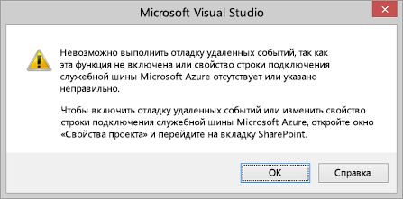
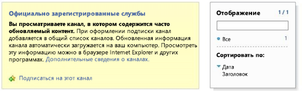

# Устранение неполадок и отладка удаленного приемника событий в надстройке для SharePoint
Сведения о настройке среды разработки для отладки удаленных событий с помощью Visual Studio.
## Настройка отладки для удаленного сайта тестирования SharePoint

> [!Примечание]
> Описанные в этом разделе действия применимы, только если Visual Studio и тестовый сайт SharePoint развернуты на разных компьютерах, а также если в качестве тестового сайта используется Сайт разработчика SharePoint Online. Если SharePoint и Visual Studio развернуты на одном компьютере, пропустите этот раздел. 
  
    
    

Если проект Надстройка SharePoint в Visual Studio содержит приемник удаленных событий (RER) или приемник событий надстройки, то для отладки надстройки с помощью клавиши F5 нужно выполнить дополнительную быструю настройку свойств проекта. А для этого, в свою очередь, требуется настроить Azure. Не нужно повторно настраивать Azure для каждого подобного проекта. Если надстройка содержит обработчик событий AppInstalled, она не запустится ни с помощью клавиши F5, ни с помощью клавиш CTRL+F5 (запуск без отладки), пока не будут выполнены настройки, описанные в этом разделе.
  
    
    

### Настройка Azure

1. Если у вас нет подписки на Microsoft Azure, получите ее. Она входит в  [подписку на MSDN](http://azure.microsoft.com/ru-ru/pricing/member-offers/msdn-benefits/).
    
  
2. Следуйте инструкциям в разделе  [How To: Create or Modify a Service Bus Service Namespace](http://msdn.microsoft.com/library/fa561f70-007c-45aa-b34d-56317dbbfc87.aspx).
    
  

### Настройка проекта надстройки SharePoint в Visual Studio

1. Вам потребуется последняя версия Инструменты разработчика Office для Visual Studio 2013, поэтому  [запустите установщик веб-платформы, расположенный по ссылке ](http://aka.ms/OfficeDevToolsForVS2013), или  [установщик Инструментов разработчика Microsoft Office для Visual Studio 2015](http://aka.ms/OfficeDevToolsForVS2015).
    
  
2. Добавив приемник удаленных событий (RER) или обработчик событий надстройки в проект Надстройка SharePoint в Visual Studio, щелкните правой кнопкой мыши проект в области **Обозреватель решений** и выберите элемент **Свойства**.
    
  
3. В области "Свойства" откройте вкладку **SharePoint** и прокрутите ползунок вниз.
    
  
4. Установите флажок **Включить отладку через служебную шину Microsoft Azure**.
    
  
5. В текстовом поле введите полную строку подключения. Вот как можно ее получить:
    
1. Войдите на портал Azure и откройте вкладку **Служебная шина**.
    
  
2. Откройте пространство имен, созданное для отладки удаленного приемника событий (RER), и перейдите к строкам подключения. Пользовательский интерфейс портала Azure часто меняется. Если не удается найти строки подключения, см.  [справку по порталу Azure](https://msdn.microsoft.com/ru-ru/library/azure/dn578292.aspx).
    
  
3. Скопируйте строку подключения **SAS**. Это строка, которую вы указываете в свойствах проекта Visual Studio.
    
  
В дальнейшем при создании проектов Надстройка SharePoint в Visual Studio эти сведения будут заполнены заранее, поэтому не потребуется каждый раз открывать портал Azure.
## Проверка настроек

Действия, описанные в этом разделе, помогут убедиться, что можно выполнять отладку приемника удаленных событий (RER).
  
    
    

### Создание проекта приемника удаленных событий

1. В Visual Studio создайте Надстройка SharePoint с размещением у поставщика.
    
    См. статью  [Знакомство с созданием надстроек SharePoint с размещением у поставщика](get-started-creating-provider-hosted-sharepoint-add-ins.md).
    
  
2. Выберите узел проекта надстройки в **обозревателе решений**.
    
  
3. В строке меню выберите пункты **Проект** и **Добавить элемент**.
    
  
4. На панели **Шаблоны** выберите шаблон **Список**, а затем нажмите кнопку **Добавить**.
    
  
5. Нажмите кнопку **Готово**, чтобы добавить настраиваемый список по умолчанию в проект надстройки.
    
  
6. Добавьте в проект надстройки другой элемент. Для этого в области **Шаблоны** выберите шаблон **Приемник удаленных событий**.
    
  
7. В поле **Имя** оставьте имя, указанное по умолчанию (RemoteEventReceiver1), а затем нажмите кнопку **Добавить**.
    
  
8. В списке **Тип приемника событий:** выберите **События элемента списка**. 
    
    В качестве источника события оставьте **List1**, список, который вы добавили в предыдущих действиях.
    
  
9. В списке **Обработать следующие ошибки** выберите пункт **Добавляется элемент**, а затем нажмите кнопку **Готово**.
    
    Веб-сервис будет добавлен в веб-приложение для управления удаленным событием, которое вы указали. Приемник удаленных событий будет добавлен в Надстройка SharePoint. Он будет ссылаться на веб-службы и события элемента списка в файле Elements.xml приемника событий.
    
  
10. В проекте надстройки откройте файл AppManifest.xml.
    
  
11. Замените начальную страницу на страницу списка:  _AddInProjectName_/Lists/List1.
    
    Замените  _AddInProjectName_ на имя проекта надстройки, напримерSharePointAddIn4/Lists/List1. В этом примере начальной страницей назначается страница списка. Но в типичной надстройке ссылка, скорее всего, будет вести к собственному пользовательскому интерфейсу на странице веб-проекта.
    
  

### Запуск и тестирование отладки обработчика событий

1. Если вы еще не сделали этого, выполните действия, описанные в разделе **Настройка проекта надстройки SharePoint в Visual Studio** этой статьи.
    
  
2. В веб-проекте откройте службу приемника удаленных событий (RemoteEventReceiver1.svc), а затем добавьте точку останова в любую строку кода внутри метода  `ProcessEvent()`.
    
  
3. Нажмите клавишу **F5** для запуска проекта.
    
  
4. Нажмите кнопку **+ Новый элемент**, чтобы добавить элемент в список.
    
  
5. Укажите для элемента название, а затем нажмите кнопку **Сохранить**.
    
    Когда будет достигнута точка останова, которую вы добавили для приемника удаленных событий, будет подтверждено выполнение отладки приемника удаленных событий.
    
  
6. Нажмите клавишу **F5**, чтобы продолжить выполнение проекта, а когда он будет выполнен, завершите отладку.
    
  

## Включение и отключение уведомления Visual Studio о том, что требуется настроить отладку событий

Если в проекте используется удаленное событие, а отладка удаленных событий еще не настроена, Visual Studio предлагает настроить такую отладку (см. рисунок 1). Чтобы это предложение не отображалось, снимите флажок **Уведомлять меня, если отладка удаленных событий не настроена** на вкладке **SharePoint**.
  
    
    

**Рисунок 1. Уведомление об отладке удаленных событий**

  
    
    

  
    
    

  
    
    

  
    
    

  
    
    

## Проверка того, размещена ли служба в служебной шине

Нажав клавишу F5 и включив доверие для надстройки, перейдите в браузере к пространству имен служебной шины, например http://mynamespace.servicebus.windows.net, и вы увидите конечную точку в виде числа. На рисунке 2 показано, как выглядит страница, когда  *не*  указано пространство имен (то есть до нажатия клавиши F5).
  
    
    

**Рисунок 2. Переход к пространству имен служебной шины**

  
    
    

  
    
    

  
    
    

  
    
    

  
    
    

## Приемник удаленных событий не достигает точки останова

Удаленные события бывают синхронными и асинхронными. Если событие асинхронное, то для активации точки останова может потребоваться несколько секунд или больше времени.
  
    
    

## Ошибка: "Ни одна точка не выполняла прослушивание"

Следующая ошибка отображается при запуске обработчика в рабочей среде:
  
    
    
"Ошибка вызова приемника удаленных событий. Сведения: прослушивание на https:// _{domain}_: _nnnnn_/ _{path}_/AppEventReceiver.svc не выполняла ни одна конечная точка, которая могла бы принять сообщение. Это могло быть вызвано неправильным адресом или действием SOAP." При этом  _nnnnn_ является портом.
  
    
    
SharePoint требует отсутствия явного порта в URL-адресе обработчика в рабочей среде. Это означает, что вам необходимо использовать либо порт 443 для HTTPS, что мы и рекомендуем, либо порт 80 для HTTP. 
  
    
    

## Ошибка: "Не удалось установить доверительные отношения для защищенного канала SSL/TLS с полномочиями"

Следующая ошибка отображается при запуске обработчика в рабочей среде:
  
    
    
"Ошибка вызова приемника удаленных событий. Ошибка: "Не удалось установить доверительные отношения для защищенного канала SSL/TLS с полномочиями"
  
    
    
Когда надстройка находится в Microsoft SharePoint Online, но приемник удаленных событий расположен в локальной среде и использует HTTPS согласно нашим рекомендациям, сервер, на котором размещен приемник, не может использовать самозаверяющий сертификат в рабочей среде. Серверу необходим общепринятый сертификат от центра сертификации. Если надстройка является локальной фермой SharePoint, самозаверяющие сертификаты принимаются.
  
    
    

## Дополнительные ресурсы

-  [Обработка событий в надстройках SharePoint](handle-events-in-sharepoint-add-ins.md)
    
  
-  [Отладка удаленных событий SharePoint 2013 с помощью Visual Studio 2012](http://blogs.msdn.com/b/officeapps/archive/2013/03/21/update-to-debugging-sharepoint-2013-remote-events-using-visual-studio-2012.aspx)
    
  

