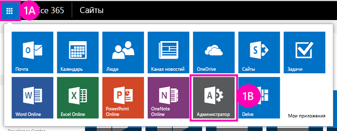

# Развертывание и установка надстроек для SharePoint
Узнайте, как развернуть и установить Надстройки SharePoint.
Это вторая часть из серии статей об основах разработки Надстройки SharePoint с размещением в SharePoint. Сначала вам необходимо ознакомиться с разделом  [Надстройки SharePoint](sharepoint-add-ins.md) и предыдущими статьями этой серии:

-  [Знакомство с созданием надстроек SharePoint с размещением в SharePoint](get-started-creating-sharepoint-hosted-sharepoint-add-ins.md)

> **Примечание**
> Если вы уже изучали предыдущие статьи серии о надстройках с размещением в SharePoint, то у вас есть решение Visual Studio, которое можно использовать для продолжения работы с этим разделом. Вы также можете скачать репозиторий по адресу  [SharePoint_SP-hosted_Add-Ins_Tutorials](https://github.com/OfficeDev/SharePoint_SP-hosted_Add-Ins_Tutorials) и открыть файл BeforeColumns.sln.

Размещаемые в SharePoint Надстройки SharePoint будет намного проще разрабатывать, зная, как пользователи развертывают и устанавливают надстройки. Поэтому в этой статье мы отвлечемся от кода, чтобы создать и использовать каталог надстроек, а затем установим надстройку, над которой вы работали.
## Создание каталога надстроек

1. Войдите в вашу подписку Office 365 в качестве администратора. Выберите значок службы запуска надстройки, а затем выберите надстройку **Администрирование**.

   **Средство запуска надстроек Office 365**

2. В **Центре администрирования** разверните узел **Администрирование** в области задач и выберите **SharePoint**.

3. В области задач **Центра администрирования SharePoint** выберите **надстройки**.

4. На странице **надстройки** выберите пункт **Каталог надстроек**. (Если в подписке уже есть семейство веб-сайтов каталога надстроек, он откроется, а вам ничего делать не придется. Невозможно создать несколько каталогов в одной подписке.)

5. На странице **Сайт каталога надстроек** нажмите кнопку **ОК**, чтобы принять параметр по умолчанию и создать новый сайт каталога надстроек.

6. В диалоговом окне **Создание семейства веб-сайтов каталога надстроек** укажите название и адрес сайта каталога надстроек. Рекомендуется добавить в название слово "каталог" и ввести URL-адрес, чтобы сделать его запоминающимся и отличающимся в **Центре администрирования SharePoint**.

7. Выберите **часовой пояс** и укажите себя как **администратора**.

8. Выберите минимально возможную **квоту хранилища** (в настоящее время это 110, но значение можно изменить), потому что пакеты надстроек, которые будут передаваться в это семейство веб-сайтов, совсем небольшие.

9. Задайте для параметра **Квота ресурсов сервера** значение 0 (ноль) и нажмите **ОК**. (Квота ресурсов сервера связана с регулированием изолированные решения с низкой производительностью, но на сайте каталога надстроек не будут устанавливаться изолированные решения.)

При создании семейства веб-сайтов SharePoint возвращает вас в **Центр администрирования SharePoint**. Через несколько минут вы увидите, что коллекция создана.
## Упаковка надстройки и ее отправка в каталог

1. Откройте решение Visual Studio и щелкните правой кнопкой узел проекта в **обозревателе решений**. Нажмите кнопку **Опубликовать**.

2. В области **Публикация** выберите команду **Упаковать надстройку**. Надстройка будет упакована и сохранена как APP-файл в папке \\bin\\debug\\web.publish\\1.0.0.0 решения.

3. Откройте сайт каталога надстроек в браузере и выберите **Надстройки SharePoint** в области навигации.

4. **Каталог Надстройки SharePoint** — это стандартная библиотека ресурсов SharePoint. Отправьте в него пакет надстройки с помощью любых из методов передачи файлов в библиотеки SharePoint.

## Установка надстройки глазами конечного пользователя

1. Перейдите на любой сайт подписки SharePoint Online и откройте страницу **Контент сайта**.

2. Выберите команду **добавить надстройку**, чтобы открыть страницу **Ваши надстройки**.

3. Найдите надстройку **Ориентация сотрудника** в разделе **Надстройки, которые можно добавить** и щелкните его плитку.

4. Выберите **Доверять** в диалоговом окне запроса согласия. Автоматически откроется страница **Контент сайта**, и появится надстройка с сообщением об установке. После завершения установки пользователи могут выбрать плитку, чтобы запустить надстройку.

## Удаление надстройки

Чтобы продолжить улучшать эту Надстройка SharePoint в Visual Studio (см. раздел  [Дальнейшие действия](#Nextsteps)), удалите надстройку, выполнив следующие действия.

1. На странице **Контент сайта** наведите указатель на надстройку, чтобы появилась кнопка выноски ( **...**).

2. Нажмите кнопку выноски, а затем выберите команду **УДАЛИТЬ**.

3. Вернитесь на сайт каталога надстроек и выберите **Надстройки SharePoint** в области навигации.

4. Выделите надстройку и выберите элемент **управление** на панели задач непосредственно над списком, а затем щелкните **Удалить** в меню "Управление".

## 

Настоятельно рекомендуем продолжить изучение этой серии статей о надстройках с размещением в SharePoint, прежде чем переходить к более сложным темам. В следующей статье  [Добавление настраиваемых столбцов в надстройку с размещением в SharePoint](add-custom-columns-to-a-sharepoint-hostedsharepoint-add-in.md) мы вернемся к программированию.

