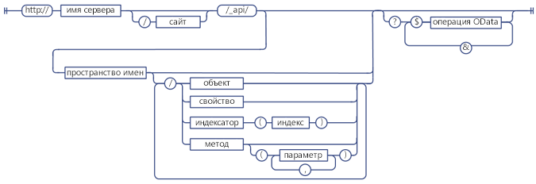
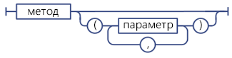
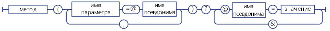
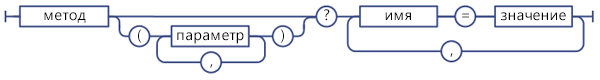
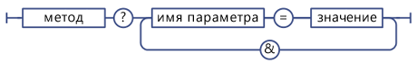

# Определение универсальных кодов ресурсов (URI) конечных точек службы SharePoint REST
Узнайте общие инструкции по определению URI конечных точек SharePoint REST из подписи соответствующих API клиентской объектной модели.
 **Для начала ознакомьтесь со следующими статьями**
  
    
    


-  [Знакомство со службой REST для SharePoint 2013](get-to-know-the-sharepoint-2013-rest-service.md)
    
  
-  [Навигация по структуре данных SharePoint, представленной в службе REST](navigate-the-sharepoint-data-structure-represented-in-the-rest-service.md)
    
  

 **Дальнейшие действия**
  
    
    


-  [Использование операций запросов OData в запросах SharePoint REST](use-odata-query-operations-in-sharepoint-rest-requests.md)
    
  

## Структура URI конечной точки SharePoint REST

Чтобы иметь возможность доступа к ресурсу SharePoint с помощью службы REST, сначала необходимо определить конечную точку URI, которая указывает на этот ресурс. Когда возможно, URI для этих конечных точек REST близко имитирует подпись API ресурса в клиентской объектной модели SharePoint. Пример:
  
    
    
 *Метод клиентской объектной модели:* 
  
    
    
List.GetByTitle(listname).GetItems()
  
    
    
 *Конечная точка REST:* 
  
    
    
 `http://server/site/_api/lists/getbytitle('listname')/items`
  
    
    
Но в некоторых случаях URI конечной точки отличается от соответствующей подписи клиентской объектной модели для соответствия соглашениям REST или OData.
  
    
    
На следующем рисунке показана общая структура синтаксиса URI SharePoint REST.
  
    
    

**Структура синтаксиса URI SharePoint REST**

  
    
    

  
    
    

  
    
    
Некоторые конечные точки для ресурсов SharePoint отклоняются от этой структуры синтаксиса:
  
    
    

- Методы, в качестве параметров которых требуются сложные типы.
    
    Если соответствующий метод клиентской объектной модели требует, чтобы в качестве параметров передавались сложные типы, конечная точка REST может отклоняться от этой структуры синтаксиса в связи с ограничениями REST.
    
  
- Статические методы и свойства.
    
    Конечные точки REST отклоняются от структуры синтаксиса для URI, представляющих статические методы и свойства.
    
  

## Определение конечных точек службы SharePoint 2013 REST

Чтобы создать конечную точку REST для ресурса SharePoint, выполните следующие действия.
  
    
    

1. Начните со ссылки на службу REST:
    
     `http://server/site/_api`
    
  
2. Укажите соответствующую точку входа. Например:
    
     `http://server/site/_api/web`
    
  
3. Перейдите от точки входа к конкретным ресурсам, к которым нужно получить доступ. Это включает указание параметров для конечных точек, которые соответствуют методам в клиентской объектной модели. Например:
    
     `http://server/site/_api/web/lists/getbytitle('listname')`
    
  

### Ссылка на службу SharePoint 2013 REST в URI конечной точки

С помощью  `_api` обозначьте службу SharePoint 2013 REST в своих URI конечной точки. Служба REST входит в веб-службу client.svc. Но чтобы упростить создание URI REST и сократить базовый путь URI REST, в службе REST используется `_api` для исключения необходимости явно ссылаться на веб-службу client.svc. Служба REST по-прежнему распознает и принимает URI, которые ссылаются на веб-службу client.svc. Например, вы можете использовать `http://server/site/_vti_bin/client.svc/web/lists` вместо `http://server/site/_api/web/lists`. Однако рекомендуется использовать соглашение  `_api`. URL-адреса имеют ограничение в 256 символов, а использование  `_api` сокращает базовый URI, позволяя использовать больше символов при создании оставшейся части URL-адреса.
  
    
    

### Указание точек входа для службы SharePoint 2013 REST

Главные точки входа для службы REST представляют семейство сайтов и сайт указанного контекста. Таким образом, эти точки входа отвечают свойствам  [ClientContext.Site](https://msdn.microsoft.com/library/Microsoft.SharePoint.Client.ClientContext.Site.aspx) и [ClientContext.Web](https://msdn.microsoft.com/library/Microsoft.SharePoint.Client.ClientContext.Web.aspx) в клиентских объектных моделях.
  
    
    
Для доступа к определенному семейству веб-сайтов используйте следующую конструкцию:
  
    
    
 `http://server/site/_api/site`
  
    
    
Для доступа к определенному сайту используйте следующую конструкцию:
  
    
    
 `http://server/site/_api/web`
  
    
    
Где  *сервер*  представляет имя сервера, а *сайт*  — имя определенного сайта или путь к нему.
  
    
    
Помимо  `/site` и `/web`, служба REST включает несколько других точек доступа, которые позволяют разработчикам переходить к определенным компонентам. В таблице ниже указаны некоторые из этих точек доступа.
  
    
    


|**Область компонента**|**Точка доступа**|
|:-----|:-----|
|Сайт  <br/> |http:// _server/site_/_api/site  <br/> |
|Интернет  <br/> |http:// _server/site_/_api/web  <br/> |
|Профиль пользователя  <br/> |http:// _server/site_/_api/SP.UserProfiles.PeopleManager  <br/> |
|Поиск  <br/> |http:// _server/site_/_api/search  <br/> |
   

### Переход к определенным ресурсам, к которым необходимо получить доступ

С этой точки можно создавать более конкретные конечные точки REST, ''обходя" объектную модель, с использованием имен API клиентской объектной модели, разделенных знаком косой черты (/). В таблице ниже показаны примеры вызовов клиентских объектных моделей и эквивалентные им конечные точки.
  
    
    


|**API клиентской объектной модели:**|**Конечная точка REST**|
|:-----|:-----|
|ClientContext.Web.Lists  <br/> |http:// _server_/ _site_/_api/web/lists  <br/> |
|ClientContext.Web.Lists[guid]  <br/> |http:// _server_/ _site_/_api/web/lists(' _guid_')  <br/> |
|ClientContext.Web.Lists.GetByTitle("Title")  <br/> |http:// _server_/ _site_/_api/web/lists/getbytitle(' _Title_')  <br/> |
   
В URI конечных точек учитывается регистр букв. Например, в предыдущей таблице используйте  `/getbytitle` для указания эквивалента REST метода **GetByTitle()**.
  
    
    

## Указание параметров в URI конечных точек REST

SharePoint 2013 расширяет спецификацию OData, позволяя использовать скобки для указания параметров метода и значений индекса. Это предотвращает потенциальные проблемы из-за неоднозначности в URI, содержащих несколько параметров с одинаковым именем. Например, два следующих URI содержат параметры с одинаковым именем:
  
    
    
 `http://server/site/_api/web/lists/getByTitle('Announcements')/fields/getByTitle('Description')`
  
    
    
 `http://server/site/_api/web/lists('<guid>')/fields/getById('<guid>')`
  
    
    
Чтобы указать несколько параметров, включите параметр в формате "значение-имя" и разделите параметры запятыми. Например:
  
    
    
 `http://server/site/_api/web/getAvailableWebTemplates(lcid=1033, includeCrossLanguage=true)`
  
    
    
На следующем рисунке показан синтаксис параметров SharePoint REST.
  
    
    

**Синтаксис параметров SharePoint REST**

  
    
    

  
    
    

  
    
    

### Сложные типы в качестве параметров для службы REST

Некоторым методам в клиентской объектной модели в качестве параметра требуются большие полезные данные. Чтобы поддерживалось равенство функциональности конечных точек REST с соответствующими API клиентской объектной модели, конечные точки должны принимать в качестве параметра комплексный тип. В этих случаях служба REST расширяет существующий протокол OData, чтобы разрешить этим конечным точкам REST принимать единственный комплексный тип в качестве параметра. Это применяется только к операциям **POST**, и вам необходимо передать комплексный тип в формат  [Atom](http://www.odata.org/developers/protocols/atom-format#RepresentingComplexTypesProperties) или [JSON](http://www.odata.org/developers/protocols/json-format#RepresentingComplexTypeProperties) соответственно стандартам OData.
  
    
    
Например, метод  [ListCollection.Add](https://msdn.microsoft.com/library/Microsoft.SharePoint.Client.ListCollection.Add.aspx) принимает в качестве параметра объект [Microsoft.SharePoint.Client.ListCreationInformation](https://msdn.microsoft.com/library/Microsoft.SharePoint.Client.ListCreationInformation.aspx) . Чтобы добавить список в указанный сайт, создайте соответствующую конечную точку REST следующим образом:
  
    
    
 `http://server/site/_api/web/lists/add`
  
    
    
Затем передайте комплексный тип в текст запроса, отформатированный здесь с помощью JSON.
  
    
    


```

{ "d" : {
   "results": {
     "__metadata": {
       "type": "SP.ListCreationInformation"
     }, 
     "CustomSchemaXml": "…large payload…/", 
     "Description": "desc", 
     "DocumentTemplateType": "1", 
     "TemplateType": "101", 
     "Title": "Announcements"
   }
} 
}

```


### Использование псевдонимов параметров в вызовах службы REST

В OData можно передавать параметры в конечную точку SharePoint REST с помощью семантики псевдонимов параметров. При таком подходе значение параметра идентифицируется с псевдонимом в вызове параметра и в строке запроса URI указывается фактическое значение. Это позволяет поддерживать больше типов символов и единообразное форматирование, используя строку запроса.
  
    
    
Например, два следующих URI REST эквивалентны:
  
    
    
 *Непосредственное указание значения параметра:* 
  
    
    
 `http://server/site/_api/web/applyWebTemplate("STS#0")`
  
    
    
 *Использование псевдонима параметра и указание фактического значения параметра в строке запроса URI:* 
  
    
    
 `http://server/site/_api/web/applyWebTemplate(title=@template)?@template="STS#0"`
  
    
    
Однако служба SharePoint REST не поддерживает передачу комплексных типов через псевдонимы параметров. Например, следующий URI, содержащий комплексный тип в качестве параметра, не поддерживается:
  
    
    
 `http://server/site/_api/userProfiles/People(7)/GetWorkplace(@address)?@address={"__metadata":{"type: "ODataDemo.Address"},"Street":"NE 228th", "City":"Sammamish","State":"WA","ZipCode":"98074","Country": "USA"}`
  
    
    

**Синтаксис псевдонимов параметров в службе SharePoint REST**

  
    
    

  
    
    

  
    
    

  
    
    

  
    
    

### Указание словарей в качестве значений параметров

Для конечных точек REST, которые соответствуют методам, принимающим в качестве параметров словари  `Dictionary<String, String>`, словарь следует передавать в строке запроса в формате разделенных запятыми пар "имя-значение".
  
    
    

**Синтаксис службы REST для параметров словарей**

  
    
    

  
    
    

  
    
    
Словарь  `Dictionary<String, object>` представлен как многозначный объект с именем KeyedPropertyValue, содержащий следующие строковые свойства:
  
    
    

- **Key** — ключ многозначного объекта.
    
  
- **Value** — значение объекта
    
  
- **ValueType** — тип значения объекта. Для простых типов значений, которые соответствуют существующим типам EDM, служба REST возвращает соответствующую строку типа EDM, например, "Edm.String." В других случаях служба REST возвращает тип значения, возвращенный функцией **Type.ToString**.
    
  

### Указание значений параметров в строке запроса

Если URI REST завершается вызовом метода, с помощью синтаксиса строки запроса можно указать значения параметров метода. Например:
  
    
    
 `http://<server>/<site>/_api/web/applyWebTemplate?template="STS#0"`
  
    
    
на приведенном ниже рисунке показан синтаксис службы REST для параметров в строке запроса.
  
    
    

**Синтаксис службы REST для параметров в строке запроса**

  
    
    

  
    
    

  
    
    

  
    
    

  
    
    

## Указание статических методов и свойств в качестве URI службы REST

Для создания URI, соответствующих статическим методам или свойствам, используйте имя соответствующего API из объектной модели ECMAScript, начиная с объявления пространства имен и используя точечную нотацию. Например,  [SP.Utilities.Utility.getImageUrl(imageName)](http://msdn.microsoft.com/ru-ru/library/ee658947.aspx) в клиентской объектной модели ECMAScript будет иметь следующий эквивалент REST:
  
    
    
 `http://server/site/_api/SP.Utilities.Utility.getImageUrl('imageName')`
  
    
    
Однако к статическим свойствам возможен только прямой доступ, и их нельзя указывать в составе более длинных URI. Например, прямой доступ к методу **SP.Utility.AssetsLibrary** в REST можно получить следующим образом:
  
    
    
 `http://server/site/_api/SP.Utility.assetsLibrary/id`
  
    
    
При этом нельзя использовать расположение ресурса в качестве параметра для более сложного URI, как показано в примере ниже:
  
    
    
 `http://server/site/_api/getList(~SP.Utility/assetsLibrary/id)`
  
    
    
На рисунке ниже показан синтаксис статического члена службы SharePoint REST.
  
    
    

**Синтаксис статического члена службы SharePoint REST**

  
    
    

  
    
    

  
    
    

  
    
    

  
    
    

## Дальнейшие действия

Служба SharePoint REST поддерживает широкий набор операторов строки запроса OData, позволяющих выбирать, фильтровать и упорядочивать данные, запрошенные у конечной точки.
  
    
    

## Дополнительные ресурсы
<a name="bk_addresources"> </a>


-  [Знакомство со службой REST для SharePoint 2013](get-to-know-the-sharepoint-2013-rest-service.md)
    
  
-  [Выполнение базовых операций с использованием конечных точек SharePoint 2013 REST](complete-basic-operations-using-sharepoint-2013-rest-endpoints.md)
    
  
-  [Работа со списками и элементами списков в службе REST](working-with-lists-and-list-items-with-rest.md)
    
  
-  [Работа с папками и файлами в службе REST](working-with-folders-and-files-with-rest.md)
    
  
-  [Навигация по структуре данных SharePoint, представленной в службе REST](navigate-the-sharepoint-data-structure-represented-in-the-rest-service.md)
    
  
-  [Использование операций запросов OData в запросах SharePoint REST](use-odata-query-operations-in-sharepoint-rest-requests.md)
    
  
-  [SharePoint 2013 REST API, конечные точки и примеры](02128c70-9d27-4388-9374-a11bce68fdb8.md)
    
  
-  [Синхронизация элементов SharePoint с помощью службы REST](synchronize-sharepoint-items-using-the-rest-service.md)
    
  
-  [Использование значений ETag в службе REST для управления версиями элементов списков документов](5f7e0579-46b7-44ab-b3b4-cdbc622dcd98.md)
    
  

  
    
    

