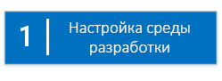
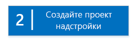
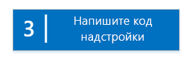

# Знакомство с созданием надстроек SharePoint с размещением у поставщика
Настройка среды разработки и создайте первое Надстройка SharePoint с размещением у поставщика.
Надстройки с размещением у поставщика принадлежат к одному из двух основных типов Надстройки SharePoint. Обзор Надстройки SharePoint и этих основных типов см. в статье  [Надстройки SharePoint](sharepoint-add-ins.md). Ниже представлен обзор надстроек с размещением у поставщика.


- К ним относятся веб-приложения, службы или базы данных, размещенные на компьютерах, которые не относятся к ферме SharePoint или подписке SharePoint Online. Они могут также содержать компоненты SharePoint. Вы можете размещать внешние компоненты в любом стеке веб-хостинга, в том числе стеке LAMP (Linux, Apache, MySQL и PHP).


- Пользовательская бизнес-логика надстройки должна запускаться на внешних компонентах или в JavaScript пользовательских страниц SharePoint.


 [


](get-started-creating-provider-hosted-sharepoint-add-ins.md#Setup) [


](get-started-creating-provider-hosted-sharepoint-add-ins.md#Create) [


](get-started-creating-provider-hosted-sharepoint-add-ins.md#Code)


## Настройка среды разработки
<a name="Setup"> </a>

Существует множество способов настройки среды разработки для Надстройки SharePoint. Здесь приведен самый простой способ. Остальные см. в разделе  [Дополнительные ресурсы](#bk_addresources).


### Получите инструменты


- Инструкции на странице  [Install Visual Studio](http://msdn.microsoft.com/library/da049020-cfda-40d7-8ff4-7492772b620f.aspx) помогут вам установить **Visual Studio** 2013 или более поздних версий, если вы еще этого не сделали. Рекомендуем использовать [последнюю версию из Центра загрузки Майкрософт](https://www.visualstudio.com/downloads/download-visual-studio-vs).


- Visual Studio включает в себя **Инструменты разработчика Microsoft Office для Visual Studio**. Иногда выпуск новой версии инструментов не совпадает с выходом обновлений Visual Studio. Чтобы убедиться, что вы используете последнюю версию инструментов, запустите [установщик Инструментов разработчика Office для Visual Studio 2013](http://aka.ms/OfficeDevToolsForVS2013) или [установщик Инструментов разработчика Office для Visual Studio 2015](http://aka.ms/OfficeDevToolsForVS2015).


### Зарегистрируйтесь на сайте Сайт разработчиков Office 365
<a name="o365_signup"> </a>


> **Примечание**
>  Возможно, у вас уже есть доступ к сайту Сайт разработчиков Office 365.> **Вы подписчик MSDN?** Visual Studio Ultimate и Visual Studio Premium с подпиской MSDN предоставляют льготное право на подписку разработчика приложений для Office 365. [Воспользуйтесь этим преимуществом прямо сегодня.](https://msdn.microsoft.com/subscriptions/manage/default.aspx)> **У вас есть один из указанных ниже планов подписки на Office 365?**> **Если есть, администратор подписки на Office 365 может создать Сайт разработчиков** с помощью [Центра администрирования Office 365](https://portal.microsoftonline.com/admin/default.aspx). Дополнительные сведения см. в статье  [Создание сайта разработчика с использованием актуальной подписки на Office 365](create-a-developer-site-on-an-existing-office-365-subscription.md). 


План Office 365 можно получить тремя способами.


- Бесплатно зарегистрируйте учетную запись разработчика Office 365 через программу для разработчиков Office 365 сроком на один год.  [Узнайте больше на сайте программы ](http://dev.office.com/devprogram) или заполните [форму регистрации](https://profile.microsoft.com/RegSysProfileCenter/wizardnp.aspx?wizid=14b845d0-938c-45af-b061-f798fbb4d170). После регистрации в программе для разработчиков вы получите сообщение электронной почты со ссылкой для входа в учетную запись разработчика. Затем следуйте приведенным ниже инструкциям.


- Начните с  [бесплатной пробной версии на один месяц](https://portal.microsoftonline.com/Signup/MainSignUp.aspx?OfferId=6881A1CB-F4EB-4db3-9F18-388898DAF510&amp;DL=DEVELOPERPACK) с лицензией на одного пользователя.


- Купите  [подписку разработчика приложений для Office 365](https://portal.microsoftonline.com/Signup/MainSignUp.aspx?OfferId=C69E7747-2566-4897-8CBA-B998ED3BAB88&amp;DL=DEVELOPERPACK).


> **Совет**
> Откройте эти ссылки в новом окне или на новой вкладке, чтобы работать с ними было удобнее. 


**Рис. 1. Доменное имя Сайта разработчика Office 365**


1. Первая страница (не отображается) регистрационной формы не требует объяснений. Введите запрашиваемую информацию и нажмите кнопку **Далее**.


2. На второй странице (рис. 1) укажите ИД администратора подписки.


3. Создайте поддомен **.onmicrosoft.com**, например contoso.onmicrosoft.com.

    После регистрации используйте полученные учетные данные (в формате  _ИД_пользователя_@ _ваш_домен_.onmicrosoft.com) для входа на сайт портала Office 365, на котором администрируется ваша учетная запись. Ваш Сайт разработчика SharePoint Online подготавливается к работе на новом домене: **http:// _ваш_домен_.sharepoint.com**.


4. Нажмите кнопку **Далее** и заполните последнюю страницу формы. Если вы хотите указать номер телефона, чтобы получить код подтверждения, можно ввести номер мобильного или стационарного телефона, но *не*  номер VoIP.


> **Примечание**
> Если при попытке зарегистрировать учетную запись разработчика вы входите в другую учетную запись Майкрософт, может отобразиться следующее сообщение: "Введенный ИД пользователя неверный. Возможно, он недействителен. Убедитесь, что вы вводите свой ИД пользователя, назначенный вам организацией. Он должен выглядеть так:  *proverka@example.com*  или *proverka@example.onmicrosoft.com*  ".> Если появляется такое сообщение, выйдите из учетной записи Майкрософт, которую использовали, и повторите попытку. Если сообщение продолжает отображаться, очистите кэш браузера или выберите режим **просмотр InPrivate**, затем заполните форму. 


По завершении регистрации в браузере откроется страница установки Office 365. Щелкните значок администратора, чтобы открыть страницу Центра администрирования.


**Рис. 2. Страница Центра администрирования Office 365**


1. Подождите, пока завершится настройка Сайт разработчиков. После этого обновите страницу Центра администрирования в браузере.


2. Затем щелкните ссылку **Создание надстроек** в верхнем левом углу страницы, чтобы открыть Сайт разработчиков. Должен открыться сайт, который выглядит так, как показано на рис. 3. На странице размещен список **Тестируемые надстройки**, подтверждающий, что веб-сайт был создан с помощью шаблона Сайта разработчика SharePoint. Если вместо него вы видите обычный сайт группы, подождите несколько минут и перезапустите сайт.


3. Обратите внимание на URL-адрес сайта. Он используется при создании проектов Надстройки SharePoint в Visual Studio.


**Рис. 3. Домашняя страница Сайта разработчика со списком "Тестируемые надстройки"**


## Создание проекта надстройки
<a name="Create"> </a>


1. Запустите Visual Studio, выбрав параметр **Запуск от имени администратора**.


2. В Visual Studio последовательно выберите элементы **Файл** > **Создать** > **Проект**.


3. В диалоговом окне **Создать проект** последовательно разверните узлы **Visual C#** и **Office/SharePoint**, а затем выберите элементы **Надстройки** > **Надстройка SharePoint**.


4. Назовите проект SampleAddIn и нажмите кнопку **ОК**.


5. В первом диалоговом окне **Укажите параметры надстройки SharePoint** выполните указанные ниже действия.

  - Укажите полный URL-адрес сайта SharePoint, который вы хотите использовать для отладки надстройки. Это URL-адрес Сайт разработчиков. При указании URL-адреса используйте протокол HTTPS вместо HTTP. В какой-то момент во время этой процедуры или вскоре после ее завершения вам будет предложено войти на сайт. Время поступления предложения бывает разным. Используйте учетные данные администратора (в домене *.onmicrosoft.com), созданные при регистрации Сайта разработчика (например, Moye_imya@contoso.onmicrosoft.com).


  - В разделе **Как требуется разместить надстройку SharePoint?** выберите элемент **Размещено у поставщика**.


  - Нажмите кнопку **Далее**.


6. На странице **Укажите целевую версию SharePoint** выберите элемент **SharePoint Online**, затем нажмите кнопку **Далее**.


7. В разделе **Какой тип проекта веб-приложения вы хотите создать?** выберите пункт **Приложение веб-форм ASP.NET**, а затем нажмите кнопку **Далее**.


8. В разделе **Как выполнять проверку подлинности для надстройки?** выберите пункт **Использовать службу контроля доступа Microsoft Azure**.


9. В мастере нажмите кнопку **Готово**.

    Основная часть операций по настройке совершается при открытии решения. В решении Visual Studio создаются два проекта: один для Надстройка SharePoint и один для веб-приложения ASP.NET.


## Создание кода надстройки
<a name="Code"> </a>


1. Откройте файл AppManifest.xml. На вкладке **Разрешения** укажите область **Семейства веб-сайтов** и уровень разрешений **Чтение**.


2. Удалите разметку в теге **<body>** файла Pages/Default.aspx веб-приложения, а затем добавьте следующие элементы управления HTML и ASP.NET в **<body>**. В этом примере используется элемент управления  [UpdatePanel](https://msdn.microsoft.com/library/System.Web.UI.UpdatePanel.aspx) , который включает частичную отрисовку страницы.

 ```HTML

<form id="form1" runat="server">
  <div>
    <asp:ScriptManager ID="ScriptManager1" runat="server"
            EnablePartialRendering="true" />
    <asp:UpdatePanel ID="PopulateData" runat="server" UpdateMode="Conditional">
      <ContentTemplate>  
        <table border="1" cellpadding="10">
         <tr><th><asp:LinkButton ID="CSOM" runat="server" Text="Populate Data" 
                               OnClick="CSOM_Click" /></th></tr>
         <tr><td>

        <h2>SharePoint Site</h2>
        <asp:Label runat="server" ID="WebTitleLabel"/>

        <h2>Current User:</h2>
        <asp:Label runat="server" ID="CurrentUserLabel" />

        <h2>Site Users</h2>
        <asp:ListView ID="UserList" runat="server"> 
            <ItemTemplate >
              <asp:Label ID="UserItem" runat="server" 
                                Text="<%# Container.DataItem.ToString()  %>">
              </asp:Label><br />
           </ItemTemplate>
        </asp:ListView>

        <h2>Site Lists</h2>
               <asp:ListView ID="ListList" runat="server">
                   <ItemTemplate >
                     <asp:Label ID="ListItem" runat="server" 
                                Text="<%# Container.DataItem.ToString()  %>">
                    </asp:Label><br />
                  </ItemTemplate>
              </asp:ListView>
            </td>          
          </tr>
         </table>
       </ContentTemplate>
     </asp:UpdatePanel>
  </div>
</form>
 ```

3. Добавьте следующие объявления в файл Default.aspx.cs веб-приложения.

 ```cs

using Microsoft.SharePoint.Client;
using Microsoft.IdentityModel.S2S.Tokens;
using System.Net;
using System.IO;
using System.Xml;
 ```

4. В файле Default.aspx.cs веб-приложения добавьте указанные ниже переменные в класс  [Page](https://msdn.microsoft.com/library/System.Web.UI.Page.aspx) .

 ```cs

SharePointContextToken contextToken;
string accessToken;
Uri sharepointUrl;
string siteName;
string currentUser;
List<string> listOfUsers = new List<string>();
List<string> listOfLists = new List<string>();
 ```

5. Добавьте метод  `RetrieveWithCSOM` в класс [Page](https://msdn.microsoft.com/library/System.Web.UI.Page.aspx) . Этот метод использует CSOM SharePoint, чтобы получать сведения о вашем сайте и отображать их на странице.

 ```cs

// This method retrieves information about the host web by using the CSOM.
private void RetrieveWithCSOM(string accessToken)
{

    if (IsPostBack)
    {
        sharepointUrl = new Uri(Request.QueryString["SPHostUrl"]);
    }        

    ClientContext clientContext =
                    TokenHelper.GetClientContextWithAccessToken(
                        sharepointUrl.ToString(), accessToken);

    // Load the properties for the web object.
    Web web = clientContext.Web;
    clientContext.Load(web);
    clientContext.ExecuteQuery();

    // Get the site name.
    siteName = web.Title;

    // Get the current user.
    clientContext.Load(web.CurrentUser);
    clientContext.ExecuteQuery();
    currentUser = clientContext.Web.CurrentUser.LoginName;

    // Load the lists from the Web object.
    ListCollection lists = web.Lists;
    clientContext.Load<ListCollection>(lists);
    clientContext.ExecuteQuery();

    // Load the current users from the Web object.
    UserCollection users = web.SiteUsers;
    clientContext.Load<UserCollection>(users);
    clientContext.ExecuteQuery();

    foreach (User siteUser in users)
    {
        listOfUsers.Add(siteUser.LoginName);
    }


    foreach (List list in lists)
    {
        listOfLists.Add(list.Title);
    }
}
 ```

6. Добавьте метод  `CSOM_Click` в класс [Page](https://msdn.microsoft.com/library/System.Web.UI.Page.aspx) . Этот метод вызывает событие, которое возникает, когда пользователь переходит по ссылке **Заполнение данными**.

 ```cs

protected void CSOM_Click(object sender, EventArgs e)
{
    string commandAccessToken = ((LinkButton)sender).CommandArgument;
    RetrieveWithCSOM(commandAccessToken);
    WebTitleLabel.Text = siteName;
    CurrentUserLabel.Text = currentUser;
    UserList.DataSource = listOfUsers;
    UserList.DataBind();
    ListList.DataSource = listOfLists;
    ListList.DataBind();
 }
 ```

7. Замените существующий метод  `Page_Load` указанным ниже. Метод `Page_Load` использует методы файла TokenHelper.cs, чтобы извлечь контекст из объекта `Request` и получить маркер доступа от Служба контроля доступа Microsoft Azure (ACS).

 ```cs

// The Page_load method fetches the context token and the access token.
// The access token is used by all of the data retrieval methods.
protected void Page_Load(object sender, EventArgs e)
{
     string contextTokenString = TokenHelper.GetContextTokenFromRequest(Request);

    if (contextTokenString != null)
    {
        contextToken =
            TokenHelper.ReadAndValidateContextToken(contextTokenString, Request.Url.Authority);

        sharepointUrl = new Uri(Request.QueryString["SPHostUrl"]);
        accessToken =
                    TokenHelper.GetAccessToken(contextToken, sharepointUrl.Authority)
                    .AccessToken;

         // For simplicity, this sample assigns the access token to the button's CommandArgument property. 
         // In a production add-in, this would not be secure. The access token should be cached on the server-side.
        CSOM.CommandArgument = accessToken;
    }
    else if (!IsPostBack)
    {
        Response.Write("Could not find a context token.");
        return;
    }
}
 ```

8. После этого файл Default.aspx.cs должен выглядеть следующим образом.

 ```cs

using System;
using System.Collections.Generic;
using System.Linq;
using System.Web;
using System.Web.UI;
using System.Web.UI.WebControls;

using Microsoft.SharePoint.Client;
using Microsoft.IdentityModel.S2S.Tokens;
using System.Net;
using System.IO;
using System.Xml;

namespace SampleAddInWeb
{
    public partial class Default : System.Web.UI.Page
    {
        SharePointContextToken contextToken;
        string accessToken;
        Uri sharepointUrl;
        string siteName;
        string currentUser;
        List<string> listOfUsers = new List<string>();
        List<string> listOfLists = new List<string>();

        protected void Page_PreInit(object sender, EventArgs e)
        {
            Uri redirectUrl;
            switch (SharePointContextProvider.CheckRedirectionStatus(Context, out redirectUrl))
            {
                case RedirectionStatus.Ok:
                    return;
                case RedirectionStatus.ShouldRedirect:
                    Response.Redirect(redirectUrl.AbsoluteUri, endResponse: true);
                    break;
                case RedirectionStatus.CanNotRedirect:
                    Response.Write("An error occurred while processing your request.");
                    Response.End();
                    break;
            }
        }

        protected void CSOM_Click(object sender, EventArgs e)
        {
            string commandAccessToken = ((LinkButton)sender).CommandArgument;
            RetrieveWithCSOM(commandAccessToken);
            WebTitleLabel.Text = siteName;
            CurrentUserLabel.Text = currentUser;
            UserList.DataSource = listOfUsers;
            UserList.DataBind();
            ListList.DataSource = listOfLists;
            ListList.DataBind();
        }

        // This method retrieves information about the host web by using the CSOM.
        private void RetrieveWithCSOM(string accessToken)
        {

            if (IsPostBack)
            {
                sharepointUrl = new Uri(Request.QueryString["SPHostUrl"]);
            }


            ClientContext clientContext =
                    TokenHelper.GetClientContextWithAccessToken(
                        sharepointUrl.ToString(), accessToken);


            // Load the properties for the web object.
            Web web = clientContext.Web;
            clientContext.Load(web);
            clientContext.ExecuteQuery();

            // Get the site name.
            siteName = web.Title;

            // Get the current user.
            clientContext.Load(web.CurrentUser);
            clientContext.ExecuteQuery();
            currentUser = clientContext.Web.CurrentUser.LoginName;

            // Load the lists from the Web object.
            ListCollection lists = web.Lists;
            clientContext.Load<ListCollection>(lists);
            clientContext.ExecuteQuery();

            // Load the current users from the Web object.
            UserCollection users = web.SiteUsers;
            clientContext.Load<UserCollection>(users);
            clientContext.ExecuteQuery();

            foreach (User siteUser in users)
            {
                listOfUsers.Add(siteUser.LoginName);
            }

            foreach (List list in lists)
            {
                listOfLists.Add(list.Title);
            }
        }

        protected void Page_Load(object sender, EventArgs e)
        {
            string contextTokenString = 
                 TokenHelper.GetContextTokenFromRequest(Request);

            if (contextTokenString != null)
            {
                contextToken =
                    TokenHelper.ReadAndValidateContextToken(contextTokenString, Request.Url.Authority);

                sharepointUrl = new Uri(Request.QueryString["SPHostUrl"]);
                accessToken =
                    TokenHelper.GetAccessToken(contextToken, sharepointUrl.Authority)
                               .AccessToken;
                CSOM.CommandArgument = accessToken;
            }
            else if (!IsPostBack)
            {
                Response.Write("Could not find a context token.");
                return;
            }
        }
    }
}
 ```

9. Нажмите клавишу F5, чтобы развернуть и запустить надстройку. Если появится окно **Оповещение системы безопасности** с запросом о доверии самозаверяющему сертификату Localhost, нажмите кнопку **Да**.

    Выберите **Доверять** на странице подтверждения, чтобы предоставить надстройке разрешения. Visual Studio установит веб-приложение IIS Express, а затем установит надстройку на тестовом сайте SharePoint и запустит ее. При запуске надстройки отображается страница, содержащая таблицу, которая представлена на снимке экрана ниже. Выберите **Заполнение данных**, чтобы просмотреть сводную информацию о сайте SharePoint.


   **Страница запуска образца базовой надстройки с размещением у поставщика**


## Дальнейшие действия
<a name="SP15createprovider_nextsteps"> </a>

Сведения об интеграции надстройки в схему пользовательского интерфейса SharePoint см. в статье  [Придание надстройке, размещаемой у поставщика, внешнего вида и удобства использования SharePoint](give-your-provider-hosted-add-in-the-sharepoint-look-and-feel.md)


## Дополнительные ресурсы
<a name="bk_addresources"> </a>


- Настройка других типов среды разработки (например, среды "все локальные") описана в разделе  [Инструменты](tools-and-environments-for-developing-sharepoint-add-ins.md) в содержании Надстройки SharePoint.


