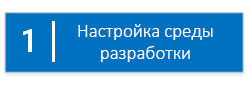
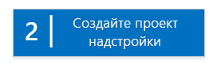
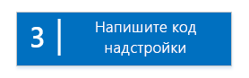
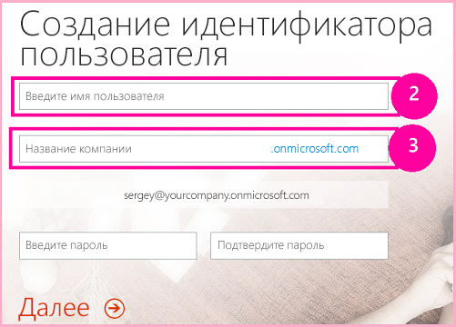
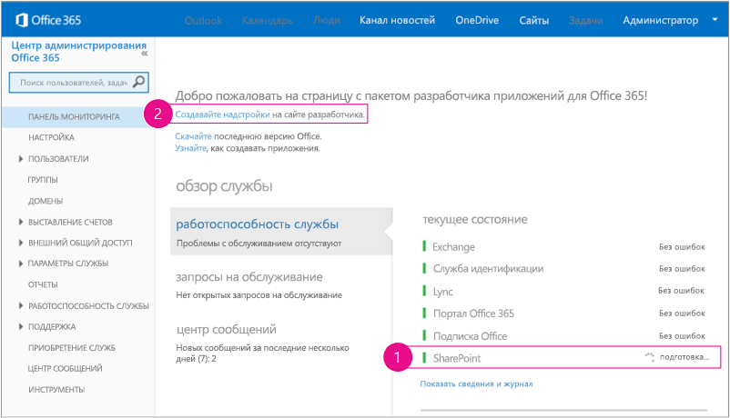
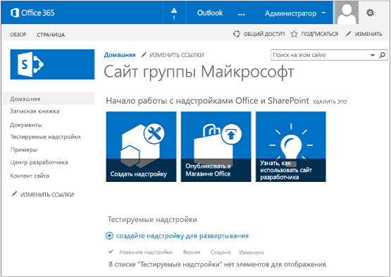
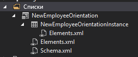
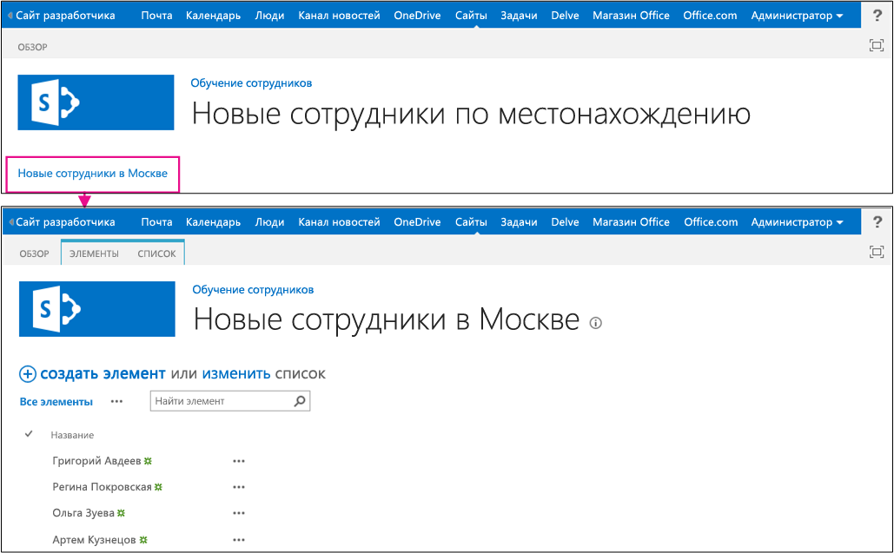

# Знакомство с созданием надстроек SharePoint с размещением в SharePoint
Настройте среду разработки и создайте первое Надстройка SharePoint с размещением в SharePoint.
Надстройки с размещением в SharePoint относятся к одному из двух основных типов Надстройки SharePoint. Обзор Надстройки SharePoint и этих основных типов см. в статье  [Надстройки SharePoint](sharepoint-add-ins.md). Ниже следует обзор надстроек с размещением в SharePoint.
  
    
    


- Они содержат списки SharePoint, веб-части, рабочие процессы, пользовательские страницы и другие компоненты, каждый из которых установлен на дочернем сайте (сайте надстройки) того веб-сайта SharePoint, на котором установлена надстройка.
    
  
- Единственный код, который они содержат, — JavaScript пользовательских страниц SharePoint.
    
  

 [
  
    
    
](get-started-creating-sharepoint-hosted-sharepoint-add-ins.md#Setup) [
  
    
    
](get-started-creating-sharepoint-hosted-sharepoint-add-ins.md#Create) [
  
    
    
](get-started-creating-sharepoint-hosted-sharepoint-add-ins.md#Code)
  
    
    


## Настройка среды разработки
<a name="Setup"> </a>

Существует множество способов настройки среды разработки для Надстройки SharePoint. Здесь приведен самый простой способ. Остальные см. в разделе  [Дополнительные ресурсы](#bk_addresources).
  
    
    

### Получите инструменты


- Инструкции на странице  [Install Visual Studio](http://msdn.microsoft.com/library/da049020-cfda-40d7-8ff4-7492772b620f.aspx) помогут вам установить **Visual Studio** 2013 или более поздних версий, если вы еще этого не сделали. Рекомендуем использовать [последнюю версию из Центра загрузки Майкрософт](https://www.visualstudio.com/downloads/download-visual-studio-vs).
    
  
- Visual Studio включает в себя **Инструменты разработчика Microsoft Office для Visual Studio**. Иногда выпуск новой версии инструментов не совпадает с выходом обновлений Visual Studio. Чтобы убедиться, что вы используете последнюю версию инструментов, запустите [установщик Инструментов разработчика Office для Visual Studio 2013](http://aka.ms/OfficeDevToolsForVS2013) или [установщик Инструментов разработчика Office для Visual Studio 2015](http://aka.ms/OfficeDevToolsForVS2015).
    
  

### Зарегистрируйтесь на сайте Сайт разработчиков Office 365
<a name="o365_signup"> </a>


> **Примечание**
>  Возможно, у вас уже есть доступ к сайту Сайт разработчиков Office 365.> **Вы подписчик MSDN?** Visual Studio Ultimate и Visual Studio Premium с подпиской MSDN предоставляют льготное право на подписку разработчика приложений для Office 365. [Воспользуйтесь этим преимуществом прямо сегодня.](https://msdn.microsoft.com/subscriptions/manage/default.aspx)> **У вас есть один из указанных ниже планов подписки на Office 365?**> **Если есть, администратор подписки на Office 365 может создать Сайт разработчиков** с помощью [Центра администрирования Office 365](https://portal.microsoftonline.com/admin/default.aspx). Дополнительные сведения см. в статье  [Создание сайта разработчика с использованием актуальной подписки на Office 365](create-a-developer-site-on-an-existing-office-365-subscription.md). 
  
    
    

План Office 365 можно получить тремя способами.
  
    
    

- Бесплатно зарегистрируйте учетную запись разработчика Office 365 через программу для разработчиков Office 365 сроком на один год.  [Узнайте больше на сайте программы ](http://dev.office.com/devprogram) или заполните [форму регистрации](https://profile.microsoft.com/RegSysProfileCenter/wizardnp.aspx?wizid=14b845d0-938c-45af-b061-f798fbb4d170). После регистрации в программе для разработчиков вы получите сообщение электронной почты со ссылкой для входа в учетную запись разработчика. Затем следуйте приведенным ниже инструкциям.
    
  
- Начните с  [бесплатной пробной версии на один месяц](https://portal.microsoftonline.com/Signup/MainSignUp.aspx?OfferId=6881A1CB-F4EB-4db3-9F18-388898DAF510&amp;DL=DEVELOPERPACK) с лицензией на одного пользователя.
    
  
- Купите  [подписку разработчика приложений для Office 365](https://portal.microsoftonline.com/Signup/MainSignUp.aspx?OfferId=C69E7747-2566-4897-8CBA-B998ED3BAB88&amp;DL=DEVELOPERPACK).
    
  

> **Совет**
> Откройте эти ссылки в новом окне или на новой вкладке, чтобы работать с ними было удобнее. 
  
    
    


**Рис. 1. Доменное имя Сайта разработчика Office 365**

  
    
    

  
    
    

  
    
    

  
    
    

  
    
    

1. Первая страница (не отображается) регистрационной формы не требует объяснений. Введите запрашиваемую информацию и нажмите кнопку **Далее**.
    
  
2. На второй странице (рис. 1) укажите ИД администратора подписки.
    
  
3. Создайте поддомен **.onmicrosoft.com**, например contoso.onmicrosoft.com.
    
    После регистрации необходимо использовать полученные учетные данные (в формате  _ИД_пользователя_@ _ваш_домен_.onmicrosoft.com) для входа на сайт портала Office 365, на котором администрируется ваша учетная запись. Ваш Сайт разработчика SharePoint Online подготавливается к работе на новом домене: **http:// _ваш_домен_.sharepoint.com**.
    
  
4. Нажмите кнопку **Далее** и заполните последнюю страницу формы. Если вы хотите указать номер телефона, чтобы получить код подтверждения, можно ввести номер мобильного или стационарного телефона, но *не*  номер VoIP.
    
  

    
> **Примечание**
> Если при попытке зарегистрировать учетную запись разработчика вы входите в другую учетную запись Майкрософт, может отобразиться такое сообщение: "Введенный ИД пользователя неверный. Возможно, он недействителен. Убедитесь, что вы вводите свой ИД пользователя, назначенный вам организацией. Он должен выглядеть так:  *proverka@example.com*  или *proverka@example.onmicrosoft.com*  ".> Если появляется такое сообщение, выйдите из учетной записи Майкрософт, которую использовали, и повторите попытку. Если сообщение продолжает отображаться, очистите кэш браузера или выберите режим **просмотр InPrivate**, затем заполните форму. 
  
    
    

По завершении регистрации в браузере откроется страница установки Office 365. Щелкните значок администратора, чтобы открыть страницу Центра администрирования.
  
    
    

**Рис. 2. Страница Центра администрирования Office 365**

  
    
    

  
    
    

  
    
    

  
    
    

1. Подождите, пока завершится подготовка к работе Сайт разработчиков. После этого обновите страницу Центра администрирования в браузере.
    
  
2. Затем щелкните ссылку **Создание надстроек** в верхнем левом углу страницы, чтобы открыть Сайт разработчиков. Должен открыться сайт, который выглядит так, как показано на рис. 3. На странице размещен список **Тестируемые надстройки**, подтверждающий, что веб-сайт был создан с помощью шаблона сайта разработчика SharePoint. Если вместо него вы видите обычный сайт группы, подождите несколько минут и перезапустите сайт.
    
  
3. Обратите внимание на URL-адрес сайта. Он используется при создании проектов Надстройки SharePoint в Visual Studio.
    
  

**Рис. 3. Домашняя страница сайта разработчика со списком "Тестируемые надстройки"**

  
    
    

  
    
    

  
    
    

  
    
    

  
    
    

## Создание проекта надстройки
<a name="Create"> </a>


1. Запустите Visual Studio, выбрав параметр **Запуск от имени администратора**.
    
  
2. Последовательно выберите элементы **Файл** > **Создать** > **Создать проект**.
    
  
3. В диалоговом окне **Создать проект** последовательно разверните узлы **Visual C#** и **Office/SharePoint**, затем выберите элементы **Надстройки** > **Надстройка для SharePoint**.
    
  
4. Присвойте проекту имя EmployeeOrientation, а затем нажмите кнопку **ОК**.
    
  
5. В первом диалоговом окне **Укажите параметры надстройки для SharePoint** введите полный URL-адрес сайта SharePoint, который вы собираетесь использовать для отладки надстройки. Это URL-адрес Сайт разработчиков. (В URL-адресе используйте HTTPS, а не HTTP.) В диалоговом окне **Как требуется разместить надстройку для SharePoint?** выберите элемент **Размещено в SharePoint** и нажмите кнопку **Готово**.
    
  
6. Вам может потребоваться войти на свой Сайт разработчиков. В этом случае используйте учетные данные администратора подписки.
    
  
7. После создания проекта откройте файл **/Pages/Default.aspx** из корневой папки проекта. Помимо прочего, этот созданный файл загружает один или оба сценария, размещенные в SharePoint: sp.runtime.js и sp.js. Разметку для загрузки этих файлов можно найти в элементе управления **Content** в верхней части файла с идентификатором **PlaceHolderAdditionalPageHead**. Разметка зависит от используемой версии **Инструменты разработчика Microsoft Office для Visual Studio**. Согласно руководствам этой серии необходимо загрузить оба файла с обычными HTML-тегами **<script>**, а не с тегами **<SharePoint:ScriptLink>**. Убедитесь, что указанные ниже строки присутствуют в элементе управления **PlaceHolderAdditionalPageHead** *над*  строкой `<meta name="WebPartPageExpansion" content="full" />`.
    
  ```
  
<script type="text/javascript" src="/_layouts/15/sp.runtime.js"></script>
<script type="text/javascript" src="/_layouts/15/sp.js"></script> 

  ```


    Проверьте файл на наличие другой разметки, загружающей один или оба файла сценария и удалите ее. Сохраните и закройте файл.
    
  

## Написание кода надстройки
<a name="Code"> </a>

Как создавать Надстройка SharePoint с размещением в SharePoint мы покажем с помощью классического расширения SharePoint: настраиваемый список и экземпляр списка.
  
    
    

1. В **обозревателе решений** откройте файл AppManifest.xml.
    
  
2. Когда откроется конструктор манифеста, добавьте пробел между словами в поле **Title**, чтобы имя имело вид Employee Orientation (Адаптация сотрудника). ( *Не*  меняйте сведения в поле **Name**.)
    
  
3. Сохраните и закройте файл.
    
  
4. Щелкните проект правой кнопкой мыши в **обозревателе решений** и выберите пункты **Добавить** > **Создать папку**. Присвойте папке имя Lists (Списки).
    
  
5. Щелкните новую папку правой кнопкой мыши и выберите пункты **Добавить** > **Создать элемент**. Откроется диалоговое окно **Добавление нового элемента** (узел **Office SharePoint**).
    
  
6. Выберите элемент **Список**. Присвойте ему имя NewEmployeeOrientation, затем выберите элемент **Добавить**.
    
  
7. На странице **Выберите параметры списка** в **мастере настройки SharePoint** оставьте отображаемое имя списка в заданном по умолчанию параметре **NewEmployeeOrientation**, нажмите кнопку **Создать настраиваемый шаблон списка и экземпляр списка на его основе** и в раскрывающемся списке выберите **По умолчанию (настраиваемый список)**. Затем нажмите кнопку **Готово**.
    
  
8. Мастер создаст шаблон списка **NewEmployeeOrientation** с экземпляром дочернего списка под названием **NewEmployeeOrientationInstance**. При этом может открыться конструктор списков, который понадобится на следующем этапе.
    
  
9. Разверните узел **NewEmployeeOrientationInstance** в **обозревателе решений**, если вы еще не сделали этого, чтобы четко отличать файл elements.xml, который представляет собой дочерний элемент  *экземпляра*  списка, от файла elements.xml, который представляет собой дочерний элемент *шаблона*  списка.
    
   **Узел списков в обозревателе решений**

  

     
  

    
    
  
10. Откройте дочерний элемент elements.xml в шаблоне списка **NewEmployeeOrientation**.
    
  
11. Добавьте пробелы в атрибут **DisplayName** (не в **Name**), чтобы он стал более понятен: New Employee Orientation (Адаптация новых сотрудников).
    
  
12. Присвойте атрибуту **Description** значениеOrientation information about new employees (Сведения об адаптации новых сотрудников).
    
  
13. Оставьте другие атрибуты такими, какими они заданы по умолчанию, сохраните и закройте файл.
    
  
14. Если конструктор списков не открыт, выберите узел **NewEmployeeOrientation** в **обозревателе решений**.
    
  
15. Откройте вкладку **Список** конструктора. Эта вкладка используется для установки определенных значений *экземпляра*  — не *шаблона*  — списка, но она содержит некоторые значения по умолчанию, унаследованные от шаблона.
    
  
16. Замените значения на вкладке следующими:
    
  - **Заголовок**: New Employees in Seattle (Новые сотрудники в Сиэтле);
    
  
  - **URL-адрес списка**: Lists/NewEmployeesInSeattle;
    
  
  - **Описание**: Новые сотрудники в Сиэтле.
    
  

    Оставьте флажки в том виде, в каком они заданы по умолчанию, сохраните файл и закройте конструктор.
    
  
17. Экземпляр списка может иметь старое имя в **обозревателе решений**. В этом случае откройте контекстное меню **NewEmployeeOrientationInstance**, выберите пункт **Переименовать** и измените имя наNewEmployeesInSeattle.
    
  
18. Откройте файл schema.xml.
    
  
19. В элементе **View**, значение **BaseViewID** которого равно 0, укажите вместо существующего элемента **ViewFields** следующие исправления. (Используйте именно этот GUID для параметра **FieldRef** с именем `Title`.)
    
     *В этом автоматически созданном файле schema.xml разрывы строки могут встречаться не там, где надо. Проверьте, чтобы совпадали все открывающие и закрывающие теги элемента **ViewFields**. Добавьте разрывы строк для удобства чтения.* 
    


  ```
  
<ViewFields>
  <FieldRef Name="Title" ID="{fa564e0f-0c70-4ab9-b863-0177e6ddd247}" DisplayName="Employee" />
 </ViewFields>
  ```

20. Не закрывая файл schema.xml, в элементе **View**, значение **BaseViewID** которого равно 1, кажите вместо существующего элемента **ViewFields** следующие исправления. (Используйте именно этот GUID для параметра **FieldRef** с именем `LinkTitle`.)
    
  ```
  
<ViewFields>
  <FieldRef Name="LinkTitle" ID="{82642ec8-ef9b-478f-acf9-31f7d45fbc31}" DisplayName="Employee" />
</ViewFields>
  ```

21. Сохраните и закройте файл schema.xml.
    
  
22. Откройте файл elements.xml, который представляет собой дочерний элемент  *экземпляра*  списка **NewEmployeesInSeattle** (не elements.xml, который представляет собой дочерний элемент *шаблона*  списка **NewEmployeeOrientation**).
    
  
23. В этом файле заполните список начальными данными. Для этого добавьте следующую разметку элемента **Data** в качестве дочернего элемента **ListInstance**.
    
  ```
  
<Data>
  <Rows>
    <Row>
      <Field Name="Title">Tom Higginbotham</Field>
    </Row>
    <Row>
      <Field Name="Title">Satomi Hayakawa</Field>
    </Row>
    <Row>
      <Field Name="Title">Cassi Hicks</Field>
    </Row>
    <Row>
      <Field Name="Title">Lertchai Treetawatchaiwong</Field>
    </Row>
  </Rows>
</Data>
  ```

24. Сохраните и закройте файл.
    
  
25. В **обозревателе решений** двойным щелчком мыши щелкните **Компонент1**, чтобы открыть конструктор компонентов. В конструкторе укажите для параметра **Заголовок** значениеNew Employee Orientation Components (Компоненты для адаптации новый сотрудников), а для параметра **Описание** — значениеСписки и другие компоненты для адаптации сотрудников в компании. Сохраните файл и закройте конструктор.
    
  
26. Если элемент **Компонент1** в **обозревателе решений** не переименовался автоматически, откройте его контекстное меню, выберите пункт **Переименовать** и укажите имяNewEmployeeOrientationComponents.
    
  
27. Откройте файл Default.aspx.
    
  
28. Найдите элемент ASP.NET **Content** с идентификатором **PlaceHolderPageTitleInTitleArea**. Замените строку по умолчанию "Заголовок страницы" на "Новые сотрудники по месту их работы".
    
  
29. Найдите элемент **Content** ASP.NET с идентификатором **PlaceHolderMain**.  *Замените*  его содержимое приведенными ниже исправлениями. ` _spPageContextInfo` — это объект JavaScript, который SharePoint автоматически добавляет на страницу. Его свойство `webAbsoluteUrl` возвращает URL-адрес сайта надстройки.
    
  ```XML
  
<p><asp:HyperLink runat="server"
    NavigateUrl="JavaScript:window.location = _spPageContextInfo.webAbsoluteUrl + '/Lists/NewEmployeesInSeattle/AllItems.aspx';" 
    Text="New Employees in Seattle" /></p>

  ```


## Запуск надстройки и тестирование списка
<a name="Code"> </a>


  
    
    

1. Нажмите клавишу F5, чтобы развернуть и запустить надстройку. Visual Studio выполнит временную установку и немедленный запуск надстройки на тестовом сайте SharePoint. (Сведения о том, как пользователи запускают установленное Надстройка SharePoint, см. в разделе  [Дальнейшие действия](#Nextsteps).)
    
  
2. Когда откроется страница надстройки по умолчанию, перейдите по ссылке **New Employees in Seattle** (Новые сотрудники в Сиэтле), чтобы открыть экземпляр настраиваемого списка.
    
   **Страница по умолчанию и страница представления списка**

  

     
  

    
    
  
3. Добавьте и удалите элементы в списке.
    
  
4. Для завершения сеанса отладки закройте окно браузера или остановите отладку в Visual Studio. При каждом нажатии клавиши F5 Visual Studio отзовет предыдущую версию надстройки и установит самую последнюю.
    
  
5. Вы будете работать с этой надстройкой и решением Visual Studio и при изучении других статей, поэтому при перерывах в работе рекомендуется отзывать надстройку. В **обозревателе решений** щелкните проект правой кнопкой мыши и выберите пункт **Отозвать**.
    
  

## 
<a name="Nextsteps"> </a>

Пока в списке указано немного сведений об адаптации. Мы добавим некоторые из них в новых статьях из этой серии. А пока отвлекитесь слегка от написания кода и почитайте о том, как развертывать Надстройки SharePoint, в статье  [Развертывание и установка надстроек для SharePoint](deploy-and-install-a-sharepoint-hosted-sharepoint-add-in.md).
  
    
    

