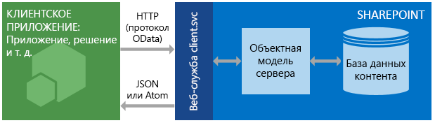

# Знакомство со службой REST для SharePoint 2013
Основы использования службы REST в SharePoint 2013 для чтения и изменения данных в SharePoint по веб-протоколам REST и OData.
В SharePoint 2013 представлена служба передачи репрезентативного состояния (REST), которая аналогична существующим  [клиентским объектным моделям](http://msdn.microsoft.com/library/88e5e1b9-eab2-4f3b-a3f2-75c96b86f1f4%28Office.15%29.aspx) SharePoint. Теперь разработчики могут удаленно взаимодействовать с данными SharePoint, используя любую технологию, поддерживающую веб-запросы REST. Это означает, что разработчики могут выполнять операции **Create**, **Read**, **Update** и **Delete** (CRUD) из своих надстроек SharePoint, решений и клиентских приложений, используя веб-технологии REST и стандартный синтаксис Open Data Protocol (OData).


## Предварительные требования

В этом разделе предполагается, что вы знакомы с REST и методикой построения запросов REST.


## Работа службы SharePoint 2013 REST
<a name="bk_how"> </a>

SharePoint 2013 позволяет удаленно взаимодействовать с сайтами SharePoint, используя REST. Теперь вы можете взаимодействовать непосредственно с объектами SharePoint, используя любую технологию, поддерживающую стандартные возможности REST.


Для доступа к ресурсам SharePoint с помощью REST необходимо создать HTTP-запрос для REST, используя стандарт Open Data Protocol (OData), который соответствует необходимому API клиентской объектной модели. Пример:


 *Метод клиентской объектной модели:* 


List.GetByTitle(listname) 


 *Конечная точка REST:* 


 `http://server/site/_api/lists/getbytitle('listname')`


Веб-служба client.svc в SharePoint обрабатывает HTTP-запрос и предоставляет соответствующий ответ в формате Atom или JSON (JavaScript Object Notation). Затем его должно проанализировать ваше клиентское приложение. На следующем рисунке показано высокоуровневое представление архитектуры SharePoint REST.


**Архитектура службы SharePoint REST**





Благодаря функциональности и простоте использования этих клиентских объектных моделей разработчики чаще всего применяют их для обмена данными с сайтами SharePoint, используя управляемый код для .NET Framework, Silverlight или JavaScript.


### Использование команд HTTP вместе со службой SharePoint 2013 REST
<a name="bk_usingHTTP"> </a>

Чтобы использовать возможности REST, встроенные в SharePoint 2013, необходимо создать HTTP-запрос для REST, используя стандартный OData, что соответствует API клиентской объектной модели, которую вы хотите использовать. Веб-служба client.svc обрабатывает HTTP-запрос и предоставляет соответствующий ответ в формате Atom или JSON (JavaScript Object Notation). Затем его должно проанализировать клиентское приложение.


Конечные точки в службе REST SharePoint 2013 аналогичны типам и методам в клиентских объектных моделях SharePoint. С помощью HTTP-запросов можно использовать эти конечные точки REST для выполнения обычных операций CRUD с сущностями SharePoint, например списками и сайтами. 


В следующей таблице приведены общие правила.


|**Действие, которое нужно выполнить с конечной точкой**|**HTTP-запрос**|**Помните**|
|:-----|:-----|:-----|
|Чтение ресурса  <br/> |**GET** <br/> ||
|Создание или обновление ресурса  <br/> |**POST** <br/> |Для создания сущностей, например списков и сайтов, используйте **POST**. Служба SharePoint 2013 REST поддерживает отправку команд **POST**, включающих определения объектов, в конечные точки, которые представляют семейства.  <br/> При операциях **POST** для всех свойств, которые не являются необходимыми, устанавливаются их значения по умолчанию. При попытке задать в операции **POST** свойство, доступное только для чтения, служба вернет исключение. <br/> |
|Обновление или вставка ресурса  <br/> |**PUT** <br/> | С помощью операций **PUT** и **MERGE** обновите существующие объекты SharePoint. <br/>  Каждая конечная точка службы, представляющая операцию **set** свойства объекта, поддерживает запросы **PUT** и **MERGE**.  <br/>  Для запросов **MERGE** задавать свойства не обязательно. Все свойства, которые не заданы явно, сохраняют свои текущие значения. <br/>  Если для запросов **PUT** не указаны все необходимые свойства в обновлениях объектов, служба REST возвращает исключение. Кроме того, для всех необязательных свойств, которые не заданы явно, устанавливаются их значения по умолчанию. <br/> |
|Удалить ресурс  <br/> |**DELETE** <br/> |Используйте команду HTTP **DELETE** для определенного URL-адреса конечной точки, чтобы удалить объект SharePoint, представленный этой конечной точкой. <br/> В случае с объектами, пригодными для повторного использования, такими как списки, файлы и элементы списков, используется операция **Recycle**.  <br/> |
 

### Создание URL-адресов REST для доступа к ресурсам SharePoint
<a name="bk_constructURLs"> </a>

Когда возможно, URI для этих конечных точек REST близко имитирует подпись API ресурса в клиентской объектной модели SharePoint. Главные точки входа для службы REST представляют семейство веб-сайтов и сайт указанного контекста. 


Для доступа к определенному семейству веб-сайтов используйте следующую конструкцию:


 `http://server/site/_api/site`


Для доступа к определенному сайту используйте следующую конструкцию:


 `http://server/site/_api/web`


В каждом случае  *сервер*  представляет имя сервера, а *сайт*  имя определенного сайта или путь к нему.


С этой начальной точки вы можете создать более конкретные URI REST, ''обходя" объектную модель, с использованием имен API клиентской объектной модели, разделенных знаком косой черты (/).


Этот синтаксис не применяется к API REST SocialFeedManager или SocialFollowingManager. Подробнее см. в статьях  [Social feed REST API reference for SharePoint 2013](http://msdn.microsoft.com/library/f1cb914f-1e91-4e23-bf53-d2ab323eac13%28Office.15%29.aspx) и [Following people and content REST API reference for SharePoint 2013](http://msdn.microsoft.com/library/c05755df-846d-4a39-941d-950d066cc6d4%28Office.15%29.aspx).


В статье  [Определение универсальных кодов ресурсов (URI) конечных точек службы SharePoint REST](determine-sharepoint-rest-service-endpoint-uris.md) представлены дополнительные инструкции по определению URI конечных точек SharePoint REST из подписи соответствующих API клиентской объектной модели.


## Примеры конечных точек SharePoint REST
<a name="bk_URLexamples"> </a>

В таблице ниже представлены примеры типичных URL-адресов конечных точек REST, которые помогут вам приступить к работе с данными SharePoint. Добавляйте  `http://server/site/_api/` в начало фрагментов показанных в таблице URL-адресов, чтобы создавать полные URL-адреса REST. Где необходимо, для команд **POST** в таблице представлены примеры данных, которые нужно передать в текст HTTP-запроса, чтобы создать указанный элемент SharePoint. Отмеченные курсивом элементы представляют собой переменные, которые необходимо заменить вашими значениями.


|**Описание**|**Конечная точка URL-адреса**|**Метод HTTP**|**Содержимое текста запроса**|
|:-----|:-----|:-----|:-----|
|Извлечение названия списка  <br/> | `web/title` <br/> |GET  <br/> |Неприменимо  <br/> |
|Извлечение всех списков на сайте  <br/> | `lists` <br/> |GET  <br/> |Неприменимо  <br/> |
|Извлечение метаданных единственного списка  <br/> | `lists/getbytitle('listname')` <br/> |GET  <br/> |Неприменимо  <br/> |
|Извлечение элементов в списке  <br/> | `lists/getbytitle('listname')/items` <br/> |GET  <br/> |Неприменимо  <br/> |
|Извлечение определенного свойства документа (в данном случае название документа).  <br/> | `lists/getbytitle('listname')?select=Title` <br/> |GET  <br/> |Неприменимо  <br/> |
|Создать список  <br/> | `lists` <br/> |POST  <br/> |
```

{
  '_metadata':{'type':SP.List},
  'AllowContentTypes': true,
  'BaseTemplate': 104 ,
  'ContentTypesEnabled': true,
  'Description': 'My list description ',
  'Title': 'RestTest '
}
```

|
|Добавление элемента в список  <br/> | `lists/getbytitle('listname')/items` <br/> |POST  <br/> |
```

{
  '_metadata':{'type':SP.listname ListItem},
  'Title': 'MyItem'
}

```

|
 

## Поддержка пакетного задания
<a name="batch"> </a>

Служба REST SharePoint Online (а также локального выпуска SharePoint 2016 или более поздней версии) поддерживает объединение нескольких запросов в одном вызове службы с помощью параметра запроса OData  `$batch`. Дополнительные сведения и ссылки на примеры кода см. в разделе  [Создание пакетного запроса с помощью интерфейсов REST API](make-batch-requests-with-the-rest-apis.md).


## Дополнительные ресурсы
<a name="bk_learnmore"> </a>

Из приведенных ниже ресурсов вы сможете подробнее узнать об использовании службы SharePoint REST.


|||
|:-----|:-----|
| [Выполнение базовых операций с использованием конечных точек SharePoint 2013 REST](complete-basic-operations-using-sharepoint-2013-rest-endpoints.md) <br/> |Узнайте, как выполнять базовые операции создания, чтения, обновления и удаления (CRUD) с помощью REST-интерфейса SharePoint 2013.  <br/> |
| [Работа со списками и элементами списков в службе REST](working-with-lists-and-list-items-with-rest.md) <br/> |Узнайте, как выполнять базовые операции создания, чтения, обновления и удаления (CRUD) для списков и элементов списков с помощью REST-интерфейса SharePoint 2013.  <br/> |
| [Работа с папками и файлами в службе REST](working-with-folders-and-files-with-rest.md) <br/> |Узнайте, как выполнять базовые операции создания, чтения, обновления и удаления (CRUD) для папок и файлов с помощью REST-интерфейса SharePoint 2013.  <br/> |
| [Навигация по структуре данных SharePoint, представленной в службе REST](navigate-the-sharepoint-data-structure-represented-in-the-rest-service.md) <br/> |Узнайте, как начать работу с конечной точки REST для определенного элемента SharePoint, а затем перейти и получить доступ к связанным элементам, например родительским сайтам или структуре библиотеки, где расположен этот элемент.  <br/> |
| [Определение универсальных кодов ресурсов (URI) конечных точек службы SharePoint REST](determine-sharepoint-rest-service-endpoint-uris.md) <br/> |Узнайте общие инструкции по определению URI конечных точек SharePoint REST из подписи соответствующих API клиентской объектной модели.  <br/> |
| [Использование операций запросов OData в запросах SharePoint REST](use-odata-query-operations-in-sharepoint-rest-requests.md) <br/> |Узнайте, как использовать широкий набор операторов строки запросов OData для выбора, фильтрации и упорядочения данных, которые вы запрашиваете из службы SharePoint REST.  <br/> |
| [SharePoint 2013 REST API, конечные точки и примеры](02128c70-9d27-4388-9374-a11bce68fdb8.md) <br/> |На этой странице приведены ссылки на все ресурсы по REST, доступные для разработчиков SharePoint 2013 в MSDN.  <br/> |
| [Общие сведения об API службы поиска REST для SharePoint](http://msdn.microsoft.com/library/8a4f7863-e4c1-4099-9189-a1894db36930%28Office.15%29.aspx) <br/> |Добавление функции поиска в клиентские и мобильные приложения с помощью службы Search REST в SharePoint Server 2013 и любой технологии, поддерживающей веб-запросы REST.  <br/> |
| [Social feed REST API reference for SharePoint 2013](http://msdn.microsoft.com/library/f1cb914f-1e91-4e23-bf53-d2ab323eac13%28Office.15%29.aspx) <br/> |Подробнее о конечных точках REST SharePoint 2013 для выполнения задач, связанных с каналами.  <br/> |
| [Following people and content REST API reference for SharePoint 2013](http://msdn.microsoft.com/library/c05755df-846d-4a39-941d-950d066cc6d4%28Office.15%29.aspx) <br/> |Подробнее о конечных точках REST SharePoint 2013 для подписки на людей и контент.  <br/> |
| [Создание пакетного запроса с помощью интерфейсов REST API](make-batch-requests-with-the-rest-apis.md) <br/> |Узнайте, как объединить несколько запросов в одном вызове службы REST.  <br/> |
| [Синхронизация элементов SharePoint с помощью службы REST](synchronize-sharepoint-items-using-the-rest-service.md) <br/> |Узнайте, как синхронизировать элементы между SharePoint и вашими надстройками или службами с помощью ресурса **GetListItemChangesSinceToken**, являющегося частью службы SharePoint REST.  <br/> |
| [Использование значений ETag в службе REST для управления версиями элементов списков документов](5f7e0579-46b7-44ab-b3b4-cdbc622dcd98.md) <br/> |Узнайте, как использовать теги ETag HTML с помощью службы SharePoint REST для контролирования блокировок списков SharePoint и элементов списка.  <br/> |
 

## Ресурсы OData
<a name="SP15startREST_bk_addlresources"> </a>


-  [Знакомство с OData](http://msdn.microsoft.com/ru-ru/data/hh237663)


-  [Пример для Open Data Protocol](http://msdn.microsoft.com/ru-ru/library/ff478141.aspx)


-  [Open Data Protocol](http://www.odata.org/)


-  [Соглашения по URI для протокола OData](http://www.odata.org/documentation/odata-version-2-0/uri-conventions/)


-  [Использование операций службы](http://www.odata.org/documentation/odata-version-2-0/uri-conventions#AddressingServiceOperations)


-  [Операции протокола OData](http://www.odata.org/documentation/odata-version-2-0/operations/)


-  [Условия ошибки](http://www.odata.org/documentation/odata-version-2-0/operations#ErrorConditions)


