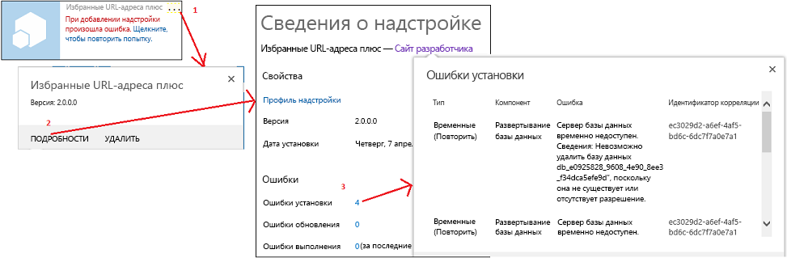
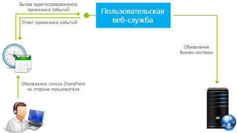

# Обработка событий в надстройках SharePoint

Пользовательский код в надстройках с размещением у поставщика может обрабатывать три категории событий:
  
    
    


- **События списков**, например добавление или удаление списка на веб-сайте.
    
  
- **События элементов списков**, например редактирование элемента в списке.
    
  
- **События надстройки**, например установка надстройки.
    
  

Надстройки SharePoint с размещением в SharePoint не поддерживают обработку событий, но вы можете превратить рабочий процесс в подобие обработчика событий для списков или их элементов, задав событие для вызова этого рабочего процесса. См. статью  [Рабочие процессы в SharePoint 2013](http://msdn.microsoft.com/library/e0602371-ae22-44be-8a7e-9e47e9f046d6%28Office.15%29.aspx). События надстроек не могут вызывать рабочие процессы, поэтому их невозможно обрабатывать в надстройках с размещением в SharePoint.
  
    
    


> **Примечание**
> Надстройки SharePoint не поддерживают события веб-сайтов и семейств веб-сайтов. 
  
    
    

События делятся на два типа:
- **События  *в настоящем времени* ** вызываются перед тем, как инфраструктура SharePoint выполнит обработку события (включая применение изменений к базе данных содержимого). В SharePoint **пользовательские обработчики событий в реальном времени всегда выполняются синхронно**. Помимо прочих целей, их можно использовать для отмены события. Например, если у надстройки есть функция для удаления списка, обработчик соответствующего события может отменить удаление, если не соблюдаются определенные условия. Если событие является частью последовательности, его отмена предотвратит возникновение всех последующих событий. Например, если обработчик события **ItemAdding** отменит событие, то событие **ItemAdded**, которое должно было произойти далее, не вызывается.
    
  
- **События  *после операции* ** вызываются после того, как инфраструктура SharePoint выполнит обработку события. В SharePoint **обработчики удаленных событий после операции в случае списков и их элементов всегда выполняются асинхронно** (только если это не события приложений). Их можно использовать для ведения журнала событий и в других целях.
    
  

## Обработка событий списков и их элементов
<a name="RER"> </a>

Для обработки событий списков и их элементов создаются удаленные приемники событий (RER) — веб-службы, которые выполняются за пределами фермы SharePoint или SharePoint Online. URL-адрес службы RER регистрируется для обрабатываемых ей событий. Зарегистрировать обработчик можно двумя способами:
  
    
    

- События на хост-сайте регистрируются программно с помощью CSOM (клиентской объектной модели) или API REST SharePoint. Как правило, эту задачу выполняет "код первого запуска" надстройки или обработчика событий надстройки. (Обзор событий надстроек см. в разделе  [Обработка событий надстройки](#HandlingAppEvents) этой статьи.) Пример кода, который программно регистрирует события списка, приведен в статье [OfficeDev/PnP/Samples/Core.EventReceivers](https://github.com/OfficeDev/PnP/tree/master/Samples/Core.EventReceivers).
    
  
- Как правило, события надстройки регистрируются в компоненте сайта надстройки с помощью простой разметки XML. Подробные сведения о создании разметки и службы представлены в статье  [Создание удаленного приемника событий в надстройках SharePoint](create-a-remote-event-receiver-in-sharepoint-add-ins.md). Кроме того, события на сайте надстройки можно регистрировать программным способом.
    
  

> **Примечание**
> Удаленные приемники событий выполняют ту же задачу, что и приемники событий в решениях фермы. Но приемники событий содержат специальный код, который выполняется на серверах SharePoint, поэтому их невозможно использовать в надстройках SharePoint. 
  
    
    

Надстройка может обрабатывать приведенные ниже события списков и библиотеки документов. События с окончанием "ing" происходят в настоящем времени (синхронно), а события с окончанием "ed" — в прошедшем (асинхронно).
  
    
    

|||
|:-----|:-----|
|ListAdding  <br/> |ListAdded  <br/> |
|ListDeleting  <br/> |ListDeleted  <br/> |
|FieldAdding  <br/> |FieldAdded  <br/> |
|FieldDeleting  <br/> |FieldDeleted  <br/> |
|FieldUpdating  <br/> |FieldUpdated  <br/> |
   
События обновления полей связаны с изменением свойств поля (столбца) в списке, например возможности сортировки, а не с изменением данных в поле.
  
    
    
Надстройка может обрабатывать следующие события элементов списков:
  
    
    

|||
|:-----|:-----|
|ItemAdding  <br/> |ItemAdded  <br/> |
|ItemUpdating  <br/> |ItemUpdated  <br/> |
|ItemDeleting  <br/> |ItemDeleted  <br/> |
|ItemCheckingOut  <br/> |ItemCheckedOut  <br/> |
|ItemCheckingIn  <br/> |ItemCheckedIn  <br/> |
|ItemUncheckingOut  <br/> |ItemUncheckedOut  <br/> |
|ItemAttachmentAdding  <br/> |ItemAttachmentAdded  <br/> |
|ItemAttachmentDeleting  <br/> |ItemAtttachmentDeleted  <br/> |
|ItemFileMoving  <br/> |ItemFileMoved  <br/> |
|ItemVersionDeleting*  <br/> |ItemVersonDeleted*  <br/> |
||ItemFileConverted  <br/> |
   

> **Примечание**
> * Эти два новых события могут быть недоступны в пользовательском интерфейсе Visual Studio. Если это так, выберите событие ItemDeleting или ItemDeleted, а затем измените имена вручную. 
  
    
    

Если при работе в Visual Studio к проекту Надстройка SharePoint добавляется удаленный приемник событий, Инструменты разработчика Office для Visual Studio делает следующее:
  
    
    

- В веб-приложение добавляется файл веб-службы, например RemoteEventReceiver1.svc, которая позволяет обрабатывать события, указанные при добавлении удаленного приемника событий в Надстройка SharePoint. Веб-служба содержит файл с кодом для обработки удаленных событий.
    
    После создания приемника удаленных событий следует добавить код в файл, используемый службой веб-приложения для обработки событий. По умолчанию файл кода содержит два метода, к которым добавляется код обработки:
    
  -  `ProcessEvent()` обрабатывает события до операции (такие, как в левых столбцах выше) и возвращает в SharePoint объект, сообщающий, отменять ли событие.
    
  
  -  `ProcessOneWayEvent()` обрабатывает события в прошедшем времени. Он выполняется асинхронно и не возвращает в SharePoint никаких данных.
    
  

    Когда происходит зарегистрированное событие, SharePoint вызывает соответствующий метод в службе и передает объект, который предоставляет некоторые контекстные сведения для кода. Например, определяется тип события (указанный в одной из двух таблиц выше), чтобы можно было перейти к соответствующему фрагменту кода.
    
  
- Элемент проекта для удаленного приемника событий добавляется в проект Надстройка SharePoint. Файл Elements.xml для удаленного приемника событий ссылается на веб-службу в веб-приложении, а также на указанные удаленные события. В следующем примере показано, как файл Elements.xml обрабатывает добавление или удаление элемента списка.
    
  ```XML
  
<?xml version="1.0" encoding="utf-8"?>
<Elements xmlns="http://schemas.microsoft.com/sharepoint/">
  <Receivers ListTemplateId="104">
      <Receiver>
        <Name>RemoteEventReceiver1ItemAdding</Name>
        <Type>ItemAdding</Type>
        <SequenceNumber>10000</SequenceNumber>
        <Url>~remoteAppUrl/RemoteEventReceiver1.svc</Url>
      </Receiver>
      <Receiver>
        <Name>RemoteEventReceiver1ItemDeleting</Name>
        <Type>ItemDeleting</Type>
        <SequenceNumber>10000</SequenceNumber>
        <Url>~remoteAppUrl/RemoteEventReceiver1.svc</Url>
      </Receiver>
  </Receivers>
</Elements>
  ```

Чтобы изменить события, обрабатываемые приемником удаленных событий, откройте **Обозреватель решений**, затем окно **Свойства** для нужного приемника удаленных событий, разверните узел **События SharePoint** и задайте для нужных событий значения **True**.
  
    
    

> **Примечание**
> Дополнительные сведения об удаленных приемниках событий, включая сведения об устранении неполадок, см. в статье  [Удаленные приемники событий: вопросы и ответы](handle-events-in-sharepoint-add-ins.md#RERFAQ). 
  
    
    


## Обработка событий надстройки
<a name="HandlingAppEvents"> </a>

События надстройки также обрабатываются удаленными веб-службами, но настраиваются в пакете надстройки не так, как удаленные приемники событий списка и его элементов. Поэтому события надстройки рассматриваются как отдельная категория компонента. В этом случае удаленная веб-служба регистрируется в манифесте надстройки, а не в компоненте сайта надстройки. Для надстройки даже не нужен сайт. Существует три события надстройки, описанные в следующих разделах.
  
    
    

### Событие AppInstalled

Событие **AppInstalled** выполняется сразу после того, как SharePoint завершит все действия, которые нужно выполнить после установки надстройки, но до того, как пользователь получит уведомление о завершении установки. Хотя это и происходит *после*  завершения, SharePoint запускает обработчик *синхронно*  . Надстройка не будет доступна для использования, пока обработчик не завершит работу, а обработчик может отменить установку (в результате чего SharePoint отменит все действия, выполненные в рамках установки). На практике рекомендуется определять все ошибки в обработчике и отправлять SharePoint указание отменить установку. Дополнительные сведения см. в разделе [Включение логики отката и логики проверки выполненных действий в обработчики событий надстроек](#Rollback).
  
    
    

> **Примечание**
> При установке надстройки на  [уровне клиента](tenancies-and-deployment-scopes-for-sharepoint-add-ins.md) она устанавливается в семействе веб-сайтов каталога надстроек, а событие AppInstalled вызывается только после этого. Надстройка видима на нескольких веб-сайтах в аренде, но событие не выполняется для каждого из них отдельно.
  
    
    

Помимо отмены установки надстройки, это событие можно использовать для многих других целей, включая:
  
    
    

- установку на хост-сайте компонентов SharePoint, которые невозможно описательно установить с помощью компонента хост-сайта, например списков и дочерних веб-сайтов;
    
  
- Программную регистрацию обработчиков событий списков и их элементов на хост-сайте или сайте надстройки.
    
  
- Установку параметров инициализации, зависящих от экземпляра надстройки. Например, у надстройки может быть контейнер свойств сайта надстройки для хранения параметров, которые отличаются между разными экземплярами надстройки. Обработчик AppInstalled может записывать в контейнер свойств разные значения, зависящие, к примеру, от типа хост-сайта (например, сайта группы или блога).
    
    > **Примечание**
      > Проверив, является ли хост-сайт сайтом каталога надстроек, можно определить, установлена ли надстройка на уровне клиента. См. статью  [Сроки аренды и области развертывания надстроек для SharePoint](tenancies-and-deployment-scopes-for-sharepoint-add-ins.md). 
- Выполнение в удаленном веб-приложении настроек, зависящих от экземпляра надстройки, например добавления таблицы в базу данных.
    
  

> **Важно!**
> Реализация события AppInstalled должна завершиться в течение 30 секунд, иначе инфраструктура установки SharePoint посчитает, что произошел сбой. Инфраструктура повторно запустит событие  *и повторит ваш код сначала*  (еще до трех раз). Если время ожидания истечет четыре раза, SharePoint выполнит полный откат установки надстройки. Подробное описание последствий представлено в разделе [Включение логики отката и логики проверки выполненных действий в обработчики событий надстроек](#Rollback). 
  
    
    


### Событие AppUninstalling

Событие **AppUninstalling** *не*  происходит при удалении надстройки с хост-сайта. Когда надстройка удаляется, она лишь перемещается в корзину пользователя. Прежде чем будет вызвано событие AppUninstalling, необходимы еще два действия. Во-первых, пользователь должен удалить надстройку из корзины, после чего она будет перемещена в корзину второго уровня. Во-вторых, **пользователь должен удалить надстройку из корзины второго уровня. После этого будет вызвано событие AppUninstalling**. Событие AppUninstalling синхронное, его можно использовать для отмены удаления, чтобы надстройка осталась в корзине второго уровня.
  
    
    
Основное назначение обработчика этого события — удаление или восстановление элементов, развернутых обработчиком события AppInstalled (или AppUpdated). SharePoint не может удалять эти элементы или перемещать их в корзину, так как не располагает данными о них, по крайней мере не как о компонентах надстроек. Как правило, рекомендуется удалять эти элементы. Однако не рекомендуется удалять элементы, которые могут приносить пользу после удаления надстройки. Если список или веб-сайт, созданный обработчиком события AppInstalled, все еще будет использоваться, не удаляйте его в обработчике события AppUninstalling.
  
    
    

### Событие AppUpgraded

Событие **AppUpgraded** происходит сразу после того, как SharePoint выполнит все необходимые действия при обновлении надстройки до новой версии, но перед тем как пользователь получит уведомление о завершении обновления. Как и событие AppInstalled, оно является событием в прошедшем времени и, по сути, является синхронным, а также рекомендуется для обнаружения ошибок и отправки SharePoint инструкции на откат обновления.
  
    
    
Некоторые примеры того, что может делать обработчик этого события:
  
    
    

- Добавление, изменение или удаление компонентов надстройки с хост-сайта.
    
  
- Действия в надстройке, которые невозможно выполнить с помощью описательной семантики обновления в компоненте сайта надстройки. Например, с помощью описательной разметки обновления невозможно удалять элементы, но это можно сделать программно в обработчике события AppUpgraded.
    
  
- Изменение компонентов, зависящих от экземпляра надстройки, в веб-приложении или удаленной базе данных надстройки.
    
  
 *Подробные указания по созданию обработчиков событий приложений см. в статье  [Создание приемника событий надстройки в надстройках для SharePoint](create-an-add-in-event-receiver-in-sharepoint-add-ins.md)*  .
  
    
    

### Включение логики отката и логики проверки выполненных действий в обработчики событий надстроек
<a name="Rollback"> </a>

Когда среда SharePoint сталкивается с ошибкой при обработке какого-либо из трех событий надстройки, она отменяет событие и откатывает все связанные с ним изменения. Обработчики событий надстроек должны учитывать эту систему, поскольку если часть реализуемого события завершится сбоем, потребуется выполнить откат всего события, а не продолжать работу, рискуя оставить надстройку в поврежденном состоянии. Как правило, обработчик должен сделать следующее:
  
    
    

- Сообщить SharePoint об ошибке. Сообщение SOAP, которое веб-служба обработки событий надстроек возвращает в SharePoint, содержит свойство **Status** со значением **Continue**, **CancelWithError** или **CancelWithoutError**. Оба состояния **Cancel*** указывают SharePoint выполнить откат события.
    
  
- Выполнить откат действий, уже выполненных обработчиком до обнаружения ошибки. Как правило, среда SharePoint не может это сделать, поскольку ей неизвестно, какие действия выполнил обработчик. Это правило не является универсальным. Например, при отмене установки надстройки SharePoint полностью удалит сайт надстройки, поэтому обработчику события AppInstalled нет смысла отменять все действия, выполненные с этим сайтом. Тем не менее, обычно он должен отменять действия, выполненные с хост-сайтом или удаленными компонентами надстройки.
    
  

> **Примечание**
> **Специальное примечание о событии AppUninstalling:** указанное выше относится к событию AppUninstalling в той же степени, что и к двум остальным событиям надстроек. Например, если обработчик события удаления удалит строку из удаленной базы данных, а затем обнаружит ошибку, то строку потребуется восстановить. Поскольку служба будет отправлять в SharePoint сообщение об отмене, надстройка не будет удалена из корзины. Если восстановить ее и использовать снова, она может не работать без этой записи в базе данных.> Тем не менее, обработчик AppUninstalling завершает работу  *до того*  , как SharePoint удалит надстройку из корзины. Таким образом, если среда SharePoint сама обнаружит ошибку и отменит удаление, обработчик не сможет отменить свои действия.
  
    
    

Если среда SharePoint не получит сообщение от обработчика в течение 30 секунд, она снова вызовет обработчик. После трех повторных попыток (всего четырех) выполняется полный откат события. При каждом вызове обработчика код запускается сначала. Как правило, вам не нужно, чтобы обработчик повторял уже выполненные действия, например создание списка на хост-сайте, и вам неизвестно, завершила ли свою работу, или вообще запустилась, логика отката до истечения времени ожидания обработчика.
  
    
    
Ошибки установки и обновления отображаются в пользовательском интерфейсе SharePoint, как показано на следующем рисунке.
  
    
    

**Рисунок 1. Получение сведений об ошибке установки.**

  
    
    

  
    
    

  
    
    

#### Стратегии архитектуры обработчиков событий надстройки
<a name="Strategies"> </a>

Если представить обработчик в псевдокоде, он должен иметь примерно следующую структуру. Если в разделе Try возникнет ошибка, должны вызываться разделы Catch и Rollback (это может происходить автоматически, в зависимости от языка и платформы).
  
    
    

```

Try
    If X not already done,
        Do X.
Catch
    Send cancel message to SharePoint.
    If X not already undone,
        Undo X.

```

Однако реализация логики отката и логики проверки выполненных действий в веб-службе может замедлить работу обработчика. Логика установки и логика отката изменяют объекты, более или менее удаленные от веб-службы, например хост-сайт SharePoint или внутреннюю базу данных. Если код установки и отката поделен между разделами Try и Catch, то служба отправляет отдельные вызовы удаленным компонентам. Как правило, несколько таких вызовом описаны в каждом разделе. Обычно рекомендуется реализовать логику установки и отката в самом удаленном компоненте с помощью процедуры, которую можно вызвать из раздела Try обработчика. Процедура должна вернуть сообщение об успешном завершении или сбое. В последнем случае код из раздела Try вызывает раздел Catch (например, сообщив об исключении). Раздел Catch лишь уведомляет SharePoint. Назовем это стратегией делегирования обработчиков. Она проиллюстрирована следующим псевдокодом:
  
    
    


```

Try
    Call the "Do X" procedure on remote platform.
    If remote platform reports failure, call Catch.
Catch
    Send cancel message to SharePoint.

```

Процедура "Do X", которая выполняется в удаленной системе, будет содержать логику отката и логику проверки выполненных действий, как показано ниже.
  
    
    


```

Try
    If X not already done,
        Do X.
        Set success flag to true.
Catch
    If X was done before error,
        Undo X.
    Set success flag to false.
Send
    Return success flag to the event handler.

```

Например, если обработчик должен выполнить действие с базой данных SQL Server, вы можете установить на сервере SQL Server хранимую процедуру, которая использует блок  [TRY-CATCH](http://msdn.microsoft.com/library/248df62a-7334-4bca-8262-235a28f4b07f%28Office.15%29.aspx) для реализации логики отката, с блоками [IF-ELSE](http://msdn.microsoft.com/library/676c881f-dee1-417a-bc51-55da62398e81%28Office.15%29.aspx) для реализации логики проверки выполненных действий.
  
    
    
Модель надстроек SharePoint не дает возможности хранить пользовательский серверный код в SharePoint и вызывать его из CSOM (клиентской объектной модели). Тем не менее, CSOM позволяет объединить логику Try-Catch и If-Else, а затем отправить ее на сервер для выполнения. Подробный пример обработчика события надстройки, который использует стратегию делегирования обработчиков, чтобы добавить список на хост-сайт, см. в статье  [Создание приемника событий надстройки в надстройках для SharePoint](create-an-add-in-event-receiver-in-sharepoint-add-ins.md). Пример кода см. на странице  [OfficeDev/PnP/Samples/Core.AppEvents.HandlerDelegation](https://github.com/OfficeDev/PnP/tree/master/Samples/Core.AppEvents.HandlerDelegation).
  
    
    
Стратегию делегирования обработчиков можно использовать не всегда. Например, если обработчик вызывает несколько компонентов, таких как база данных и хост-сайт SharePoint, один из вызовов может завершиться успешно, а другой — с ошибкой. В этом случае логика отката для первого компонента не будет выполняться, если она реализована согласно стратегии делегирования обработчиков. По этой причине, если компоненты вызываются синхронно, только последний вызванный компонент может использовать эту стратегию. Если они вызываются асинхронно, делегирование обработчиков не может использовать ни один из компоненты. Пример обработчика событий надстроек, который не использует стратегию делегирования обработчиков, см. на странице  [OfficeDev/PnP/Samples/Core.AppEvents](https://github.com/OfficeDev/PnP/tree/master/Samples/Core.AppEvents).
  
    
    

> **Совет**
> В случае сбоя события AppInstalled SharePoint удалит сайт надстройки (если он существует), а в случае сбоя события AppUpated SharePoint восстановит состояние надстройки до обновления. По этой причине обработчикам никогда не нужно отменять действия, выполненные на сайте надстройки. Если обработчик выполняет действия как на хост-сайте, так и на сайте надстройки, то начать следует с сайта надстройки. Это позволит использовать стратегию делегирования обработчика для хост-сайта. Даже если действия с сайтом надстройки будут выполнены успешно, а действия с хост-сайтом завершатся с ошибкой, выполняется вся логика отката. 
  
    
    


## Удаленные приемники событий в надстройках, поддерживающих несколько зон безопасности
<a name="HandlingAppEvents"> </a>

В отношении разработки надстроек, поддерживающих несколько зон безопасности и содержащих удаленный приемник событий, действуют некоторые ограничения. Дополнительные сведения см. в статье базы знаний kb3135876 о том, что  [невозможно добавить приложение из Магазина SharePoint по умолчанию при использовании надстроек, размещенных у поставщика, не в зонах по умолчанию в SharePoint 2013](https://support.microsoft.com/ru-ru/kb/3135876).
  
    
    

## Удаленные приемники событий: вопросы и ответы
<a name="RERFAQ"> </a>

Ниже приведены распространенные вопросы, которые могут у вас возникнуть при использовании удаленных приемников событий.
  
    
    

### Чем удаленные приемники событий отличаются от приемников событий в SharePoint 2010?
<a name="RER_HowRERDifferentfrom2010"> </a>

В SharePoint 2010 приемники событий обрабатывают события, которые происходят в списках, сайтах и других объектах SharePoint, выполняя код на сервере SharePoint (с полным доверием или в песочнице). Такие приемники событий существуют и в SharePoint 2013. Тем не менее, SharePoint 2013 также поддерживает  *удаленные*  приемники событий, в которых код, выполняющийся при возникновении события, размещается в веб-службе. Это означает, что если вы зарегистрируете удаленный приемник событий, необходимо также сообщить SharePoint, какую веб-службу вызывать. В таблице 1 пример кода слева (решения SharePoint) реализует функции с помощью обработчика событий. Пример справа (Надстройки SharePoint) реализует те же функции с помощью удаленного приемника событий.
  
    
    

**Таблица 1. Примеры кода для приемников событий в SharePoint 2010 по сравнению с удаленными приемниками событий в надстройках**


|**Решения SharePoint**|**Надстройки SharePoint**|
|:-----|:-----|
|
```cs

// Trigger an event when an item is added to the SharePoint list.
Public class OnPlantUpdated : SPItemEventReceiver
{
Public override void ItemAdding (SPItemEventProperties properties)
{
Properties.After.Properties.ChangedProperties.Add("Image",CreateLink(properties));
Properties.status =SPEventReceiverStatus.Continue;
}

/// When an item updates, run the following.
Public override void ItemUpdating(SPItemEventProperties properties)
{
Properties.AfterProperties.ChangedProperties.Add("Image",CreateLink9properties));
Properties.Status= SPEventReceiverStatus.Continue;
}

```

|
```cs

/* Trigger an event when an item is added to the SharePoint list*/
Public class OnPlantUpdated : IRemoteEventService
{
public SPRemoteEventResult ProcessEvent (SPRemoteEventProperties properties)
{
SPRemoteEventResult result =new SPRemoteEventResult();
If (properties.EventType == SPRemoteEventType.ItemAdding ||  
properties.EventType == SPRemoteEventType.ItemUpdating)
{

// Add code that runs when an item is added or updated.
}

```

|
   
Полный пример кода см. в статье о  [добавлении свойств элемента списка с помощью удаленного приемника событий](http://code.msdn.microsoft.com/SharePoint-2013-Add-list-2c6e71e0). Подробную демонстрацию примера кода см. в видео, посвященном  [переносу приемника событий SharePoint в удаленный приемник событий](http://channel9.msdn.com/Series/Reimagine-SharePoint-Development/Migrating-a-SharePoint-Event-Receiver-to-a-Remote-Event-Receiver).
  
    
    

### 
<a name="RER_HowRERDifferentfrom2010"> </a>

Подробнее см. в статье  [Перечисление SPRemoteEventType](https://msdn.microsoft.com/ru-ru/library/microsoft.sharepoint.client.eventreceivers.spremoteeventtype.aspx)
  
    
    

### Как работают удаленные приемники событий?
<a name="RER_HowDoRERWork"> </a>

На рисунке 1 показано, как работают удаленные приемники событий:
  
    
    

- Пользователь выполняет действие в SharePoint (например, редактирует элемент списка).
    
  
- Затем SharePoint обращается к зарегистрированной веб-службе. Вы можете выполнять некоторые операции, например обновлять свойство элемента списка или серверную систему.
    
  
- Веб-служба также может обратиться к службе контроля доступа, чтобы запросить собственный подписанный маркер для обратного вызова SharePoint. С помощью этого маркера можно выполнять удаленные действия из веб-службы в результате предыдущей операции над элементом списка или серверной системой.
    
  

**Рисунок 2. Принцип действия удаленных приемников событий в SharePoint**

  
    
    

  
    
    

  
    
    

  
    
    

  
    
    

### Как отлаживать удаленные приемники событий?
<a name="RER_DebugRER"> </a>

См. статью  [Устранение неполадок и отладка удаленного приемника событий в надстройке для SharePoint](debug-and-troubleshoot-a-remote-event-receiver-in-a-sharepoint-add-in.md). 
  
    
    

### Можно ли запускать клиентский код (JavaScript) из удаленных приемников событий?
<a name="RER_ClientsideCodeFromRER"> </a>

Нет.
  
    
    

### Существуют ли ограничения на размещение удаленного приемника событий или его URL-адрес?
<a name="RER_ClientsideCodeFromRER"> </a>

Удаленный приемник событий может быть размещен в облаке или на локальном сервере, который не используется в качестве сервера SharePoint. URL-адрес производственного приемника не может использовать определенный порт. Это значит, что вам необходимо использовать порт 443 для HTTPS (рекомендовано) или порт 80 для HTTP. При использовании HTTPS, если приемник размещен локально, а надстройка — на Microsoft SharePoint Online, сервер размещения должен иметь доверенный сертификат, выданный центром сертификации. (Самозаверяющий сертификат действует, только если надстройка расположена в локальной ферме SharePoint.)
  
    
    

### Будет ли работать обработчик событий SharePoint 2010 после обновления до SharePoint 2013?
<a name="RER_Will2020EventHandlerWillWorkOn2013"> </a>

Если пакет решения SharePoint 2010, содержащий обработчик событий, обновляется до SharePoint 2013, то, в зависимости от ваших настроек, пакет решения может работать без изменений. Это касается и обработчика событий. Если решение SharePoint 2010 преобразуется в Надстройка SharePoint в SharePoint 2013, обработчик событий должен быть переписан как удаленный приемник событий. (См. видеоролик  [о переносе приемника событий SharePoint в удаленный приемник событий](http://channel9.msdn.com/Series/Reimagine-SharePoint-Development/Migrating-a-SharePoint-Event-Receiver-to-a-Remote-Event-Receiver).)
  
    
    

## Дополнительные ресурсы
<a name="SP15handleevents_addlresources"> </a>


-  [Создание удаленного приемника событий в надстройках SharePoint](create-a-remote-event-receiver-in-sharepoint-add-ins.md)
    
  
-  [Создание приемника событий надстройки в надстройках для SharePoint](create-an-add-in-event-receiver-in-sharepoint-add-ins.md)
    
  
-  [Представление удаленных приемников событий в SharePoint 2013](http://www.microsoft.com/resources/msdn/en-us/office/media/video/video.mdl?cid=sdc&amp;from=mscomsdc&amp;VideoID=3ef8f7ae-85a7-44c3-967d-d1620e2a019f)
    
  
-  [Перенос приемника событий SharePoint в удаленный приемник событий](http://channel9.msdn.com/Series/Reimagine-SharePoint-Development/Migrating-a-SharePoint-Event-Receiver-to-a-Remote-Event-Receiver)
    
  

