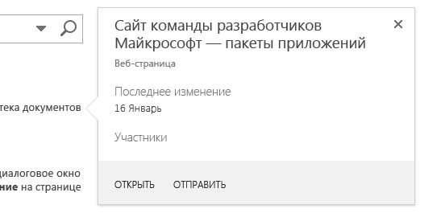
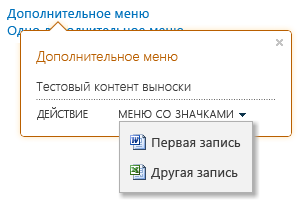

# Выделение контента и расширение функциональных возможностей размещаемых в SharePoint надстроек с помощью элемента управления выносками
Элемент управления выносками SharePoint предоставляет гибкий способ для привлечения внимания пользователей и демонстрации функциональных возможностей вашего приложения, размещенного в SharePoint. Вы можете настраивать его различным образом в зависимости от требований к пользовательскому интерфейсу приложения. В этой статье рассказывается, как спроектировать такой элемент управления, добавить его на страницу, а также настроить его внешний вид и режим работы.Когда вы будете выполнять поиск на сайте SharePoint 2013, то увидите примеры элемента управления выносками, так как он отображается при каждом наведении указателя на результат поиска. На рисунке 1 показана выноска для отдельного результата поиска, а также показано несколько типичных аспектов элемента управления контентом: заголовок, информация об элементе на странице и действия ( **Открыть** и **Отправить**), которые вы можете выполнить над этим элементом. В данном случае информация и действия имеют относительно простой вид, однако вы уже может наблюдать два преимущества использования выноски. Во-первых, она позволяет отобразить дополнительную информацию об элементах на странице, когда это необходимо, во-вторых, она позволяет удобно расширять функциональные возможности страницы. 
**Рис. 1. Пример элемента управления выносками на странице результатов поиска SharePoint 2013**





## Обеспечение доступности элемента управления на HTML-странице путем включения файла callout.js
<a name="GettingStarted"> </a>

В данном примере используется метод  `SP.SOD.executeFunc`, подтверждающий запуск файла скрипта до выполнения любого зависимого от него кода.



```

SP.SOD.executeFunc("callout.js", "Callout", function () {
    });
```

Функция, которую вы передаете в функцию  `SP.SOD.executeFunc`, содержит код, который вы хотите выполнить после загрузки файла callout.js. Когда эти файлы загрузятся, используйте объект  `CalloutManager`, чтобы создать объект  `Callout` для каждого элемента страницы, которому требуется иметь сопоставленный с ним элемент управления выносками. `CalloutManager` — это одноэлементный объект, хранящий ссылки на каждый объект `Callout` на странице внутри массива ассоциативных элементов. Объект `Callout` имеет всего два обязательных члена: `ID` и `launchPoint`. Член  `ID` — это ключ, сопоставленный с объектом `Callout` в `CalloutManager`:  `CalloutManager["value of the callout's ID member"]`. Член  `launchPoint` — это элемент HTML-страницы. Вы можете, например, создать или получить элемент `div` на своей странице и передать его в качестве члена объекта `Callout`. По умолчанию элемент управления выносками отображается при щелчке пользователем элемента  `launchPoint`. В этом примере показано, как создать простейший элемент управления выносками всего с одним из обязательных членов и строкой заголовка.



```

var calloutPageElement = document.createElement("div");
var callout = CalloutManager.createNew({
   ID: "unique identifier",
   launchPoint: calloutPageElement,
   title: "callout title"
});

```

Данная конкретная выноска отображает заголовок в верхней части элемента управления, когда пользователь щелкает элемент страницы. Используйте необязательные члены для удобной и эффективной настройки внешнего вида, режима работы, положения и действий элемента управления. Элемент управления выносками имеет метод set, с помощью которого вы можете задать значение для любого параметра после создания экземпляра элемента управления.



```

callout.set({openOptions:{event: "hover"}});
```

Вы также можете задавать значения для всех членов выноски в объекте  `CalloutOptions` и затем передать этот объект в метод `createNew`.



```
var calloutPageElement = document.createElement("div");
var calloutOptions = new CalloutOptions();
calloutOptions.ID = unique identifier;
calloutOptions.launchPoint = calloutPageElement;
calloutOptions.title = callout title;
var callout = CalloutManager.createNew(calloutOptions);
```


## Настройка внешнего вида элемента управления выносками
<a name="Appearance"> </a>

Вы можете использовать эти члены для управления отображением выноски.


|**Член**|**Назначение**|**Допустимые значения (значение по умолчанию выделено полужирным шрифтом)**|
|:-----|:-----|:-----|
|title  <br/> |Отображение заголовка в верхней части элемента управления  <br/> |строка, **NULL**, строка с HTML-кодом <br/> |
|content  <br/> |Отображение HTML-кода внутри элемента управления, когда значение для члена  `contentElement` отсутствует <br/> |строка с HTML-кодом, **NULL**, должен быть равен NULL, если `contentElement` имеет какое-либо значение. <br/> |
|contentElement  <br/> |Отображение HTML-элемента внутри элемента управления, когда значение для члена  `content` отсутствует <br/> |любой HTML-элемент, **NULL**, должен быть равен NULL, если `content` имеет какое-либо значение. <br/> |
|contentWidth  <br/> |Указание ширины (в пикселях) контейнера основной части выноски. Этот контейнер также имеет границу шириной 1 пиксель и поле шириной 15 пикселей с каждой стороны, поэтому итоговый элемент управления на 32 пикселя шире указанной вами ширины. Для свойства  `overflow` CSS элемента управления устанавливается значение `hidden`, поэтому контент, который не умещается в указанную вами ширину, обрезается. Если задать этот член для открытой выноски, изменение вступит в силу немедленно. Это не распространяется на остальные члены.  <br/> |Любое число от 240 до 610, **350** (то есть по умолчанию элемент управления имеет ширину в 382 пикселя) <br/> |
|beakOrientation  <br/> |Указание ориентации стрелки или указателя элемента управления выносками  <br/> |**topBottom** для использования следующей ориентации (рисунок 2). **Рис. 2. Стрелка элемента управления выносками с ориентацией topBottom**!\[Место, где отображается заостренная часть элемента управления "Выноска", направленного сверху вниз](images/SP15_CalloutTopBottom.png) **leftRight** для использования следующей ориентации (рисунок 3). **Рис. 3. Стрелка элемента управления выносками с ориентацией leftright**!\[Место, где отображается заостренная часть элемента управления "Выноска", направленного слева направо](images/SP15_CalloutLeftRight.png)|
 

## Настройка режима работы элемента управления выносками
<a name="Behavior"> </a>

Вы можете использовать следующие члены для управления режимом работы выноски. Начинайте с важного члена  `openOptions`, так как он позволяет вам указать, как элемент управления открывается и закрывается при взаимодействии пользователя со страницей.


|**Используйте эти значения для члена  `openOptions`**|**Назначение**|
|:-----|:-----|
|**{event: "click", closeCalloutOnBlur: true}** <br/> |Элемент управления выносками отображается, когда пользователь щелкает элемент  `launchPoint`, и закрывается, когда пользователь перемещает указатель за пределы элемента управления  `launchPoint`. Поскольку значение  `event` равно `click`, значение параметра  `showCloseButton` равно **true** по умолчанию и не может быть изменено. Это сочетание значений используется по умолчанию. <br/> |
| `{event: "hover", showCloseButton: true}` <br/> |Элемент управления выносками отображается, когда пользователь наводит указатель на элемент  `launchPoint`, и закрывается, когда пользователь нажимает кнопку **X** в верхнем правом углу элемента управления. Поскольку значение `event` равно `hover`, значение  `closeCalloutOnBlur` не используется и не может быть задано. <br/> |
| `{event: "click", closeCalloutOnBlur: false}` <br/> |Элемент управления выносками отображается, когда пользователь наводит указатель на элемент  `launchPoint`, и закрывается только тогда, когда пользователь нажимает кнопку **X** в верхнем правом углу элемента управления. Поскольку значение `event` равно `click`, значение параметра  `showClosebutton` равно **true** по умолчанию и не может быть изменено. <br/> |
 
Существуют и другие члены, которые можно задать для управления режимом работы элемента управления выносками.


|**Используйте этот член.**|**Назначение**|**Допустимые значения (значение по умолчанию выделено полужирным шрифтом)**|
|:-----|:-----|:-----|
|onOpeningCallback  <br/> |Выполнение действий, которые должны произойти до прорисовки на странице элемента управления выносками. Поскольку объект  `Callout` требуется передать в виде параметра в предоставляемую вами функцию, вы можете использовать этот член, чтобы задать значения для любых свойств элемента управления до его прорисовки. Вы также можете использовать этот член для запуска асинхронных действий, которые добавляют или изменяют содержимое этого элемента управления. Задать значение для этого члена можно только один раз. <br/> | `function(callout /*=Callout*/) {...}`, **NULL** <br/> |
|onOpenedCallback  <br/> |Выполнение действий, которые должны произойти после прорисовки на странице элемента управления выносками и полного его анимирования. Вы можете использовать этот член для работы с моделью DOM элемента управления. Задать значение для этого члена можно только один раз.  <br/> | `function(callout /*=Callout*/) {...}`, **NULL** <br/> |
|onClosingCallback  <br/> |Выполнение действий, которые должны произойти во время закрытия элемента управления выносками, но до его полного удаления со страницы. Задать значение для этого члена можно только один раз.  <br/> | `function(callout /*=Callout*/) {...}`, **NULL** <br/> |
|onClosedCallback  <br/> |Выполнение действий, которые должны произойти после закрытия элемента управления выносками и полного удаления его со страницы. Задать значение для этого члена можно только один раз.  <br/> | `function(callout /*=Callout*/) {...}`, **NULL** <br/> |
 

## Использование методов элемента управления выносками
<a name="CalloutMethods"> </a>

Вы можете использовать эти методы для настройки режима работы элемента управления выносками.


|**Используйте этот метод.**|**Назначение**|**Допустимые значения параметра**|
|:-----|:-----|:-----|
|set({член:значение})  <br/> |Задание значений для членов после создания экземпляра элемента управления  <br/> |Пара имя-значение, которая определяет значение любого члена элемента управления выносками  <br/>```var callout = new Callout({openOptions:{event: "click"}});callout.set({openOptions:{event: "hover"}});```|
|getOrientation()  <br/> |Возвращение объекта  `CalloutOrientation`, который указывает, в какую сторону направлен элемент управления. Этот объект имеет четыре логических члена:  `up`,  `down`,  `left` и `right`. Пока элемент управления открыт, два из этих значений будут равны **true**, а другие два — **false** (например, `up` и `right`).  <br/> |Нет параметров  <br/> |
|addEventCallback(string eventName, CalloutCallback callback  <br/> |Регистрация функции обратного вызова, которая вызывается при изменении состояния элемента управления на значение, указанное параметром  `eventName` <br/> |Параметр  `eventName` должен иметь одно из следующих значений: `opening`,  `open`,  `closing`,  `closed`. Параметр  `callback` должен быть функцией, которая принимает экземпляр элемента управления выносками в качестве своего первого параметра. <br/> |
|open()  <br/> |Отображение элемента управления. Если элемент управления уже открыт или находится в процессе открытия, этот метод возвращает значение **false** и не выполняется никаких действий. <br/> |Нет параметров  <br/> |
|close(bool useAnimation)  <br/> |Скрытие элемента управления. Если элемент управления уже закрыт или находится в процессе закрытия, этот метод возвращает значение **false** и не выполняется никаких действий. <br/> |Логическое значение, указывающее, используется ли при закрытии элемента управления анимация. По умолчанию анимация выключена.  <br/> |
|toggle()  <br/> |Переключение открытого/закрытого состояния элемента управления  <br/> |Нет параметров  <br/> |
|addAction(CallOutAction calloutAction)  <br/> |Добавление нового  `CalloutAction` в массив объектов `CalloutAction` элемента управления выносками. Эти объекты определяют действия для отображения в нижнем колонтитуле элемента управления. В разделе [Добавление действий в элемент управления выносками](#AddActions) поясняется, как создавать эти объекты. Вы можете добавлять действия только после создания экземпляра элемента управления. Этот элемент управления может иметь не более трех действий, и в случае добавления большего числа действий возникает исключение. <br/> |Объект  `CalloutAction` <br/> |
|refreshActions()  <br/> |Перезагрузка действий, добавленных в элемент управления. Вы можете использовать этот метод для изменения, включения или отключения действий при открытом элементе управления.  <br/> |Нет параметров  <br/> |
 

## Добавление действий в элемент управления выносками
<a name="AddActions"> </a>

Вы добавляете действия после создания экземпляра элемента управления выносками. Действие выноски может представлять собой отдельное действие или меню действий. Вы можете добавить в элемент управления выносками до трех действий. После создания действия выноски вы добавляете его в объект  `CalloutControl` с помощью его метода `addAction`. Этот пример действия открывает новое окно в браузере, когда пользователь щелкает текст.



```

//Create CalloutAction
var calloutAction = new CalloutAction({
            text: "Open window"
            onClickCallback: function() {            
                window.open(url);
            }
        });

//Add Action to an instance of the CalloutControl    
        myCalloutControl.addAction(calloutAction);
```

Вы также можете задавать значения для всех членов  `CalloutAction` в объекте `CalloutActionOptions` и затем передать этот объект в конструктор `CalloutAction`.



```

//Create CalloutAction
var calloutActionOptions = new CalloutActionOptions();
calloutActionOptions.text = "Open window";
actionOptions.onClickCallback = function() {
    window.open(url);
};
var calloutAction = new CalloutAction(calloutActionOptions);

//Add Action to an instance of the CalloutControl    
        myCalloutControl.addAction(calloutAction);
```

Вы можете использовать эти члены для задания режима работы действия выноски.


|**Используйте этот член.**|**Назначение**|**Допустимые значения (значение по умолчанию выделено полужирным шрифтом)**|
|:-----|:-----|:-----|
|text (обязательный)  <br/> |Отображение текстовой метки для действия  <br/> |строка, **NULL** <br/> |
|onClickCallback  <br/> |Определение действия, выполняемого, когда пользователь щелкает метку действия выноски.  <br/> | `function(calloutAction /*=CalloutAction*/) {...}`, **NULL** <br/> |
|isEnabledCallback  <br/> |Определение функции обратного вызова, которая выполняется до отображения выноски и определяет, разрешено ли определенное действие. Если функция возвращает значение **true**, на выноске отображается разрешенное действие. Если она возвращает значение **false**, на выноске отображается текст действия, однако само действие отключается. <br/>  `function(calloutAction /*=CalloutAction*/) {...}`, **NULL** <br/> |
|isVisibleCallback  <br/> |Определение функции обратного вызова, которая выполняется до отображения выноски и определяет, отображается ли текст действия. Если функция возвращает значение **true**, на выноске отображается текст действия. Если она возвращает значение **false**, текст действия на выноске скрывается. Дополнительные действия смещаются влево, занимая место скрытого действия. <br/> | `function(calloutAction /*=CalloutAction*/) {...}`, **NULL** <br/> |
|tooltip  <br/> |Отображение текста, когда пользователь наводит указатель на текст действия выноски.  <br/> |строка, **NULL** <br/> |
|disabledTooltip  <br/> |Отображение текста, когда пользователь наводит указатель на текст действия выноски, которое было отключено (когда функция  `isEnabledCallback` возвращает значение **false** ). <br/> |строка, **NULL** <br/> |
|menuEntries  <br/> |Определение меню действий вместо отдельного действия. В следующем разделе поясняется, как создать  `CalloutActionMenuEntry` и добавить его в объект `CalloutAction`.  <br/> |[ `CalloutActionMenuEntry`, ...], NULL  <br/> |
 

### Добавление меню действий в элемент управления выносками

Когда действие выноски содержит меню вместо отдельного действия, пользователь видит рядом с текстом действия выноски стрелку вниз, как показано на рисунке 4.


**Рис. 4. Действие выноски отображает меню, когда пользователь щелкает стрелку рядом с меткой действия.**





Вы можете создать в меню любое число элементов и добавить их в действие выноски, передав в виде массива, как значение члена  `menuEntries` объекта `CalloutAction`.



```

//Create two menu entries.
var menuEntry1 = new CalloutActionMenuEntry("Entry One", calloutActionCallbackFunction, "/_layouts/images/DOC16.GIF");
var menuEntry2 = new CalloutActionMenuEntry("Some Other Entry", calloutActionCallbackFunction, "/_layouts/images/XLS16.GIF");

//Add the menu entries to the callout action.
var calloutAction = new CalloutAction({
   text: "MENU W/ ICONS",
   menuEntries: [menuEntry1, menuEntry2]
})

//Add the callout action to the callout control.
callout.addAction(calloutAction);

```

Конструктор  `CalloutActionMenuEntry` принимает три параметра. Первые два из них являются обязательными. Третий необязателен, но может оказаться полезным, так как позволяет отобразить значок рядом с текстом.


- Передайте строку в качестве первого параметра, чтобы отобразить текстовую метку для каждого элемента меню.


- Передайте функцию в качестве второго параметра, чтобы определить действие, которое выполняется при щелчке пользователем текста элемента меню.


- Передайте строку, содержащую URL-адрес для значка, который вы хотите отобразить слева от текстовой метки.


## Использование CalloutManager для создания экземпляров элемента управления выносками и управлениями этими экземплярами
<a name="UseCalloutManager"> </a>

Одноэлементный объект  `CalloutManager` хранит ссылки на каждый объект `Callout` на странице. Он хранит каждый экземпляр элемента управления выносками в массиве ассоциативных элементов, где значение `ID` каждого элемента управления является ключом. `CalloutManager` содержит методы, помогающие создавать хранимые им объекты `Callout` и управлять ими.


|**Используйте этот метод.**|**Назначение**|**Допустимые значения параметра**|
|:-----|:-----|:-----|
|createNew(members)  <br/> |Создание нового объекта  `Callout`. Когда вы делаете это,  `CalloutManager` добавляет запись для элемента управления в свой массив ассоциативных элементов, используя значение требуемого члена `ID` в качестве ключа. <br/> |Массив ассоциативных элементов, который назначает значения каждому используемому члену. Члены  `ID` и `launchPoint` являются обязательными. <br/> |
|createNewIfNecessary (members)  <br/> |Создание объекта  `Callout`, если элемент  `launchPoint`, передаваемый в качестве параметра, еще не имеет назначенного ему элемента управления выносками.  <br/> |Массив ассоциативных элементов, который назначает значения каждому используемому члену. Члены  `ID` и `launchPoint` являются обязательными. <br/> |
|getFromLaunchPoint: function (/*@type(HTMLElement)*/launchPoint)  <br/> |Получение объекта  `Callout`, связанного с предоставленным в функции элементом  `launchPoint`. Этот метод вызывает исключение, если  `launchPoint` не имеет назначенного объекта `Callout`.  <br/> |Нет параметров  <br/> |
|getFromLaunchPointIfExists: function (/*@type(HTMLElement)*/launchPoint)  <br/> |Получение объекта  `Callout`, связанного с предоставленным в функции элементом  `launchPoint`. Этот метод возвращает значение NULL, если  `launchPoint` не имеет назначенного объекта `Callout`.  <br/> |Нет параметров  <br/> |
|getFromCalloutDescendant: function (/*@type(HTMLElement)*/descendant)  <br/> |Получение объекта  `Callout`, связанного с HTML-элементом, который предоставлен в выданном функцией элементе. Этим элементом может быть любой потомок элемента выноски. Например, вы можете передать значение члена  `contentElement`, назначенное при создании объекта  `Callout`. Этот метод вызывает исключение, если потомок не имеет связанного с ним объекта  `Callout`.  <br/> |Нет параметров  <br/> |
|closeAll()  <br/> |Закрытие всех открытых объектов  `Callout`. Этот метод возвращает значение true, если закрывает хотя бы одну выноску.  <br/> |Нет параметров  <br/> |
|isAtLeastOneCalloutOpen()  <br/> |Проверяет наличие хотя бы одной открытой выноски.  <br/> |Нет параметров  <br/> |
 

## Расположение элемента управления выносками на странице
<a name="Positioning"> </a>


|**Используйте этот член**|**Назначение**|**Допустимые значения (значение по умолчанию выделено полужирным шрифтом)**|
|:-----|:-----|:-----|
|boundingBox  <br/> |Указание HTML-элемента, который будет выступать в качестве эквивалента  `offsetParent` элемента управления выносками. По умолчанию стандартным значением для него будет `offsetParent` элемента управления выносками, однако вы можете использовать этот член, чтобы обеспечить правильное расположение элемента управления. Элемент управления выносками попытается расположиться таким образом, чтобы находится внутри этой рамки. Он изменит направление (с верхнего на нижнее или с левого на правой — в зависимости от ориентации указателя), чтобы оставаться видимым в этой рамке. <br/> |любой HTML-элемент, **offsetParent HTML-элемента, содержащего элемент управления выносками** <br/> |
|positionAlgorithm  <br/> |Переопределение алгоритма размещения по умолчанию для элемента управления выносками. В следующем разделе описывается использование объекта  `calloutPositioningProxy` в целях написания алгоритмов размещения для элемента управления выносками. <br/> |**CalloutOptions.prototype.defaultPositionAlgorithm**, `function(calloutPositioningProxy) { ... }` <br/> |
 

### Написание алгоритмов размещения с помощью calloutPositioningProxy

Объект  `calloutPositioningProxy` содержит методы и свойства, которые вы можете использовать, чтобы переопределить логическую схему размещения, используемую по умолчанию элементом управления выносками. Например, если вы хотите, чтобы этот элемент все время отображался ниже и правее элемента `launchPoint`, напишите следующий алгоритм размещения.



```

function alwaysGoDownAndRight(calloutPositioningProxy)  {
    calloutPositioningProxy.moveDownAndRight();
} 

```

Затем вы передаете эту функцию в качестве значения члена  `positionAlgorithm` объекта `Callout`. Вы можете сделать это при создании  `Callout` или позднее, просто задав это значение.



```

callout.set({positionAlgorithm: alwaysGoDownAndRight});

```

Вы всегда можете взглянуть на логическую схему размещения по умолчанию, запустив консоль JavaScript браузера (например, инструменты разработчика по F12 в Internet Explorer).



```

CalloutOptions.prototype.positionAlgorithm.toString()
```

Вы можете использовать эти методы в объекте  `CalloutPositioningProxy` для написания собственной логической схемы размещения.


|**Метод**|**Описание**|
|:-----|:-----|
|isCalloutTooFarTop()  <br/> |Возвращает логическое значение.  <br/> |
|isCalloutTooFarRight()  <br/> |Возвращает логическое значение.  <br/> |
|isCalloutTooFarBottom()  <br/> |Возвращает логическое значение.  <br/> |
|isCalloutTooFarLeft()  <br/> |Возвращает логическое значение.  <br/> |
|isCalloutLeftOfHardBoundingBox()  <br/> |Возвращает логическое значение. Если это значение равно **true**, левая сторона элемента управления выходит за границы элемента-контейнера. Она не видна, и пользователь не может попасть на нее.  <br/> |
|isCalloutRightOfHardBoundingBox()  <br/> |Возвращает логическое значение. Если это значение равно **true**, правая сторона элемента управления выходит за границы элемента-контейнера. Она не видна, и пользователь не может попасть на нее.  <br/> |
|isCalloutAboveHardBoundingBox()  <br/> |Возвращает логическое значение. Если это значение равно **true**, верхняя сторона элемента управления выходит за границы элемента-контейнера. Она не видна, и пользователь не может попасть на нее.  <br/> |
|isCalloutBelowHardBoundingBox()  <br/> |Возвращает логическое значение. Если это значение равно **true**, нижняя сторона элемента управления выходит за границы элемента-контейнера. Она не видна, и пользователь не может попасть на нее.  <br/> |
|isOrientedUp()  <br/> |Возвращает логическое значение.  <br/> |
|isOrientedDown()  <br/> |Возвращает логическое значение.  <br/> |
|isOrientedLeft()  <br/> |Возвращает логическое значение.  <br/> |
|isOrientedRight()  <br/> |Возвращает логическое значение.  <br/> |
|moveUpAndRight()  <br/> |Не возвращает никакого значения. Изменяет направление ориентации элемента управления.  <br/> |
|moveUpAndLeft()  <br/> |Не возвращает никакого значения. Изменяет направление ориентации элемента управления.  <br/> |
|moveDownAndRight()  <br/> |Не возвращает никакого значения. Изменяет направление ориентации элемента управления.  <br/> |
|moveDownAndLeft()  <br/> |Не возвращает никакого значения. Изменяет направление ориентации элемента управления.  <br/> |
|moveTowardsOppositeQuadrant()  <br/> |Не возвращает никакого значения. Изменяет направление ориентации элемента управления.  <br/> |
|flipHorizontal()  <br/> |Не возвращает никакого значения. Изменяет направление ориентации элемента управления.  <br/> |
|flipVertical()  <br/> |Не возвращает никакого значения. Изменяет направление ориентации элемента управления.  <br/> |
|numberOfEdgesCollidingWithBoundingBox()  <br/> |Возвращает целое число от 0 до 4, обозначающее число краев, которыми выноска соприкасается с видимым ограничивающим прямоугольником. Например, если верхняя часть элемента управления обрезается верхним краем основной части документа после вызова метода  `moveUpAndRight()`, метод  `numberOfEdgesCollidingWithBoundingBox()` возвращает число больше 1. <br/> |
 
Этот алгоритм размещения вынуждает элемент управления располагаться над текстом или под ним. Свойство  `isRTL` объекта `CalloutPositioningProxy` указывает, читается ли отображаемый текст справа налево. Проверяйте значение этого свойства, чтобы обеспечить правильное размещение элемента управления относительно текста на странице.



```
function examplePositionAlgorithm(calloutPositioningProxy) {
    if (!calloutPositioningProxy.isRTL) {
        calloutPositioningProxy.moveDownAndRight();
        if (calloutPositioningProxy.isCalloutTooFarBottom()) {
            calloutPositioningProxy.moveUpAndRight();
        }
    }
    else {
        calloutPositioningProxy.moveDownAndLeft();
        if (calloutPositioningProxy.isCalloutTooFarBottom()) {
            calloutPositioningProxy.moveUpAndLeft();
        }
    }
}
callout.set({positionAlgorithm: examplePositionAlgorithm});

```

Этот алгоритм размещения изменяет направление по умолчанию для элемента управления с  `upAndRight` на `downAndRight`, однако при наличии столкновений он использует стандартный алгоритм.



```

function tryDownAndRightThenGoDefault(calloutPositioningProxy) {
    if (!calloutPositioningProxy.isRTL)
        calloutPositioningProxy.moveDownAndRight();
    else
        calloutPositioningProxy.moveDownAndLeft();

    if (calloutPositioningProxy.numberOfEdgesCollidingWithBoundingBox() > 0)
        return CalloutOptions.prototype.positionAlgorithm.apply(this, arguments);
};
callout.set({positionAlgorithm: tryDownAndRightThenGoDefault});

```


## Дополнительные ресурсы
<a name="bk_addresources"> </a>


-  [SharePoint 2013: использование представлений списка, выносок и диалоговых окон в надстройках с размещением в SharePoint](http://code.msdn.microsoft.com/officeapps/SharePoint-2013-Use-list-cb3e4e14)


-  [Знакомство с созданием надстроек SharePoint с размещением в SharePoint](get-started-creating-sharepoint-hosted-sharepoint-add-ins.md)


-  [Создание простой надстройки для SharePoint с размещением в SharePoint с помощью средств разработки Napa для Office 365](create-a-basic-sharepoint-hosted-add-in-by-using-napa-office-365-development-too.md)


-  [Проектирование пользовательского интерфейса для надстроек SharePoint](ux-design-for-sharepoint-add-ins.md)


