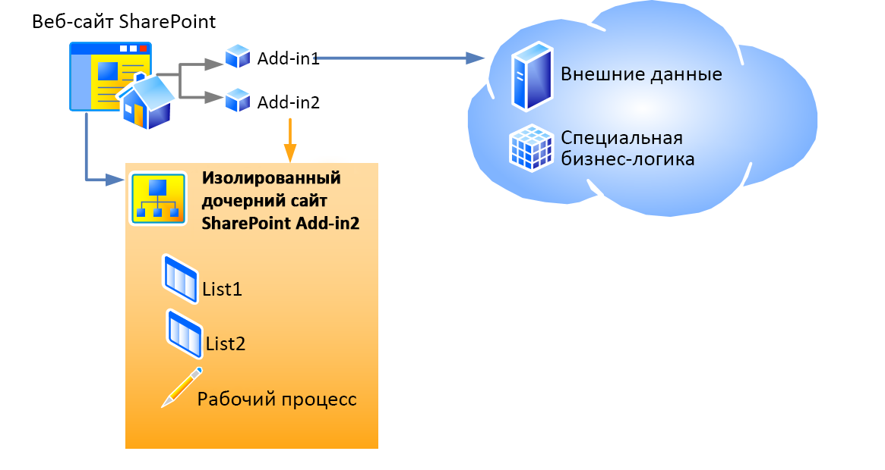

# Хост-сайты, сайты надстроек и компоненты SharePoint в SharePoint 2013
Изучите различия между сайтами надстроек и хост-сайтами. Узнайте также, какие компоненты SharePoint 2013 могут быть включены в Надстройка SharePoint, которые разворачиваются на хост-сайте, на сайте надстройки, и о порядке развертывания сайта надстройки в изолированном домене.
## Хост-сайты, сайты надстройки и изолированный домен
<a name="IsolatedDomain"> </a>

Когда надстройка, включающая компоненты SharePoint, устанавливается на веб-сайте, она включается в список на странице **содержания**, откуда его можно запустить. Этот список, являющийся точкой запуска надстройки, представляет единственное обязательное добавление на веб-сайт, хотя могут также быть добавлены и другие элементы, например, дополнительное действие или веб-часть надстройки. Сведения об этих возможностях см. в разделе  [Доступ к надстройке из пользовательского интерфейса](important-aspects-of-the-sharepoint-add-in-architecture-and-development-landscap.md#AccessingApp). Компоненты Надстройка SharePoint, отличные от этих элементов пользовательского интерфейса, такие как списки, типы контента, рабочие процессы и страницы, разворачиваются на другом веб-сайте в специальном изолированном домене. Этот факт во многом скрыт от пользователя. Специальный сайт, на котором  *разворачивается*  надстройка, называетсясайтом надстройки. Веб-сайт, на котором  *устанавливается*  надстройка, называетсяхост-сайтом. Хотя сайт надстройки имеет собственный изолированный домен, он находится в том же семействе сайтов, что и хост-сайт. (Единственным исключением из этого правила является установка надстройки с областью клиента. В этом случае сайт надстройки находится в семействе сайтов корпоративного каталога надстроек.) 


На рисунке 1 показан хост-сайт с двумя установленными Надстройки SharePoint. В надстройке 1 имеются удаленные компоненты, но нет компонентов SharePoint, поэтому оно не имеет сайта надстройки. В надстройке 2 отсутствуют удаленные компоненты, но имеются два списка и рабочий процесс SharePoint. Они развернуты на изолированном дочернем сайте. (Надстройка SharePoint может иметь как удаленные компоненты, так и компоненты, размещенные в SharePoint, хотя ни одна показанная на этом рисунке надстройка не имеет сразу оба вида компонентов.)


**Рисунок 1. Хост-сайт с размещенной в облаке надстройкой и надстройкой, размещенной в SharePoint**





Например, предположим, что надстройка с компонентами SharePoint, включающими не только элементы пользовательского интерфейса, которые могут быть развернуты на хост-сайте, устанавливается на хост-сайте со следующим URL-адресом:


 `https://www.fabrikam.com/sites/Marketing`


Надстройка SharePoint будет развертываться на заново созданном веб-сайте с URL-адресом, аналогичным следующему:


 `http://add-in-bdf2016ea7dacb.fabrikamadd-ins.com/sites/Marketing/Scheduler`


Обратите внимание, что этот URL-адрес имеет следующую структуру:


 `https://` _Префикс_надстройки_ `-` _ИД_надстройки_ `.` _Базовый_домен_надстройки_ `/` _URL-адрес_хост-сайта_относительно_домена_ `/` _Имя_надстройки_


Заполнители задаются следующим образом.


-  _Префикс_надстройки_ — это любая строка, установленная администратором фермы в центре администрирования. Значение по умолчанию — "default". В данном примере администратор изменил его на "add-in".


-  _ИД_надстройки_ — это шестнадцатеричный номер, который создается внутренне при установке надстройки.


-  _Базовый_домен_надстройки_ — это строка, установленная администратором фермы в центре администрирования или с помощью Командная консоль SharePoint. Его *не*  следует устанавливать как поддомен веб-приложения SharePoint, иначе цель изоляции надстройки не будет выполнена. В этом примере администратор удалил префикс "www." и добавил "add-ins" к имени компании. Таким образом, `fabrikamadd-ins.com` — базовый домен приложения.


-  _URL-адрес_хост-сайта_относительно_домена_ — это относительный URL-адрес родительского хост-сайта, в данном случае `sites/Marketing`.


-  _Имя_надстройки_ — это значение атрибута **Name** элемента **App** в файле appmanifest.xml.


Существует две основные причины развертывания компонентов SharePoint на сайтах надстройки, а не на хост-сайте. Обе причины связаны с безопасностью.


- **Обеспечение выполнения разрешений надстройки.** В Модель для надстроек SharePoint надстройка имеет собственное удостоверение, а также разрешения, которые могут не совпадать с разрешениями пользователя, выполняющего надстройку. Эти разрешения надстройки запрашиваются при установке надстройки и предоставляются лицом, устанавливающим её, а также лицом, имеющим все разрешения, которые запрашивает надстройка. (Если пользователь, устанавливающий надстройку, не имеет все разрешения, запрашиваемые надстройкой, то он не может установить её.) Предоставляя каждой надстройке собственный домен, SharePoint 2013 может надежно идентифицировать запросы, которые делает надстройка, и проверять разрешения надстройки. Дополнительные сведения о разрешениях надстроек см. в разделе [Разрешения надстроек](important-aspects-of-the-sharepoint-add-in-architecture-and-development-landscap.md#AppPermissions).


- **Безопасность междоменных скриптов.** Современные браузеры поддерживают "политику единого домена" по отношению к вызовам методов JavaScript. При развертывании каждого Надстройка SharePoint в собственном домене, SharePoint использует преимущества политики единого домена браузера, чтобы JavaScript в Надстройка SharePoint не мог выполнять никакой JavaScript из другого домена, включая домен, в котором с точки зрения пользователя установлена надстройка.

    SharePoint также предоставляет средства безопасного преодоления ограничений политики. Помимо прочего, удаленным компонентам Надстройка SharePoint разрешается запрашивать данные с любого веб-сайта в рамках общей родительской принадлежности сайта надстройки и хост-сайта. Дополнительные сведения см. в статье  [Обращение к данным SharePoint 2013 из надстроек с помощью междоменной библиотеки](access-sharepoint-2013-data-from-add-ins-using-the-cross-domain-library.md).


## Типы компонентов SharePoint, которые могут находиться в надстройке для SharePoint
<a name="TypesOfSPComponentsInApps"> </a>

В целом Надстройка SharePoint может содержать один или несколько компонентов из следующего списка. С некоторыми исключениями, эти компоненты должны разворачиваться в компонентах уровня **Web**, находящихся в файле пакета решения SharePoint (WSP-файле).


> **Примечание**
> ***** Компоненты, помеченные звездочкой (*), более подробно рассматриваются в разделе [Предостережения для развертывания компонентов SharePoint](#SpecialCases) ниже в этой статье.


- Компоненты (только уровня **Web**)


- Дополнительные действия (включая элементы контекстного меню и настройки ленты)*


- Удаленные приемники событий*


- Разметка, которая ссылается на веб-части, в том числе веб-части надстроек, которые включены в SharePoint (но не настраиваемые веб-части)*


- Пользовательские файлы таблиц стилей (CSS) для использования страницами SharePoint


- Пользовательские файлы JavaScript для использования страницами SharePoint


- Модули (наборы файлов)


- Страницы


- Шаблоны списка


- Экземпляры списков и библиотек


- Настраиваемые формы списков


- Настраиваемые представления списков


- Настраиваемые типы контента


- Поля (или типы полей, встроенные в SharePoint)


- Модели Службы Microsoft Business Connectivity Services (BCS) (только уровня **Web**), типы внешнего контента на основе модели и внешние списки, которые используют эти типы контента*


- Рабочие процессы*


- Контейнеры свойств


- Шаблоны сайтов (но не определения сайтов)*


Никакие другие виды компонентов SharePoint не могут разворачиваться в Надстройка SharePoint. Дополнительные сведения об ограничениях того, что можно включать в Надстройка SharePoint, см. в статье  [Сравнение надстроек SharePoint с решениями SharePoint](http://msdn.microsoft.com/library/0e9efadb-aaf2-4c0d-afd5-d6cf25c4e7a8%28Office.15%29.aspx).


## Предостережения для развертывания компонентов SharePoint
<a name="SpecialCases"> </a>

Далее приводятся некоторые предостережения и сведения, относящиеся к развертыванию разных видов компонентов SharePoint в надстройке. 


- **Дополнительные действия.** Дополнительные действия можно добавлять как на сайт надстройки, так и на хост-сайт. Чтобы добавить дополнительное действие на сайт надстройки, его следует включить в компонент уровня **Web**, находящийся в WSP-файле, как это делается с любым другим компонентом, который добавляется на сайт надстройки. Чтобы добавить дополнительное действие на хост-сайт, можно включить (даже в надстройке с внешним размещением) разметку **CustomAction** в компонент, который находится в пакете надстройки, но вне WSP-файла. Компоненты в таком "свободном" компоненте относятся к хост-сайту, а не к сайту надстройки, поэтому такой тип компонентов называетсякомпонентом хост-сайта. 


- **Веб-части.** Одну разновидность веб-частей, веб-часть надстройки, можно разворачивать в надстройке, и эта веб-часть может вести либо на сайт надстройки, либо на хост-сайт. На все остальные типы веб-частей можно ссылаться в надстройках, но они не могут разворачиваться в надстройках. Если веб-часть надстройки разворачивается на хост-сайте, ее необходимо включить в компонент хост-сайта.


- **Удаленные приемники событий.** Удаленные приемники событий появились в SharePoint 2013. Они похожи на классические приемники событий SharePoint, за исключением того, что код выполняется в облаке. Эти приемники событий недоступны в надстройках, размещенных в SharePoint.


- **Рабочие процессы.** Рабочие процессы в SharePoint 2013 используют среду выполнения workflow-процессов, размещенную в Microsoft Azure, которая появилась в SharePoint 2013. Закодированные рабочие процессы, которые используют среду выполнения workflow-процессов, размещенную в SharePoint, не могут включаться в Надстройка SharePoint. Разрешены только декларативные рабочие процессы или рабочие процессы, использующие новейшую среду выполнения.


- **Модели, типы внешнего контента и внешние списки Службы Microsoft Business Connectivity Services (BCS).** Модели Служба подключения к бизнес-данным (BDC) обычно имеют область, которая шире, чем семейство сайтов. Однако когда модель Служба подключения к бизнес-данным (BDC) разворачивается в надстройке, ее область ограничивается областью сайта надстройки. Когда модель Служба подключения к бизнес-данным (BDC) включается в надстройку, она хранится не в хранилище общих служб Служба подключения к бизнес-данным (BDC), а в виде файла на сайте надстройки.


- **Шаблоны сайтов.** В большинстве случаев вам будет требоваться, чтобы сайт надстройки устанавливал новую встроенную конфигурацию определений сайта **APP#0**, оптимизированную для сайтов надстройки. (Дополнительные сведения об этом см. в разделе  [Доступ к надстройке из пользовательского интерфейса](important-aspects-of-the-sharepoint-add-in-architecture-and-development-landscap.md#AccessingApp).) SharePoint 2013 автоматически использует **APP#0**, если пакет надстройки не включает элемент  [WebTemplate](http://msdn.microsoft.com/library/ff4ba91a-cc5f-47ff-9101-a7651f452185%28Office.15%29.aspx). 

    Кроме того, можно задать настраиваемый тип сайта для сайта надстройки. Чтобы сделать это, необходимо выполнить два основных действия.

  - Включите настраиваемый  [Элемент WebTemplate (веб-шаблон)](http://msdn.microsoft.com/library/ff4ba91a-cc5f-47ff-9101-a7651f452185%28Office.15%29.aspx), файл onet.xml и возможно другие связанные файлы в компонент сайта надстройки для вашей надстройки. Разверните шаблон сайта в компоненте уровня сайта в WSP-файле в пакете надстройки обычным образом.


  - Добавьте  [Элемент WebTemplate (PropertiesDefinition complexType) (Manifest SharePoint Add-in)](http://msdn.microsoft.com/library/62302903-e97a-a9a3-a64e-13176a7c4e1e%28Office.15%29.aspx) в манифест надстройки в качестве потомка элемента **Properties** и установите для его атрибута **Id** значение GUID компонента сайта надстройки и значение **Name** атрибута [Элемент WebTemplate (веб-шаблон)](http://msdn.microsoft.com/library/ff4ba91a-cc5f-47ff-9101-a7651f452185%28Office.15%29.aspx). Обратите внимание, что GUID должен быть заключен в фигурные скобки и содержать дефисы, а также отделяться от имени шаблона символом "#". Вот пример такого значения:

 ```XML

<WebTemplate Id="{81dd4ae5-873b-4759-9838-4ad9c3dd2952}#NewSiteType" />
 ```


    > **Примечание**
      > Новый элемент  [WebTemplate](http://msdn.microsoft.com/library/62302903-e97a-a9a3-a64e-13176a7c4e1e%28Office.15%29.aspx) для манифестов надстроек не является той же разметкой, что и элемент [WebTemplate](http://msdn.microsoft.com/library/ff4ba91a-cc5f-47ff-9101-a7651f452185%28Office.15%29.aspx), который может быть включен в компоненты. Элемент **WebTemplate**, который может быть включен в компоненты, задает тип сайта, а элемент **WebTemplate** для манифестов надстроек просто определяет, какой тип сайта следует использовать. Дополнительные сведения о манифесте надстройки Надстройка SharePoint см. в разделе [Структура пакета надстройки](important-aspects-of-the-sharepoint-add-in-architecture-and-development-landscap.md#SPAppModelArch_Package). 

    > **Внимание!**
      > Не используйте элемент **WebTemplate** в манифесте надстройки для указания какой-либо из встроенных конфигураций определений сайта SharePoint, в качестве типа веб-сайта. Мы не поддерживаем использование какой-либо из встроенных конфигураций определений сайта, кроме **APP#0**, для сайтов надстройки. 

    Дополнительные сведения о конфигурациях определений сайтов и шаблонах сайтов см. в статье  [Работа с шаблонами и определениями](http://msdn.microsoft.com/library/1edf6d4d-eddb-4cb5-9034-ed394e8a3e01%28Office.15%29.aspx).


## Дополнительные ресурсы
<a name="SP15hostedwebs_bk_addlresources"> </a>


-  [Важные аспекты архитектуры и разработки надстройки SharePoint](important-aspects-of-the-sharepoint-add-in-architecture-and-development-landscap.md)


-  [Сравнение надстроек SharePoint с решениями SharePoint](http://msdn.microsoft.com/library/0e9efadb-aaf2-4c0d-afd5-d6cf25c4e7a8%28Office.15%29.aspx)


