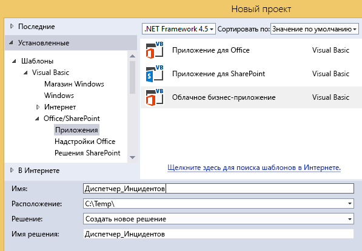
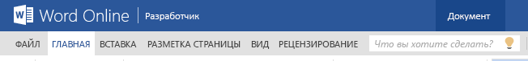

# Управление происшествиями. Учебник по облачной бизнес-надстройке
С помощью шаблона **Облачная бизнес-надстройка** в Visual Studio можно создать размещаемую в SharePoint надстройку, в которой мобильные пользователи могут просматривать, добавлять и изменять данные из удаленных источников с помощью современных сенсорных устройств, например телефонов и планшетов. В этом учебнике показано создание надстройки для вымышленной противопожарной службы Contoso, предназначенное для управления на месте происшествия. Пошаговое руководство охватывает базовые концепции создания облачной бизнес-надстройки, а также более продвинутые концепции, такие как интеграция библиотек документов и списков SharePoint.Вы можете скачать пример приложения для управления происшествиями и связанные файлы из коллекции примеров MSDN:  [Управление происшествиями: учебник по созданию облачной бизнес-надстройки](http://code.msdn.microsoft.com/Incident-Manager-A-Cloud-c32d9b04).
## Необходимые требования

Для этого пошагового руководства требуется Visual Studio 2013 с обновлением 1 и средства разработчика Майкрософт для Visual Studio 2013 с обновлением за март 2014 г.
  
    
    
Для размещения надстройки вам также понадобится сайт разработчика SharePoint в Office 365, который вы можете получить на странице  [Регистрация на сайте разработчиков для Office 365](http://go.microsoft.com/fwlink/?LinkId=263490).
  
    
    

> [!Примечание]
> Вы также можете размещать облачную бизнес-надстройку на сайте SharePoint 2013. 
  
    
    


## Создание приложения управления происшествиями
<a name="add-in"> </a>

В сферу работы противопожарной службы Contoso входит ликвидация пожаров, неотложная медицинская помощь, дорожно-транспортные происшествия и другие аварийные случаи. Каждый такой случай требует значительной работы по документированию происшествия. Сейчас компания регистрирует информацию, заполняя бумажные бланки на месте происшествия, а по возвращении в часть вводит информацию в свою компьютерную систему. Недавно компания ввела систему SharePoint для Office 365 для управления записями и приобрела планшеты, чтобы позволить руководителю аварийно-спасательных работ вводить данные на месте происшествия.
  
    
    
Вы создадите мобильную надстройку, которая будет использоваться для ввода основных сведений о происшествии. Так как при многих происшествиях требуется медицинская помощь, в надстройке также необходимо предусмотреть возможность ввода данных для многих пострадавших при одном происшествии. Этот раздел покажет вам, как создать базовое приложение, попутно объясняя основы облачных бизнес-надстроек.
  
    
    

### Создание проекта


1. В строке меню выберите пункты **Файл**, **Создать** и **Проект**.
    
    Откроется диалоговое окно **Новый проект**.
    
  
2. В списке шаблонов разверните узел **Visual Basic** или **Visual C#**, затем — узел **Office/SharePoint**, выберите узел **Надстройки**, а затем — шаблон **Облачная бизнес-надстройка**, как показано на рисунке 1.
    
   **Рисунок 1. Шаблон "Облачная бизнес-надстройка"**

  

     
  

  

  
3. В текстовом поле **Имя** введитеУправление_происшествиями, а затем нажмите кнопку **ОК**.
    
    Откроется мастер **создания облачной бизнес-надстройки**.
    
  
4. В мастере **Создание облачной бизнес-надстройки** введите URL-адрес для своего сайта разработчика Office 365, а затем нажмите кнопку **Готово**.
    
    URL-адрес должен быть указан в формате https://  _личный_сайт_.sharepoint.com/sites/Developer/.
    
    Решение **Управление_происшествиями** добавляется в обозреватель решений с четырьмя проектами: проект **Управление_происшествиями** верхнего уровня, а также проекты **Управление_происшествиями.HTMLClient**, **Управление_происшествиями.Server** и **Управление_происшествиями.SharePoint**.
    
    
  
    
    

    
    На следующем этапе вы добавите сущность, представляющую набор происшествий. Сущность создает таблицу базы данных SQL Server, встроенную в надстройку. В ней будет храниться информация о каждом происшествии.
    
  

### Добавление сущности происшествия


1. На **начальном** экране выберите гиперссылку **Создать новую таблицу**.
    
    Откроется конструктор сущностей.
    
  
2. В окне **Свойства** в текстовом поле для свойства **Имя** введитеПроисшествие.
    
  
3. В конструкторе сущностей выберите ссылку **<Добавить свойство>** и введитеНомер_происшествия.
    
  
4. Нажмите клавишу ВВОД, принимая **Тип** по умолчанию **String** и оставив установленным флажок **Обязательное**.
    
  
5. В окне **Свойства** установите флажок **Включить в уникальный индекс**.
    
    У каждого происшествия должен быть уникальный номер.
    
  
6. Выберите ссылку **<Добавить свойство>** и введитеДата_происшествия, а затем нажмите клавишу **TAB**.
    
  
7. В столбце **Тип** выберите **Дата**, а затем дважды нажмите клавишу TAB.
    
  
8. В столбце **Имя** введитеВремя_отправки и в столбце **Тип** выберите тип данных **DateTime**.
    
  
9. В следующей строке введите Тип_происшествия и выберите тип данных **Integer**.
    
  
10. В следующей строке введите Адрес_происшествия и выберите тип данных **String**.
    
  
11. В следующей строке введите Имя_сообщающей_стороны и выберите тип данных **Строка**, а затем снимите флажок **Обязательный**.
    
    Иногда о происшествиях сообщают анонимно, поэтому значение в этом поле не должно быть обязательным.
    
  
12. В следующей строке введите Телефон_сообщения и выберите тип данных **PhoneNumber**.
    
    **Номер телефона** — этонастраиваемый бизнес-тип, который автоматически форматируется и проверяет телефонные номера.
    
  
13. В окне **Свойства** выберите гиперссылку **Форматы телефонных номеров**.
    
    Откроется диалоговое окно **Форматы телефонных номеров**.
    
  
14. В диалоговом окне **Форматы телефонных номеров** выберите соответствующий формат для своей локали, а затем нажмите кнопку **Вверх**, чтобы переместить его в верх списка.
    
  
15. В текстовом поле **Проверка тестового номера телефона** введите номер телефона и убедитесь, что он правильно отформатирован, а затем нажмите кнопку **Сохранить**.
    
    Бизнес-тип **Телефонный номер** выполняет форматирование и проверку на любом экране, на котором он появляется.
    
  
16. В следующей строке введите Руководитель_аварийно-спасательных_работ и выберите тип данных **Person**.
    
    Бизнес-тип **Человек** осуществляет связь со службой профилей пользователей SharePoint, которая запрашивает информацию о пользователях из Active Directory.
    
    На рисунке 2 показана готовая сущность.
    

   **Рисунок 2. Сущность "Происшествия"**

  

     
  

    
  
    
    

    
    На следующем этапе вы добавите список вариантов выбора, позволяющий пользователям выбирать значения из фиксированного набора. В таком случае у противопожарной службы будет набор общих типов происшествий.
    
  

### Добавление списка вариантов выбора


1. В конструкторе сущностей выберите поле **Тип_происшествия**, а затем в окне **Свойства** нажмите гиперссылку **Список значений**.
    
    Откроется диалоговое окно **Список значений**.
    
  
2. В диалоговом окне **Список значений** выберите ссылку **Добавить значение** и введите1.
    
  
3. В столбце **Отображаемое имя** введите **Коммерческая противопожарная служба**.
    
  
4. Введите следующие значения и отображаемые имена, а затем нажмите кнопку **ОК**.
    

|**Значение**|**Отображаемое имя**|
|:-----|:-----|
|2  <br/> |Пожар — помещения  <br/> |
|3  <br/> |Пожар — один личный состав тушения  <br/> |
|4  <br/> | Медицинская помощь — специализированная реаниматологическая помощь <br/> |
|5  <br/> | Медицинская помощь — первичные реанимационные мероприятия <br/> |
|6  <br/> |Дорожно-транспортное происшествие  <br/> |
|7  <br/> |Экстренный вызов  <br/> |
|||
   

    При работе с приложением пользователю будет представлен список отображаемых имен. Когда пользователь выберет необходимый вариант, в базе данных сохранится соответствующее значение **Integer**.
    
    
  
    
    

    
    На следующем этапе вы добавите сущность "Пострадавший". Многие из происшествий, которыми занимается противопожарная служба, требуют оказания медицинской помощи, и часто в одном происшествии есть несколько пострадавших.
    
  

### Добавление сущности "Пострадавший"


1. В **обозревателе решений** откройте контекстное меню для узла **Источники данных** и выберите пункт **Добавить таблицу**.
    
  
2. В окне **Свойства** в текстовом поле для свойства **Имя** введитеПострадавший.
    
  
3. В конструкторе сущностей добавьте следующие поля, как показано на рисунке 3:
    
   **Рисунок 3. Готовая сущность "Пострадавший"**

  

     
  

    
  
    
    

    
    На следующем этапе вы определите отношение между сущностями "Происшествие" и "Пострадавший". С происшествием может быть связано много пациентов.
    
  

### Определение отношений


1. В **обозревателе решений** откройте контекстное меню для узла **Происшествия.lsml** и нажмите **Открыть**.
    
  
2. На панели инструментов нажмите кнопку **Отношение**.
    
    Откроется диалоговое окно **Добавление нового отношения**.
    
  
3. В диалоговом окне **Добавление нового отношения** в столбце **К:** строки **Имя** выберите **Пострадавший**.
    
  
4. В строке **Количество элементов** в столбце **К:** выберите **Ноль или один**.
    
  
5. В столбце **К:** выберите **Много**, а затем нажмите кнопку **ОК**.
    
    На рисунке 4 показано отношение.
    

   **Рисунок 4. Отношение между происшествиями и пострадавшими**

  

     
  

    Таким образом создается отношение "ноль или один ко многим" между происшествиями и пострадавшими. У записи происшествия не обязательно должен быть пострадавший, но у каждого пострадавшего должно быть отношение с записью происшествия.
    
    
  
    
    

    
    На следующем этапе вы добавите экраны для просмотра, добавления и редактирования записей "Пострадавший" и "Происшествие".
    
  

### Добавление экранов


1. В **обозревателе решений** откройте контекстное меню для узла **Происшествия.lsml** и нажмите **Открыть**.
    
  
2. В конструкторе экрана в строке **Перспектива** откройте вкладку **HTML-клиент**, а затем на панели инструментов нажмите кнопку **Экран**.
    
    Откроется диалоговое окно **Добавление нового экрана**.
    
  
3. В диалоговом окне **Добавление нового экрана** из списка **Выберите шаблон экрана** выберите **Общий набор экранов**.
    
  
4. В текстовом поле **Имя набора экранов** введитеПроисшествия.
    
  
5. В списке **Данные экрана** выберите **Происшествия**.
    
  
6. Установите оба флажка — **Сведения о происшествии** и **Пострадавшие в происшествии**, а затем нажмите кнопку **ОК**.
    
    На рисунке 5 показано диалоговое окно "Добавление нового экрана".
    

   **Рисунок 5. Диалоговое окно "Добавление нового экрана"**

  

     
  

    В проект "HTML-клиент" добавлены экраны для обзора, просмотра сведений, а также добавления и редактирования. Экран обзора автоматически устанавливается в качестве начального экрана приложения, и автоматически предоставляются необходимые команды для запуска экранов просмотра и добавления и редактирования.
    
  
7. Чтобы запустить приложение, в строке меню последовательно выберите **Отладка**, **Начать отладку**. Если появится диалоговое окно **Подключение к SharePoint**, введите свое имя пользователя и пароль.
    
  
8. Если будет предложено, нажмите кнопку **Доверять**. Откроется надстройка с пустым экраном. Обратите внимание, что экран имеет название **Набор_происшествий**.
    
  
9. Нажмите кнопку **Добавить**.
    
    Откроется диалоговое окно **Происшествия**. Обратите внимание, что, хотя вы можете ввести данные о происшествии, не предусмотрена возможность добавления пострадавших. Вы исправите этот и другие недочеты дизайна, настроив экраны.
    
    
  
    
    

    
    На следующем этапе вы настроите экран обзора.
    
  
10. Закройте диалоговое окно **Происшествие**, а затем закройте окно браузера, чтобы вернуться в режим конструктора.
    
  

### Настройка экрана браузера


1. На экране **обозревателя решений** откройте контекстное меню для узла **Просмотр_набора_происшествий** и нажмите **Открыть**.
    
  
2. В окне **Свойства** выберите свойство **Отображаемое имя** и введитеПроисшествия.
    
  
3. На экране конструктора выберите узел **Макет строк | строки**, а затем разверните список **Добавить** и выберите **Адрес происшествия**.
    
  
4. Разверните узел **Время отправки**, а затем на панели инструментов нажмите кнопку **Удалить**.
    
    На рисунке 6 показан готовый макет экрана.
    

   **Рисунок 6. Макет экрана обзора**

  

     
  

    При выполнении приложения на экране будут отображаться плитки для всех происшествий, и на каждой из них будет показан номер, дата и адрес.
    
    
  
    
    

    
    На следующем экране вы настроите экран добавления и редактирования.
    
  

### Настройка экрана добавления и редактирования


1. На экране **обозревателя решений** откройте контекстное меню для узла **Добавление_происшествий.lsml** и нажмите **Открыть**.
    
  
2. Выберите узлы **Адрес происшествия**, **Имя сообщающей стороны** и **Телефон сообщения** и перетащите их в раздел **Макет строк | слева** под узлом **Тип происшествия**.
    
  
3. Выберите узел **Время отправки** и в окне **Свойства** снимите флажок **Средство выбора даты включено**.
    
    Не нужно указывать дату, потому что она всегда совпадает с датой происшествия.
    
  
4. В левой панели конструктора экрана выберите ссылку **Добавить пострадавших**, как показано на рисунке 7.
    
   **Рисунок 7. Добавление ссылки "Пострадавшие"**

  

     
  

  

  
5. В левой панели выберите узел **Пострадавшие** и перетащите его под узел **Руководитель аварийно-спасательных работ** в центральной панели.
    
    На рисунке 8 показан готовый макет экрана.
    

   **Рисунок 8. Макет экрана добавления и изменения**

  

     
  

    
  
    
    

    
    На следующем этапе вы создадите экран для добавления записей о пострадавших.
    
  

### Добавление экрана пострадавших


1. На экране **обозревателя решений** откройте контекстное меню для узла **Добавление_происшествий.lsml** и нажмите **Открыть**.
    
  
2. В конструкторе экрана под узлом **Макет строк | Сведения (вкладка)** откройте контекстное меню для узла **Панель команд** и выберите **Добавить кнопку**.
    
  
3. В диалоговом окне **Добавление кнопки** разверните список **Показать_вкладку** и в группе **Пострадавшие** выберите **Добавить_и_изменить_новую**, а затем нажмите кнопку **ОК**.
    
    Откроется диалоговое окно **Добавление нового экрана**.
    
  
4. В диалоговом окне **Добавление нового экрана** примите значения по умолчанию и нажмите кнопку **ОК**.
    
    В конструкторе экрана откроется экран **Добавление_и_редактирование_пострадавшего**.
    
  
5. В окне "Свойства" выберите свойство **Отображаемое имя** и введитеДобавить пострадавшего.
    
  
6. В конструкторе экрана выберите узел **Происшествие** и удалите его.
    
    Поле **Происшествия** не требуется, так как пациент уже связан с происшествием.
    
    На рисунке 9 показан готовый макет экрана.
    

   **Рисунок 9. Макет экрана добавления и изменения**

  

     
  

    
  
    
    

    
    На следующем этапе вы запустите надстройку и добавите некоторые данные.
    
  

### Тестирование надстройки


1. В строке меню последовательно выберите **Отладка**, **Начать отладку**.
    
  
2. В запущенной надстройке нажмите кнопку **Добавить**.
    
    Откроется всплывающее окно **Происшествия**, как показано на рисунке 10.
    

   **Рисунок 10. Всплывающее окно "Происшествия"**

  

     
  

  

  
3. В текстовом поле **Номер происшествия** введите2014-1.
    
  
4. В полях **Дата происшествия** и **Время отправки** с помощью элементов управления **Средство выбора даты** и **Средство выбора времени** выберите дату и время.
    
  
5. В списке **Тип происшествия** выберите **Медицинская помощь — первичные реанимационные мероприятия**.
    
  
6. В текстовом поле **Адрес происшествия** введите адрес в своем городе.
    
     Не включайте город, страну или почтовый индекс. Подразумевается, что противопожарная служба обслуживает только один город.
    
  
7. В элементе управления **Средство выбора людей** для **Руководитель аварийно-спасательных работ** введите имя пользователя на вашем сайте SharePoint.
    
    Обратите внимание, что по мере введения текста появляется список всех совпадающих имен.
    
  
8. Нажмите кнопку **Добавить пострадавшего**.
    
    Откроется всплывающее окно **Добавление пострадавшего**, как показано на рисунке 11.
    

   **Рисунок 11. Всплывающее окно "Добавление пострадавшего"**

  

     
  

  

  
9. Введите информацию о пострадавшем и нажмите кнопку **Сохранить**.
    
    Имя добавленного вами пострадавшего отобразится во всплывающем окне **Происшествия**. Если хотите, можете добавить других пострадавших.
    
  
10. Во всплывающем окне **Происшествия** нажмите кнопку **Сохранить**.
    
    Если вы выполнили инструкции, вы увидите сообщение об ошибке проверки. Поле **Телефон сообщения** является обязательным. В облачных бизнес-надстройках есть встроенная проверка для обязательных полей.
    
  
11. Введите номер телефона и снова нажмите кнопку **Сохранить**.
    
    На домашнем экране **Происшествия** отобразится плитка с номером, датой и адресом происшествия.
    
  
12. Выберите плитку, чтобы открыть экран просмотра для происшествия.
    
    Обратите внимание, что поле **Телефон сообщения** отображается как гиперссылка, предоставляя прямой доступ к приложению телефона, установленному по умолчанию.
    
  
13. Нажмите кнопку **Правка**, чтобы открыть экран **Добавление_и_редактирование_происшествий**, а затем нажмите кнопку **Отменить**, чтобы вернуться на экран **Просмотр**.
    
  
14. Откройте вкладку **Пострадавшие**, чтобы показать список пострадавших, а затем выберите плитку пострадавшего.
    
    Обратите внимание, что экран для пострадавшего не откроется. Это связано с тем, что вы его еще не создали.
    
  
15. В браузере нажмите кнопку **Закрыть**, чтобы вернуть его в режим конструктора.
    
    
  
    
    

    
    На следующем этапе вы добавите экран для просмотра пострадавших.
    
  

### Добавление экрана просмотра


1. На экране **обозревателя решений** откройте контекстное меню для узла **Пострадавшие.lsml** и нажмите **Открыть**.
    
  
2. В конструкторе сущностей в строке **Перспектива** откройте вкладку **HTML-клиент**, а затем на панели инструментов нажмите кнопку **Экран**. 
    
    Откроется диалоговое окно **Добавление нового экрана**.
    
  
3. В диалоговом окне **Добавление нового экрана** из списка **Выберите шаблон экрана** выберите **Экран просмотра сведений**.
    
  
4. В текстовом поле **Имя экрана** введите **Просмотр_пострадавшего**, из списка **Данные экрана** выберите **Пострадавший** и нажмите кнопку **ОК**.
    
    В конструкторе экрана откроется экран **Просмотр_пострадавшего**.
    
  
5. В конструкторе экрана под узлом **Макет строк | Сведения (вкладка)** откройте контекстное меню для узла **Панель команд** и выберите **Добавить кнопку**.
    
  
6. В диалоговом окне **Добавление кнопки** разверните список **Показать_вкладку** и в группе **Пострадавшие** выберите **Правка**, а затем нажмите кнопку **ОК**.
    
  
7. Запустите приложение и убедитесь, что теперь вы можете просматривать и редактировать записи пострадавших.
    
    
  
    
    

    
    Теперь вы создали полнофункциональную надстройку по управлению происшествиями, но облачные бизнес-надстройки способны делать намного больше. В следующем разделе вы узнаете, как использовать ресурсы на сайте SharePoint из надстройки по управлению происшествиями.
    
  

## Интеграция ресурсов SharePoint
<a name="integrate"> </a>

Противопожарная служба Contoso начала использовать надстройку по управлению происшествиями, и, как часто происходит с проектами разработки программного обеспечения, теперь она хочет добавить новую возможность. Кроме информации о происшествиях и пострадавших, компании необходимо управлять ресурсами, например огнетушительными аппаратами и персоналом. У компании уже есть списки аппаратов и персонала на сайте SharePoint, поэтому вы будете использовать эти списки как еще один источник данных для надстройки.
  
    
    
На первом этапе необходимо добавить несколько заранее заполненных шаблонов списков на свой сайт разработчика.
  
    
    

### Добавление шаблонов списков


1. Чтобы запустить надстройку, в строке меню последовательно выберите **Отладка**, **Начать отладку**.
    
  
2. В запущенной надстройке на панели хрома нажмите **Назад к сайту**, чтобы перейти на свой сайт разработчика SharePoint, как показано на рисунке 12.
    
   **Рисунок 12. Ссылка "Назад к сайту"**

  

     
  

  

  
3. На странице **Разработчик** выберите ссылку **Контент сайта**.
    
  
4. На странице **Контент сайта** выберите ссылку **Параметры**, как показано на рисунке 13.
    
   **Рисунок 13. Ссылка "Параметры сайта"**

  

     
  

  

  
5. На странице **Параметры сайта** в списке **Коллекции веб-дизайнера** выберите ссылку **Шаблоны списков**, как показано на рисунке 14.
    
   **Рисунок 14. Ссылка "Шаблоны списков"**

  

     
  

  

  
6. На странице **Коллекция шаблонов списков** откройте вкладку **ФАЙЛЫ**, а затем на ленте нажмите кнопку **Отправить документ**.
    
  
7. В диалоговом окне **Добавление шаблона** нажмите кнопку **Обзор**, а затем перейдите к папке **Ресурсы** для загруженного примера "Управление происшествиями".
    
  
8. Выберите файл **Аппараты_Contoso.stp** и нажмите кнопку **Открыть**, а затем — кнопку **ОК**.
    
  
9. В диалоговом окне **Коллекция шаблонов списков** нажмите кнопку **Сохранить**.
    
  
10. Повторите процесс и отправьте файл **Аппараты_Contoso.stp**.
    
   **Рисунок 15. Отправленные файлы**

  

     
  

  

  
11. Выберите ссылку **Контент сайта** и на странице **Контент сайта** выберите плитку **добавить надстройку**.
    
  
12. На странице **Контент сайта > Ваши надстройки** выберите плитку **Аппараты Contoso**.
    
    > [!Примечание]
      > Чтобы найти ссылку **Аппараты Contoso**, вам может понадобиться перейти на вторую страницу надстроек. 
13. В диалоговом окне **Добавление настраиваемого списка** выберите текстовое поле **Имя** и введитеАппараты Contoso, а затем нажмите кнопку **Создать**.
    
  
14. Повторите процесс и добавьте список **Персонал Contoso**, введя в качестве имени Персонал Contoso.
    
  
15. На странице **Контент сайта** проверьте, появились ли списки **Аппараты Contoso** и **Персонал Contoso**.
    
    
  
    
    

    
    На следующем этапе вы добавите свой сайт SharePoint в качестве источника данных.
    
  

### Добавление источника данных SharePoint


1. В **обозревателе решений** откройте контекстное меню для узла **Источники данных** и выберите пункт **Добавить источник данных**.
    
    Откроется **мастер присоединения к источнику данных**.
    
  
2. В **мастере присоединения к источнику данных** выберите значок **SharePoint**, как показано на рисунке 16, а затем нажмите кнопку **Далее**.
    
   **Рисунок 16. Источник данных SharePoint**

  

     
  

  

  
3. На странице **Ввод сведений для подключения** проверьте, отображается ли правильный URL-адрес вашего сайта разработчика SharePoint, а затем нажмите кнопку **Далее**.
    
  
4. На странице **Выбор элементов SharePoint** установите флажки для списков **Аппараты_Contoso** и **Персонал_Contoso**, как показано на рисунке 17, а затем нажмите кнопку **Готово**.
    
   **Рисунок 17. Выбранные списки**

  

     
  

    Добавляются сущности в новый узел **Данные разработчика** под узлом **Источники данных** в **Обозревателе решений**, и в конструкторе сущностей открывается сущность **Аппараты_Contoso**.
    
    
    > [!Примечание]
      > Возможно, вы заметили, что также добавлена сущность **Списки_информации_пользователей**. SharePoint использует этот список для управления полями **Кто создал** и **Кто изменил** для списков.
5. В окне **Свойства** выберите свойство **Отображаемое имя** и измените его наАппараты.
    
    
  
    
    

    
    На следующем этапе вы определите запрос, который будет ограничивать данные, возвращаемые из сущности **Набор_аппаратов**. В таком случае вам необходимо видеть только действующие аппараты.
    
  

### Определение запроса "Доступные_аппараты"


1. В **обозревателе решений** откройте контекстное меню для узла **Набор_аппаратов.lsml** и выберите пункт **Добавить запрос**.
    
    Откроется конструктор запросов.
    
  
2. В окне **Свойства** выберите свойство **Имя** и введитеДоступные_аппараты.
    
  
3. В конструкторе запросов выберите ссылку **Добавить фильтр** и во втором раскрывающемся списке выберите **Доступен**.
    
  
4. В последнем поле измените **False** на **True**.
    
    На рисунке 18 показан запрос.
    

   **Рисунок 18. Запрос "Доступные_аппараты"**

  

     
  

    
  
    
    

    
    В следующем запросе вы определите другой запрос для сущности **Персонал_Contoso**. В таком случае вам необходимо видеть только персонал, относящийся к смене "А".
    
  

### Определение запроса "Доступный_персонал"


1. В **обозревателе решений** откройте контекстное меню для узла **Персонал_Contoso.lsml** и выберите пункт **Добавить запрос**.
    
    Откроется конструктор запросов.
    
  
2. В окне **Свойства** выберите свойство **Имя** и введитеДоступный_персонал.
    
  
3. В конструкторе запросов выберите ссылку **Добавить фильтр** и во втором раскрывающемся списке выберите **Смена**.
    
  
4. В последнем текстовом поле введите **А**.
    
    На рисунке 19 показан запрос.
    

   **Рисунок 19. Запрос "Доступный_персонал"**

  

     
  

    
  
    
    

    
    На следующем этапе вы добавите списки доступных аппаратов и персонала на экран **Просмотр_происшествий**.
    
  

### Добавление запросов на экран


1. В **обозревателе решений** откройте контекстное меню для узла **Просмотр_происшествий.lsml** и нажмите **Открыть**.
    
  
2. В конструкторе экрана откройте контекстное меню для узла **Вкладка** и выберите **Добавить вкладку**.
    
  
3. В окне **Свойства** измените свойство **Имя** наРесурсы.
    
  
4. В конструкторе экрана на панели инструментов выберите **Добавить элемент данных**.
    
    Откроется диалоговое окно **Добавление элемента данных**.
    
  
5. В диалоговом окне **Добавление элемента данных** установите переключатель **Запрос**.
    
  
6. В списке выберите **Данные_разработчика.Доступные_аппараты**, как показано на рисунке 20, а затем нажмите кнопку **ОК**.
    
   **Рисунок 20. Запрос "Доступные_аппараты"**

  

     
  

    Коллекция **Доступные_аппараты** добавляется в левую панель конструктора экрана.
    
  
7. Повторите этот процесс, чтобы добавить на экран запрос **Доступный_персонал**.
    
  
8. Под узлом **Макет строк | Ресурсы** откройте список **Добавить** и выберите **Доступные_аппараты**.
    
  
9. Выберите узел **Список | Доступные аппараты**, откройте список **Список** и выберите **Список плиток**.
    
  
10. Удалите все элементы под узлом **Макет строк | Аппараты Contoso**, кроме **Номер аппарата** и **Тип аппарата**.
    
  
11. Под узлом **Макет строк | Ресурсы** откройте список **Добавить** и выберите **Доступный_персонал**.
    
  
12. Выберите узел **Список | Доступный персонал**, откройте список **Список** и выберите **Таблица**.
    
  
13. Удалите все элементы под узлом **Строка таблицы | Персонал Contoso**, кроме **Имя**, **Ранг** и **Назначение**.
    
    На рисунке 21 показан макет экрана.
    

   **Рисунок 21. Макет экрана**

  

     
  

  

  
14. Запустите надстройку и пронаблюдайте за изменениями. Выберите происшествие, а затем откройте вкладку **Ресурсы**, чтобы просмотреть список доступных ресурсов.
    
    
  
    
    

    
    Изменения внесены. В следующем разделе вы узнаете, как добавлять и сопоставлять библиотеку документов SharePoint с надстройкой.
    
  

## Сопоставление библиотеки документов
<a name="associate"> </a>

На месте происшествия руководитель аварийно-спасательных работ должен документировать многие данные. Для некоторых из них предварительно созданы формы, а некоторые не предусмотрены заранее и зависят от конкретного случая. Документы, создаваемые на месте происшествия, должны быть доступны позже; они должны быть упорядочены по происшествиям для легкого извлечения. Для надстройки по управлению происшествиями можно использовать компонент настраиваемой библиотеки документов в SharePoint, чтобы сопоставлять документы с каждым происшествием.
  
    
    

### Добавление библиотеки документов на сайт SharePoint


1. Чтобы запустить надстройку, в строке меню последовательно выберите **Отладка**, **Начать отладку**.
    
  
2. В запущенной надстройке на панели хрома выберите **Назад к сайту**, как показано на рисунке 22, чтобы перейти на свой сайт разработчика SharePoint.
    
   **Рисунок 22. Ссылка "Назад к сайту"**

  

     
  

  

  
3. На странице **Разработчик** выберите ссылку **Контент сайта**.
    
  
4. На странице **Контент сайта** выберите плитку **добавить надстройку**.
    
  
5. На странице **Контент сайта > Ваши надстройки** выберите плитку **Библиотека документов**.
    
  
6. В диалоговом окне **Добавление библиотеки документов** в текстовом поле **Имя** введитеДокументы о происшествии, а затем нажмите кнопку **Создать**.
    
  
7. На странице **Контент сайта** выберите плитку **Документы о происшествии**, чтобы открыть библиотеку, а затем откройте вкладку **БИБЛИОТЕКА**.
    
  
8. На **ленте** нажмите кнопку **Создать столбец**.
    
  
9. В диалоговом окне **Создание столбца** в текстовом поле **Имя столбца** введитеНомер_происшествия, а затем нажмите кнопку **ОК**.
    
    На рисунке 23 показан вновь созданный столбец.
    

   **Рисунок 23. Библиотека документов "Документы об инциденте"**

  

     
  

    Чтобы сопоставить библиотеку документов с вашей надстройкой, библиотека документов должна содержать настраиваемый столбец, сопоставленный с уникальным полем в вашей сущности. В этом случае столбец **Номер_происшествия** сопоставляется с полем **Номер_происшествия** в сущности **Происшествия**.
    
    
  
    
    

    
    На следующем этапе вы добавите в надстройку библиотеку документов.
    
  

### Добавление библиотеки документов в проект


1. В **обозревателе решений** откройте контекстное меню для узла **Данные разработчика** и выберите пункт **Обновить источник данных**.
    
  
2. На странице **Выбор элементов SharePoint** в левой панели выберите элемент списка **Библиотеки документов**, а в правой панели установите флажок **Документы_о_происшествии**, как показано на рисунке 24, и нажмите кнопку **Готово**.
    
   **Рисунок 24. Сущность "Документы_о_происшествии"**

  

     
  

    В обозреватель решений добавляется узел **Документы_о_происшествии.lsml**.
    
    
  
    
    

    
    На следующем этапе вы создадите отношение между библиотекой документов и сущностью "Происшествия".
    
  

### Создание отношения между источниками данных


1. В **обозревателе решений** откройте контекстное меню для узла **Документы_о_происшествии** и нажмите **Открыть**.
    
  
2. В конструкторе сущностей в строке **Перспектива** откройте вкладку **Сервер**, а затем на панели инструментов нажмите кнопку **Отношение**.
    
  
3. В диалоговом окне **Добавление нового отношения** из раскрывающегося списка выберите **К:**, выберите **Происшествие**, как показано на рисунке 25.
    
   **Рис. 25. Диалоговое окно "Добавление нового отношения"**

  

     
  

  

  
4. Из раскрывающегося списка ключей **Внешний** выберите поле **Номер_происшествия (строка)** из сущности **Документы_о_происшествии**.
    
  
5. Из раскрывающегося списка ключей **Первичный** выберите поле **Номер_происшествия (строка)** из сущности **Происшествия** и нажмите кнопку **ОК**.
    
    На рисунке 26 показаны внешний и первичный ключи.
    

   **Рисунок 26. Внешний и первичный ключи**

  

     
  

    
  
    
    

    
    На следующем этапе вы добавите библиотеку документов на экран **Просмотр_происшествий**.
    
  

### Добавление библиотеки документов на экран


1. В **обозревателе решений** откройте контекстное меню для узла **Просмотр_происшествий.lsml** и нажмите **Открыть**.
    
  
2. В конструкторе экрана откройте контекстное меню для узла **Вкладка** и выберите **Добавить вкладку**.
    
  
3. В окне **Свойства** измените свойство **Имя** наДокументы.
    
  
4. В конструкторе экрана в левой панели выберите ссылку **Добавить документы_о_происшествии**.
    
  
5. В центральной панели под узлом **Макет строк | Документы** откройте список **Добавить** и выберите **Документы о происшествии**.
    
  
6. Под узлом **Макет строк | Документы** откройте контекстное меню для узла **Панель команд** и выберите **Добавить кнопку**.
    
  
7. В диалоговом окне **Добавление кнопки** разверните список **Показать_вкладку** и в группе **Документы_о_происшествии** выберите **Создать_или_отправить_документ**, как показано на рисунке 27, и нажмите кнопку **ОК**.
    
   **Рисунок 27. Диалоговое окно "Добавление кнопки"**

  

     
  

  

  
8. В окне **Свойства** выберите свойство **Отображаемое имя** и введитеДобавить документ.
    
  
9. Разверните список свойств **Значок** и выберите **Вложение**.
    
  
10. Чтобы запустить надстройку, в строке меню последовательно выберите команды **Отладка**, **Начать отладку**.
    
  
11. Выберите происшествие, откройте вкладку **Документы** и нажмите кнопку **Добавить документ**.
    
    Откроется диалоговое окно SharePoint **Создание нового файла**, как показано на рисунке 28.
    

   **Рис. 28. Диалоговое окно "Создание нового файла"**

  

     
  

  

  
12. Выберите ссылку **ОТПРАВИТЬ ФАЙЛ** и выберите файл для отправки, а затем нажмите кнопку **Открыть**.
    
    Файл будет добавлен на вкладку **Документы**.
    
    > [!Совет]
      > Если выбран документ Office, вы можете просмотреть его в надстройке. 
13. Нажмите кнопку "Добавить документ" и в диалоговом окне **Создание нового файла** выберите **Документ Word**.
    
    Новый документ Word откроется в **Word Online**.
    
  
14. В заголовке окна выберите поле имени **Документ**, как показано на рисунке 29, и введите Отчет о происшествии.
    
   **Рисунок 29. Поле имени "Документ"**

  

     
  

    Оно будет использовано в качестве имени файла для документа.
    
    
    > [!Примечание]
      > Если вы не введете имя файла, он будет сохранен с именем по умолчанию **Документ.docx**. После сохранения имя файла можно изменить, только получив к нему доступ в библиотеке документов в SharePoint. 
15. В браузере нажмите кнопку "Назад", чтобы вернуться к надстройке. Документ **Отчет о происшествии** должен появиться на вкладке **Документы**.
    
  
16. В браузере нажмите кнопку **Закрыть**, чтобы вернуть его в режим конструктора.
    
    
  
    
    

    
    В следующем разделе вы настроите надстройку и добавите код JavaScript.
    
  

## Конфигурация надстройки
<a name="custom"> </a>

Противопожарная служба Contoso довольна возможностями, добавленными в надстройку по управлению происшествиями, но хочет добавить еще несколько "завершающих штрихов". Представители службы хотят, чтобы на экране отображался логотип службы вместо значка по умолчанию. Им не нравится элемент управления **FlipSwitch** для поля **Есть страховка** на экране **Добавление_и_редактирование_данных_о пострадавшем**, и они хотят заменить его на флажок. Наконец, так как не при всех происшествиях есть пострадавшие, необходимо, чтобы вкладка **Пострадавшие** не отображалась на экране **Просмотр_происшествий**, если пострадавших нет.
  
    
    

### Отображение пользовательского логотипа


1. В **обозревателе решений** в проекте **Обозреватель_происшествий.Html-клиент** разверните узлы **Контент** и **Изображения**.
    
  
2. Выберите файлы **пользовательский-логотип.png** и **пользовательский-экран-заставка.png**, как показано на рисунке 30, и удалите их.
    
   **Рисунок 30. Файлы, которые необходимо удалить**

  

     
  

  

  
3. Откройте контекстное меню для узла **Изображения**, выберите **Добавить**, **Существующий элемент**.
    
  
4. В диалоговом окне **Добавление существующего элемента** нажмите кнопку **Обзор**, а затем перейдите к папке **Ресурсы** для загруженного примера "Управление происшествиями".
    
  
5. Выберите файлы **пользовательский-логотип.png** и **пользовательский-экран-заставка.png**, а затем нажмите кнопку **Добавить**.
    
    В заголовке окна надстройки отобразятся новые изображения, а при ее загрузке будет появляться экран-заставка.
    
    
  
    
    

    
    На следующем этапе вы замените элемент управления **переключатель пролистыванием** на флажок.
    
  

### Замена элемента управления "переключатель пролистыванием"


1. В **обозревателе решений** откройте контекстное меню для узла **Добавление_и_редактирование_данных_о пострадавшем.lsml** и нажмите **Открыть**.
    
  
2. В конструкторе экрана разверните список для узла **Есть страховка** и выберите **пользовательский элемент управления**.
    
  
3. В окне **Свойства** выберите ссылку **Изменить код метода Render**.
    
  
4. В редакторе кода добавьте в метод **Insured_render** следующий код:
    
  ```
  
// Create the checkbox and add it to the DOM.
    var checkbox = $("<input type='checkbox'/>")
            .css({
                height: 20,
                width: 20,
                margin: "10px"
            })
            .appendTo($(element));

    // Determine if the change was initiated by the user.
    var changingValue = false;

    checkbox.change(function () {
        changingValue = true;
        contentItem.value = checkbox[0].checked;
        changingValue = false;
    });
    contentItem.dataBind("value", function (newValue) {
        if (!changingValue) {
            checkbox[0].checked = newValue;
        }
    });
  ```


    При подготовке к прорисовке экрана этот код создаст элемент управления **Флажок**. Вам также понадобится добавить код, чтобы установить начальное значение.
    
  
5. В **обозревателе решений** откройте контекстное меню для сущности **Пострадавшие.lsml** и нажмите **Открыть**.
    
  
6. В конструкторе сущностей на панели **Перспектива** откройте вкладку **HTML-клиент**.
    
  
7. На панели инструментов разверните список **Запись кода** и выберите **созданные**.
    
  
8. В редакторе кода добавьте в метод **created** следующий код:
    
  ```
  
entity.Insured = new Boolean();
    entity.Insured = 'true';
  ```


    При создании экрана этот код задает в качестве начального значения для элемента управления установленное состояние (true).
    
    
  
    
    

    
    На следующем этапе вы добавите код, скрывающий вкладку **Пострадавшие**, когда пострадавших нет.
    
  

### Условное скрытие вкладки


1. В **обозревателе решений** откройте контекстное меню для узла экрана **Просмотр_происшествий.lsml** и нажмите **Открыть**.
    
  
2. На панели инструментов откройте список **Запись кода** и выберите **созданные**.
    
  
3. В редакторе кода добавьте следующий код в метод **Просмотреть_созданные_происшествия**:
    
  ```
  
screen.getPatients().then(function (results) {
        var queryCount = results.count;
        if (queryCount == 0 ) {
            screen.findContentItem("Patients").isVisible = false;
        }
    });
  ```


    Этот код запускает запрос **GetPatients**, чтобы получить количество **Patients**. Если результат равен нулю, метод **findContentItem** устанавливает для свойства **isVisible** вкладки **Пострадавшие** значение false, скрывая его.
    
  
4. В строке меню выберите **Отладка**, **Начать отладку**, чтобы запустить надстройку. Обратите внимание, что на экранах отображается новый логотип. Откройте первое происшествие, которое вы создали ранее, и отредактируйте данные о пострадавшем. Убедитесь, что поле "Есть страховка" теперь имеет вид флажка. Добавьте новое происшествие без пострадавших и убедитесь, что вкладка **Пострадавшие** скрыта на экране просмотра.
    
    
  
    
    

    
    В последнем разделе вы опубликуете готовую надстройку в SharePoint.
    
  

## Публикация в SharePoint
<a name="pub"> </a>

Пока вы запускали надстройку только в режиме отладки, который выполняет проверку подлинности с помощью SharePoint и перенаправляет вас к экземпляру IIS Express локального компьютера. Далее вы опубликуете надстройку как автоматически размещаемую надстройку SharePoint, которая будет автоматически подготавливать пространство в Office 365 для надстройки и внутренней базы данных. В частности, надстройка будет размещена в Microsoft Azure, а база данных — в SQL Azure. После того как вы опубликуете надстройку, другие люди смогут запускать ее из SharePoint на своих компьютерах и мобильных устройствах.
  
    
    

### Публикация надстройки


1. На панели инструментов Visual Studio откройте список **Отладка** и выберите **Выпуск**.
    
  
2. В **обозревателе решений** откройте контекстное меню для узла **Управление_происшествиями**, как показано на рисунке 31, а затем выберите пункт **Опубликовать**.
    
   **Рисунок 31. Узел "Управление происшествиями"**

  

     
  

    Откроется **мастер публикации приложений LightSwitch**.
    
  
3. На странице параметров **SharePoint** нажмите кнопку параметров **Автоматическое размещение**, как показано на рисунке 32, а затем нажмите кнопку **Опубликовать**.
    
   **Рисунок 32. Параметр автоматического размещения**

  

     
  

    Когда надстройка будет опубликована, откроется **проводник**, в котором будет отображаться папка **Публикация** для вашего проекта.
    
  
4. В браузере перейдите к своему сайту разработчика SharePoint.
    
  
5. В списке **Тестируемые надстройки** выберите ссылку с троеточием (…) возле **Управление_происшествиями**, а затем выберите ссылку **Удалить**, как показано на рисунке 33.
    
   **Рисунок 33. Ссылка "Удалить"**

  

     
  

  

  
6. Выберите ссылку **создать надстройку для развертывания**.
    
  
7. В диалоговом окне **Развертывание надстройки** выберите ссылку **отправить**, как показано на рисунке 34.
    
   **Рисунок 34. Ссылка "Отправить"**

  

     
  

    Откроется диалоговое окно **Отправка надстройки**.
    
  
8. В диалоговом окне **Отправка надстройки** нажмите кнопку **Обзор**, перейдите к папке **Публикация** для своей надстройки и выберите файл **Управление_происшествиями.SharePoint.app**, нажмите кнопку **Открыть**, а затем — **ОК**.
    
    Когда файл будет отправлен, откроется диалоговое окно **Развертывание надстройки**.
    
  
9. В диалоговом окне **Развертывание надстройки** нажмите кнопку **Развернуть**.
    
  
10. В диалоговом окне **Отправка надстройки** нажмите кнопку **Доверять**.
    
    Надстройка будет установлена на вашем сайте SharePoint. Этот процесс может длиться несколько минут.
    
    На рисунке 35 показан список "Тестируемые надстройки" во время установки надстройки.
    

   **Рисунок 35. Список "Тестируемые надстройки"**

  

     
  

  

  
11. Выберите ссылку **Контент сайта**.
    
    На рисунке 37 показан список "Контент сайта" во время установки надстройки.
    

   **Рисунок 37. Установка надстройки**

  

     
  

  

  
12. Когда завершится установка надстройки, нажмите плитку **Управление происшествиями**, чтобы запустить надстройку.
    
    На рисунке 38 показан список "Контент сайта" после установки надстройки.
    

   **Рисунок 38. Надстройка установлена**

  

     
  

    Надстройка открывается в браузере и выглядит точно так же, как при запуске в режиме отладки. Обратите внимание, что исчезли данные, которые вы ввели при разработке. При развертывании надстройки развертывается база данных, но не сами данные.
    
  
13. Введите какие-либо данные и убедитесь, что все работает, как ожидалось.
    
    На рисунке 39 показана надстройка в браузере компьютера.
    

   **Рисунок 39. Представление плиток**

  

     
  

    Вы также можете проверить свою надстройку на мобильном устройстве. Войдите на сайт SharePoint из веб-браузера на устройстве, а затем запустите надстройку.
    
    На рисунке 40 показана надстройка в мобильном браузере.
    

   **Рисунок 40. Представление списка**

  

     
  

  

  
Поздравляем! Вы завершили изучение этого руководства и теперь знакомы с основами создания облачной бизнес-надстройки. Теперь создайте собственную надстройку, а представленные ниже дополнительные ресурсы помогут вам углубить свои знания.
## Дополнительные ресурсы
<a name="bk_addresources"> </a>


-  [Начало разработки облачных бизнес-надстроек](get-started-developing-cloud-business-add-ins.md)
    
  
-  [Разработка облачных бизнес-надстроек](develop-cloud-business-add-ins.md)
    
  
-  [Публикация облачных бизнес-надстроек](publish-cloud-business-add-ins.md)
    
  

