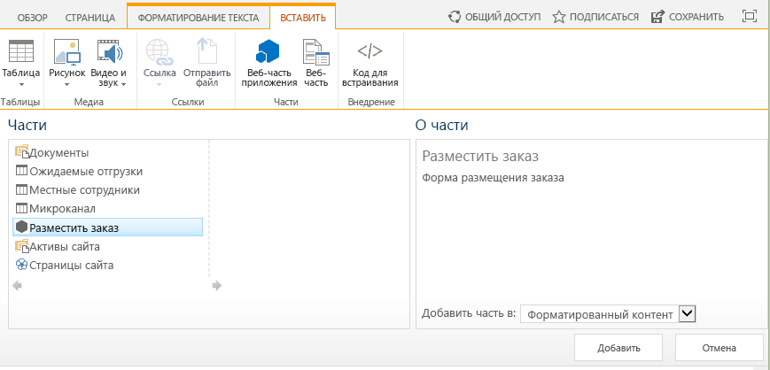
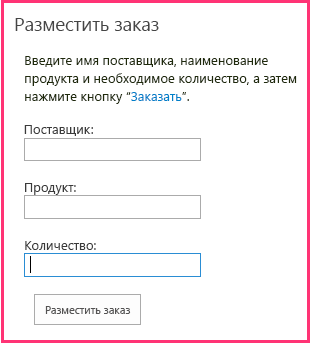

# Включение веб-части надстройки в надстройку, размещаемую у поставщика
В данной статье рассказывается, как настроить внешний вид удаленной веб-формы на странице SharePoint в Надстройка SharePoint, размещаемой у поставщика.
Это шестая часть из серии статей о том, как разрабатывать Надстройки SharePoint, размещаемые в у поставщика. Сначала вам необходимо ознакомиться со статьей  [Надстройки SharePoint](sharepoint-add-ins.md) и с указанными ниже предыдущими статьями серии.

-  [Знакомство с созданием надстроек SharePoint с размещением у поставщика](get-started-creating-provider-hosted-sharepoint-add-ins.md)

-  [Придание надстройке, размещаемой у поставщика, внешнего вида и удобства использования SharePoint](give-your-provider-hosted-add-in-the-sharepoint-look-and-feel.md)

-  [Включение настраиваемой кнопки в надстройку, размещаемую у поставщика](include-a-custom-button-in-the-provider-hosted-add-in.md)

-  [Краткий обзор объектной модели SharePoint](get-a-quick-overview-of-the-sharepoint-object-model.md)

-  [Добавление операций записи SharePoint в надстройку, размещаемую у поставщика](add-sharepoint-write-operations-to-the-provider-hosted-add-in.md)

> **Примечание**
> Если вы изучали предыдущие статьи этой серии о надстройках, размещаемых у поставщика, то у вас уже есть решение для Visual Studio, которое можно использовать для работы с данной статьей. Кроме того, вы можете скачать репозиторий  [SharePoint_Provider-hosted_Add-Ins_Tutorials](https://github.com/OfficeDev/SharePoint_Provider-hosted_Add-ins_Tutorials) и открыть файл BeforeAdd-inPart.sln.

В данной статье вы добавите особую веб-часть, называемую веб-частью надстройки, в Надстройка SharePoint. Веб-часть надстройки позволяет использовать форму заказа надстройки на странице SharePoint.
## Создание веб-части надстройки

> **Примечание**
>  При повторном открытии решения параметры раздела "Начальные проекты" в Visual Studio обычно сбрасываются к значениям, используемым по умолчанию. Сразу же после повторного открытия примера решения в этой серии статей всегда выполняйте указанные ниже действия.>  В верхней части **обозревателя решений** щелкните правой кнопкой мыши узел решения и выберите **Назначить запускаемые проекты**. >  Убедитесь, что в столбце **Действие** для всех трех проектов указано значение **Запускать**. 

1. В **обозревателе решений** щелкните правой кнопкой мыши проект **ChainStore** и выберите **Добавить | Создать элемент**.

2. Выберите **Клиентская веб-часть (хост-сайт)**, присвойте ей имя Place Order (Размещение заказа), а затем нажмите кнопку **Добавить**. (Клиентская веб-часть это еще одно название веб-части надстройки.)

3. На следующей странице мастера выберите второй переключатель **Выберите или введите URL-адрес существующей веб-страницы для контента клиентской веб-части**.

4. В раскрывающемся списке выберите URL-адрес для страницы **OrderForm.aspx**, а затем нажмите кнопку **Готово**.

    Файл elements.xml, в котором определена веб-часть надстройки, будет добавлен в проект и открыт.

5. В элементе **ClientWebPart** измените указанные ниже атрибуты на следующие значения:

|**Атрибут**|**Значение**|
|:-----|:-----|
|Title (Название)    |Place Order    |
|Description (Описание)    |Форма для размещения заказа    |
|DefaultHeight (Высота, используемая по умолчанию)    |320    |
 

    Для других атрибутов оставьте значения, используемые по умолчанию, и закройте файл.

## Запуск надстройки и тестирование веб-части надстройки

1. Нажмите клавишу F5, чтобы развернуть и запустить вашу надстройку. Visual Studio размещает удаленное веб-приложение в IIS Express, а базу данных SQL в SQL Express. Кроме того, он создает временную установку надстройки на вашем тестовом сайте SharePoint и немедленно запускает ее. Прежде чем откроется начальная страница надстройки, вам будет предложено предоставить надстройке необходимые разрешения.

2. Когда откроется начальная страница надстройки, сама надстройка уже будет развернута, и пользователи смогут применять веб-часть надстройки **Place Order** (Размещение заказа) для добавления любой области веб-части на любую страницу SharePoint на веб-сайте магазина в Гонконге. Чтобы добавить ее на начальную страницу, выполните указанные ниже действия.

1. На расположенном в верхней части начальной страницы элементе управления хрома нажмите кнопку **Back to Site** (Вернуться на сайт). Откроется домашняя страница магазина в Гонконге.

2. На ленте откройте вкладку **Страница** и нажмите кнопку **Изменить**.

3. После перевода страницы в режим правки откройте вкладку **Вставка** на ленте и нажмите кнопку **Веб-часть надстройки**. (Кнопка может по-прежнему называться **Веб-часть приложения**.)

4. На открывшемся элементе управления вставки веб-части выберите веб-часть надстройки **Place Order** (Размещение заказа). Элемент управления будет выглядеть примерно так, как показано ниже.

5. Щелкните какую-нибудь из зон веб-части на форме. Это необходимо, чтобы задать расположение для веб-части надстройки. 

6. Нажмите кнопку **Добавить** на элементе управления вставки веб-части. Веб-часть надстройки **Place Order** (Размещение заказа) будет добавлена в выбранную зону веб-части.

7. На ленте нажмите кнопку **Сохранить**.

3. Теперь форма заказа отобразится на странице. У нее будет такие же внешний вид и удобство использования, как и у остальной части страницы. Она должна выглядеть указанным ниже образом. 

4. Введите значения полей **Supplier** (Поставщик), **Product** (Продукт) и **Quantity** (Количество), а затем нажмите кнопку **Place Order** (Разместить заказ). На первый взгляд ничего не произойдет, но при этом в корпоративную базу данных будет добавлен заказ. Кроме того, вы можете очистить поля веб-части надстройки, обновив страницу.

5. Нажимайте кнопку "Назад" в браузере, пока вы не вернетесь на начальную страницу надстройки Chain Store, а затем нажмите кнопку **Show Orders** (Показать заказы). В списке будет ваш новый заказ.

6. Чтобы завершить сеанс отладки, закройте окно браузера или остановите отладку в Visual Studio. При каждом нажатии клавиши F5 Visual Studio будет отзывать предыдущую версию надстройки и устанавливать ее последнюю версию.

7. Вы будете работать с этой надстройкой и решением Visual Studio и при изучении других статей, поэтому при перерывах в работе рекомендуется отзывать надстройку. В **обозревателе решений** щелкните проект правой кнопкой мыши и выберите пункт **Отозвать**.

## 

 Надстройка зависит от двух списков, которые вы создали вручную. Но мы не хотим, чтобы пользователи тоже вводили списки вручную. В следующей статье вы начнете работу над процессом автоматического создания этих списков. Первый основной этап создание настраиваемых обработчиков события установки надстройки: [Обработка событий надстройки в надстройке, размещаемой у поставщика](handle-add-in-events-in-the-provider-hosted-add-in.md)

