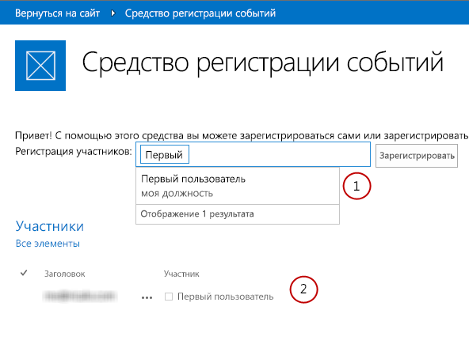

# Обзор веб-виджетов Office (экспериментальная версия)
Узнайте об экспериментальной версии веб-виджетов Office, которые вы можете использовать в надстройках Office, надстройках SharePoint и на веб-сайтах.
> **Внимание!**
> Экспериментальная версия веб-виджетов Office предназначена только для ознакомления и сбора отзывов. Не используйте их в производстве. Работа веб-виджетов Office в следующих выпусках может значительно измениться. Прочтите статью  [Условия лицензии веб-виджетов Office (экспериментальная версия)](office-web-widgetsexperimental-license-terms.md). 

Клиентские элементы управления, такие как экспериментальная версия веб-виджетов Office, могут значительно ускорить разработку надстроек, а также повысить их качество. Для этого мы должны быть уверены, что виджеты отвечают определенным критериям:
- предназначены для использования на любой веб-странице, даже если она не указана в SharePoint;

- работают в среде выполнения элементов управления Office. Это позволяет нам предоставлять общий набор требований и согласованный синтаксис для использования виджетов;

- виджеты, которые обращаются к SharePoint, используют междоменную библиотеку. Виджеты не зависят от определенной платформы или технологии на стороне сервера. Вы можете использовать виджеты независимо от того, какая у вас серверная технология;

- должны сосуществовать с другими элементами на странице. Добавление виджета на страницу не должно изменять другие ее элементы;

- хорошо работают с существующими платформами. Мы хотим быть уверены, что вы по-прежнему сможете использовать привычные средства и технологии.

**Рисунок 1. Надстройка, использующая экспериментальную версию веб-виджетов Office**

Вы можете использовать виджеты, установив пакет NuGet **экспериментальной версии веб-виджетов Office** из Visual Studio. Подробнее см. в статье [Управление пакетами NuGet в диалоговом окне](http://docs.nuget.org/docs/start-here/managing-nuget-packages-using-the-dialog). Вы можете также просмотреть  [страницу коллекции NuGet](http://www.nuget.org/packages/Microsoft.Office.WebWidgets.Experimental/).Ваши отзывы и комментарии помогли нам решить, какие виджеты следует предоставить. Как показано на рисунке 1, вы уже можете испытать виджеты (1) "Выбор людей" и (2) "Представление списка на рабочем столе" и экспериментировать с ними. Отправляйте свои отзывы на  [сайте Office Developer Platform UserVoice](http://officespdev.uservoice.com/)Вы можете также посмотреть на виджеты в действии в примере кода  [Демонстрация экспериментальной версии веб-виджетов Office](http://code.msdn.microsoft.com/SharePoint-2013-Office-Web-6d44aa9e).
## Виджет "Выбор людей"

Используя в надстройках экспериментальный виджет "Выбор людей", вы можете помочь пользователям находить и выбирать людей и группы в клиенте. Когда пользователь вводит текст в текстовом поле, виджет загружает контакты, чьи имена или адреса электронной почты соответствуют запросу.

**Рисунок 2. Выполнение запроса виджетом "Выбор людей"**

Вы можете объявить виджет в разметке HTML или программным путем, используя JavaScript. В любом случае необходимо использовать элемент **div** в качестве заполнителя для виджета. Вы можете также установить для виджета "Выбор людей" свойства и обработчики событий. В следующей таблице показаны доступные в виджете "Выбор людей" свойства и события.

|**Свойство или событие**|**Тип**|**Описание**|
|:-----|:-----|:-----|
|**objectType**   |Объект JSON (список строк)    | Тип элементов, которые будет разрешать виджет. Варианты:    пользователь;    группа.    По умолчанию выбран вариант "пользователь".   |
|**allowMultipleSelections**   |Логический    |Истина/Ложь. Если выбрано "Ложь", виджет позволяет выбирать только один элемент за раз.           По умолчанию выбрано "Ложь".    |
|**rootGroupName**   |Строка    |Если указано, виджет будет выбирать элементы только из этой группы.           Если не указано, виджет будет отправлять запросы объектам в рамках всего клиента.    |
|**selectedItems**   |Массив JSON    |Список выбранных элементов. Каждый элемент возвращает объект, представляющий пользователя или группу.    |
|**onAdded**   |Функция    |Событие, которое вызывается при добавлении нового объекта к выбранным. Функция обработчика получила добавленный объект.    |
|**onRemoved**   |Функция    |Событие, которое вызывается при удалении нового объекта из выбранных. Функция обработчика получила удаленный объект.    |
|**onChange**   |Функция    |Это событие вызывается добавлением или удалением объектов. Функции обработчика событий не передаются никакие параметры.    |
|**validationErrors**   |Массив    | Массив возможных ошибок проверки:    empty    unresolvedItem    tooManyItems   |
|**autoShowValidationMessage**   |Логический    |Истина = показывать          Ложь = не показывать    |
|**hasErrors**   |Логический    |Истина = есть одна или несколько ошибок проверки          Ложь = ошибки проверки отсутствуют    |
|**errors**   |Массив    | Массив возможных ошибок проверки:    empty    unresolvedItem    tooManyItems   |
|**displayErrors**   |Логический    |Истина = показывать ошибки          Ложь = не показывать ошибки    |
 
Классы CSS для виджета "Выбор людей" определены в таблице стилей **Office.Controls.css**. Вы можете переопределить классы и настроить стиль виджета для своей надстройки.

Дополнительные сведения см. в статье  [Использование экспериментального мини-приложения "Выбор людей" в надстройках для SharePoint](use-the-experimental-people-picker-widget-in-sharepoint-add-ins.md) и примере кода [Использование экспериментального виджета "Выбор людей" в надстройке](http://code.msdn.microsoft.com/SharePoint-2013-Use-the-57859f85). 

## Виджет "Представление списка на рабочем столе"

Пользователи получают все преимущества виджета "Представление списка" и могут представлять данные в списке, как в обычном виджете "Представление списка". Но вы можете использовать его в даже в тех надстройках, которые не размещены в SharePoint.

**Рисунок 3. Виджет "Представление списка на рабочем столе", в котором показан список с данными**

Вы можете указать в списке существующее представление; виджет отображает поля в порядке их отображения в представлении.

> **Примечание**
> На данный момент виджет "Представление списка на рабочем столе" отображает только данные. Он не предлагает возможности редактирования. 

Вы можете вставить для виджета заполнитель, используя элемент **div**. Вы можете использовать виджет программно или декларативно.

Вы также можете указать свойства или обработчики событий для виджета "Представление списка на рабочем столе". В следующей таблице показаны доступные свойства и события в виджете "Представление списка на рабочем столе".

|**Свойство или событие**|**Тип**|**Описание**|
|:-----|:-----|:-----|
|**listUrl**   |URL-адрес    |URL-адрес списка, из которого необходимо получать элементы. Это может быть относительный URL-адрес (в таком случае он будет считаться расположенным на самом сайте надстройки) или абсолютный URL-адрес.    |
|**viewName**   |Строка    |Имя представление, которое будет показано. Это программное имя представления (не отображаемое имя).    |
|**onItemSelected**   |Функция    |Событие, которое вызывается при выборе элемента списка.    |
|**onItemAdded**   |Функция    |Событие, которое вызывается при добавлении нового элемента в список.    |
|**onItemRemoved**   |Функция    |Событие, которое вызывается при удалении элемента из списка.    |
|**selectedItems**   |Массив    |Список выбранных элементов в формате JSON.    |
 
Для виджета требуется таблица стилей веб-сайта SharePoint. Вы можете непосредственно указать ссылку на таблицу стилей SharePoint или использовать виджет хрома. Подробнее о таблице стилей см. в статьях  [Использование таблицы стилей веб-сайта SharePoint в надстройках для SharePoint](use-a-sharepoint-website-s-style-sheet-in-sharepoint-add-ins.md) и [Использование клиентского элемента управления хрома в надстройках для SharePoint](use-the-client-chrome-control-in-sharepoint-add-ins.md). 

Чтобы увидеть виджет "Представление списка" в действии, см. пример кода  [Использование экспериментального виджета "Представление списка на рабочем столе" в надстройке](http://code.msdn.microsoft.com/SharePoint-2013-Use-the-c3edb076). См. также  [Использование экспериментального мини-приложения "Просмотр списка на рабочем столе" в надстройках для SharePoint](use-the-experimental-desktop-list-view-widget-in-sharepoint-add-ins.md).

## Заключение

Виджеты могут помочь ускорить процесс разработки, а также сократить затраты на ваши надстройки и время их выхода на рынок. Вы можете использовать экспериментальные веб-виджеты Office в некоммерческих надстройках. Отправляйте свои отзывы и комментарии на  [сайт Office Developer Platform UserVoice](http://officespdev.uservoice.com/).

## Дополнительные ресурсы

-  [Условия лицензии веб-виджетов Office (экспериментальная версия)](office-web-widgetsexperimental-license-terms.md)

-  [Страница коллекции экспериментальных веб-виджетов Office NuGet](http://www.nuget.org/packages/Microsoft.Office.WebWidgets.Experimental/)

-  [Использование экспериментального мини-приложения "Выбор людей" в надстройках для SharePoint](use-the-experimental-people-picker-widget-in-sharepoint-add-ins.md)

-  [Пример кода: демонстрация экспериментальной версии веб-виджетов Office](http://code.msdn.microsoft.com/SharePoint-2013-Office-Web-6d44aa9e)

-  [Использование экспериментального мини-приложения "Просмотр списка на рабочем столе" в надстройках для SharePoint](use-the-experimental-desktop-list-view-widget-in-sharepoint-add-ins.md)

-  [Пример кода: использование экспериментального виджета "Выбор людей" в надстройке](http://code.msdn.microsoft.com/SharePoint-2013-Use-the-57859f85)

-  [Пример кода: использование экспериментального виджета "Представление списка на рабочем столе" в надстройке](http://code.msdn.microsoft.com/SharePoint-2013-Use-the-c3edb076)

