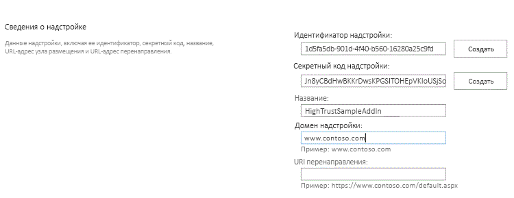
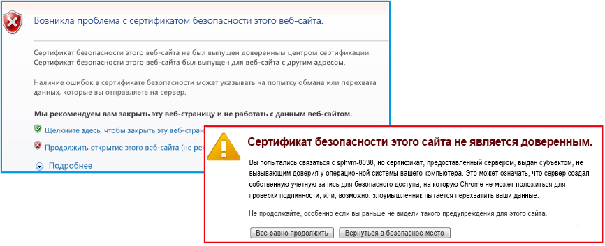
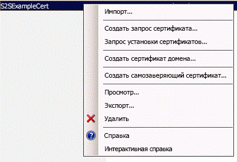

# Упаковка и публикация надстроек с высоким уровнем доверия для SharePoint
Узнайте, как упаковать и опубликовать приложение с высоким уровнем доверия для Надстройка SharePoint для локального использования.
## Предварительные требования для упаковки и публикации надстроек с высоким уровнем доверия
<a name="Prereqs"> </a>

Вам понадобится следующее:
  
    
    

- Локальная среда разработки SharePoint 2013. Инструкции по установке см. в разделе  [Настройка локальной среды разработки надстроек SharePoint](set-up-an-on-premises-development-environment-for-sharepoint-add-ins.md).
    
  
- Веб-сервер IIS для размещения удаленного веб-приложения. Необходим установленный диспетчер IIS.
    
  
- Среда Visual Studio установлена удаленно или на компьютере с SharePoint 2013.
    
  
- Инструменты разработчика Microsoft Office для Visual Studio
    
  
-  [Средство веб-развертывания](http://www.iis.net/downloads/microsoft/web-deploy), установленное на компьютере с Visual Studio, и такая же версия **средства веб-развертывания**, установленная на сервере удаленного веб-приложения.
    
  
В таблице 1 перечислены некоторые полезные статьи, которые помогут разобраться в понятиях, используемых при создании Надстройки SharePoint.
  
    
    

**Таблица 1. Основные принципы настройки для публикации надстроек с высоким уровнем доверия**


|**Название статьи**|**Описание**|
|:-----|:-----|
| [Знакомство с созданием надстроек SharePoint с размещением у поставщика](get-started-creating-provider-hosted-sharepoint-add-ins.md) <br/> |Узнайте, как создать простейшее Надстройка SharePoint, размещаемое у поставщика с помощью Инструменты разработчика Office для Visual Studio.  <br/> |
| [Создание надстроек с высоким уровнем доверия для SharePoint](create-high-trust-sharepoint-add-ins.md) <br/> |Узнайте, как создать простое Надстройка SharePoint с высоким уровнем доверия в Инструменты разработчика Office для Visual Studio с помощью самозаверяющего сертификата и соответствующего идентификатора издателя.  <br/> |
| [Веб-развертывание](http://www.iis.net/downloads/microsoft/web-deploy) <br/> |Веб-развертывание упрощает развертывание веб-приложений и веб-сайтов на серверах IIS.  <br/> |
| [Digital Certificates](http://msdn.microsoft.com/library/e523b335-0156-4f47-b55c-b80495587c4f.aspx) и [Working with Certificates](http://msdn.microsoft.com/library/6ffb8682-8f07-4a45-afbb-8d2487e9dbc3.aspx) <br/> |Ознакомьтесь с основами работы с цифровыми сертификатами.  <br/> |
   

> **Примечание**
> Надстройки SharePoint с высоким уровнем доверия могут быть установлены только в локальную среду SharePoint, но не в Microsoft SharePoint Online, и в первую очередь они предназначены для использования с локальными, а не облачными веб-приложениями. В этих статьях описывается процесс публикации надстройки для данного случая. Кроме того, в этой статье понятие "клиент" относится к организации, которая устанавливает Надстройка SharePoint и размещает удаленные компоненты надстройки. 
  
    
    


## Регистрация надстройки с высоким уровнем доверия
<a name="Register"> </a>

Перед публикацией надстройки ее необходимо зарегистрировать на ферме SharePoint с помощью службы управления надстройками. Надстройки SharePoint с высоким уровнем доверия всегда регистрируются на ферме SharePoint, на которой установлена надстройка. (Они не могут продаваться через Магазин Office.) Регистрация осуществляется на странице http:// _веб-сайт_SharePoint_/_layouts/15/appregnew.aspx, как это описано в следующей процедуре.
  
    
    

### Регистрация надстройки:


1. Перейдите на страницу http:// _веб-сайт_SharePoint_/_layouts/15/appregnew.aspx. Нажмите кнопки **Создать**, чтобы сгенерировать значения для идентификатора и секретного ключа надстройки. (В настоящее время в Надстройки SharePoint с высоким уровнем доверия секретный ключ не используется, но он требуется для формы.) Укажите базовый URL-адрес домена, где будет запущено удаленное веб-приложение надстройки. Не включайте в домен протокол (HTTPS), однако укажите порт, который будут использовать удаленные компоненты для запросов по протоколу HTTPS, если он отличен от 443 (например, www.contoso.com:5555 илиMyAppServer:4444).
    
    Если вам необходим URI перенаправления, также укажите его значение. Ознакомьтесь со статьей  [Поток кода аутентификации OAuth для надстроек в SharePoint](authorization-code-oauth-flow-for-sharepoint-add-ins.md), чтобы понять, как можно использовать URI перенаправления.
    
    Форма на странице должна выглядеть аналогично рис. 1. В этом примере сервер удаленного веб-приложения прослушивает HTTPS-запросы на порте 443, который является портом по умолчанию, поэтому указывать его в домене надстройки не обязательно.
    

   **Рис. 1. Регистрация надстройки в файле appregnew.aspx**

  

     
  

  

  
2. Нажмите кнопку **Создать**. Введенные сведения будут показаны на следующей странице. Сохраните их, так как они потребуются для средств публикации Visual Studio. Для этого можно сделать снимок экрана страницы.
    
  

## Выбор стратегии получения, обслуживания и развертывания сертификатов для Надстройки SharePoint с высоким уровнем доверия
<a name="Certificate"> </a>

Когда разработчик использует клавишу **F5** в Visual Studio для разработки и отладки Надстройка SharePoint с высоким уровнем доверия, он может использовать самозаверяющий сертификат, как описано в статье [Создание надстроек с высоким уровнем доверия для SharePoint](create-high-trust-sharepoint-add-ins.md). Однако если надстройка  *опубликована*  , то перед открытием начальной страницы удаленного веб-приложения в браузере появится страница с предупреждением. Пользователю придется решать, стоит ли продолжать. Пример такого предупреждения показан на рис. 3.
  
    
    

**Рис. 3. Предупреждение для самозаверяющих сертификатов**

  
    
    

  
    
    

  
    
    
Такая помеха может быть приемлема для разработчика, но не для клиентов. Поэтому перед окончательной публикацией в рабочую среду, клиент должен получить сертификат, подписанный доверенной третьей стороной. Это может быть коммерческий или локальный центр сертификации (ЦС). Что касается коммерческих ЦС, помните, что отрасль постепенно сокращает сертификаты для веб-серверов, предназначенные "только для интрасетей". Их по-прежнему можно купить, но срок действия всех подобных сертификатов истекает в ноябре 2016 года или ранее. Использовать такой тип сертификата для Надстройка SharePoint с высоким уровнем доверия необязательно, так как сертификаты для веб-серверов с выходом в Интернет могут использоваться и для веб-серверов интрасети, однако последние обычно стоят дороже.
  
    
    
Сертификат должен находиться в двух форматах — в виде файла обмена личной информацией (PFX) и в виде сертификата безопасности (CER). Если изначально при получении один из этих форматов отсутствует, клиент может конвертировать его с помощью служебной программы. Кроме того, после получения версии в формате PFX, PFX-файл можно импортировать в IIS, а затем экспортировать версию CER согласно описанной ниже инструкции.
  
    
    
Если изначально при получении сертификат находится в формате CER, в нем будут находиться и закрытый, и открытый ключи. Согласно общепринятой практике, CER-файл, используемый SharePoint, не должен содержать закрытый ключ. Попробуйте согласно приведенной ниже инструкции импортировать оригинальный сертификат в IIS, а затем экспортировать новую CER-версию, которая не содержит закрытый ключ. Дополнительную информацию о CER- и PFX-файлах можно узнать в статье  [Сертификат издателя программного обеспечения](http://msdn.microsoft.com/ru-ru/library/windows/hardware/ff552299%28v=vs.85%29.aspx).
  
    
    
Кроме того, клиент должен решить, использовать один сертификат для всех Надстройки SharePoint с высоким уровнем доверия или отдельные сертификаты для каждого из них. Дополнительные сведения об этом решении см. в статье  [Выбор между одним или несколькими сертификатами для Надстройки SharePoint с высоким уровнем доверия](creating-sharepoint-add-ins-that-use-high-trust-authorization.md#Deciding).
  
    
    

## Настройка удаленного веб-сервера с помощью сертификата
<a name="ConfigureRemote"> </a>

Следующие процедуры выполняются на удаленном веб-сервере, на котором размещено удаленное веб-приложение.
  
    
    

### Чтобы настроить удаленный веб-сервер и сертификат PFX:


1. Создайте для сертификата PFX надежный пароль. Дополнительную информацию можно узнать в статьях  [Рекомендации по созданию надежных паролей](http://msdn.microsoft.com/ru-ru/library/bb416446.aspx) и [Надежные пароли](http://msdn.microsoft.com/ru-ru/library/ms161962.aspx).
    
  
2. Импортируйте сертификат в IIS на удаленный веб-сервер согласно следующим шагам:
    
1. В левой области диспетчера IIS в представлении в виде дерева выберите узел  _Имя_сервера_.
    
  
2. Дважды щелкните значок **Сертификаты сервера**.
    
  
3. Выберите пункт **Импорт** в правой области панели **Действия**.
    
  
4. В диалоговом окне **Импорт сертификата** нажмите кнопку "Обзор", найдите PFX-файл, а затем введите пароль сертификата.
    
  
5. Если вы используете диспетчер IIS 8, нажмите выпадающий список **Выбор хранилища сертификата**. Выберите пункт **Личные**. (Речь идет о "личном" хранилище сертификатов компьютера, а не пользователя.)
    
  
6. Если у вас еще нет сертификата CER или в него включен закрытый ключ, установите флажок напротив пункта **Разрешить экспортировать этот сертификат**.
    
  
7. Нажмите кнопку **ОК**.
    
  

### Чтобы открыть хранилище сертификатов Windows:


1. На этом же сервере откройте **консоль управления (MMC)**, как это описано в статье  [Запуск MMC 3.0](http://technet.microsoft.com/ru-ru/library/cc766121.aspx).
    
  
2. Добавьте для своей учетной записи компьютера оснастку **Сертификаты**, как это описано в статье  [Добавление оснастки "Сертификаты" в консоль MMC](http://technet.microsoft.com/ru-ru/library/cc754431.aspx). Убедитесь, что вы следуете процедуре, предназначенной для  *компьютера*  , а не для пользователя или службы. При появлении соответствующего запроса выберите *локальный*  , а не "другой" компьютер.
    
  
Если вы используете диспетчер ISS 8, следующую процедуру можно пропустить.
  
    
    

### Дополнительные действия для получения сертификата в хранилище сертификатов Windows с помощью диспетчера ISS 7


1. Создайте папку в файловой системе сервера, которая будет использоваться для кратковременного хранения сертификата.
    
  
2. В левой области диспетчера IIS в представлении в виде дерева выберите узел  _Имя_сервера_.
    
  
3. Дважды щелкните значок **Сертификаты сервера**.
    
  
4. В списке **Сертификаты сервера** щелкните правой кнопкой мыши сертификат и выберите пункт **Экспорт**, как показано на рис. 4.
    
   **Рис. 4. Экспорт сертификата**

  

     
  

  

  
5. Экспортируйте файл в созданную вами папку и введите ее пароль.
    
  
6. В **консоли управления (MMC)** импортируйте сертификат, как это описано в статье [Импорт сертификата](http://technet.microsoft.com/ru-ru/library/cc754489.aspx). Не забудьте указать **Личное** хранилище.
    
  
7. Не закрывайте консоль, чтобы выполнить следующую процедуру.
    
  
8.  *Удалите папку, которую вы создали на первом шаге, вместе с файлом, находящимся в ней.*  Если сертификат находится в файловой системе, преимущества безопасности его хранения в хранилище сертификатов аннулируются.
    
  
Следующая процедура применима к обеим версиям диспетчера IIS (7 и 8).
  
    
    

### Чтобы получить серийный номер сертификата:


1. В **консоли управления (MMC)** в оснастке **Сертификаты (локальный компьютер)** перейдите в папку **Сертификаты** под папкой **Личные**, если она еще не открыта.
    
  
2. Дважды щелкните сертификат для вашего Надстройка SharePoint, чтобы открыть его, а затем откройте вкладку **Сведения**.
    
  
3. Выберите поле **Серийный номер**, чтобы серийный номер отображался полностью.
    
  
4. Скопируйте серийный номер  *без пробелов*  в текстовый файл и передайте его разработчику Надстройка SharePoint.
    
    > **Совет**
      > В записях блогов разработчиков и в вопросах на форумах встречаются упоминания о том, что при копировании серийного номера в буфер обмена напрямую создается строка со скрытыми символами, из-за чего Надстройка SharePoint не может распознать код. Попробуйте не копировать код, а ввести его вручную. 
Далее создайте CER-версию сертификата. Она содержит закрытый ключ удаленного веб-сервера и используется SharePoint, чтобы расшифровывать запросы от удаленного веб-приложения и проверять маркеры доступа в этих запросах. Эта версия создается на удаленном веб-сервере, а затем перемещается на ферму SharePoint.
  
    
    

### Чтобы создать сертификат CER:


1. В диспетчере IIS выберите узел  _Имя сервера_ в представлении в виде дерева слева.
    
  
2. Дважды щелкните на пункт **Сертификаты сервера**.
    
  
3. В представлении **Сертификаты сервера** дважды щелкните сертификат, чтобы просмотреть сведения о нем.
    
  
4. На вкладке **Сведения** нажмите кнопку **Копировать в файл**, чтобы запустить **мастер экспорта сертификатов**, а затем нажмите кнопку **Далее**.
    
  
5. Оставьте значение по умолчанию **Нет, не экспортировать закрытый ключ** и нажмите кнопку **Далее**.
    
  
6. На следующей странице используйте значения по умолчанию. Нажмите кнопку **Далее**.
    
  
7. Нажмите кнопку **Обзор** и выберите любую папку. (CER-файл будет удален с компьютера в любом случае.) Дайте этому файлу имя, аналогичное имени PFX-файла, и нажмите кнопку **Сохранить**. Сертификат сохранится в виде CER-файла.
    
  
8. Нажмите кнопку **Далее**.
    
  
9. Нажмите кнопку **Готово**.
    
  

## Настройка использования сертификата в SharePoint
<a name="ConfigureSP"> </a>

Процедуры, описанные в этом разделе, можно выполнить на любом сервере SharePoint, на котором установлена **командная консоль SharePoint**.
  
    
    

### Чтобы разместить CER-файл на SharePoint:


1. Создайте папку и убедитесь, что удостоверения пула надстроек для следующих пулов надстроек IIS имеют право на ее чтение:
    
  - **SecurityTokenServiceApplicationPool**
    
  
  - Пул надстроек, обслуживающий веб-сайт IIS, на котором размещается родительское веб-приложение SharePoint для тестового веб-сайта SharePoint. Пул для веб-сайта IIS **SharePoint - 80** называется **OServerPortalAppPool**.
    
  
2.  *Переместите*  (не просто скопируйте) CER-файл из удаленного веб-сервера в папку, которую вы только что создали на сервере SharePoint. Файл будет временно находиться в этой папке.
    
  
Следующая процедура настраивает сертификат в качестве доверенного поставщика маркера в SharePoint. Она выполняется только один раз (для каждого Надстройка SharePoint с высоким уровнем доверия).
  
    
    

### Чтобы настроить сертификат:


1. Если вы этого еще не сделали, создайте скрипт или скрипты настройки высокого уровня доверия для Windows PowerShell, как это описано в статье  [Скрипты настройки высокого уровня доверия для SharePoint 2013](high-trust-configuration-scripts-for-sharepoint-2013.md).
    
  
2. Скопируйте скрипты на сервер SharePoint.
    
  
3. Откройте от имени администратора **командную консоль SharePoint** и запустите соответствующий скрипт.
    
  
4. Один из скриптов предназначен для использования в случае, когда клиент использует один сертификат для нескольких Надстройки SharePoint. Этот скрипт выводит файл, содержащий GUID для поставщика маркеров. Если вы используете этот скрипт, передайте выходной файл разработчику Надстройка SharePoint с высоким уровнем доверия.
    
  
5.  *Удалите CER-файл из файловой системы сервера SharePoint.* 
    
  

> **Примечание**
> Регистрация сертификата в качестве поставщика маркера не вступает в силу немедленно, и до этого времени надстройка работать не будет. Может потребоваться до 24 часов, пока все серверы SharePoint не получат сведения о новом поставщике. Если вы уверены, что работа пользователей SharePoint не будет нарушена, выполните команду iisreset на всех серверах SharePoint для немедленной регистрации поставщика. 
  
    
    


## Изменение файла web.config
<a name="WebConfig"> </a>


> **Совет**
> Пример кода, который включает в себя изменения файла web.config, можно посмотреть в разделе  [PnP / Samples / Core.OnPrem.S2S.WindowsCertStore](https://github.com/OfficeDev/PnP/tree/dev/Samples/Core.OnPrem.S2S.WindowsCertStore). 
  
    
    

Измените файл web.config так, чтобы он содержал новые значения для следующих ключей в узле  `appSettings`:
  
    
    

- **ClientID.** Это идентификатор клиента (GUID) веб-приложения, которое было создано на странице appregnew.aspx.
    
  
- **ClientSigningCertificateSerialNumber.** *(Вам необходимо добавить этот ключ, если он не был добавлен с помощью Инструменты разработчика Microsoft Office для Visual Studio.)*  Это серийный номер сертификата. В его значении не должно быть никаких пробелов или дефисов.
    
  
- **IssuerId.** Это GUID поставщика маркера ( *который должен быть написан в нижнем регистре*  ). Это значение зависит от стратегии сертификата клиента:
    
  - Если Надстройка SharePoint с высоким уровнем доверия имеет собственный сертификат, который не используется совместно с другими Надстройки SharePoint, значение  `IssuerId` совпадает с `ClientId`.
    
  
  - Если Надстройка SharePoint использует тот же сертификат, что и остальные Надстройки SharePoint, значение  `IssuerId` — это произвольный GUID. Скрипт для этого сценария можно найти в статье [Скрипты настройки высокого уровня доверия для SharePoint 2013](high-trust-configuration-scripts-for-sharepoint-2013.md); он создает текстовый файл с данным GUID. ИТ-персонал может передать этот файл разработчику надстройки, чтобы он вставил его в файл web.config в качестве значения  `IssuerId`.
    
  

> **Примечание**
> Инструменты разработчика Office для Visual Studio могут иметь добавленные ключи параметров надстройки для **ClientSigningCertificatePath** и **ClientSigningCertificatePassword**. Они не используются в работе надстройки и могут быть удалены. 
  
    
    

Рассмотрим пример. Помните, что для Надстройка SharePoint с высоким уровнем доверия ключ **ClientSecret** не существует.
  
    
    


```XML

<appSettings>
  <add key="ClientID" value="c1c12d4c-4900-43c2-8b89-c05725e0ba30" />
  <add key="ClientSigningCertificateSerialNumber" value="556a1c9c5a5415994941abd0ef2f947b" />
  <add key="IssuerId" value="f94591d5-89e3-47cd-972d-f1895cc158c6" />
</appSettings>

```


## Изменение файла TokenHelper
<a name="WebConfig"> </a>

Чтобы работать с сертификатами, находящимися в хранилище сертификатов Windows, и получать их по их серийному номеру, необходимо изменить файл TokenHelper.cs (возможно расширение VB), созданный Инструменты разработчика Office для Visual Studio. В представленном ниже примере описан один из способов на языке C#.
  
    
    

> **Совет**
> Пример кода, который включает в себя изменения файла tokenhelper.cs, можно посмотреть в разделе  [PnP / Samples / Core.OnPrem.S2S.WindowsCertStore](https://github.com/OfficeDev/PnP/tree/dev/Samples/Core.OnPrem.S2S.WindowsCertStore). 
  
    
    


### Чтобы изменить файл TokenHelper:


1. В файле ниже части  `#region private fields` есть объявления полей `ClientSigningCertificatePath`,  `ClientSigningCertificatePassword` и `ClientCertificate`. Удалите все три.
    
  
2. На их месте добавьте следующую строку:
    
  ```
  
private static readonly string ClientSigningCertificateSerialNumber
    = WebConfigurationManager.AppSettings.Get("ClientSigningCertificateSerialNumber");
  ```

3. Найдите строку, в которой объявляется поле  `SigningCredentials`. Замените ее следующей строкой:
    
  ```
  
private static readonly X509SigningCredentials SigningCredentials
    = GetSigningCredentials(GetCertificateFromStore());
  ```

4. В файле перейдите к части  `#region private methods` и добавьте два следующих метода:
    
  ```
  
private static X509SigningCredentials GetSigningCredentials(X509Certificate2 cert)
{
    return (cert == null) ? null 
                          : new X509SigningCredentials(cert, 
                                                       SecurityAlgorithms.RsaSha256Signature, 
                                                       SecurityAlgorithms.Sha256Digest);
}

private static X509Certificate2 GetCertificateFromStore()
{
    if (string.IsNullOrEmpty(ClientSigningCertificateSerialNumber))
    {
        return null;
    }  

    // Get the machine's personal store
    X509Certificate2 storedCert;
    X509Store store = new X509Store(StoreName.My, StoreLocation.LocalMachine); 

    try
    {
        // Open for read-only access                 
        store.Open(OpenFlags.ReadOnly);

        // Find the cert
        storedCert = store.Certificates.Find(X509FindType.FindBySerialNumber, 
                                             ClientSigningCertificateSerialNumber, 
                                             true)
                       .OfType<X509Certificate2>().SingleOrDefault();
    }
    finally
    {
        store.Close();
    }

    return storedCert;
}
  ```


## Использование мастера Visual Studio для упаковки удаленного веб-приложения и Надстройка SharePoint для публикации
<a name="Package"> </a>


> **Совет**
> Корпорация Майкрософт обновляет Visual Studio и Инструменты разработчика Office для Visual Studio чаще, чем раньше, а документация не всегда своевременно отражает эти изменения. Этот раздел был написан с использованием версии Visual Studio, выпущенной в октябре 2013, и включенной в нее версии Инструменты разработчика Office для Visual Studio. Если вы работаете с более ранними или поздними версиями Visual Studio или средств разработчика, возможно, вам придется обратиться к справке Visual Studio или соответствующим записям блогов, чтобы найти действия, эквивалентные описанным в этих процедурах. 
  
    
    


### Чтобы запаковать удаленное веб-приложение:


1. В **обозревателе решений** щелкните правой кнопкой мыши проект веб-приложения (не проект Надстройка SharePoint) и выберите команду **Опубликовать**.
    
  
2. На вкладке **Профиль** выберите из выпадающего списка **Новый профиль**.
    
  
3. При появлении соответствующего запроса укажите для профиля соответствующее имя. Например, Надстройка для расчета заработной платы Payroll — удаленное веб-приложение.
    
  
4. На вкладке **Подключение** выберите пункт **Пакет веб-развертывания** в выпадающем списке **Публикация**.
    
  
5. Для **размещения пакета** используйте любую папку. Чтобы упростить дальнейшие процедуры, используйте пустую папку. Обычно используется вложенная папка в папке проекта bin.
    
  
6. Для имени сайта укажите имя веб-сайта IIS, на котором будет размещено приложение. Не включайте в имя протокол, порт или знаки косой черты. Пример: "PayrollSite". Если вы хотите, чтобы веб-приложение являлось дочерним по отношению к веб-сайту по умолчанию, используйте шаблон Веб-сайт по умолчанию _/<имя веб-сайта>_; например, "веб-сайт по умолчанию/PayrollSite." (Если веб-сайт IIS еще не существует, он будет создан при выполнении пакета веб-развертывания в процедуре, описанной ниже.)
    
  
7. Нажмите кнопку **Далее**.
    
  
8. На вкладке **Параметры** выберите пункт **Выпуск** или **Отладка** в выпадающем списке **Конфигурация**.
    
  
9. Нажмите кнопку **Далее** и затем — **Опубликовать**. В месте расположения пакета будет создан ZIP-файл и различные другие файлы, которые будут использоваться для установки веб-приложения в следующей процедуре.
    
  

### Создание пакета Надстройка SharePoint:


1. Щелкните проект Надстройка SharePoint в решении правой кнопкой мыши и выберите пункт **Опубликовать**.
    
  
2. В выпадающем списке **Текущий профиль** выберите профиль, созданный вами в последней процедуре.
    
  
3. Если рядом с кнопкой **Правка** появится маленький желтый значок предупреждения, нажмите нанего. Откроется окно с предложением заполнить некоторую информацию, которая содержится в файле web.config. Данная информация не требуется, если вы используете метод публикации **Пакет веб-развертывания**, но оставлять данную форму пустой тоже нельзя. Введите в четыре текстовых поля любые символы и нажмите кнопку **Готово**.
    
  
4. Нажмите кнопку **Упаковать надстройку**. (Не нажимайте кнопку **Развернуть веб-проект**. Она просто повторяет последнее действие, которое вы выполнили в последней процедуре.) Откроется окно **Упаковка надстройки**.
    
  
5. В текстовом поле **Где размещен ваш веб-сайт?** введите URL-адрес домена удаленного веб-приложения. Обязательно укажите протокол HTTPS, а также порт, если веб-приложение прослушивает HTTPS-запросы на порте, отличном от 443; напримерhttps://MyServer:4444. (Инструменты разработчика Office для Visual Studio использует это значение, чтобы заменить маркер ~remoteAppUrl в манифесте надстройки для Надстройка SharePoint.)
    
  
6. В текстовом поле **Идентификатор клиента надстройки** введите идентификатор клиента, который был создан на странице appregnew.aspx, а также указан в файле web.config.
    
  
7. Нажмите кнопку **Готово**. Пакет надстройки готов.
    
  

## Публикация удаленного веб-приложения и установка Надстройка SharePoint
<a name="PublishRemote"> </a>


  
    
    

### Чтобы опубликовать веб-приложение:


1. Перейдите к папке, которая используется для **Размещения пакета** при упаковке удаленного веб-приложения, а затем скопируйте все файлы из нее в папку на удаленном сервере.
    
  
2. В этой папке откройте файл  _имя_проекта_.deploy-readme.txt (где  _имя_проекта_ — это имя проекта веб-приложения Visual Studio) и следуйте инструкциям в файле для установки веб-приложения, используя файл _имя_проекта_.deploy.cmd.
    
  

### Чтобы настроить привязку протокола для веб-приложения:


1. В диспетчере IIS на панели **Подключения** выделите новый веб-сайт. (Если новое веб-приложение является дочерним по отношению к **Веб-сайту по умолчанию**, выделите **Веб-сайт по умолчанию** и выполните эту процедуру для него.)
    
  
2. Щелкните **Привязки** на панели **Действия**.
    
  
3. В диалоговом окне **Привязки сайта** нажмите кнопку **Добавить**. В открывшемся диалоговом окне **Добавление привязки сайта** выполните следующие действия:
    
1. Выберите пункт **HTTPS** в выпадающем списке **Тип**.
    
  
2. Выберите пункт **Все неназначенные** в выпадающем списке **IP-адрес**.
    
  
3. В текстовое поле **Порт** введите порт. Если вы указали порт в домене надстройки при регистрации Надстройка SharePoint на странице appregnew.aspx (как описано в разделе [Регистрация надстройки с высоким уровнем доверия](#Register)), то вы обязаны использовать порт с таким же номером и здесь. Если вы не указывали его на странице appregnew, введите 443.
    
  
4. В выпадающем списке **Сертификат SSL** выберите сертификат, который вы использовали ранее для настройки сервера в разделе [Настройка удаленного веб-сервера с помощью сертификата](#ConfigureRemote).
    
  
5. Нажмите кнопку **ОК**.
    
  
4. Нажмите кнопку **Закрыть**.
    
  

### Чтобы настроить проверку подлинности для веб-приложения:


1. Когда в IIS установлено новое приложение, его изначальная настройка позволяет анонимный доступ, однако почти все Надстройка SharePoint с высоким уровнем доверия созданы таким образом, чтобы запрашивать проверку подлинности пользователей, поэтому ее необходимо изменить. В диспетчере IIS на панели **Подключения** выделите веб-приложение. Это будет либо веб-сайт одного ранга с веб-сайтом по умолчанию, либо дочерний сайт по отношению к веб-сайту по умолчанию.
    
  
2. Дважды щелкните значок **Проверка подлинности** на центральной панели, чтобы открыть панель **Проверка подлинности**.
    
  
3. Выделите пункт **Анонимная проверка подлинности**, а затем на панели **Действия** нажмите кнопку **Отключить**.
    
  
4. Выделите систему проверки подлинности, под использование которой спроектировано веб-приложение, и нажмите на панели **Действия** кнопку **Включить**.
    
    Если код веб-приложения использует в файлах TokenHelper и SharePointContext сгенерированный код, в который не были внесены изменения в части файлов, где происходит проверка подлинности пользователей, то в веб-приложении используется **Проверка подлинности Windows**, и вам следует включить этот параметр.
    
  
5. Если вы используете файлы со сгенерированным кодом, в которые не были внесены изменения, касающиеся проверки подлинности пользователей, вам также необходимо настроить поставщика проверки подлинности с помощью следующих действий:
    
1. Выделите пункт **Проверка подлинности Windows** на панели **Проверка подлинности**.
    
  
2. Щелкните **Поставщики**.
    
  
3. В диалоговом окне **Поставщики** убедитесь, что пункт **NTLM** находится *выше*  пункта **С согласованием**.
    
  
4. Нажмите кнопку **ОК**.
    
  

### Чтобы отправить и установить Надстройка SharePoint


1. Отправьте APP-файл пакета Надстройка SharePoint в каталог надстроек организации. (Надстройки SharePoint с высоким уровнем доверия нельзя распространять через Магазин Office.) Подробные сведения см. в статье  [Добавление надстроек в каталог надстроек](http://technet.microsoft.com/ru-ru/library/fp161234.aspx#AddApps).
    
  
2. Установите надстройку на любом веб-сайте в рамках одного родителя веб-приложения SharePoint, которое содержит каталог надстроек. Дополнительную информацию об отправке и установке Надстройка SharePoint можно узнать в статье  [Добавление надстроек SharePoint на сайт SharePoint 2013](http://technet.microsoft.com/ru-ru/library/fp161231).
    
  

## Дополнительные ресурсы
<a name="bk_addresources"> </a>


-  [Создание надстроек с высоким уровнем доверия для SharePoint](create-high-trust-sharepoint-add-ins.md)
    
  
-  [Публикация надстройки для SharePoint с помощью Visual Studio](publish-sharepoint-add-ins-by-using-visual-studio.md)
    
  
-  [Регистрация надстроек для SharePoint 2013](register-sharepoint-add-ins-2013.md)
    
  
-  [Знакомство с созданием надстроек SharePoint с размещением у поставщика](get-started-creating-provider-hosted-sharepoint-add-ins.md)
    
  

