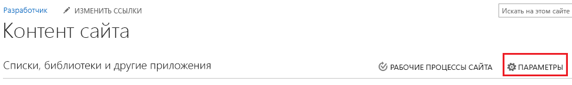
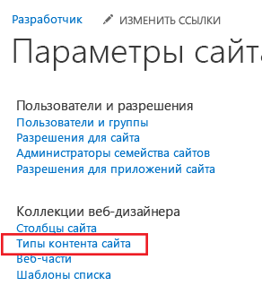

# Предоставление шаблона для библиотеки документов в облачной бизнес-надстройке
Кроме шаблонов Office, которые доступны при добавлении документа в библиотеку документов SharePoint, вы можете предоставлять собственные шаблоны. Например, у вас может быть собственный шаблон предложения о продаже, который вы хотите использовать при добавлении новых заказов.
## 

Если вы еще этого не сделали, свяжите библиотеку документов со своей облачной бизнес-надстройкой. См. статью  [Сопоставление библиотеки документов с сущностью](associate-a-document-library-with-an-entity.md).

### Добавление шаблона

1. Перейдите на свой сайт разработчика SharePoint и на странице **Разработчик** выберите **Контент сайта**.

2. На странице **Контент сайта** выберите **Параметры**, как показано на рисунке 1.

   **Рисунок 1. Ссылка "Параметры сайта"**

3. На странице **Параметры сайта** в списке **Коллекции веб-дизайнера** выберите **Типы конвента сайта**, как показано на рисунке 2.

   **Рисунок 2. Ссылка "Типы конвента сайта"**

4. На странице **Типы конвента сайта** выберите **Создать**, как показано на рисунке 3.

   **Рисунок 3. Ссылка "Создать"**

5. На странице **Создание типа конвента сайта** введите имя и описание для своего шаблона. В поле **Родительский тип конвента** выберите **Типы конвента документа** и **Документ**, как показано на рисунке 4.

   **Рисунок 4. Выбор родительского типа конвента**

6. В разделе **Группа** в списке **Существующая группа** выберите **Типы конвента документа**, как показано на рисунке 5, а затем нажмите **ОК**.

   **Рисунок 5. Настройка группы**

7. На странице **Тип конвента сайта** выберите **Дополнительные параметры**.

8. На странице **Дополнительные параметры** введите URL-адрес существующего шаблона документа или передайте новый шаблон документа, как показано на рисунке 6, и нажмите **ОК**.

   **Рисунок 6. Указание типа документа**

9. Перейдите на странице **Контент сайта** и выберите библиотеку документов, а затем перейдите на страницу **Параметры**.

10. На странице **Параметры** выберите **Добавить из существующих типов конвента сайта**.

11. На странице **Добавление типов конвента** добавьте свой шаблон, как показано на рисунке 7, а затем нажмите **ОК**.

   **Рисунок 7. Добавление шаблона**

12. Запустите надстройку и добавьте документ. Документ должен появиться в диалоговом окне **Создание нового файла**, как показано на рисунке 8.

   **Рисунок 8. Диалоговое окно "Создание нового файла" с новым шаблоном**

## Дополнительные ресурсы

-  [Разработка облачных бизнес-надстроек](develop-cloud-business-add-ins.md)

-  [Сопоставление библиотеки документов с сущностью](associate-a-document-library-with-an-entity.md)

