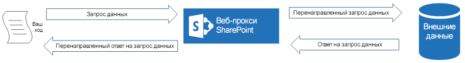
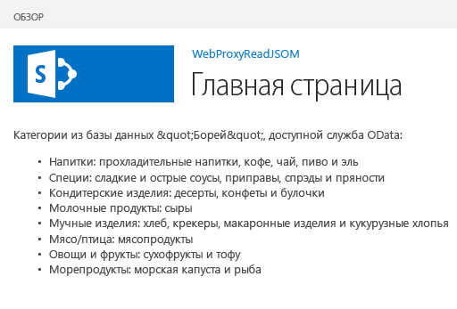

# Отправка запросов удаленной службе с помощью веб-прокси в SharePoint 2013
Сведения о доступе к данным в удаленном домене со страницы, которая размещается в SharePoint 2013, с помощью веб-прокси.
При создании надстроек SharePoint обычно необходимо объединять данные из различных источников. Из соображений безопасности связь между доменами блокируется. Если вы используете веб-прокси, веб-страницам в надстройке доступны данные в удаленном домене и домене SharePoint.
  
    
    

Как разработчик вы можете использовать веб-прокси, предоставляемый в клиентских API, например клиентские объектные модели JavaScript и .NET. Если вы используете веб-прокси, первый запрос отправляется в SharePoint. В свою очередь, SharePoint запрашивает данные в указанной конечной точке и пересылает ответ обратно на вашу страницу. Используйте веб-прокси, если нужно, чтобы связь осуществлялось на уровне сервера. Чтобы узнать больше, см.  [Безопасный доступ к данным и клиентские объектные модели для надстроек SharePoint](secure-data-access-and-client-object-models-for-sharepoint-add-ins.md).
**Веб-прокси SharePoint — это посредник между вашим кодом и внешним источником данных**

  
    
    

  
    
    

  
    
    

  
    
    

  
    
    

## Предварительные требования для использования примеров в этой статье
<a name="SP15Queryremoteservice_Prereq"> </a>

Для выполнения действий, описанных в этом примере, вам необходимо следующее:
  
    
    

-  [Visual Studio 2015 и последняя версия Microsoft Office Developer Tools](https://www.visualstudio.com/features/office-tools-vs.aspx)
    
  
- Среда разработки SharePoint 2013 (для локальных сценариев требуется изоляция надстроек).
    
  

### Ключевые понятия, с которыми необходимо ознакомиться до использования веб-прокси

В следующей таблице представлен список некоторых полезных статей, которые помогут вам лучше ознакомиться с понятиями, связанными с выполнением междоменных сценариев в Надстройки SharePoint.
  
    
    

**Табл. 1. Ключевые понятия для веб-прокси**


|**Заголовок статьи**|**Описание**|
|:-----|:-----|
| [Надстройки SharePoint](sharepoint-add-ins.md) <br/> |Узнайте о новой модели надстроек в SharePoint 2013, которая позволяет вам создавать небольшие, простые в использовании решения для конечных пользователей.  <br/> |
| [Безопасный доступ к данным и клиентские объектные модели для надстроек SharePoint](secure-data-access-and-client-object-models-for-sharepoint-add-ins.md) <br/> |Узнайте о вариантах доступа к данным в надстройках SharePoint. В этой статье представлена информация о вариантах работы с данными в надстройке.  <br/> |
| [Хост-сайты, сайты надстроек и компоненты SharePoint в SharePoint 2013](host-webs-add-in-webs-and-sharepoint-components-in-sharepoint-2013.md) <br/> |Изучите различия между хост-сайтами и сайтами надстроек. Узнайте, какие компоненты SharePoint 2013 можно включать в надстройку для SharePoint, какие компоненты разворачиваются на хост-сайте, какие компоненты разворачиваются на сайте надстройки, и как выполняется развертывание сайта надстройки в изолированном домене.  <br/> |
| [Междоменная безопасность на уровне клиента](http://msdn.microsoft.com/ru-ru/library/cc709423%28vs.85%29.aspx) <br/> |Ознакомьтесь с междоменными угрозами, случаями использования и принципами безопасности для междоменных запросов, а также оцените риски для разработчиков, возникающие при расширении междоменного доступа из веб-приложений, которые запускаются в браузере.  <br/> |
   

## Пример кода: доступ к данным в удаленной службе с помощью веб-прокси
<a name="SP15Queryremoteservice_Codeexample"> </a>

Чтобы прочитать данные из удаленной службы, необходимо выполнить следующие действия:
  
    
    

1. Создайте проект надстройки для SharePoint.
    
  
2. Измените страницу **Default.aspx**, чтобы использовать веб-прокси для запроса удаленной службы.
    
  
3. Измените манифест надстройки, чтобы разрешить связь с удаленным доменом.
    
  
На рис. 1 показано окно браузера с данными из удаленной службы на веб-странице SharePoint.
  
    
    

**Рис. 1. Веб-страница SharePoint с данными из удаленной службы**

  
    
    

  
    
    

  
    
    

### Создание проекта надстройки для SharePoint


1. Откройте 2015 от имени администратора. Для этого щелкните правой кнопкой значок 2015 в меню **Пуск** и выберите **Запуск от имени администратора**.
    
  
2. Создайте новый проект с помощью шаблона **Надстройка SharePoint**.
    
    На рисунке 2 показано расположение шаблона **Надстройка SharePoint** в 2015: **Шаблоны** > **Visual C#** > **Office/SharePoint** > **Надстройки Office**.
    

   **Рис. 2. Шаблон надстройки SharePoint в Visual Studio**

  

     
  

  

  
3. Предоставьте URL-адрес веб-сайта SharePoint, который планируется использовать для отладки.
    
  
4. Выберите **SharePoint-hosted** (Размещение в SharePoint) в качестве варианта размещения надстройки.
    
  

### Изменение страницы Default.aspx для использования веб-прокси с помощью объектной модели JavaScript


1. Дважды щелкните страницу **Default.aspx** в папке **Страницы**.
    
  
2. Скопируйте следующую разметку и вставьте ее в тег содержимого **PlaceHolderMain** страницы. Разметка выполняет следующие задачи:
    
  - Предоставление заполнителя для удаленных данных.
    
  
  - Создание ссылки на файлы SharePoint JavaScript.
    
  
  - Подготовка запроса с объектом **WebRequestInfo**.
    
  
  - Подготовка заголовка запроса **Accept** для указания ответа в формате Нотация объектов JavaScript (JSON).
    
  
  - Создание вызова удаленной службы.
    
  
  - Обработка успешного выполнения с отображением удаленных данных на веб-странице SharePoint.
    
  
  - Обработка любых ошибок с отображением сообщения об ошибке на веб-странице SharePoint.
    
  

 ```
  
Categories from the Northwind database exposed as an OData service:
    
<!-- Placeholder for the remote content -->
<span id="categories"></span>

<!-- Add references to the JavaScript libraries. -->
<script 
    type="text/javascript" 
    src="../_layouts/15/SP.Runtime.js">
</script>
<script 
    type="text/javascript" 
    src="../_layouts/15/SP.js">
</script>
<script type="text/javascript">
(function () {
    "use strict";

    // Prepare the request to an OData source
    // using the GET verb.
    var context = SP.ClientContext.get_current();
    var request = new SP.WebRequestInfo();
    request.set_url(
        "http://services.odata.org/Northwind/Northwind.svc/Categories"
        );
    request.set_method("GET");

    // We need the response formatted as JSON.
    request.set_headers({ "Accept": "application/json;odata=verbose" });
    var response = SP.WebProxy.invoke(context, request);

    // Let users know that there is some
    // processing going on.
    document.getElementById("categories").innerHTML =
                "<P>Loading categories...</P>";

    // Set the event handlers and invoke the request.
    context.executeQueryAsync(successHandler, errorHandler);

    // Event handler for the success event.
    // Get the totalResults node in the response.
    // Render the value in the placeholder.
    function successHandler() {

        // Check for status code == 200
        // Some other status codes, such as 302 redirect
        // do not trigger the errorHandler. 
        if (response.get_statusCode() == 200) {
            var categories;
            var output;

            // Load the OData source from the response.
            categories = JSON.parse(response.get_body());

            // Extract the CategoryName and Description
            // from each result in the response.
            // Build the output as a list.
            output = "<UL>";
            for (var i = 0; i < categories.d.results.length; i++) {
                var categoryName;
                var description;
                categoryName = categories.d.results[i].CategoryName;
                description = categories.d.results[i].Description;
                output += "<LI>" + categoryName + ":&amp;nbsp;" +
                    description + "</LI>";
            }
            output += "</UL>";

            document.getElementById("categories").innerHTML = output;
        }
        else {
            var errordesc;

            errordesc = "<P>Status code: " +
                response.get_statusCode() + "<br/>";
            errordesc += response.get_body();
            document.getElementById("categories").innerHTML = errordesc;
        }
    }

    // Event handler for the error event.
    // Render the response body in the placeholder.
    // The body includes the error message.
    function errorHandler() {
        document.getElementById("categories").innerHTML =
            response.get_body();
    }
})();
</script>
 ```


### (Необязательно) Изменение страницы Default.aspx для использования веб-прокси с помощью конечной точки REST


1. Дважды щелкните страницу **Default.aspx** в папке **Страницы**.
    
  
2. Скопируйте следующую разметку и вставьте ее в тег содержимого **PlaceHolderMain** страницы. Разметка выполняет следующие задачи:
    
  - Предоставление заполнителя для удаленных данных.
    
  
  - Ссылка на библиотеку jQuery.
    
  
  - Подготовка запроса к конечной точке **SP.WebRequest.Invoke**.
    
  
  - Подготовка текста запроса с объектом **SP.WebrequestInfo**. Он включает заголовок **Accept** для указания ответа в формате Нотация объектов JavaScript (JSON).
    
  
  - Создание вызова удаленной службы.
    
  
  - Обработка успешного выполнения с отображением удаленных данных на веб-странице SharePoint.
    
  
  - Обработка любых ошибок с отображением сообщения об ошибке на веб-странице SharePoint.
    
  

 ```
  
Categories from the Northwind database exposed as an OData service:
    
<!-- Placeholder for the remote content -->
<span id="categories"></span>

<script 
    type="text/javascript" 
    src="//ajax.aspnetcdn.com/ajax/jQuery/jquery-1.8.0.min.js">
</script>

<script type="text/javascript">
(function () {
    "use strict";

    // The Northwind categories endpoint.
    var url =
        "http://services.odata.org/Northwind/Northwind.svc/Categories";

    // Let users know that there is some
    // processing going on.
    document.getElementById("categories").innerHTML =
                "<P>Loading categories...</P>";

    // Issue a POST request to the SP.WebProxy.Invoke endpoint.
    // The body has the information to issue a GET request
    // to the Northwind service.
    $.ajax({
        url: "../_api/SP.WebProxy.invoke",
        type: "POST",
        data: JSON.stringify(
            {
                "requestInfo": {
                    "__metadata": { "type": "SP.WebRequestInfo" },
                    "Url": url,
                    "Method": "GET",
                    "Headers": {
                        "results": [{
                            "__metadata": { "type": "SP.KeyValue" },
                            "Key": "Accept",
                            "Value": "application/json;odata=verbose",
                            "ValueType": "Edm.String"
                        }]
                    }
                }
            }),
        headers: {
            "Accept": "application/json;odata=verbose",
            "Content-Type": "application/json;odata=verbose",
            "X-RequestDigest": $("#__REQUESTDIGEST").val()
        },
        success: successHandler,
        error: errorHandler
    });

    // Event handler for the success event.
    // Get the totalResults node in the response.
    // Render the value in the placeholder.
    function successHandler(data) {
        // Check for status code == 200
        // Some other status codes, such as 302 redirect,
        // do not trigger the errorHandler. 
        if (data.d.Invoke.StatusCode == 200) {
            var categories;
            var output;

            // Load the OData source from the response.
            categories = JSON.parse(data.d.Invoke.Body);

            // Extract the CategoryName and Description
            // from each result in the response.
            // Build the output as a list
            output = "<UL>";
            for (var i = 0; i < categories.d.results.length; i++) {
                var categoryName;
                var description;
                categoryName = categories.d.results[i].CategoryName;
                description = categories.d.results[i].Description;
                output += "<LI>" + categoryName + ":&amp;nbsp;" +
                    description + "</LI>";
            }
            output += "</UL>";

            document.getElementById("categories").innerHTML = output;
        }
        else {
            var errordesc;

            errordesc = "<P>Status code: " +
                data.d.Invoke.StatusCode + "<br/>";
            errordesc += response.get_body();
            document.getElementById("categories").innerHTML = errordesc;
        }
    }

    // Event handler for the error event.
    // Render the response body in the placeholder.
    // The 2nd argument includes the error message.
    function errorHandler() {
        document.getElementById("categories").innerHTML =
            arguments[2];
    }
})();
</script>

 ```


### Изменение файла манифеста надстройки


1. В **обозревателе решений** щелкните правой кнопкой мыши файл **AppManifest.xml** и выберите **Просмотр кода**.
    
  
2. Скопируйте следующее определение **RemoteEndPoints** в качестве дочернего элемента узла **App**.
    
 ```XML
  
<RemoteEndpoints>
    <RemoteEndpoint Url=" http://services.odata.org" />
</RemoteEndpoints>
 ```


    Элемент **RemoteEndpoint** используется для указания удаленного домена. Веб-прокси проверяет, объявлены ли запросы к удаленным доменам в манифесте надстройки. Вы можете создать до 20 записей в элементе **RemoteEndpoints**. Учитывается только часть источника;  `http://domain:port` и `http://domain:port/website` считаются одной и той же конечной точкой. Вы можете осуществлять вызовы множества различных конечных точек в одном домене с помощью одного определения **RemoteEndpoint**.
    
  

### Построение и запуск решения


1. Нажмите клавишу F5.
    
    > **Примечание**
      > Когда вы нажимаете клавишу F5, Visual Studio выполняет построение решения, разворачивает надстройку и открывает страницу разрешений для надстройки. 
2. Нажмите кнопку **Trust It (Доверять)**.
    
  
3. Щелкните значок надстройки на странице "Содержимое сайта".
    
    На рис. 3 представлены удаленные данные на веб-странице SharePoint.
    

   **Рис. 3. Удаленные данные на веб-странице SharePoint**

  

     
  

  

  

**Таблица 2. Устранение неполадок решения**


|**Проблема**|**Решение**|
|:-----|:-----|
|Visual Studio не открывает браузер после нажатия клавиши F5.  <br/> |Задайте проект Надстройка SharePoint в качестве запускаемого.  <br/> |
|Комбинация "схема-порт" не поддерживается.  <br/> |Комбинация "схема-порт" вызова должна отвечать следующим критериям:  <br/> |**Схема**|**Порт**|
|:-----|:-----|
|http  <br/> |80  <br/> |
|https  <br/> |443  <br/> |
|http или https  <br/> |7000-10000  <br/> |
   

> **Важно!**
> На исходящие порты влияет доступность брандмауэра узла. В частности, в SharePoint Online доступны только порты http-80 и https-443. 
  
    
    

|
|Необработанное исключение **SP is undefined**. <br/> |Убедитесь, что можно получить доступ к файлу SP.RequestExecutor.js в окне браузера.  <br/> Если вы используете локальный сервер в качестве среды разработки, необходимо отключить проверку обратной связи IIS. Выполните следующую команду в командной строке Windows PowerShell.  <br/>```New-ItemProperty HKLM:\\System\\CurrentControlSet\\Control\\Lsa -Name "DisableLoopbackCheck" -value "1" -PropertyType dword```> **Внимание!**> Отключение проверки обратной связи IIS в производственной среде не рекомендуется.           |
|Размер ответа от удаленной конечной точки превышает настроенный предел.  <br/> |Размер ответа на запросы веб-прокси не может превышать 200 КБ.  <br/> |
   

## Дальнейшие действия
<a name="SP15Queryremoteservice_Next"> </a>

В этой статье показано, каким образом осуществляется считывание данных в удаленной службе с веб-страницы SharePoint. В качестве следующего шага вы можете ознакомиться с другими возможностями доступа к данным, которые существуют в Надстройки SharePoint. Чтобы узнать больше, см. следующие разделы:
  
    
    

-  [Пример кода: получение данных из удаленной службы с помощью веб-прокси](http://code.msdn.microsoft.com/SharePoint-2013-Get-data-705bdcd5)
    
  
-  [Создание пользовательской прокси-страницы для междоменной библиотеки в SharePoint 2013](create-a-custom-proxy-page-for-the-cross-domain-library-in-sharepoint-2013.md)
    
  
-  [Обращение к данным SharePoint 2013 из надстроек с помощью междоменной библиотеки](access-sharepoint-2013-data-from-add-ins-using-the-cross-domain-library.md)
    
  
-  [Как: доступ к внешним данным с помощью REST в SharePoint 2013](http://msdn.microsoft.com/library/0663cc8c-a736-434d-9858-6ce12ce7f748%28Office.15%29.aspx)
    
  

## Дополнительные ресурсы
<a name="SP15Queryremoteservice_Addresources"> </a>


-  [Настройка локальной среды разработки надстроек SharePoint](set-up-an-on-premises-development-environment-for-sharepoint-add-ins.md)
    
  
-  [Работа с внешними данными в SharePoint 2013](work-with-external-data-in-sharepoint-2013.md)
    
  
-  [Безопасный доступ к данным и клиентские объектные модели для надстроек SharePoint](secure-data-access-and-client-object-models-for-sharepoint-add-ins.md)
    
  
-  [Авторизация и проверка подлинности для надстроек в SharePoint 2013](authorization-and-authentication-of-sharepoint-add-ins.md)
    
  
-  [Использование операций запросов OData в запросах SharePoint REST](use-odata-query-operations-in-sharepoint-rest-requests.md)
    
  
-  [Существует три способа рассмотрения возможностей проектирования надстроек SharePoint](three-ways-to-think-about-design-options-for-sharepoint-add-ins.md)
    
  
-  [Важные аспекты архитектуры и разработки надстройки SharePoint](important-aspects-of-the-sharepoint-add-in-architecture-and-development-landscap.md)
    
  
-  [Данные в надстройках SharePoint](important-aspects-of-the-sharepoint-add-in-architecture-and-development-landscap.md#Data)
    
  
