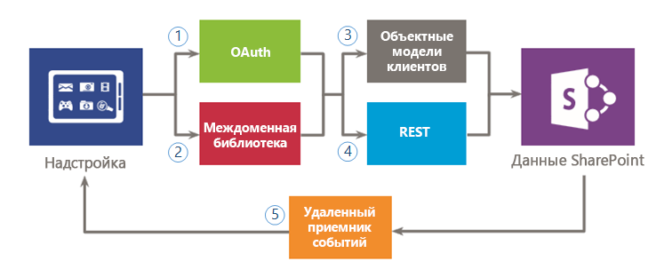
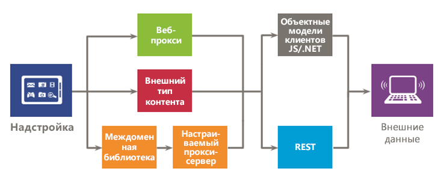

# Безопасный доступ к данным и клиентские объектные модели для надстроек SharePoint
Сведения о возможностях доступа к данным, которые имеются в наличии при создании Надстройки SharePoint, включая возможности подключения для доступа к данным в SharePoint и во внешних системах, а также информация об API-интерфейсах, которые доступны при получении доступа к данным из вашей надстройки.
При оценке возможностей доступа к данным для Надстройки SharePoint необходимо принимать во внимание среду надстройки и ряд факторов, таких как связь между клиентом и сервером, а также уровень разрешений, который требуется надстройке для выполнения необходимых задач. Вы также должны оценить API-интерфейсы, которые доступны в Модель для надстроек SharePoint.

## Высокоуровневый обзор данных в Надстройки SharePoint

Трудно представить себе Надстройка SharePoint (или, собственно говоря, любую надстройку), которой не требуется запрашивать, хранить данные или управлять ими. При работе с надстройкой часто требуется извлекать данные SharePoint и управлять ими, включая элементы в библиотеках документов и списках, метаданные и профили пользователей. Кроме того, могут возникать сценарии, в которых необходимо получать доступ к внешним данным, в вашей надстройке. Модель для надстроек SharePoint предоставляет несколько вариантов подключения и обширный набор API-интерфейсов для доступа к полноформатным данным и службам, которые находятся в SharePoint и во внешних системах.

Когда вы разрабатываете свою надстройку и планируете доступ к данным, необходимо принять два ключевых решения:

1. Какой вариант подключения следует использовать?

2. Какие API-интерфейсы следует использовать для доступа к необходимым данным?

На следующих рисунках приведена сводная информация о различных вариантах, которые предоставляются Модель для надстроек SharePoint. В следующих разделах мы подробно рассмотрим каждый вариант и узнаем, когда следует их использовать.

На рис. 1 представлены имеющиеся в наличии варианты для доступа к данным SharePoint из надстройки. При работе с этими сценариями необходимо выбрать способ проверки подлинности и связи с SharePoint: с использованием (1) OAuth или (2)междоменной библиотеки. Затем, когда речь идет об API-интерфейсе доступа к данным, необходимо выбрать между (3) клиентской объектной моделью (клиентские объектные модели JavaScript/.NET) или (4)службой REST.

Помните, что вы также можете получить доступ к определенным данным с помощью (5)  *удаленных приемников событий*  , однако основной сценарий для удаленных приемников событий — удаленное выполнение кода.

**Рис. 1. Возможности использования данных SharePoint в надстройке**

На рис. 2 представлены варианты доступа к внешним данным в надстройке. При работе с этими сценариями необходимо выбрать использование (1)  *веб-прокси*  , (2) *внешних типов контента*  или (3) *междоменной библиотеки с пользовательской прокси-страницей*  для проверки подлинности и взаимодействия с внешними службами или системами. Также можно использовать (4)клиентскую объектную модель (клиентские объектные модели JavaScript или .NET) или (5)REST.

**Рис. 2. Возможности использования внешних данных в надстройке**

## Возможности подключения к данным для Надстройки SharePoint

При работе с данными в надстройке следует учитывать ряд аспектов. Например, какой маршрут используется для передачи данных? Передаются ли данные с сервера или проходят через него? Проходят ли данные через клиента? Можно ли проходить проверку подлинности в качестве пользователя, вошедшего в систему? Требуются ли надстройке повышенные полномочия? Следующие разделы помогут вам ответить на эти и другие вопросы, которые могут у вас возникнуть.

### Возможности подключения к данным SharePoint

При доступе к данным SharePoint возможны следующие варианты подключения (см. рис. 1).

- **OAuth:** открытый протокол, который позволяет выполнять безопасную авторизацию простым и стандартным способом. OAuth позволяет пользователям утверждать заявки на выполнение действий от их имени без раскрытия имени пользователя и пароля. Вы можете использовать OAuth с серверным кодом. Это отличный вариант, если необходимо выполнять неинтерактивный процесс или повышать привилегии, предоставляя вошедшему в систему пользователю расширенные полномочия. Для получения информации о OAuth см. [Авторизация и проверка подлинности для надстроек в SharePoint 2013](authorization-and-authentication-of-sharepoint-add-ins.md).

- **Междоменная библиотека:** клиентская альтернатива в форме файла JavaScript ( **SP.RequestExecutor.js** ), который размещается на веб-сайте SharePoint и ссылку на который может содержать удаленная надстройка. Междоменная библиотека позволяет взаимодействовать с несколькими доменами на удаленной странице надстройки через прокси-сервер. Это отличный вариант, если вы предпочитаете, чтобы код надстройки выполнялся в клиенте, а не на сервере, или если существуют препятствия для подключения, такие как брандмауэры, между SharePoint и удаленной инфраструктурой. Дополнительные сведения см. в статье [Обращение к данным SharePoint 2013 из надстроек с помощью междоменной библиотеки](access-sharepoint-2013-data-from-add-ins-using-the-cross-domain-library.md).

- **Приемники удаленных событий.** Они обрабатывают события, которые происходят с элементом в надстройке (например, это может быть список, элемент списка или веб-страница). Эти события похожи на события в традиционном решении SharePoint, однако поддерживают также работу с удаленными компонентами Надстройка SharePoint. Обратите внимание на то, что некоторые свойства элемента доступны приемнику удаленных событий. Дополнительные сведения см. в статье [Создание удаленного приемника событий в надстройках SharePoint](create-a-remote-event-receiver-in-sharepoint-add-ins.md). Аналогичным образом с помощью приемников событий можно настраивать установку, обновление и удаление надстройки. Дополнительные сведения см. в статье  [Создание приемника событий надстройки в надстройках для SharePoint](create-an-add-in-event-receiver-in-sharepoint-add-ins.md).

### Варианты подключения к данным SharePoint: какой из них следует использовать?

В следующей таблице представлен список основных требований и сценариев, с которыми вы можете столкнуться при создании надстроек. Символ **x** в столбце указывает, какой вариант можно использовать в каждом отдельном случае.

**Таблица 1. Варианты подключения к данным SharePoint**

|**Требование/сценарий**|**OAuth**|**Междоменная библиотека**|
|:-----|:-----|:-----|
|Я могу использовать клиентские технологии (HTML + JavaScript).    ||x    |
|Я хочу использовать интерфейсы REST.    |x    |x    |
|Между SharePoint и удаленной надстройкой имеется брандмауэр, и необходимо осуществлять вызовы через браузер.    ||x    |
|Надстройка должна осуществлять доступ к ресурсам как вошедший в систему пользователь.    |x    |x    |
|Надстройка должна повышать уровень разрешений, предоставляя вошедшему в систему пользователю расширенные полномочия.    |x    ||
|Надстройка должна действовать от имени пользователя, отличного от пользователя, который вошел в систему.    |x    ||
|Надстройка должна выполнять операции только в том случае, если пользователь вошел в систему.    |x    |x    |
|Надстройка должна выполнять операции, даже если пользователь не вошел в систему.    |x    ||
|Надстройка должна выполнять удаленный код в ответ на событие в SharePoint.    |||
 
Так как удаленные приемники событий основаны на OAuth, сравнение в этой таблице не представляет собой лучший способ для принятия решения об использовании того или иного варианта. Используйте удаленные приемники событий, если вам нужно выполнить удаленный код в дополнение к обмену данными.

### Подключение к внешним данным

При доступе к внешним данным доступны следующие варианты подключения (см. рис. 2).

- **Веб-прокси:** как разработчик, вы можете использовать веб-прокси, предоставляемый в API-интерфейсах клиента, такие как JSOM. Если вы используете веб-прокси, вы отправляете первоначальный запрос на SharePoint. В свою очередь, SharePoint запрашивает данные на определенной конечной точке и передает ответ обратно на свою страницу. Используйте веб-прокси, если вы хотите, чтобы связь осуществлялась на уровне сервера. Веб-прокси предназначен для доступа к неструктурированным данным, не требующим проверки подлинности. Дополнительные сведения см. в статье [Отправка запросов удаленной службе с помощью веб-прокси в SharePoint 2013](query-a-remote-service-using-the-web-proxy-in-sharepoint-2013.md).

- **Внешние типы контента:** вы можете создавать надстройки, получающие доступ к внешним данным из SAP, Netflix и другим типам данных без администратора клиента. Доступ к внешним приложениям осуществляется с помощью служб Business Connectivity Services (BCS), которые предоставляют согласованный интерфейс, доступный другим приложениям SharePoint. ECT с разрешениями на уровне приложения — хороший вариант, если вы используете модель BCS и получаете доступ к данным, требующим проверки подлинности. Дополнительные сведения см. в статье [Добавьте в пределах внешних типов контента в SharePoint 2013](http://msdn.microsoft.com/library/a34cbbba-dc38-4d3d-b796-d54b5848bdfb%28Office.15%29.aspx).

- **Пользовательская прокси-страница для междоменной библиотеки:** вы можете использовать междоменную библиотеку для доступа к данным в удаленной надстройке, если вы предоставляете пользовательскую прокси-страницу, которая размещается в инфраструктуре удаленной надстройки. Как разработчик, вы несете ответственность за реализацию пользовательской прокси-страницы и должны использовать настраиваемую логику, например механизм проверки подлинности, для удаленной надстройки Используйте междоменную библиотеку с пользовательской прокси-страницей, если требуется, чтобы связь осуществлялась на уровне клиента. Для получения дополнительной информации см. [Создание пользовательской прокси-страницы для междоменной библиотеки в SharePoint 2013](create-a-custom-proxy-page-for-the-cross-domain-library-in-sharepoint-2013.md).

### Варианты подключения к внешним данным: какой из них следует использовать?

В следующей таблице представлен список основных требований и сценариев, с которыми вы можете столкнуться при создании надстроек. Символ **x** в столбце указывает, какой вариант можно использовать в каждом отдельном случае.

**Таблица 2. Варианты подключения к внешним данным**

|**Требование/сценарий**|**Веб-прокси**|**Внешние типы контента**|**Междоменная библиотека с пользовательской прокси-страницей**|
|:-----|:-----|:-----|:-----|
|Я могу использовать клиентские технологии (HTML + JavaScript).    |x    |x    |x    |
|Не удается добавлять страницы или компоненты в удаленную надстройку или службу.    |x    |x    ||
|Я хочу использовать интерфейсы REST.    |x    |x    |x    |
|Я хочу использовать JavaScript CSOM.    |x    |x    |x    |
|Я хочу использовать .NET CSOM.    |x    |x    ||
|Прямая связь между инфраструктурой SharePoint и надстройкой отсутствует, и мне необходимо осуществлять вызовы через браузер.    ||x    |x    |
|Надстройка должна осуществлять доступ к ресурсам как вошедший в систему пользователь.    |x    |x    |x    |
 

## Доступные API-интерфейсы доступа к данным для Надстройки SharePoint

Если необходимо осуществлять доступ к данным SharePoint из надстройки, можно использовать следующие варианты API-интерфейсов:

- **Служба REST:** для сценариев, в которых требуется доступ к сущностям SharePoint из клиентских технологий, которые не используют JavaScript и созданы не на основе платформы .NET Framework, SharePoint предоставляет реализацию веб-службы REST, которая использует [протокол Open Data (OData)](http://www.odata.org/) для выполнения операций CRUDQ (Create, Read, Update, Delete, Query — создание, чтение, обновление, удаление, запрос) с данными SharePoint. Кроме того, практически каждый API-интерфейс в клиентских объектных моделях обладает соответствующей конечной точкой REST. Это позволяет коду взаимодействовать напрямую с SharePoint с использованием любой технологии, которая поддерживает стандартные возможности REST. Для использования возможностей REST, которые встроены в SharePoint, код создает запрос RESTful HTTP, передаваемый на конечную точку, которая соответствует необходимому объекту SharePoint. Служба REST обрабатывает запрос HTTP и запрос в формате Atom или Нотация объектов JavaScript (JSON). Для получения более подробных сведений о REST в SharePoint см. [Использование операций запросов OData в запросах SharePoint REST](use-odata-query-operations-in-sharepoint-rest-requests.md).

- **Клиентская объектная модель .NET Framework (.NET client OM):** практически каждый класс на основном узле и в объектной модели на стороне сервера обладают соответствующим классом в клиентской объектной модели .NET Framework. Кроме того, клиентская объектная модель .NET Framework также предоставляет полный набор API-интерфейсов для расширения других функций, включая некоторые функции уровня SharePoint, в том числе ECM, таксономию, профили пользователей, расширенный поиск, аналитику, BCS и т. д. Для получения дополнительных сведений об объектных моделях на стороне клиента см. [Выбор правильного набора API в SharePoint 2013](http://msdn.microsoft.com/library/f36645da-77c5-47f1-a2ca-13d4b62b320d%28Office.15%29.aspx).

- **Клиентская объектная модель JavaScript (JSOM):** SharePoint предоставляет объектную модель JavaScript для использования во встроенном скрипте или отдельных JS-файлах. Она включает те же функциональные возможности, что и клиентская объектная модель .NET Framework. JSOM — это удобный способ включения пользовательского кода SharePoint в надстройку, особенно в Надстройки, размещаемые в SharePoint, где пользовательский код на стороне сервера не разрешен. Эта модель также позволяет веб-разработчикам использовать существующие навыки работы с JavaScript для создания Надстройки SharePoint при прохождении минимального обучения. Дополнительные сведения о клиентских объектных моделях см. в статье [Выбор правильного набора API в SharePoint 2013](http://msdn.microsoft.com/library/f36645da-77c5-47f1-a2ca-13d4b62b320d%28Office.15%29.aspx).

Возможно, существуют другие API, которые можно использовать в Надстройка SharePoint при доступе к внешним данным. Это зависит от интерфейсов с внешними системами и возможностями этих систем. Данные интерфейсы также следует учитывать при создании приложения.

## Дополнительные ресурсы

-  [Авторизация и проверка подлинности для надстроек в SharePoint 2013](authorization-and-authentication-of-sharepoint-add-ins.md)

-  [Обращение к данным SharePoint 2013 из надстроек с помощью междоменной библиотеки](access-sharepoint-2013-data-from-add-ins-using-the-cross-domain-library.md)

-  [Создание пользовательской прокси-страницы для междоменной библиотеки в SharePoint 2013](create-a-custom-proxy-page-for-the-cross-domain-library-in-sharepoint-2013.md)

-  [Отправка запросов удаленной службе с помощью веб-прокси в SharePoint 2013](query-a-remote-service-using-the-web-proxy-in-sharepoint-2013.md)

-  [Создание удаленного приемника событий в надстройках SharePoint](create-a-remote-event-receiver-in-sharepoint-add-ins.md)

-  [Выбор правильного набора API в SharePoint 2013](http://msdn.microsoft.com/library/f36645da-77c5-47f1-a2ca-13d4b62b320d%28Office.15%29.aspx)

-  [Использование операций запросов OData в запросах SharePoint REST](use-odata-query-operations-in-sharepoint-rest-requests.md)

