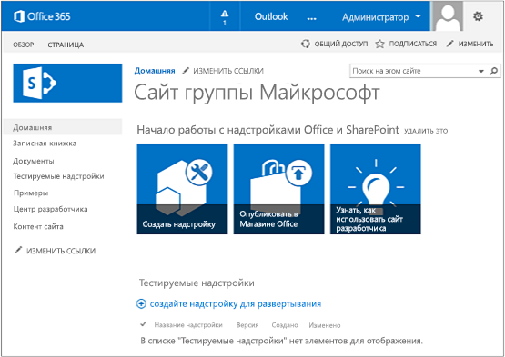

# Настройка среды для разработки надстроек SharePoint в Office 365
Настройка среды разработки для Надстройки SharePoint на Сайте разработчика Office 365.
Прежде чем выполнять действия, описанные в этой статье, прочтите статью  [Средства и среды для разработки надстроек для SharePoint](tools-and-environments-for-developing-sharepoint-add-ins.md), чтобы ознакомиться с возможностями. Если вы не знаете, какие Надстройки SharePoint вы хотите создать, ознакомьтесь с материалами на странице  [Надстройки SharePoint](sharepoint-add-ins.md).

## Установка Visual Studio и инструментов на компьютере

- Инструкции на странице  [Install Visual Studio](http://msdn.microsoft.com/library/da049020-cfda-40d7-8ff4-7492772b620f.aspx) помогут вам установить **Visual Studio** 2013 или более позднюю версию, если вы еще этого не сделали. Рекомендуем использовать [последнюю версию из Центра загрузки Майкрософт](https://www.visualstudio.com/downloads/download-visual-studio-vs).

- Visual Studio включает в себя **Инструменты разработчика Microsoft Office для Visual Studio**, но иногда выпуск новой версии инструментов не совпадает с выходом обновлений Visual Studio. Чтобы убедиться в том, что используете последнюю версию инструментов, запустите [установщик Инструментов разработчика Office для Visual Studio 2013](http://aka.ms/OfficeDevToolsForVS2013) или [установщик Инструментов разработчика Office для Visual Studio 2015](http://aka.ms/OfficeDevToolsForVS2015). 

### Подробное ведение журнала в Visual Studio

Выполните указанные ниже действия, чтобы включить подробное ведение журнала.

1. Откройте реестр и перейдите к разделу **HKEY_CURRENT_USER\\Software\\Microsoft\\VisualStudio\\ _nn.n_\\SharePointTools**, где _nn.n_ — это номер версии Visual Studio, например 12.0 или 14.0.

2. Добавьте ключ DWORD с именем **EnableDiagnostics**.

3. Присвойте ключу значение **1**.

Путь реестра в будущих версиях Visual Studio изменится.

## Зарегистрируйтесь на сайте Сайт разработчиков Office 365

> **Примечание**
>  Возможно, у вас уже есть доступ к сайту Сайт разработчиков Office 365.> **Вы подписчик MSDN?** Visual Studio Enterprise с подпиской MSDN предоставляет льготное право на подписку разработчика приложений для Office 365. [Воспользуйтесь этим преимуществом уже сегодня.](https://msdn.microsoft.com/subscriptions/manage/default.aspx)> **У вас есть один из указанных ниже планов подписки на Office 365?**> **Если да, администратор подписки на Office 365 может создать Сайт разработчиков** в [Центре администрирования Office 365](https://portal.microsoftonline.com/admin/default.aspx). Дополнительные сведения см. в статье  [Создание сайта разработчика с использованием актуальной подписки на Office 365](create-a-developer-site-on-an-existing-office-365-subscription.md). 

Существует три способа получения плана Office 365. 

- Бесплатно зарегистрируйте учетную запись разработчика Office 365 через программу для разработчиков Office 365 сроком на один год.  [Узнайте больше на сайте программы ](http://dev.office.com/devprogram) или заполните [форму регистрации](https://profile.microsoft.com/RegSysProfileCenter/wizardnp.aspx?wizid=14b845d0-938c-45af-b061-f798fbb4d170). После регистрации в программе для разработчиков вы получите сообщение электронной почты со ссылкой для входа в учетную запись разработчика. Затем следуйте приведенным ниже инструкциям.

- Начните с  [бесплатной пробной версии на один месяц](https://portal.microsoftonline.com/Signup/MainSignUp.aspx?OfferId=6881A1CB-F4EB-4db3-9F18-388898DAF510&amp;DL=DEVELOPERPACK) с лицензией на одного пользователя.

- Купите  [подписку разработчика приложений для Office 365](https://portal.microsoftonline.com/Signup/MainSignUp.aspx?OfferId=C69E7747-2566-4897-8CBA-B998ED3BAB88&amp;DL=DEVELOPERPACK). 

> **Совет**
> Откройте эти ссылки в новом окне или на новой вкладке, чтобы работать с ними было удобнее. 

**Рис. 1. Доменное имя Сайта разработчика Office 365**

1. Первая страница (не отображается) регистрационной формы не требует объяснений. Просто введите нужные сведения о себе и нажмите кнопку **Далее**.

2. На второй странице (рис. 1) укажите ИД администратора подписки.

3. Создайте поддомен **.onmicrosoft.com**. 

    После регистрации необходимо использовать полученные учетные данные (в формате  _ИД_пользователя_@ _ваш_домен_.onmicrosoft.com) для входа на сайт портала Office 365, на котором администрируется ваша учетная запись. Ваш Сайт разработчика SharePoint Online подготавливается к работе на новом домене: **http:// _ваш_домен_.sharepoint.com**.

4. Нажмите кнопку **Далее** и заполните последнюю страницу формы. Если вы хотите указать номер телефона, чтобы получить код подтверждения, можно ввести номер мобильного или стационарного телефона, но *не*  номер VoIP.

> **Примечание**
> Если при попытке зарегистрировать учетную запись разработчика вы входите в другую учетную запись Майкрософт, может отобразиться такое сообщение: "Неправильный ИД пользователя. Возможно, он недействителен. Убедитесь, что вы вводите ИД пользователя, назначенный вам организацией. Он должен выглядеть так:  *proverka@example.com*  или *proverka@example.onmicrosoft.com*  ".> Получив такое сообщение, выйдите из текущей учетной записи Майкрософт и повторите попытку. Если сообщение приходит снова, очистите кэш браузера или выберите режим **просмотр InPrivate**, а затем заполните форму. 

По завершении регистрации в браузере откроется страница установки Office 365. Щелкните значок администратора, чтобы открыть страницу Центра администрирования.

**Рис. 2. Страница Центра администрирования Office 365**

1. Необходимо подождать, пока завершится подготовка к работе Сайт разработчиков. После этого обновите страницу Центра администрирования в браузере.

2. Затем щелкните ссылку **Создание надстроек** в верхнем левом углу страницы, чтобы открыть Сайт разработчиков. Должен открыться сайт, который выглядит так, как показано на рис. 3. На странице размещен список **Тестируемые надстройки**. Это подтверждает, что веб-сайт был создан с помощью шаблона Сайта разработчика SharePoint. Если вместо него вы видите обычный сайт группы, подождите несколько минут и перезапустите сайт.

3. Обратите внимание на URL-адрес сайта. Он используется при создании проектов Надстройки SharePoint в Visual Studio.

**Рис. 3. Домашняя страница Сайта разработчика со списком "Тестируемые надстройки"**

## Дополнительные ресурсы

-  [Надстройки SharePoint](sharepoint-add-ins.md)

-  [Знакомство с созданием надстроек SharePoint с размещением у поставщика](get-started-creating-provider-hosted-sharepoint-add-ins.md)

-  [Знакомство с созданием надстроек SharePoint с размещением в SharePoint](get-started-creating-sharepoint-hosted-sharepoint-add-ins.md)

