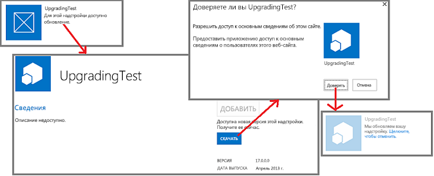

# Процедура обновления надстроек для SharePoint
Ознакомьтесь с процессом обновления надстроек SharePoint.
Чтобы добавить новые возможности в надстройку SharePoint, исправить ошибку или устранить уязвимость, вам нужно обновить ее. Обновление для надстройки развертывается с помощью пакета Надстройка SharePoint так же, как и изначальная версия надстройки. Процесс обновления надстройки SharePoint позволяет гарантировать сохранность данных, если при обновлении произойдет какой-либо сбой.

> **Важно!**
>  *Тип надстройки*  невозможно изменить с помощью системы обновления. Например нельзя заменить надстройку с размещением в SharePoint на надстройку с размещением у поставщика, используя обновление. Чтобы сделать подобное изменение, необходимо [перейти со старой надстройки на новую](#Major). В частности, так как  [действие программы по ознакомлению с автоматически размещаемыми надстройками прекращено](http://blogs.office.com/2014/05/16/update-on-autohosted-apps-preview-program/), помните, что невозможно обновить надстройку с автоматическим размещением до надстройки с размещением у поставщика. Следует преобразовать надстройку, как описано в статье  [Преобразование надстройки для SharePoint с автоматическим размещением в надстройку с размещением у поставщика](convert-an-autohosted-sharepoint-add-in-to-a-provider-hosted-add-in.md). 

## Процесс обновления надстройки SharePoint

Для обновления в манифесте надстройки используется тот же код продукта, что и для исходной версии. Номер версии в манифесте надстройки должен быть больше, чем номер версии исходной надстройки или предыдущего обновления.

В течение 24 часов после того как вы передадите обновление в каталог надстроек организации и в течение недели после его передачи в Магазин Office на странице **Контент сайта** каждого веб-сайта, где установлена надстройка, рядом с ее пунктом появится указание на то, что для нее доступно обновление. Чтобы обновить надстройку, пользователь может нажать ссылку, как показано на рисунке 1. Доступные обновления также отображаются в пользовательском интерфейсе управления клиента.

**Рисунок 1. Процесс обновления надстройки SharePoint**

> **Совет**
>  Когда вы разрабатываете обновления, можно не ждать 24 часа после каждой передачи новой версии обновления в тестовый каталог надстроек SharePoint. О том, как мгновенно обновить надстройку, см. в статье [Обновление надстройки без необходимости ожидать 24 часа](update-sharepoint-add-ins.md#ImmediateUpdateNotice). >  По умолчанию SharePoint проверяет наличие обновлений для установленных надстроек каждые 24 часа. Администратор фермы может указать другое значение для этого периода с помощью команды Командная консоль SharePoint, гдеn это количество часов между проверками.>  `Set-SPInternalAppStateUpdateInterval -AppStateSyncHours n`>  Если установлено значение 0, проверка происходит при каждом выполнении задания встроенного таймера **Обновление внутреннего состояния надстройки** (по умолчанию оно выполняется каждый час). С помощью узла центра администрирования администраторы могут изменить частоту выполнения задания таймера или задать его мгновенное выполнение.

Когда пользователь устанавливает обновление для Надстройка SharePoint, SharePoint 2013 выполняет следующие действия. Их порядок может быть иным, и некоторые из них могут выполняться параллельно. Кроме того, в случае сбоя обновления происходит полный откат.

- SharePoint 2013 выдает пользователю запрос на подтверждение изменений, запрашиваемых надстройкой.

- SharePoint 2013 делает надстройку временно недоступной для пользователей.

- Если надстройка включает пакет решения SharePoint (с расширением WSP) и содержимое этого пакета как-либо изменяется, SharePoint делает следующее:

  - создает резервную копию сайта надстройки (но в SharePoint Online, а также локальной среде SharePoint 2016 и более поздних версий резервные копии фактических данных в списках SharePoint создаются, только если при обновлении изменяется схема списка);

  - тестирует обновление с помощью резервной копии;

  - если тестирование завершается успешно, обновляет исходный сайт надстройки; обратите внимание на то, что для обновления компонентов и других частей сайта надстройки используется новый WSP-файл в пакете надстройки (элементы обновления схемы компонентов были расширены в SharePoint 2013).

- SharePoint 2013 выполняет веб-службу **UpgradedEventEndpoint**, если она зарегистрирована в манифесте надстройки.

    > **Примечание**
    > Если надстройка размещается у поставщика, нужно реализовать логику обновления для всех ее компонентов, не относящихся к SharePoint. Чаще всего эти компоненты обновляются отдельно от обновления самой Надстройка SharePoint, точно так же, как они были установлены отдельно от установки надстройки. Но может понадобиться внести определенные изменения только при обновлении пользователем Надстройка SharePoint. Эту логику можно добавить в веб-службу **UpgradedEventEndpoint** или логику первого запуска после обновления в самой надстройке.
- SharePoint 2013 восстанавливает доступ к надстройке и ее компонентам.

> **Примечание**
> При изменении схемы любого списка на сайте надстройки создается резервная копия списка вместе с оставшимися компонентами сайта надстройки. При наличии большого количества данных в списке это может занять некоторое время. Если процесс обновления не завершается в течение 1 часа, он останавливается, а обновление откатывается. 

## Переход со старой надстройки на новую

В некоторых ситуациях может потребоваться заменить старую надстройку совершенно новой, вместо того чтобы обновлять ее. Новая надстройка может иметь то же название, что и старая, так как оно знакомо пользователям. Однако в манифесте надстройки для нее нужно задать новый код продукта, и она будет отображаться в общедоступном Магазин Office и на странице **Добавление надстройки** веб-сайтов SharePoint как отдельный элемент исходной версии.

> **Примечание**
> Элементы в каталоге надстроек организации различаются по  *имени файла*  пакета надстройки, а не по идентификатору продукта или имени надстройки. Если имя файла пакета новой надстройки совпадает с именем файла пакета старой надстройки, старая надстройка будет заменена в каталоге надстроек на новую и больше не будет отображаться на странице **Добавление надстройки**. Если при передаче пакета надстройки в каталог вы включите для нее управление версиями, старая версия файла (старая надстройка) будет по-прежнему доступна в истории элемента. Вы сможете скачать старый пакет надстройки или вернуться к нему, отменив изменения, но это сделает невозможным одновременное хранение старой и новой надстроек в каталоге или на странице **Добавление надстройки** в качестве отдельных элементов.

В некоторых случаях может потребоваться перенести данные. Например, новая надстройка может использовать База данных SQL Microsoft Azure, схема которой отличается от схемы старой надстройки. Либо в новой надстройке может применяться другой механизм хранения данных, например внешняя база данных вместо списков SharePoint. В этом случае вам следует реализовать код для переноса данных.

Если существующие данные размещаются в месте, доступном для обработчика удаленных событий, вы можете реализовать логику переноса в веб-службе **InstalledEventEndpoint** новой надстройки. Если новая надстройка имеет доступ к существующим данным, вы также можете включить логику переноса в код, выполняемый при ее первом запуске. Если существующие данные недоступны для обработчиков удаленных событий или для новой надстройки, вы можете создать обновление для старой надстройки, чтобы добавить возможность экспорта данных и соответствующий пользовательский интерфейс. Пользователи смогут сначала обновить старую надстройку, а затем экспортировать с ее помощью данные в расположение, где они будут доступны для новой надстройки, в которой нужно обеспечить возможность импорта данных и соответствующий пользовательский интерфейс.

В принципе, в новой надстройке вы можете использовать внешние источники данных, вычислительные и другие внешние компоненты, которые использовались в старой надстройке. Но учтите, что при удалении Надстройка SharePoint инфраструктура SharePoint 2013 удалит все установленные компоненты. Соответственно, рекомендуется использовать для Надстройка SharePoint только установленные им компоненты или внешние компоненты, которые не были установлены инфраструктурой SharePoint 2013.

> **Примечание**
> В случае внедрения **InstalledEventEndpoint** или **UpgradedEventEndpoint**, устанавливающей компоненты, рекомендуется также внедрить **UninstallingEventEndpoint** для удаления этих компонентов. Это соответствует принципам проектирования, требующим, чтобы надстройки были автономными и "чисто" удалялись. При этом, не должны удаляться данные, которые останутся полезны пользователям и после удаления надстройки. Созданные надстройкой веб-сайты, за исключением сайта надстройки, также считаются данными.

Если и старая, и новая надстройки включают сайт надстройки, при установке новой надстройки следует создать для него новый сайт. По этой причине не следует использовать разметку XML, связанную с обновлением, в схеме компонентов SharePoint 2013. Эта разметка не работает, поскольку существующие компоненты SharePoint не обновляются: имеющаяся надстройка заменяется новой.

## Дополнительные ресурсы

-  [Обновление надстроек для SharePoint](update-sharepoint-add-ins.md)

-  [Обновление веб-компонентов надстройки в SharePoint 2013](update-add-in-web-components-in-sharepoint-2013.md)

-  [Обновление веб-компонентов узла в SharePoint 2013](update-host-web-components-in-sharepoint-2013.md)

-  [Создание обработчика для события обновления в надстройках для SharePoint](create-a-handler-for-the-update-event-in-sharepoint-add-ins.md)

-  [Обновление удаленных компонентов в надстройках для SharePoint](update-remote-components-in-sharepoint-add-ins.md)

-  [Публикация надстроек для SharePoint](publish-sharepoint-add-ins.md)

-  [Важные аспекты архитектуры и разработки надстройки SharePoint](important-aspects-of-the-sharepoint-add-in-architecture-and-development-landscap.md)

-  [Развертывание и установка надстроек для SharePoint: методы и параметры](deploying-and-installing-sharepoint-add-ins-methods-and-options.md)

