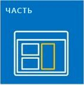
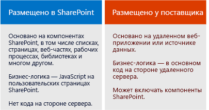

# Надстройки SharePoint
Надстройки SharePoint это автономные расширения созданных вами веб-сайтов SharePoint, которые выполняются на сервере SharePoint без пользовательского кода.
## Обзор Надстройки SharePoint

Существует два основных типа надстроек SharePoint надстройки с размещением в SharePoint и у поставщика. Чтобы выбрать наиболее подходящий вариант для своего сценария, сначала узнайте, что общего у обоих типов таких надстроек.

> **Примечание**
> Приложение для устройства, например мобильное приложение, это не совсем Надстройка SharePoint, даже если оно получает доступ к SharePoint. Это касается и веб-приложений, запускаемых не из SharePoint. Если вам нужно разработать одно из таких приложений, см. статью  [SharePoint доступа с мобильных устройств и собственные устройства приложений](http://msdn.microsoft.com/library/42014171-5ee5-421d-9cde-413efc3aecef%28Office.15%29.aspx). 

- **Надстройка SharePoint это автономный функциональный модуль**, расширяющий возможности веб-сайтов SharePoint для решения определенной бизнес-проблемы.

- **Надстройки не содержат пользовательский код, который запускается на серверах SharePoint**. Вместо этого вся пользовательская логика перемещается в облако, на клиентские компьютеры или же на локальный сервер, который не входит в ферму SharePoint или подписку на SharePoint Online. Если пользовательский код находится за пределами серверов SharePoint, администраторы SharePoint могут не беспокоиться, что надстройка причинит вред их серверам или снизит производительность веб-сайтов SharePoint Online.

- **Бизнес-логика надстройки SharePoint может получить доступ к данным SharePoint через один из клиентских API в составе SharePoint**. Какой API нужно использовать для своей надстройки, зависит от того, каким вы разработаете это приложение.

- **Практически все основные типы компонентов SharePoint могут быть частью надстройки**, в том числе страницы, списки, рабочие процессы, настраиваемые типы контента, шаблоны списков и веб-части.

- **Веб-сайты SharePoint, где установлены Надстройки SharePoint и где пользователи запускают их, называются хост-сайтами.** Но компоненты SharePoint обычно находятся на отдельном дочернем сайте хост-сайта —сайте надстройки.

- **Надстройки SharePoint можно разместить на веб-сайте SharePoint по-разному**:

|||
|:-----|:-----|
||**с использованием иммерсивного полностраничного интерфейса**, похожего по внешнему виду и удобству использования на страницу SharePoint;   |
||**как часть веб-страницы, то есть с использованием специального элемента управления (веб-части надстройки)**, для отображения элемента iframe, содержащего такую надстройку;   |
||**как команды пользовательского интерфейса, дополняющие ленты и меню** для списков, документов и многого другого.   |
 
- **Для всех надстроек SharePoint, устанавливаемых пользователями, предусмотрена плитка на странице **Содержимое сайта** веб-сайта SharePoint.** При нажатии на плитку надстройка запускается.

- **Надстройка SharePoint настраивается с помощью  *манифеста надстройки* **. Это XML-файл, в котором указаны основные свойства надстройки, место запуска, а также действия, которые должна предпринять служба SharePoint после запуска надстройки. Кроме того, в манифесте можно определить языки, поддерживаемые надстройкой, службы и функции SharePoint, от которых она зависит, а также разрешения дляхост-сайта, необходимые этой надстройке (Надстройки SharePoint полностью контролируют собственные сайты надстроек).

- **Распространять Надстройки SharePoint следует в пакетах надстроек**, которые содержат по крайней мере манифест надстройки. (Если компоненты SharePoint отсутствуют, пакет надстройки может содержать только ее манифест.) Если для надстройки предусмотрены компоненты SharePoint на сайте надстройки, они включаются в пакет как набор XML-файлов. Удаленные компоненты, размещенные не на серверах SharePoint (например, удаленное веб-приложение или база данных), не входят в пакет и разворачиваются отдельно от пакета надстройки. Однако в этом случае нужно указать URL-адреса удаленных компонентов в манифесте надстройки.

- **Пакеты надстроек могут также содержать Надстройки Office.** Когда устанавливается Надстройка SharePoint, в каталог надстроек Office в SharePoint добавляется Надстройка Office. Пользователи могут установить ее в приложения Office (например, Word или Excel).

> **Совет**
> **Чтобы получить представление о том, что вы можете разрабатывать, ознакомьтесь с несколькими надстройками SharePoint в** [Магазине Office](https://store.office.com/appshome.aspx?productgroup=SharePoint) или посетите веб-сайт SharePoint 2013 и установите несколько бесплатных надстроек SharePoint. Для этого просто выберите элементы ** Содержимое сайта | Добавить надстройку | Магазин SharePoint**. 

### Несколько заметок для опытных разработчиков SharePoint

Мы исключили изолированные решения, содержащие пользовательский серверный код. Мы все еще поддерживаем изолированные решения "без кода" и изолированные решения, содержащие только JavaScript.

Надстройки SharePoint не используют серверную объектную модель SharePoint. Клиентские объектные модели значительно расширены в SharePoint 2013. Хотя некоторые API серверной объектной модели SharePoint недоступны в клиентских объектных моделях, они в основном принадлежат к административным или связанным с безопасностью классам. Пользовательская логика SharePoint, которая обращается к этим областям, больше подходит для сценария Windows PowerShell или классического изолированного решения для SharePoint. Из статьи  [Сравнение надстроек SharePoint с решениями SharePoint](http://msdn.microsoft.com/library/0e9efadb-aaf2-4c0d-afd5-d6cf25c4e7a8%28Office.15%29.aspx) можно узнать о том, что выбрать Надстройки SharePoint, классические решения ферм SharePoint или изолированные решения.

## Два способа распространения или продажи пакета надстройки

Пакеты надстроек можно распространять двумя способами:

- **Через каталог надстроек организации** специальное семейство веб-сайтов SharePoint в локальной ферме или в составе подписки на SharePoint Online. Этот метод используется, если надстройка разработана для конкретной организации.

- **Через  [Магазин Office](https://store.office.com/appshome.aspx?productgroup=SharePoint)**. Маркетинговые операции, связанные с обнаружением, покупкой и обновлениями, выполняет магазин, а не вы. Чтобы помочь вам продавать надстройки через Магазин Office, корпорация Майкрософт предоставляет **Панель мониторинга продаж**.

После развертывания надстройки одним из указанных способов она станет доступной для установки на странице **добавления надстроек** веб-сайтов SharePoint. Если надстройке требуются разрешения для хост-сайта или его родительской подписки, при установке этой надстройки SharePoint запросит у пользователя эти разрешения.

Если вам потребуется обновить надстройку, чтобы исправить ошибку или добавить функцию, внесите изменения и обновите версию надстройки в ее манифесте. Затем повторно разверните пакет надстройки в магазине или каталоге надстроек. Пользователи получат уведомление о доступности обновления через пользовательский интерфейс SharePoint в течение 24 часов. Обновление можно установить одним щелчком мыши. 

## Два типа надстроек SharePoint (с размещением в SharePoint и у поставщика)

### Надстройки SharePoint с размещением в SharePoint

Надстройки с размещением в SharePoint почти целиком состоят из компонентов SharePoint на сайте надстройки. Иногда говорят, что их центр находится в SharePoint.

Как и все Надстройки SharePoint, надстройку с размещением в SharePoint можно запустить с помощью плитки на странице **Содержимое сайта** того веб-сайта SharePoint, на котором она установлена. При необходимости на хост-сайте надстройка может поддерживать два других типа компонентов пользовательского интерфейса элементы для дополнительных действий и веб-части надстройки (пользовательские кнопки ленты или элементы меню). **Остальные компоненты надстройки с размещением в SharePoint разворачиваются на сайте надстройки.** Эти компоненты определяются декларативно с помощью XML-файлов и могут содержать указанные ниже элементы.

||||
|:-----|:-----|:-----|
|Настраиваемые страницы    |Рабочие процессы    |Модули (наборы файлов)    |
|Шаблоны списка    |Экземпляры списков и библиотек    |Настраиваемые формы и представления списков    |
|Настраиваемые типы контента    |Веб-шаблоны    |Встроенные столбцы (не настраиваемые столбцы)    |
|Встроенные веб-части (не настраиваемые веб-части)    |Файлы JavaScript    |Настраиваемые кнопки и элементы меню для сайта надстройки    |
 

Вся бизнес-логика надстройки с размещением в SharePoint использует JavaScript непосредственно на настраиваемой странице или в файле JavaScript, на который ссылается такая страница. Версия JavaScript объектной модели SharePoint (JSOM) создана для того, чтобы упростить для надстройки выполнение операций создания, чтения, обновления и удаления (CRUD) данных SharePoint.

Настраиваемые страницы в надстройке с размещением в SharePoint это в основном страницы ASP.NET (ASPX), которые могут декларативно ссылаться на ASP.NET и встроенные элементы управления SharePoint, но не могут содержать код. Но вы можете настроить элементы управления SharePoint, используя клиентскую обработку и настраиваемое JavaScript.

JavaScript надстроек с размещением в SharePoint может получать доступ к данным и ресурсам, размещенным за пределами сайта надстройки, с помощью любого из двух методов безопасного обхода политики одинаковых источников браузера использования специальной междоменной библиотеки JavaScript или определенного класса WebProxy JavaScript. Эти методы позволяют надстройке с размещением в SharePoint работать с данными хост-сайта, ее родительской подписки или в Интернете.

### Надстройки SharePoint с размещением у поставщика

Любой компонент SharePoint, который может быть частью надстройки с размещением в SharePoint, может входить и в состав надстройки с размещением у поставщика. Эти два типа надстроек отличаются тем, что надстройки с размещением у поставщика содержат по крайней мере один удаленный компонент (например, веб-приложение, службу или базу данных), размещенный за пределами фермы SharePoint или не входящий в подписку на SharePoint Online. Это может быть сервер, находящийся в той же корпоративной сети, что и ферма SharePoint или облачная служба. Внешние компоненты могут размещаться в любом стеке веб-хостинга, включая стеки Linux, Apache, MySQL и PHP (LAMP). 

> **Примечание**
> **"Поставщиком" считается любой владелец сервера или облачной учетной записи.** Это может быть та же компания или организация, владеющая фермой SharePoint или областью клиентов SharePoint Online, в которой должна быть установлена надстройка. Разработчик надстройки также может быть поставщиком. Если надстройка создается для организации, обычно она размещает надстройку на своих серверах. Но если надстройка создается для нескольких организаций, вероятно, удаленные компоненты будут размещены на сервере разработчика. Размещение у разработчика обязательно, если Надстройка SharePoint распространяется через Магазин Office, так как у разработчика нет контактных данных покупателей надстроек. В этом случае разным экземплярам надстройки известен универсальный код ресурса (URI) удаленного компонента, потому что он указан в манифесте надстройки.

Вы абсолютно свободны в выборе платформы для размещения удаленных компонентов. Не обязательно использовать стек Майкрософт. Вы можете использовать любую платформу для веб-хостинга, в том числе LAMP (Linux, сервер Apache, MySQL, PHP), MEAN (MongoDB, ExpressJS, AngularJS, Nodejs), Java, Python и другие, а также сторонние средства разработки. Кроме того, удаленные компоненты можно разместить в сторонних облачных службах.

 **Вы можете сделать удаленные страницы надстройки похожими по внешнему виду и удобству использования на страницы SharePoint** с помощью специального элемента управления хрома.

 **К удаленным данным могут, среди прочих, относиться большие двоичные объекты, кэш, очереди сообщений, сети доставки содержимого (CDN) и базы данных**. Базы данных могут быть любых типов, в том числе релятивными и объектно-ориентированными. К удаленным данным можно получать доступ несколькими способами. Например, используя Службы Business Connectivity Services (BCS) для их включения в список SharePoint или представляя данные в сетке на странице удаленного веб-приложения.

 **Надстройки SharePoint используют API SharePoint для подключения и интеграции функций SharePoint** поиска, рабочих процессов, социальных сетей, таксономии, профилей пользователей, BCS и не только. Это позволяет им считывать документы, выполнять поиск и операции CRUD, а также обеспечивать общение пользователей. Существует несколько наборов API:

- Если удаленные компоненты реализуются с помощью .NET, становится доступной библиотека **клиентской объектной модели (CSOM) SharePoint** для управляемого кода.

- Если удаленные компоненты созданы не на базе .NET, для них существует набор **API REST или OData**, который можно использовать для доступа к данным SharePoint. Его также можно использовать в клиенте .NET, если вы предпочитаете работать с интерфейсом OData.

- Упомянутую выше **библиотеку JSOM** невозможно использовать на удаленной странице. Но надстройки с размещением у поставщика могут содержать настраиваемые страницы SharePoint на сайте надстройки, и код JavaScript этих страниц может использовать библиотеку JSOM.

 **Надстройки с размещением у поставщика, у которых есть доступ к SharePoint, такие же субъекты безопасности, как пользователи и группы**. Субъект надстройки, как и пользователь, должен пройти проверку подлинности и авторизацию. Для выполнения операций с данными SharePoint на хост-сайте надстройке требуются разрешения. В большинстве случаев эффективная реализация разрешений для пользователя, работающего с SharePoint при помощи надстройки, предусматривает применение сразу двух типов разрешений для пользователя и для надстройки. Хотя иногда при работе с надстройкой пользователь может выполнять такие действия, на которые у него нет разрешений.

 **Надстройки с размещением у поставщика могут подключаться к любой внутренней или общедоступной веб-службе** и, в отличие от надстроек с размещением в SharePoint, **обрабатывать список SharePoint и события элементов списка**, например добавление элемента в библиотеку документов.

## Выбор пути разработки решений для SharePoint

Готовы приступить к работе?

- **Если вы опытный разработчик решений для SharePoint, рекомендуем начать с надстроек с размещением в SharePoint.** Они больше всего похожи на те расширения SharePoint, которые вы создавали ранее.

     [Знакомство с созданием надстроек SharePoint с размещением в SharePoint](get-started-creating-sharepoint-hosted-sharepoint-add-ins.md)

- **Если вы опытный разработчик веб-приложений на базе ASP.NET, рекомендуем начать с надстроек с размещением у поставщика.** Они создаются как веб-приложения.

     [Знакомство с созданием надстроек SharePoint с размещением у поставщика](get-started-creating-provider-hosted-sharepoint-add-ins.md)

- **Если вы планируете разработать надстройку с размещением у поставщика в стороннем стеке, вот с чего можно начать:**

  -  Установите средства, соответствующие вашему стеку, если у вас их еще нет.

  - Получите учетную запись разработчика в Office 365 для тестирования и отладки. Подробности см. в статье  [Настройка среды для разработки надстроек SharePoint в Office 365](set-up-a-development-environment-for-sharepoint-add-ins-on-office-365.md). Если у вас уже есть подписка на Office 365, вам нужно просто  [создать с ее помощью Сайт разработчика.](create-a-developer-site-on-an-existing-office-365-subscription.md)

  - Надстройка будет использовать API REST или OData SharePoint для выполнения операций CRUD с данными SharePoint.

  - Разъяснения можно найти в статье  [Знакомство со службой REST для SharePoint 2013](get-to-know-the-sharepoint-2013-rest-service.md) и других статьях, на которые в ней есть ссылки.

  - Справочную документацию можно найти в статье  [Ссылка на API REST для SharePoint 2013](http://msdn.microsoft.com/library/3514e753-19f9-4b41-a1ae-f35c5ffc17d2%28Office.15%29.aspx).

  - Если вы не используете Visual Studio, вам потребуется создать файл манифеста надстройки и пакет надстройки. Сведения об этом см. в статье  [Изучите структуру манифеста надстройки и пакет надстройки для SharePoint](explore-the-app-manifest-structure-and-the-package-of-a-sharepoint-add-in.md). Использование Visual Studio и Инструменты разработчика Microsoft Office для Visual Studio для создания манифеста и пакета значительно экономит время. Рекомендуем принимать их во внимание, даже если для создания удаленного веб-приложения вы используете другое средство.  [Выпуск Visual Studio Community](https://www.visualstudio.com/news/vs2013-community-vs.aspx) предоставляется бесплатно.

  - В  [разделе GitHub, посвященном разработке решений для Office,](https://github.com/OfficeDev) вы найдете примеры надстроек с размещением у поставщика для нескольких сторонних языков и платформ (например, код [PHP-приложений для SharePoint](https://github.com/OfficeDev/PHP-App-for-SharePoint)).

> **Примечание**
> Если вы начинающий разработчик приложений для SharePoint и веб-сайтов, рекомендуем начать с бесплатного курса в Microsoft Virtual Academy или изучить книгу о разработке решений для SharePoint 2013. 

## См. также

#### Другие ресурсы

 [Введение в разработку основных решений для Microsoft SharePoint Server 2013](http://www.microsoftvirtualacademy.com/training-courses/developing-microsoft-sharepoint-server-2013-core-solutions-jump-start)
