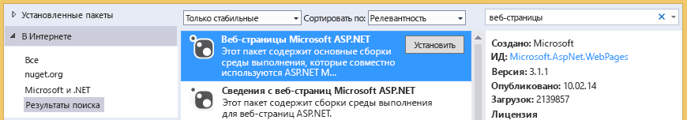

# Устранение неполадок с библиотеками документов
В этой статье описываются проблемы, которые могут возникнуть при доступе к библиотеке документов SharePoint из облачной бизнес-надстройки, а также способы их устранения.

  
    
    

## Ошибка: "Эта надстройка не поддерживает отправку документов из текущего браузера"

При попытке отправить документ в связанную библиотеку документов из облачной бизнес-надстройки, отображается сообщение об ошибке "Эта надстройка не поддерживает отправку документов из текущего браузера. Используйте последнюю версию". Эта проблема возникает только в определенных старых браузерах, которые не поддерживают API-интерфейс FileReader HTML5. Чтобы ее устранить, добавьте в проект пакет NuGet и повторно разверните надстройку.
  
    
    

### Предотвращение ошибки

1. В **обозревателе решений** откройте контекстное меню для проекта **Сервер** и выберите пункт **Управление пакетами NuGet**.
    
  
2. В диалоговом окне **Управление пакетами NuGet** разверните узел **В сети**, а затем в поле **Поиск в сети** введите веб-страницы, как показано на рисунке 1.
    
   **Рисунок 1. Параметры, выбранные в диалоговом окне "Управление пакетами NuGet"**

  

     
  

  

  
3. В списке результатов выберите **Веб-страницы Microsoft ASP.NET**, а затем нажмите кнопку **Установить**.
    
    Откроется диалоговое окно **Согласие с условиями лицензионного соглашения**.
    
  
4. В диалоговом окне **Согласие с условиями лицензионного соглашения** изучите условия лицензионного соглашения и, если вы принимаете их, нажмите кнопку **Принимаю**.
    
  
5. После завершения установки пакета нажмите кнопку **Закрыть**.
    
  
6. Опубликуйте обновленную надстройку на веб-сайте SharePoint.
    
  

## Дополнительные ресурсы

-  [Сопоставление библиотеки документов с сущностью](associate-a-document-library-with-an-entity.md)
    
  

