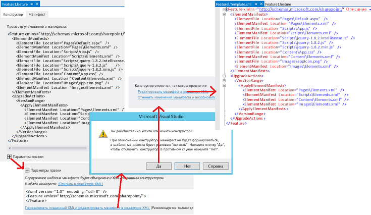

# Обновление веб-компонентов надстройки в SharePoint 2013
Обновление страниц, списков, типов контента и других веб-компонентов в надстройке SharePoint.
## Необходимые условия для обновления веб-компонентов надстройки
<a name="Prerequisites"> </a>

Ознакомьтесь с шагом  [Обновление надстроек для SharePoint](update-sharepoint-add-ins.md) и необходимыми условиями, а также основными понятиями, включенными в данную статью.


В этом разделе предполагается, что вы разработали и протестировали последнюю версию надстройки, как это описано в статье  [Создание и отладка новой версии в качестве новой надстройки](update-sharepoint-add-ins.md#DebugFirst).


## Обновление компонентов SharePoint на сайте надстройки
<a name="UpdatingAppWeb"> </a>

Все компоненты SharePoint, которые развернуты на сайте надстройки, включены в компоненты уровня **Web**-сайта в пакете надстройки, поэтому обновление одних компонентов предусматривает обновление других. Этот процесс не изменился со времени выпуска SharePoint 2010 и описан в статье  [Практическое руководство. Добавление элементов к существующему компоненту](http://msdn.microsoft.com/library/b007f419-e0d6-4e3a-a3ae-b8e448656d02%28Office.15%29.aspx) в Пакет SDK для SharePoint 2010. Другие статьи, указанные на странице [Обновление компонентов](http://msdn.microsoft.com/library/e917f709-6491-4d50-adbe-2ab8f35da990%28Office.15%29.aspx), также могут пригодиться, но следует учитывать, что надстройки не должны включать пользовательский код на сервере SharePoint, поэтому некоторые аспекты обновления компонентов в SharePoint 2010 не относятся к обновлению надстроек. Например, невозможно использовать элемент  [CustomUpgradeAction](http://msdn.microsoft.com/library/16a2182e-80aa-4184-8071-8f717ee5c572%28Office.15%29.aspx), когда вы обновляете компонент надстройки SharePoint.


### Что можно выполнять декларативно, а что нет

В случае обновления надстройки, размещенной в SharePoint, можно использовать только разметку XML. При этом возможности декларативного изменения надстройки будут ограничены. Для надстройки, размещенной на стороне поставщика, можно реализовать  [обработчик UpdatedEventEndpoint](create-a-handler-for-the-update-event-in-sharepoint-add-ins.md), чтобы выполнить действия, которые невозможно сделать декларативно.


Добавлять компоненты в надстройку просто. Любой компонент, который можно включить в надстройку, можно добавить также в обновление. (Дополнительные сведения о компонентах, которые могут входить в надстройку, можно найти в статье  [Типы компонентов SharePoint, которые могут находиться в надстройке для SharePoint](host-webs-add-in-webs-and-sharepoint-components-in-sharepoint-2013.md#TypesOfSPComponentsInApps).) Но если вы хотите изменить существующий компонент декларативно, учтите указанные ниже сведения. 


- Тип данных поля (столбца) списка или типа контента в любом случае невозможно изменить после первоначального развертывания. В частности, не меняйте этот тип данных при обновлении надстройки ( *даже программно*  ). В качестве альтернативного решения вы можете добавить новое поле. Если надстройка содержит пользовательские формы для создания, редактирования или просмотра элементов, не забудьте внести в них соответствующие изменения. Например, добавьте элемент пользовательского интерфейса для нового поля и удалите его для старого. (В надстройке, размещенной на стороне поставщика, можно программным путем переместить данные из старого поля в новое, а затем удалить старое.)


- Списки, экземпляры списков, типы контента и поля в разметке обновления удалить невозможно.


- Файлы невозможно удалить с сайта надстройки в разметке обновления. Но вы можете изменить содержимое любого файла.


- Элементы **CustomUpgradeAction** и **MapFile** невозможно использовать при обновлении надстройки SharePoint, хотя они могут быть доступными в IntelliSense для Visual Studio.


### Обновление сайта надстройки в первый раз

В этом разделе описано, как добавлять или обновлять типы контента, списки, файлы и другие компоненты SharePoint на сайте надстройки. Чтобы было проще, предполагается, что все компоненты входят в один компонент на сайте надстройки. Но этот сайт может иметь несколько таких компонентов, и за один раз можно обновить несколько таких компонентов.


Инструменты разработчика Microsoft Office для Visual Studio ориентированы на создание надстроек, поэтому поведение этих средств, заданное по умолчанию, не всегда оптимально при обновлении надстройки. Для большего контроля над процессом сначала отключите конструктор компонентов, выполнив описанные ниже действия, чтобы можно было непосредственно изменять неотформатированный XML компонента. 


### Внесение изменений в XML компонента


1. В области **Обозреватель решений** откройте файл _{FeatureName}_.features. Он открывается в конструкторе компонентов.


2. Откройте вкладку **Манифест** и разверните **Параметры правки**.


3. Выберите пункт **Перезаписать созданный XML и редактировать манифест в редакторе XML**.


4. Выберите в приглашениях **Да**, чтобы отключить конструктор.


5. В открывшемся представлении выберите пункт **Редактирование манифеста в редакторе XML**. Откроется файл  _{FeatureName}_.Template.xml. 

   **Открытие редактора XML компонентов**





> **Внимание!**
> Не добавляйте комментарии "<!-- -->" в файл  _{FeatureName}_.features. Комментарии не поддерживаются инфраструктурой обновления, и оно станет невозможным, если комментарии находятся в файле. Они используются только в примерах разметки этой статьи, чтобы показать вам, куда должна быть помещена разметка. 


Чтобы обновить компонент сайта надстройки, выполните следующие шаги.


### Обновление компонента сайта надстройки в первый раз


1. Увеличьте значение атрибута **Version** для элемента [Feature](http://msdn.microsoft.com/library/265cd648-1a7e-410f-a1d7-0da8c64b4006%28Office.15%29.aspx), если это еще не сделано с помощью Инструменты разработчика Office для Visual Studio при повышении номера версии в манифесте надстройки. Указанные средства не делают этого в каждом сценарии, поэтому необходимо проверять. Следует использовать тот же номер версии, что и для надстройки. Следует даже рассмотреть вопрос о повышении версии компонента, когда обновляются другие компоненты надстройки, но не сам компонент сайта надстройки. Логикой элемента  [VersionRange](http://msdn.microsoft.com/library/cd715e38-6ec3-43b2-8007-6d0ed8865d91%28Office.15%29.aspx) (рассматривается в разделе [Последующие обновления сайта надстройки](#SubsequentUpgrades)) легче управлять, если версия надстройки и версия компонента всегда одинаковы. 


2. Не удаляйте элементы раздела  [ElementManifests](http://msdn.microsoft.com/library/d8d4db7e-2bc2-40c6-958b-d5683bdee87a%28Office.15%29.aspx) в файле. Содержимое этого раздела не подлежит удалению.


3. Если их еще нет, добавьте в файл следующие элементы. 

  - Дочерний элемент  [UpgradeActions](http://msdn.microsoft.com/library/5af24ac1-a290-454d-b32b-bc7f7a4634f0%28Office.15%29.aspx) в элемент **Feature**.  *Не*  добавляйте атрибуты **ReceiverAssembly** или **ReceiverClass** в элемент. Они не используются при обновлении надстройки SharePoint. Эти атрибуты ссылаются на настраиваемую сборку, неподдерживаемую в надстройках SharePoint. Если вы включите настраиваемую сборку в надстройку, SharePoint ее не установит.


  - Дочерний элемент **VersionRange** в элемент **UpgradedActions**. Не добавляйте атрибуты **BeginVersion** или **EndVersion** в элемент. Это бесполезно, когда надстройка обновляется впервые. Их использование обсуждается в разделе [Последующие обновления сайта надстройки](#SubsequentUpgrades).


  - Дочерний элемент  [ApplyElementManifests](http://msdn.microsoft.com/library/c087a0c3-1e27-4034-b4da-e025991454d6%28Office.15%29.aspx) в элемент **VersionRange**. 


    В этот момент файл должен выглядеть примерно так.

    > **Важно!**
      > Возможно, с помощью Инструменты разработчика Office для Visual Studio уже добавлена указанная выше разметка и скопированы некоторые элементы из раздела **ElementManifests** в раздел **ApplyElementManifests** в качестве примера. *Удалите их*  . Не исключено, что вам придется в дальнейшем возвращать некоторые из них обратно. Но намного легче и безопаснее начать работу с пустого раздела **ApplyElementManifests**. Лишние записи для компонентов, которые не изменялись, могут иметь плохие последствия. Например, длительность процесса обновления может увеличиться настолько, что будет превышено время ожидания и обновление завершится ошибкой. 


 ```XML

<Feature <!-- Some attributes omitted -->
               Version="2.0.0.0">
  <ElementManifests>
    <!-- ElementManifest elements omitted -->
  </ElementManifests>
  <UpgradeActions>
   <VersionRange>
     <ApplyElementManifests>
   
     </ApplyElementManifests>
   </VersionRange>
  </UpgradeActions>
</Feature>
 ```


### Добавление компонентов в надстройку


1. Добавляйте любые новые компоненты в компонент именно так, как если бы вы создавали новый проект надстройки SharePoint.


2. Когда добавляется компонент типа, который отсутствовал в предыдущей версии надстройки (например, добавляете в надстройку список, которого раньше не было), Инструменты разработчика Office для Visual Studio добавляет в проект файл elements.xml. Это манифест элементов для компонента. К этому файлу следует добавить номер новой версии надстройки (например, elements.2.0.0.0.xml). Это может быть полезно при устранении неполадок. Не забудьте внести изменения в область **Обозреватель решений**, чтобы ссылки на файл (например, CSPROJ-файл) и XML-компонент тоже изменились. 


3. Для каждого нового манифеста элементов добавьте дочерний элемент  [ElementManifest](http://msdn.microsoft.com/library/5a6a2865-5d31-45a2-a402-6da6e0f5567a%28Office.15%29.aspx) в элементы **ElementManifests** и **ApplyElementManifests** XML компонента. (Тот же элемент **ElementManifest** в обоих случаях.) Атрибут **Location** должен указывать на относительный путь к файлу elements.2.0.0.0.xml. Например, если вы добавили список с именем MyCustomList, элемент **ElementManifest** будет выглядеть следующим образом.

 ```XML

<ElementManifest Location="MyCustomList\\elements.2.0.0.0.xml" />
 ```

4. Некоторые виды компонентов добавляют к проекту файлы. Например, при добавлении списка создается файл schema.xml. А когда вы добавляете страницу, создается файл подкачки. Добавьте дочерний элемент  [ElementFile](http://msdn.microsoft.com/library/bd43638e-8f18-4a0d-b122-1c055f97aa71%28Office.15%29.aspx) в элемент **ElementManifests** для каждого такого файла. (Не добавляйте его в элемент **ApplyElementManifests**.) Атрибут **Location** должен указывать на относительный путь файла. Например, если вы добавили список, элемент **ElementFile** файла schema.xml будет выглядеть следующим образом.

 ```XML
  <ElementFile Location="MyCustomList\\Schema.xml" />
 ```

5. При добавлении другого типа элемента, который уже использовался в предыдущей версии надстройки, Инструменты разработчика Office для Visual Studio могут добавить ссылку на новый элемент в существующий манифест элементов вместо того, чтобы создавать новый. Например, чтобы добавить страницу на сайт надстройки, обычно нужно щелкнуть правой кнопкой мыши узел **Страницы** в области **Обозреватель решений**, а затем последовательно выбрать **Добавить | Создать элемент | Страница | Добавить**. Инструменты разработчика Office для Visual Studio будут добавлять новый элемент **File** в модуль **Pages** в существующем файле манифеста элементов (обычно зовется elements.xml), вместо того чтобы создавать новый манифест элементов.

    Это нежелательное действие. По возможности не изменяйте существующие файлы манифеста элементов для предыдущих версий надстройки при ее обновлении. Как правило, новые элементы должны находиться в новых файлах манифеста элементов (на которые ссылается элемент **ApplyElementManifests** XML компонента). (Есть несколько исключений, они описаны ниже.) Например, чтобы добавить новую страницу, выполните следующие действия:

1. Создайте модуль с именем Pages.2.0.0.0.


2. Удалите из него файл sample.txt, который Инструменты разработчика Office для Visual Studio добавляют автоматически.


3. Переименуйте манифест элементов в новом модуле на elements.2.0.0.0.xml.


4. Щелкните правой кнопкой мыши модуль **Pages.2.0.0.0** и последовательно выберите **Добавить | Создать элемент | Страница | Добавить**. Вы получите новую страницу, на которую будет ссылаться манифест элементов для модуля **Pages.2.0.0.0**, а не **Pages**.


5. Убедитесь, что элемент **ElementManifests** XML компонента имеет элемент **ElementsFile** для новой страницы, а также что существует элемент **ElementManifest** для файла elements.2.0.0.0.xml в разделах **ElementManifests** и **ApplyElementManifests**.


    Если Инструменты разработчика Office для Visual Studio изменили существующий манифест элементов, создайте вручную файл elements.2.0.0.0.xml и переместите в новый манифест разметку, добавленную в старый. (При желании новый манифест можно поместить в тот же узел **Обозреватель решений**, что и старый.)


6. Если вы добавляете поле в тип контента компонента, добавьте элемент  [AddContentTypeField](http://msdn.microsoft.com/library/cb04a3ac-f41a-4ffe-aaa1-d4bf3fb6347d%28Office.15%29.aspx) в раздел **VersionRange**. Убедитесь, что вы присвоили правильные значения атрибутам **ContentTypeId** и **FieldId**. С помощью атрибута **PushDown** укажите, будет ли добавлено новое поле в какой-либо производный тип контента (необязательно). Ниже приведен пример.

 ```XML
  <VersionRange>
  <AddContentTypeField 
    ContentTypeId="0x0101000728167cd9c94899925ba69c4af6743e"
    FieldId="{CCDD361F-A3FB-40D8-A272-3A3C858F4116}"
    PushDown="TRUE" />
  <!-- Other child elements of VersionRange -->
</VersionRange>
 ```


### Изменение существующих компонентов надстройки


1. Если вы изменили файл, на который имеется ссылка в файле манифеста элементов (например, файл Default.aspx), то вообще не нужно изменять элемент **ElementFile**. Но для инфраструктуры обновления следует задать замену старой версии файла на новую. Это можно сделать, добавив элемент **ElementManifest** модуля в раздел **ApplyElementManifests**. Если в разделе **ElementManifests** уже существует такой элемент, иногда можно просто скопировать его (не переместить) в **ApplyElementManifests**. Это рекомендуется делать, только если были изменены все файлы, на которые ссылается манифест. Обычно не нужно заменять неизмененный файл, так как это может иметь плохие последствия. Например, если настройки страницы позволяют пользователям ее изменять, то в результате замены внесенные изменения могут быть удалены. Если вы изменили страницу, то учитывайте эти последствия. Но не нужно без веской причины доставлять неудобства пользователям.

    Чтобы удостовериться, что заменены только измененные файлы модуля, создайте еще один манифест элементов для модуля, который будет ссылаться только на измененные файлы, и примените второй манифест в **ApplyElementManifests**, выполнив действия ниже.

1. Щелкните правой кнопкой мыши узел модуля в области **Обозреватель решений** и добавьте XML-файл (не страницу) с именем elements.2.0.0.0.xml.


2.  Выберите новый файл в области **Обозреватель решений**, чтобы его область свойств стала видимой, и измените свойство **Deployment Type** на **ElementManifest**. Это обязательно нужно сделать, чтобы обработка файла с помощью Инструменты разработчика Office для Visual Studio выполнялась должным образом.


3. Скопируйте содержимое исходного манифеста в новый и удалите из нового манифеста все элементы меню  [Файл](http://msdn.microsoft.com/library/c270e4ce-8110-4da7-b0e7-c223604bfce7%28Office.15%29.aspx), соответствующие **неизмененным** файлам.


4. Добавьте элемент **ElementManifest** в раздел **ApplyElementManifests**, который ссылается на новый файл манифеста, как в примере ниже.

 ```XML

<ElementManifest Location="Pages\\elements.2.0.0.0.xml" />
 ```


    > **Примечание**
      >  Не удаляйте исходный манифест. XML компонента использует как старый манифест, так и новый.>  Не копируйте никаких элементов **ElementFile** из раздела **ElementManifests** в раздел **ApplyElementManifests**, даже если файл, на который имеются ссылки в **ElementFile**, был изменен. 
2. Откройте каждый файл манифеста элементов, на который имеются ссылки в разделе **ApplyElementManifests**, и удостоверьтесь, что у всех элементов  [File](http://msdn.microsoft.com/library/c270e4ce-8110-4da7-b0e7-c223604bfce7%28Office.15%29.aspx) есть атрибут **ReplaceContents** со значением **TRUE**. Пример приведен ниже. Возможно, это уже сделано с помощью Инструменты разработчика Office для Visual Studio, но вам следует проверить. Проверьте даже манифесты элементов для предыдущих версий надстройки. Это один из хороших способов изменить существующий файл манифеста элементов.

 ```XML
  <Module Name="Pages">
  <File Path="Pages\\Default.aspx" Url="Pages/Default.aspx" ReplaceContent="TRUE" />
</Module>
 ```

3. В страницы могут быть встроены веб-части, как описано в статье  [Добавление веб-части на страницу сайта надстройки](include-a-web-part-in-a-webpage-on-the-add-in-web.md). Если вы изменяете страницу со встроенной веб-частью (или изменяете свойства веб-части), потребуется выполнить дополнительное действие: добавить на страницу указанную ниже разметку, чтобы служба SharePoint не добавила вторую копию веб-части на страницу. Разметку необходимо добавить к элементу **asp:Content** с ИД `PlaceHolderAdditionalPageHead`. Возможно, при создании страницы Инструменты разработчика Office для Visual Studio уже ее добавили, но нужно это проверить.

 ```XML

<meta name="WebPartPageExpansion" content="full" />
 ```


    > **Примечание**
      >  Если параметры страницы позволяли пользователям настраивать ее, то побочным эффектом разметки может стать возможность удаления таких настроек. Пользователям придется выполнить их заново.>  Если веб-часть была добавлена на страницу в соответствии с инструкцией, описанной в статье [Добавление веб-части на страницу сайта надстройки](include-a-web-part-in-a-webpage-on-the-add-in-web.md), то ее разметка находится в манифесте элементов. Поэтому изменение свойств веб-части исключение из общего правила, которое не разрешает изменять файл манифеста элементов при обновлении надстройки. 
4. Альтернатива изменению страницы перенаправление на новую страницу. Как это сделать, описано ниже. 

1. Создайте страницу и настройте разметку ее обновления, как описано выше в разделе **Добавление компонентов в надстройку**.


2. Откройте старую страницу и удалите всю разметку из элемента **asp:Content** с ИД `PlaceHolderAdditionalPageHead`. 


3. Добавьте в элемент **asp:Content** указанную ниже разметку и замените путь _{RelativePathToNewPageFile}_ на новый путь и имя файла. Этот сценарий перенаправит браузер на новую страницу и укажет параметры запроса. Кроме того, он исключит старую страницу из истории браузера.

 ```
  <script type="text/javascript">
        var queryString = window.location.search.substring(1);
        window.location.replace("{RelativePathToNewPageFile}" + "?" + queryString);
</script>
 ```

4. Удалите все остальные элементы **asp:Content** на странице.


5. Если вы заменяете начальную страницу надстройки, то измените элемент **StartPage** манифеста надстройки так, чтобы он указывал на новую страницу.


5. Если сайт надстройки содержит **CustomAction** или **ClientWebPart** и вы его изменяете при обновлении, тогда необходимо изменить манифест элементов, так как он определяет эти компоненты. Это исключение из общего правила, которое не разрешает изменять манифест элементов предыдущей версии надстройки при ее обновлении. Кроме того, необходимо скопировать (не переместить) элемент **ElementManifest** из раздела **ElementManifests** в раздел **ApplyElementManifests**.


#### Пример XML компонента для первого обновления надстройки

Ниже приведен пример полного пути к файлу  _{Имя_компонента}_.Template.xml для первого обновления надстройки. Обновленная надстройка в этих примерах включает измененный файл Default.aspx, на который имеются ссылки в файле  `Pages\\Elements.xml`. Она развертывает три новых файла jQuery, на каждый из которых имеются ссылки в файле  `Scripts\\Elements.xml`. Обратите внимание, что все элементы **ElementFile** перешли в раздел **ElementManifests**, а файл  `<ElementManifest Location="Pages\\Elements.xml" />` скопирован (не перемещен) из раздела **ElementManifests** в раздел **ApplyElementManifests**.



```XML

<Feature xmlns="http://schemas.microsoft.com/sharepoint/" Title="MyApp Feature1"
      Description="SharePoint Add-in Feature" Id="85d309a8-107e-4a7d-b3a2-51341d3b11ff" 
      Scope="Web" Version="2.0.0.0">
  <ElementManifests>
    <ElementFile Location="Pages\\Default.aspx" />
    <ElementManifest Location="Pages\\Elements.xml" />
    <ElementFile Location="Content\\App.css" />
    <ElementManifest Location="Content\\Elements.xml" />
    <ElementFile Location="Images\\AppIcon.png" />
    <ElementManifest Location="Images\\Elements.xml" />
    <ElementFile Location="Scripts\\jquery-3.0.0.intellisense.js" />
    <ElementFile Location="Scripts\\jquery-3.0.0.js" />
    <ElementFile Location="Scripts\\jquery-3.0.0.min.js" />
  </ElementManifests> 
  <UpgradeActions>
      <VersionRange>  
        <ApplyElementManifests>
          <ElementManifest Location="Pages\\Elements.xml" />
          <ElementManifest Location="Scripts\\elements.2.0.0.0.xml" />
        </ApplyElementManifests>
      </VersionRange>
  </UpgradeActions>
</Feature>

```


### Последующие обновления сайта надстройки
<a name="SubsequentUpgrades"> </a>

Когда вы обновляете надстройку SharePoint второй (или третий и т. д.) раз, следует учитывать, что некоторые из ваших клиентов, возможно, не установили предыдущие обновления. Таким образом, если пользователь отвечает на приглашение "доступно обновление" после развертывания вашего последнего обновления в каталоге надстроек организации или в Магазин Office, их экземпляр надстройки может быть обновлен с помощью различных версий в ходе единого процесса обновления. По большей части это именно то, что нужно: выполнить обновление каждой более ранней версии надстройки до последней версии. Однако, вам не всегда нужно, чтобы каждое действие обновления компонента сайта надстройки повторялось для каждого экземпляра надстройки. Существуют некоторые действия обновления, которые не должны происходить несколько раз в данном экземпляре надстройки. Например, если вы добавляете поле к типу содержимого в одном обновлении, вам не нужно добавлять его снова в следующем обновлении. В следующей процедуре показано, как использовать элемент **VersionRange** для управления действиями обновления в зависимости от версии обновляемого компонента.


### Изменение компонента сайта надстройки на более поздние обновления


1. Откройте файл  _{Имя_компонента}_.Template.xml для редактирования, как это уже было описано в этой статье в процедуре **Внесение изменений в XML компонента** и увеличьте атрибут **Version** элемента [Feature](http://msdn.microsoft.com/library/265cd648-1a7e-410f-a1d7-0da8c64b4006%28Office.15%29.aspx). Следует использовать тот же номер версии для компонента, какой использовался для надстройки.

    В продолжение данного примера давайте предположим, что вы ранее обновили надстройку с версии 1.0.0.0 до версии 2.0.0.0 и теперь обновляете ее до версии 3.0.0.0. Установите для атрибута **Version** значение 3.0.0.0.


2. Добавьте новый элемент **VersionRange** под всеми существующими элементами **VersionRange**.  *Не*  добавляйте атрибут **BeginVersion** или **EndVersion** в этот элемент.


3. Заполните элемент **VersionRange**, как это было описано в разделе **Обновление компонента сайта надстройки в первый раз** этой статьи, чтобы учесть изменения обновленной версии компонента. При этом считайте, что используется не раздел **ApplyElementManifests**, а дочерний элемент **ApplyElementManifests** недавно добавленного элемента **VersionRange**, т. е.  *самый нижний*  в XML-файле компонента.


4. Перейдите к предыдущему элементу **VersionRange** тому, который вы добавили при последнем обновлении надстройки (с версии 1.0.0.0 до версии 2.0.0.0 в продолжении примера). Добавьте к этому элементу атрибут **EndVersion**. Вам нужно, чтобы обновления в этом элементе **VersionRange** были применены к любым версиям надстройки, к которым они еще не применялись (версия 1.0.0.0). При этом важно, чтобы такие обновления не применялись повторно к версиям, к которым они уже были применены (версия 2.0.0.0). Значение **EndVersion** *исключает обработку*  , поэтому задайте его для наиболее ранней версии, к которой *не*  хотите применять обновления. В последующем примере это значение будет задано для версии 2.0.0.0. Теперь ваш файл должен выглядеть следующим образом:

 ```XML

<Feature <!-- Some attributes omitted -->
               Version="3.0.0.0">
  <ElementManifests>
    <!-- ElementManifest elements omitted -->
  </ElementManifests>
  <UpgradeActions>
    <VersionRange EndVersion="2.0.0.0">
      <!--  Child elements for upgrade from 1.0.0.0 to 2.0.0.0 go here. -->
    </VersionRange>
   <VersionRange>
      <!--  Child elements for upgrade from 2.0.0.0 to 3.0.0.0 go here. -->
   </VersionRange>
  </UpgradeActions>
</Feature>
 ```


    Каждый раз, когда вы обновляете компонент, следуйте одному и тому же шаблону. Добавьте новый элемент **VersionRange** для самых последних действий обновления. Затем добавьте элемент **EndVersion** к *предыдущему*  элементу **VersionRange** и задайте для него предыдущий номер версии. В последующем примере в файле будет отражено обновление с версии 3.0.0.0 до версии 4.0.0.0.


 ```XML

<Feature <!-- Some attributes omitted -->
               Version="4.0.0.0">
  <ElementManifests>
    <!-- Child elements omitted -->
  </ElementManifests>
  <UpgradeActions>
    <VersionRange EndVersion="2.0.0.0">
       <!-- Child elements for upgrade from 1.0.0.0 to 2.0.0.0 go here. -->
    </VersionRange>
    <VersionRange EndVersion="3.0.0.0">
       <!-- Child elements for upgrade from 2.0.0.0 to 3.0.0.0 go here. -->
    </VersionRange>
    <VersionRange>
       <!-- Child elements for upgrade from 3.0.0.0 to 4.0.0.0 go here. -->
    </VersionRange>
  </UpgradeActions>
</Feature>
 ```


    Обратите внимание, что самый последний элемент **VersionRange** не имеет атрибутов **BeginVersion** или **EndVersion**. Это гарантирует, что действия обновления, проходящие в этом элементе **VersionRange**, применяются ко всем предыдущим версиям компонента, который является тем, который вам нужен, потому что все самые последние изменения имеют ссылки в этом элементе **VersionRange** и ни одно из них еще не произошло для любого из экземпляров компонента.

    Следует также отметить, что атрибут **BeginVersion** не используется ни в одном элементе **VersionRange**. Это происходит потому, что значение по умолчанию для атрибута **BeginVersion** 0.0.0.0. Это необходимое вам значение, так как все действия обновления необходимо применить к каждому экземпляру надстройки, имеющему более раннюю версию, чем та, которая указана в атрибуте **EndVersion**. 

    > **Важно!**
      >  Элемент **VersionRange** определяет только версии компонента, к которым применимы обновления. Он не определяет, какие версии надстройки получают уведомление о том, что доступно обновление. Такие уведомления определяются только номером версии надстройки. В течение 24 часов после того, как новая версия надстройки появляется в каталоге надстроек организации или в Магазин Office, на плитке каждого установленного экземпляра надстройки, независимо от его версии, на странице **Содержимое сайта** отображается уведомление о доступном обновлении.>  Элемент **VersionRange** не влияет на новый номер версии только что обновленного компонента или надстройки. Эти два номера всегда изменяются на номер последней версии, независимо от диапазона версий, в котором находился компонент перед обновлением. Это дает достаточное основание, чтобы избежать использования атрибута **BeginVersion**. Атрибут **BeginVersion** может быть использован для блокировки ряда возможных действий обновления на некоторых экземплярах надстроек. Но он не может заблокировать компонент или версии надстройки от их обновления до последней версии. Поэтому использование атрибута **BeginVersion** может создать ситуацию, при которой два экземпляра вашей надстройки могут иметь один и тот же номер версии и один и тот же номер версии компонента сайта надстройки, но при этом иметь различные компоненты на своих сайтах надстройки.

## Проверка развертывания компонентов сайта надстройки
<a name="VerifyDeployAppWebComp"> </a>

Выполните следующие шаги, чтобы проверить развертывание компонента сайта надстройки и его компонентов.


### Проверка подготовки сайта надстройки


1. Откройте страницу **Параметры сайта** хост-сайта. В разделе **Администрирование семейства веб-узлов** выберите ссылку **Иерархия узлов**.


2. На странице **Иерархия сайтов** в списке URL-адресов вы увидите свой сайт надстройки. Не запускайте его. Вместо этого скопируйте URL-адрес и используйте его при выполнении оставшихся шагов.


3. Перейдите к  _URL_сайта_прилоения_/_layouts/15/ManageFeatures.aspx и на открывшейся странице **Возможности сайта** убедитесь, что компонент включен в алфавитный список компонентов и имеет статус **Активный**. 


4. Если ваш компонент сайта надстройки включает настраиваемые столбцы узла, откройте  _URL-адрес_веб-приложения_/_layouts/15/mngfield.aspx и на открывшейся странице **Столбцы сайта** убедитесь в том, что ваши новые настраиваемые столбцы сайта включены в список.


5. Если в ваш компонент сайта надстройки включены какие-либо настраиваемые типы контента, откройте  _URL-адрес_веб-приложения_/_layouts/15/mngctype.aspx и на открывшейся странице **Типы контента сайта** убедитесь в том, что ваши новые типы контента включены в список.


6. Для каждого типа настраиваемого контента и каждого типа контента, в который вы добавили столбец, выберите ссылку к данному типу. На открывшейся странице **Тип контента сайта** убедитесь, что тип контента имеет нужные для него столбцы сайта.


7. Если в ваш компонент сайта надстройки включены какие-либо экземпляры списка, откройте  _URL-адрес_веб-приложения_/_layouts/15/mcontent.aspx и на открывшейся странице **Библиотеки и списки сайта** убедитесь в наличии ссылки **Настройка "имя_списка"** для каждого настраиваемого экземпляра списка.


8. Для каждого из этих настраиваемых экземпляров списка выберите ссылку **Настройка "name_of_list "** и убедитесь на странице параметров списка в наличии в списке нужных типов контента и столбцов.

    > **Примечание**
      > Если на странице отсутствует раздел **Типы контента**, вам необходимо включить управление типами контента. Выберите ссылку **Дополнительные параметры** и на странице дополнительных параметров включите управление типами контента, а затем нажмите кнопку **ОК**. Вы возвращаетесь на предыдущую страницу, и теперь на ней имеется список раздела **Типы контента**. 
9. В верхней части страницы находится **веб-адрес** списка. Если вы включили образцы в свое определение экземпляров списка, скопируйте адрес и вставьте его в адресную строку своего браузера, а затем перейдите к списку. Убедитесь, что созданные вами образцы находятся в списке.


## Дальнейшие действия
<a name="Next"> </a>

Вернитесь к разделу  [Основные действия при обновлении надстройки](update-sharepoint-add-ins.md#MajorAppUpgradeSteps) или перейдите непосредственно к одной из следующих статей, чтобы узнать, как обновить следующий важный компонент надстройки SharePoint.


-  [Обновление веб-компонентов узла в SharePoint 2013](update-host-web-components-in-sharepoint-2013.md)


-  [Создание обработчика для события обновления в надстройках для SharePoint](create-a-handler-for-the-update-event-in-sharepoint-add-ins.md)


-  [Обновление удаленных компонентов в надстройках для SharePoint](update-remote-components-in-sharepoint-add-ins.md)


## Дополнительные ресурсы
<a name="bk_addresources"> </a>


-  [Обновление надстроек для SharePoint](update-sharepoint-add-ins.md)


-  [Практическое руководство. Добавление элементов к существующему компоненту](http://msdn.microsoft.com/library/b007f419-e0d6-4e3a-a3ae-b8e448656d02%28Office.15%29.aspx) в Пакет SDK для Microsoft SharePoint 2010.


-  [Обновление компонентов](http://msdn.microsoft.com/library/e917f709-6491-4d50-adbe-2ab8f35da990%28Office.15%29.aspx) в Пакет SDK для Microsoft SharePoint 2010.


