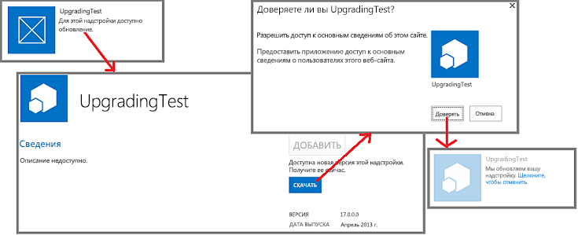
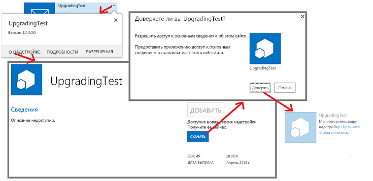

# Обновление надстроек для SharePoint
Узнайте, как создавать и развертывать обновления для Надстройка SharePoint.
Вы можете обновить свое Надстройка SharePoint, используя встроенные средства поддержки обновлений SharePoint 2013. В течение 24 часов после передачи обновленной версии надстройки в каталог надстроек организации или приема надстройки в Магазин Office рядом с надстройкой на странице **Контент сайта** каждого веб-сайта, на котором оно установлено, появится уведомление о доступном обновлении. Как видно на рисунке 1, пользователям предоставляется ссылка для мгновенной установки обновления.
  
    
    

**Рисунок 1. Процесс обновления надстройки SharePoint**

  
    
    

  
    
    

  
    
    
Пользователь может установить обновление, не удаляя предыдущую версию. Инфраструктура обновления проверяет установку обновления и выполняет ее откат в случае каких-либо ошибок.
    
> [!Важно!]
>  *Тип надстройки*  невозможно изменить с помощью системы обновления. Например нельзя заменить надстройку с размещением в SharePoint на надстройку с размещением у поставщика, используя обновление. Чтобы сделать подобное изменение, необходимо [перейти со старой надстройки на новую](sharepoint-add-ins-update-process.md#Major). В частности, так как  [действие программы по ознакомлению с автоматически размещаемыми надстройками прекращено](http://blogs.office.com/2014/05/16/update-on-autohosted-apps-preview-program/), помните, что невозможно обновить надстройку с автоматическим размещением до надстройки с размещением у поставщика. Следует преобразовать надстройку, как описано в статье  [Преобразование надстройки для SharePoint с автоматическим размещением в надстройку с размещением у поставщика](convert-an-autohosted-sharepoint-add-in-to-a-provider-hosted-add-in.md). 
  
    
    

## Предварительные требования для обновления надстройки SharePoint

  
    
    

- Тестовая установка SharePoint 2013, которая поддерживает изоляцию. Указания по настройке Сайт разработчиков Office 365 см. в статье  [Настройка среды для разработки надстроек SharePoint в Office 365](set-up-a-development-environment-for-sharepoint-add-ins-on-office-365.md).
    
  
- Средства, используемые при создании Надстройка SharePoint, обычно также используются для его обновления. Например, многие разработчики используют Visual Studio и Инструменты разработчика Microsoft Office для Visual Studio для создания Надстройки SharePoint.
    
  

### Основные понятия, которые необходимо знать при обновлении надстройки SharePoint

  
    
    

**Таблица 1. Основные понятия обновления надстроек SharePoint**

|**Название статьи**|**Описание**|
|:-----|:-----|
| [Выбор шаблонов для разработки и размещения надстройки SharePoint](choose-patterns-for-developing-and-hosting-your-sharepoint-add-in.md)   |Сведения о различных типах Надстройки SharePoint. Процесс обновления разнится в зависимости от типа.    |
| [Процедура обновления надстроек для SharePoint](sharepoint-add-ins-update-process.md)   |Описание процесса обновления Надстройки SharePoint.    |
| [Обновление компонентов](http://msdn.microsoft.com/library/e917f709-6491-4d50-adbe-2ab8f35da990%28Office.15%29.aspx)   |Инструкции по обновлению компонентов (Пакет SDK для SharePoint 2010).    |
| [Развертывание и установка надстроек для SharePoint: методы и параметры](deploying-and-installing-sharepoint-add-ins-methods-and-options.md)   |Сведения о методах публикации, установки и удаления Надстройка SharePoint.    |
| [Обработка событий в надстройках SharePoint](handle-events-in-sharepoint-add-ins.md)   |Сведения о приемниках удаленных событий в SharePoint 2013.    |
   

## Основные действия при обновлении надстройки

Ниже описаны основные действия, которые может понадобиться выполнить при создании обновления для Надстройка SharePoint. Каждое действие подробно обсуждается в разделах статьи, на которые можно перейти по ссылкам. Не все они являются обязательными в каждом проекте обновления. Необходимые действия зависят от того, какие компоненты уже содержатся в надстройке и какие необходимо добавить. Обязательными являются только элементы, отмеченные знаком *****.
  
    
    

- Обновите манифест надстройки.
    
  - ***** Увеличьте номер **Version** в элементе [App](http://msdn.microsoft.com/library/d5f30dfe-7500-5f85-0f08-f4f220c0c692%28Office.15%29.aspx) файла appmanifest.xml. (В первоначальном выпуске схемы надстройки назывались "приложениями".) *Не*  изменяйте номер **ProductID**.
    
  
  - Измените раздел  [AppPermissionRequests](http://msdn.microsoft.com/library/4e617622-78d3-3d23-677d-9957eb1fb107%28Office.15%29.aspx) файла appmanifest.xml.
    
  
  - Измените раздел  [AppPrerequisites](http://msdn.microsoft.com/library/7622b55f-01a1-2c39-9daa-7cfb1a3c890f%28Office.15%29.aspx) файла appmanifest.xml.
    
  

    Дополнительные сведения см. в статье  [Обновление версии надстройки, запросов разрешений и необходимых условий](#UpdateManifest).
    
  
- Добавьте или обновите разметку для компонентов сайта надстройки. Дополнительные сведения см. в статье  [Обновление веб-компонентов надстройки в SharePoint 2013](update-add-in-web-components-in-sharepoint-2013.md).
    
  
- Добавьте или обновите разметку для компонентов хост-сайта. Подробнее см. в статье  [Обновление веб-компонентов узла в SharePoint 2013](update-host-web-components-in-sharepoint-2013.md).
    
  
- Добавьте настраиваемую логику в  [UpgradedEventEndpoint](http://msdn.microsoft.com/library/09a93d44-d295-47bb-f91c-d243178b0f53%28Office.15%29.aspx) и зарегистрируйте ее в файле appmanifest.xml. Подробнее см. в статье [Создание обработчика для события обновления в надстройках для SharePoint](create-a-handler-for-the-update-event-in-sharepoint-add-ins.md).
    
  
- Обновите удаленные компоненты.
    
  - Для надстройки, размещаемой у поставщика, обновите удаленные компоненты с помощью методов, подходящих для стека платформы размещения.
    
  

    Дополнительные сведения см. в статье  [Обновление удаленных компонентов в надстройках для SharePoint](update-remote-components-in-sharepoint-add-ins.md).
    
  
- ***** Отправьте пакет надстройки в Магазин Office или каталог надстроек организации.
    
  

## Рекомендации по обновлению надстроек

В следующих разделах рассматриваются процедуры, которым нужно следовать, и важные вопросы, на которые следует обратить внимание при планировании обновления.
  
    
    

### Определение необходимости обновления

Улучшить Надстройка SharePoint с размещением у поставщика можно и без ее обновления. Если изменения касаются только удаленных компонентов и не должны отражаться на компонентах SharePoint, можно изменить удаленные компоненты, не обновляя надстройку. Если не изменяются URL-адреса и строки подключения, используемые компонентами SharePoint для доступа к удаленным компонентам, Надстройка SharePoint будет продолжать работать. Допустим, вы добавили кнопку в удаленное веб-приложение, которое читает столбец из списка SharePoint, который ранее не был прочтен веб-приложением. Если столбец уже существует в списке, вам не нужно ничего менять в SharePoint. Вы можете загрузить измененную веб-страницу, измененный код или JavaScript в удаленное веб-приложение. Новые функции мгновенно станут доступны пользователям при запуске Надстройка SharePoint.
  
    
    

### Необязательное обновление для пользователей

Когда новая версия Надстройка SharePoint становится доступна в Магазин Office или каталоге надстроек организации, на плитке надстройки на странице **Содержимое сайта** для пользователей отображается сообщение о доступном обновлении. Оно появляется в течение 24 часов. Но инфраструктура SharePoint не принуждает пользователей к обновлению. Поэтому изменения, которые вы вносите в удаленные компоненты, не должны нарушать работу предыдущих версий надстройки. Общее, но не универсальное, правило гласит, что следует *добавлять*  новое в удаленные компоненты, но избегать удаления, переименования, перемещения или изменения схемы, строки подключения или URL-адреса существующих компонентов.
  
    
    
Если удаленному компоненту необходимо знать версию экземпляра надстройки, который его вызывает, вы можете отправить эти сведения из SharePoint. Например, можно добавить версию надстройки как параметр запроса в URL-адресе  [начальной страницы](http://msdn.microsoft.com/library/3092674c-a6c3-9021-3d7e-e716562a4a4f%28Office.15%29.aspx) приложения.
  
    
    

### Создание и отладка новой версии в качестве новой надстройки

Следует отделять разработку и отладку новой версии надстройки от отладки разметки и логики обновления. Для этого удалите предыдущую версию надстройки из тестового сайта SharePoint для разработки. Сохраните резервную копию файла пакета надстройки для предыдущей версии. Необходимым образом добавьте и измените компоненты надстройки, а затем проверьте и отладьте их с использованием тестового сайта, как будто это новая надстройка, созданная с нуля.
  
    
    

### Тестирование обновления с каждой предыдущей версией надстройки

Когда вы убедитесь, что новая версия надстройки правильно работает в качестве новой надстройки, измените код и разметку таким образом, чтобы проект являлся обновлением старой надстройки. Например, увеличьте номер версии надстройки, как указано в статье  [Основные действия при обновлении надстройки](#MajorAppUpgradeSteps). Дополнительные сведения о преобразовании проекта в обновление см. в разделах этой статьи.
  
    
    
Когда вы будете готовы проверить свое обновление, отзовите новую версию из тестового сайта и повторно разверните предыдущую версию, чтобы иметь возможность проверить логику обновления. Если вы предоставили много предыдущих версий надстройки, установите каждую предыдущую версию на отдельный дочерний сайт тестового сайта. Затем передайте последнюю версию надстройки в каталог надстроек тестового сайта и обновите каждый экземпляр надстройки. Убедитесь, что каждый из них имеет последний номер версии надстройки и версии всех компонентов. Если в надстройке используется сайт надстройки, убедитесь, что его компоненты развернуты соответственно процедуре, описанной в статье  [Проверка развертывания компонентов сайта надстройки](update-add-in-web-components-in-sharepoint-2013.md#VerifyDeployAppWebComp).
  
    
    

### Обновление надстройки без необходимости ожидать 24 часа

При разработке обновления для надстройки на тестовом сайте SharePoint нет смысла ждать 24 часа между обновлениями. Вы (и пользователи производственного сайта SharePoint) можете обновить надстройку мгновенно после ее отправки в Магазин Office или каталог надстроек организации, выполнив указанные ниже действия.
  
    
    

### Мгновенное обновление надстройки

1. После того как последнее обновление будет загружено в каталог надстроек, откройте страницу **Контент сайта** на веб-сайте, на котором установлена надстройка, и нажмите кнопку **...** на плитке надстройки.
    
  
2. В появившейся выноске выберите вкладку **О программе**. На открывшейся странице **О программе** вы увидите сообщение о доступности новой версии.
    
  
3. Нажмите кнопку **Получить**. Снова откроется страница **Контент сайта**, и на плитке надстройки появится сообщение о выполнении обновления.
    
  
На рисунке 2 проиллюстрированы эти действия.
  
    
    

**Рисунок 2. Процесс мгновенного обновления надстройки SharePoint**

  
    
    

  
    
    

  
    
    

    
> [!Примечание]
> Чтобы сообщение о доступности обновления на плитке надстройки отображалось чаще, чем каждые 24 часа, вы можете использовать метод, описанный в статье  [Процесс обновления надстройки SharePoint](sharepoint-add-ins-update-process.md#Minor), чтобы оно появлялось мгновенно. 
  
    
    

## Обновление версии надстройки, запросов разрешений и необходимых условий

Создав резервную копию папки проекта Visual Studio, откройте проект надстройки. Откройте манифест надстройки и на вкладке **Общие** конструктора манифеста увеличьте номер версии.
  
    
    
Если обновленной версии надстройки требуется больше (или меньше) разрешений для компонентов хост-сайта, внесите необходимые изменения в раздел надстройки  [AppPermissionRequests](http://msdn.microsoft.com/library/4e617622-78d3-3d23-677d-9957eb1fb107%28Office.15%29.aspx). В Visual Studio используйте вкладку **Разрешения** конструктора манифеста. После обновления надстройки пользователь будет видеть подсказки с предложением предоставить разрешения, независимо от того, изменились ли разрешения по сравнению с предыдущей версией. Если в новой версии требуется *меньше*  разрешений по сравнению с предыдущей, дополнительные разрешения, имеющиеся в предыдущей версии, *не отзываются*  . Чтобы использовать в надстройке только те разрешения, которые предусмотрены в последней версии, необходимо после обновления надстройки перейти на страницу *{SharePointDomain}*  `/_layouts/15/appinv.aspx`, а затем вручную задать разрешения, соответствующие схеме  [AppPermissionRequests](http://msdn.microsoft.com/library/4e617622-78d3-3d23-677d-9957eb1fb107%28Office.15%29.aspx).
  
    
    
Если обновленной версии надстройки требуются определенные компоненты, которых не было в предыдущей версии (или отсутствуют компоненты, которые использовались в предыдущей версии), внесите необходимые изменения в раздел надстройки  [AppPrerequisites](http://msdn.microsoft.com/library/7622b55f-01a1-2c39-9daa-7cfb1a3c890f%28Office.15%29.aspx). В Visual Studio откройте вкладку **Необходимые компоненты** в конструкторе манифеста.
  
    
    

## Дальнейшие действия

Перейдите к следующему пункту раздела  [Основные действия при обновлении надстройки](#MajorAppUpgradeSteps) или непосредственно к одной из следующих статей:
  
    
    

-  [Обновление веб-компонентов надстройки в SharePoint 2013](update-add-in-web-components-in-sharepoint-2013.md)
    
  
-  [Обновление веб-компонентов узла в SharePoint 2013](update-host-web-components-in-sharepoint-2013.md)
    
  
-  [Создание обработчика для события обновления в надстройках для SharePoint](create-a-handler-for-the-update-event-in-sharepoint-add-ins.md)
    
  
-  [Обновление удаленных компонентов в надстройках для SharePoint](update-remote-components-in-sharepoint-add-ins.md)
    
  

## Дополнительные ресурсы

-  [Разработка надстроек для SharePoint](develop-sharepoint-add-ins.md)
    
  
-  [Процедура обновления надстроек для SharePoint](sharepoint-add-ins-update-process.md)
    
  

