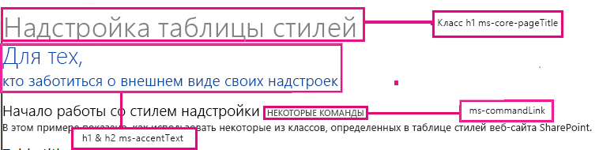
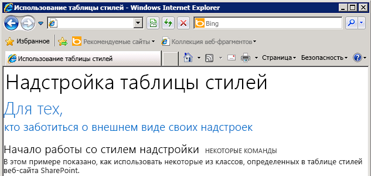

# Использование таблицы стилей веб-сайта SharePoint в надстройках для SharePoint
Узнайте, как использовать таблицу стилей веб-сайта SharePoint в надстройке SharePoint.
Вы можете добавить ссылку на таблицу стилей веб-сайта SharePoint в надстройку SharePoint и оформлять веб-страницы с помощью таблицы стилей в SharePoint. Кроме того, если таблица стилей или тема веб-сайта SharePoint изменится, то вы сможете применить новый набор стилей, не изменяя ссылку на таблицу стилей в надстройке.
  
    
    


> **Важно!**
> Если на ваших веб-страницах используется элемент управления хрома или эталонная страница надстройки, стили уже доступны, и ссылаться на таблицу стилей вручную, используя инструкции из этой статьи, не требуется. 
  
    
    


## Необходимые условия для использования примеров в этой статье
<a name="SP15Usestylesheetcontrol_Prereq"> </a>

Вам необходима среда разработки, как описано в статье  [Знакомство с созданием надстроек SharePoint с размещением у поставщика](get-started-creating-provider-hosted-sharepoint-add-ins.md).
  
    
    

### Основные понятия, с которыми необходимо ознакомиться перед использованием таблицы стилей SharePoint в надстройке SharePoint

В следующей таблице приведены полезные статьи о концепциях применения таблицы стилей SharePoint.
  
    
    

**Таблица 1. Основные концепции применения таблицы стилей**


|**Название статьи**|**Описание**|
|:-----|:-----|
| [Надстройки SharePoint](sharepoint-add-ins.md) <br/> |Изучите новую модель надстроек в SharePoint, позволяющую создавать небольшие и удобные в использовании решения для конечных пользователей.  <br/> |
| [Проектирование пользовательского интерфейса для надстроек SharePoint](ux-design-for-sharepoint-add-ins.md) <br/> |Ознакомьтесь с параметрами и вариантами построения пользовательского интерфейса при создании Надстройки SharePoint.  <br/> |
| [Хост-сайты, сайты надстроек и компоненты SharePoint в SharePoint 2013](host-webs-add-in-webs-and-sharepoint-components-in-sharepoint-2013.md) <br/> |Узнайте, в чем разница между хост-сайтами и сайтами надстроек. Узнайте, какие компоненты SharePoint можно включить в Надстройка SharePoint, какие компоненты можно развернуть на хост-сайтах, а какие — на сайтах надстроек, а также узнайте, как развертывать сайты надстроек в изолированном домене.  <br/> |
   

## Пример кода: использование таблицы стилей веб-сайта SharePoint в надстройке SharePoint
<a name="SP15Usestylesheetcontrol_Example"> </a>

В этом примере кода показано, как использовать таблицу стилей веб-сайта SharePoint. Это позволит сделать страницы удаленного веб-приложения похожими на страницы хост-сайта SharePoint.
  
    
    
Чтобы применить таблицу стилей в надстройке SharePoint, сделайте следующее:
  
    
    

1. Создайте надстройку SharePoint с размещением у поставщика. 
    
  
2. Подготовьте сайт надстройки, создав пустую страницу.
    
  
3. Добавьте в веб-проект страницу со ссылкой на таблицу стилей.
    
  
4. Измените элемент в манифесте надстройки.
    
  
На рис. 1 показана веб-страница SharePoint с использованием таблицы стилей.
  
    
    

**Рис. 1. Веб-страница с использованием таблицы стилей**

  
    
    

  
    
    

  
    
    

### Чтобы создать надстройку SharePoint и удаленные веб-проекты, сделайте следующее:


1. Откройте Visual Studio как администратор. (Для этого щелкните правой кнопкой значок Visual Studio в меню **Пуск** и выберите команду **Запуск от имени администратора**.)
    
  
2. Создайте надстройку SharePoint с размещением у поставщика, как описано в статье  [Знакомство с созданием надстроек SharePoint с размещением у поставщика](get-started-creating-provider-hosted-sharepoint-add-ins.md), и назовите ее StylesheetAdd-in.
    
  

### Подготовка сайта надстройки путем создания пустой страницы


1. Щелкните правой кнопкой мыши проект Надстройка SharePoint и добавьте новый модуль.
    
  
2. Щелкните правой кнопкой мыши новый модуль и добавьте новый элемент.
    
  
3. В разделе **Элементы Visual C#**, **Интернет** выберите пункт **HTML-страница**. Переименуйте страницу в **blank.html**.
    
  
4. Удалите содержимое blank.html.
    
  

### Чтобы добавить веб-страницу со ссылками на таблицу стилей в веб-проекте, выполните следующие действия


1. Щелкните правой кнопкой мыши веб-проект и добавьте новую веб-форму. Переименуйте ее в **StyleConsumer.aspx**.
    
  
2. Замените содержимое Web Form.aspx следующим кодом, который выполняет перечисленные далее задачи.
    
  - Загружает страницу blank.html с сайта надстройки в невидимом фрейме IFrame.
    
  
  - Загружает файл defaultcss.ashx с сайта надстройки.
    
  
  - Использует доступные стили.
    
  

 ```
  
<%@ Page Language="C#" AutoEventWireup="true" CodeBehind="StyleConsumer.aspx.cs" Inherits="StylesheetAppWeb.StyleConsumer" %>

<!DOCTYPE html>
<html>
<head>
    <title>Add-in using stylesheet</title>
</head>
<body>

    <!-- The main page title -->
    <h1 class="ms-core-pageTitle">Stylesheet add-in</h1>

    <!-- Some subtitle -->
    <h1 class="ms-accentText">For people</h1>

    <!-- Subtitle comments -->
    <h2 class="ms-accentText">who care about the style in their add-ins</h2>
    <p></p>
    <div>
        <h2 class="ms-webpart-titleText">Get started with style in your add-in... </h2>
        <a class="ms-commandLink" href="#">some command</a>
        <br />
        This sample shows you how to use some of the classes defined in the SharePoint website's style sheet.
    </div>

    <!-- Script to load SharePoint resources
        and load the blank.html page in
        the invisible iframe
        -->
    <script type="text/javascript">
        "use strict";
        var appweburl;

        (function () {
            var ctag;

            // Get the URI decoded add-in web URL.
            appweburl =
                decodeURIComponent(
                    getQueryStringParameter("SPAppWebUrl")
            );
            // Get the ctag from the SPClientTag token.
            ctag =
                decodeURIComponent(
                    getQueryStringParameter("SPClientTag")
            );

            // The resource files are in a URL in the form:
            // web_url/_layouts/15/Resource.ashx
            var scriptbase = appweburl + "/_layouts/15/";

            // Dynamically create the invisible iframe.
            var blankiframe;
            var blankurl;
            var body;
            blankurl = appweburl + "/Pages/blank.html";
            blankiframe = document.createElement("iframe");
            blankiframe.setAttribute("src", blankurl);
            blankiframe.setAttribute("style", "display: none");
            body = document.getElementsByTagName("body");
            body[0].appendChild(blankiframe);

            // Dynamically create the link element.
            var dclink;
            var head;
            dclink = document.createElement("link");
            dclink.setAttribute("rel", "stylesheet");
            dclink.setAttribute("href", scriptbase + "defaultcss.ashx?ctag=" + ctag);
            head = document.getElementsByTagName("head");
            head[0].appendChild(dclink);
        })();

        // Function to retrieve a query string value.
        // For production purposes you may want to use
        //  a library to handle the query string.
        function getQueryStringParameter(paramToRetrieve) {
            var params;
            var strParams;

            params = document.URL.split("?")[1].split("&amp;");
            strParams = "";
            for (var i = 0; i < params.length; i = i + 1) {
                var singleParam = params[i].split("=");
                if (singleParam[0] == paramToRetrieve)
                    return singleParam[1];
            }
        }
    </script>
</body>
</html>

 ```


    В некоторых случаях пользователь должен пройти проверку подлинности в SharePoint, прежде чем страница сможет скачать CSS и изображения стилей. Теги ссылок не обеспечивают автоматическую проверку подлинности пользователя, который не вошел в систему. Советуем загружать ресурс страницы с сайта надстройки для обязательной проверки подлинности перед предоставлением ссылки на CSS-файл. В этом примере страница blank.html загружается в невидимом фрейме IFrame.
    
  

### Изменение элемента StartPage в манифесте надстройки


1. Дважды щелкните файл **AppManifest.xml** в **обозревателе решений**.
    
  
2. В раскрывающемся меню **Начальная страница** выберите веб-страницу, использующую таблицу стилей.
    
  

### Чтобы построить и запустить решение, выполните следующие действия:


1. Убедитесь, что проект Надстройка SharePoint выбран как запускаемый проект.
    
  
2. Нажмите клавишу F5.
    
    > **Примечание**
      > Когда вы нажимаете клавишу F5, Visual Studio выполняет построение решения, разворачивает надстройку и открывает страницу разрешений для надстройки. 
3. Нажмите кнопку **Trust It (Доверять)**.
    
  
4. Щелкните значок надстройки **StylesheetBasic**.
    
  
5. На рис. 2 показана готовая веб-страница, использующая стили SharePoint.
    
   **Рис. 2. Таблица стилей, используемая на странице**

  

     
  

  

  
6. Вы также можете перейти на хост-сайт и изменить тему. Затем обновите веб-страницу надстройки, чтобы использовать новые стили.
    
  

**Таблица 2. Устранение неполадок решения**


|**Проблема**|**Решение**|
|:-----|:-----|
|Visual Studio не открывается браузер после нажатия клавиши F5.  <br/> |Установите проект Надстройка SharePoint в качестве запускаемого.  <br/> |
|Ошибка сертификата.  <br/> |Задайте свойство **SSL включено** веб-проекта равным "false". В проекте Надстройка SharePoint задайте свойство **Веб-проект** равнымNone, а затем верните в свойстве имя своего веб-проекта.  <br/> |
   

## Дальнейшие действия
<a name="SP15Usestylesheetcontrol_Nextsteps"> </a>

В этой статье показано, как использовать таблицу стилей в надстройке SharePoint. Далее вы можете узнать о других компонентах UX, доступных для надстроек SharePoint. Дополнительные сведения см. в следующих источниках:
  
    
    

-  [Пример кода: использование таблицы стилей SharePoint в надстройке](http://code.msdn.microsoft.com/SharePoint-2013-Use-the-7a8684e2)
    
  
-  [Использование клиентского элемента управления хрома в надстройках для SharePoint](use-the-client-chrome-control-in-sharepoint-add-ins.md)
    
  
-  [Выполнение пользовательских действий для развертывания надстроек для SharePoint](create-custom-actions-to-deploy-with-sharepoint-add-ins.md)
    
  
-  [Создание веб-частей надстройки для установки совместно с надстройкой для SharePoint](create-add-in-parts-to-install-with-your-sharepoint-add-in.md)
    
  

## Дополнительные ресурсы
<a name="SP15Usestylesheetcontrol_Addresources"> </a>


-  [Проектирование пользовательского интерфейса для надстроек SharePoint](ux-design-for-sharepoint-add-ins.md)
    
  
-  [Рекомендации по UX design для надстроек для SharePoint](sharepoint-add-ins-ux-design-guidelines.md)
    
  
-  [Создание компонентов UX в SharePoint 2013](create-ux-components-in-sharepoint-2013.md)
    
  
-  [Существует три способа рассмотрения возможностей проектирования надстроек SharePoint](three-ways-to-think-about-design-options-for-sharepoint-add-ins.md)
    
  
-  [Важные аспекты архитектуры и разработки надстройки SharePoint](important-aspects-of-the-sharepoint-add-in-architecture-and-development-landscap.md)
    
  

