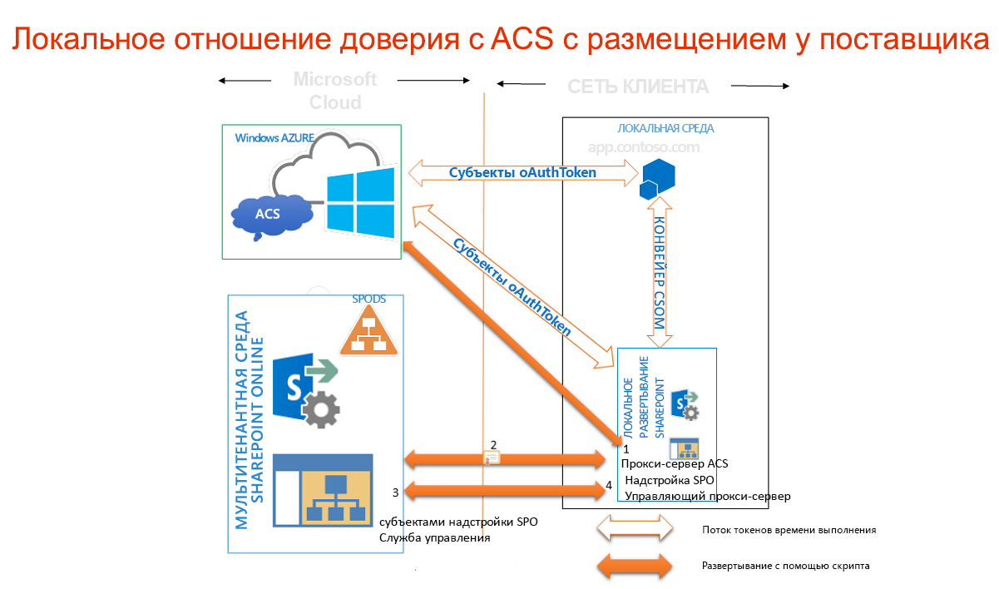

# Использование сайта Office 365 SharePoint для авторизации размещенных у поставщика надстроек на локальном сайте SharePoint
В этой статье описывается использование сайта Office 365 SharePoint для создания среды, в которой можно применять службу контроля доступа для установления отношения доверия между надстройкой с размещением у поставщика и в локальной ферме SharePoint 2013, как при разработке надстроек для сайта Office 365 SharePoint.
## Необходимые условия для использования службы контроля доступа и надстроек с размещением у поставщика в локальных средах
<a name="Prerequisites"> </a>

Проверьте, имеется ли в наличии все указанное ниже.
  
    
    

- Локальная среда разработки SharePoint 2013. См. статью  [Настройка локальной среды разработки надстроек SharePoint](set-up-an-on-premises-development-environment-for-sharepoint-add-ins.md).
    
  
- Сайт Office 365 SharePoint. Если у вас его еще нет и вы хотите быстро настроить среду разработки, вы можете  [Настройка среды для разработки надстроек SharePoint в Office 365](set-up-a-development-environment-for-sharepoint-add-ins-on-office-365.md).
    
  
-  [Среда Visual Studio 2012](https://www.microsoft.com/ru-ru/download/details.aspx?id=30682), установленная удаленно или на компьютере с SharePoint 2013.
    
  
-  [Инструменты разработчика Microsoft Office для Visual Studio 2012](https://msdn.microsoft.com/ru-ru/office/aa905340.aspx).
    
  
- 64-разрядный выпуск  [помощника по входу в Microsoft Online Services](http://www.microsoft.com/ru-ru/download/details.aspx?id=41950), установленный на компьютере с SharePoint 2013.
    
  
-  [Модуль Microsoft Online Services для Windows PowerShell (64-разрядный выпуск)](http://go.microsoft.com/fwlink/p/?linkid=236297), установленный на компьютере с SharePoint 2013.
    
  

## Создайте сертификат и сделайте его сертификатом службы маркеров безопасности (STS) своей локальной установки SharePoint 2013
<a name="Certificate"> </a>

Вам понадобится заменить выбранный по умолчанию сертификат службы маркеров безопасности (STS) своей локальной установки SharePoint 2013 на собственный сертификат. В этой статье приводится пример создания тестового сертификата и его экспорта с помощью команды **Создать самозаверяющий сертификат** в IIS. Можно также использовать коммерческий сертификат, выпущенный центром сертификации.
  
    
    
 [Сначала создайте файл сертификата test.pfx, а затем соответствующий файл test.cer](http://msdn.microsoft.com/ru-ru/library/windows/hardware/ff552299%28v=vs.85%29.aspx).
  
    
    
 [Можно также создать тестовый сертификат X.509 с помощью тестовой программы MakeCert ](http://msdn.microsoft.com/ru-ru/library/ms537364%28VS.85%29.aspx).
  
    
    

### Создание тестового PFX-файла сертификата


1. В диспетчере IIS в дереве слева выберите узел  _"Имя сервера"_.
    
  
2. Выберите **Сертификаты сервера**, как показано на рисунке 1.
    
   **Рисунок 1. Элемент "Сертификаты сервера" в IIS**

  

     
  

  

  
3. В наборе ссылок справа выберите ссылку **Создать самозаверяющий сертификат**, показанную на рисунке 2.
    
   **Рисунок 2. Ссылка "Создать самозаверяющий сертификат"**

  

     
  

  

  
4. Задайте для сертификата имя SampleCert и нажмите кнопку **ОК**.
    
  
5. Щелкните сертификат правой кнопкой мыши и выберите команду **Экспорт**, как показано на рисунке 3.
    
   **Рисунок 3. Экспорт тестового сертификата**

  

     
  

  

  
6. Экспортируйте файл в выбранное расположение и создайте для него пароль. В этом примере используется пароль **пароль**. В рабочей среде следует использовать надежный пароль. См. статьи [Рекомендации по созданию надежных паролей](http://msdn.microsoft.com/ru-ru/library/bb416446.aspx) и [Надежные пароли](http://msdn.microsoft.com/ru-ru/library/ms161962.aspx).
    
  

## Назначение своего сертификата сертификатом STS для локальной установки SharePoint 2013
<a name="STSCertificate"> </a>

Теперь, когда у вас есть сертификат, сделайте его сертификатом STS для своей локальной фермы SharePoint.
  
    
    
Откройте Командная консоль SharePoint от имени администратора и запустите этот сценарий Windows PowerShell.
  
    
    


```

$certPrKPath = "c:\\location of your .pfx file"
$certPassword = "password"
$stsCertificate = New-Object System.Security.Cryptography.X509Certificates.X509Certificate2 $certPrKPath, $certPassword, 20
Set-SPSecurityTokenServiceConfig -ImportSigningCertificate $stsCertificate -confirm:$false

```


> [!Примечание]
> В документе  [Настройка односторонней гибридной среды с SharePoint Server 2013 и Office 365](http://download.microsoft.com/download/6/4/4/644BA525-96CB-4739-B08F-18949A9BDADC/sps-2013-config-one-way-hybrid-environment.docx), который можно скачать на  [странице гибридных ресурсов SharePoint 2013](http://www.microsoft.com/ru-ru/download/details.aspx?id=35593), подробнее объясняется, как заменить сертификат STS по умолчанию, расположенный в локальной ферме, на сертификат из известного центра сертификации или самозаверяющий сертификат. 
  
    
    


## Настройка локальной установки SharePoint 2013 для использования службы контроля доступа
<a name="ConnectAAD"> </a>

На рисунке 4 показаны четыре шага, позволяющие разрешить необходимые соединения в рамках всей архитектуры надстройки с размещением у поставщика, которое запускается на локальном сайте. На нем также показаны потоки маркеров OAuth при выполнении надстройки.
  
    
    

**Рисунок 4. Работа службы контроля доступа с локальной установкой SharePoint при использовании сайта Office 365 SharePoint**

  
    
    

  
    
    

  
    
    

  
    
    

1. Создайте прокси-сервер службы контроля доступа в локальной ферме SharePoint 2013.
    
  
2. Установите сертификат подписи своего локального сервера на правах аренды Office 365.
    
  
3. Добавьте полные доменные имена сайтов на своей ферме SharePoint 2013, на которой нужно запускать надстройки, в коллекцию имен субъектов-служб в аренде Office 365.
    
  
4. Создайте прокси-сервер управления надстройками на своей ферме SharePoint 2013.
    
  
Представленная ниже функция выполняет всю настройку локального сайта SharePoint 2013, необходимую для использования службы контроля доступа. С помощью этой функции можно также выполнять действия для удаления предыдущих конфигураций. Запускать функцию PowerShell можно многими способами. Ниже описан один из них.
  
    
    

  
    
    

1. На локальном сервере SharePoint скопируйте код из функции в текстовый файл и сохраните его под именем MySharePointFunctions.psm1 в одну из следующих папок (но не в обе). Возможно, понадобится создать части пути, если он содержит папки, которых еще не существует. Обратите внимание, что в обоих случаях папка, находящаяся на самом низком уровне пути, должна иметь то же имя, что и файл.
    
    > [!Совет]
      > Файл необходимо сохранить в формате ANSI, а не UTF-8. При загрузке файла в формате, отличном от ANSI, в PowerShell могут возникать ошибки синтаксиса. По умолчанию Windows NotePad сохраняет файлы в формате ANSI. Если для сохранения файла используется другой редактор, обязательно выберите формат ANSI. 

  -  `C:\\users\\username\\documents\\windowspowershell\\modules\\MySharePointFunctions`, где  _имя пользователя_ принадлежит администратору фермы, который будет запускать файл.
    
  
  -  `C:\\windows\\system32\\windowspowershell\\V1.0\\modules\\MySharePointFunctions`
    
  
2. Откройте Командная консоль SharePoint в качестве администратора и запустите следующий командлет, чтобы убедиться, что модуль MySharePointFunctions добавлен в список.
    
  ```
  
Get-Module -listavailable
  ```

3. Запустите следующий командлет, чтобы импортировать модуль.
    
  ```
  Import-Module MySharePointFunctions
  ```

4. Запустите следующий командлет, чтобы убедиться, что функция Connect-SPFarmToAAD входит в модуль.
    
  ```
  Get-Command -module MySharePointFunctions
  ```

5. Запустите следующий командлет, чтобы убедиться, что функция Connect-SPFarmToAAD загружена.
    
  ```
  ls function:\\ | where {$_.Name -eq "Connect-SPFarmToAAD"}
  ```

6. Запустите функцию  `Connect-SPFarmToAAD`. Обязательно укажите необходимые параметры и все дополнительные параметры, которые применяются к вашей среде разработки. Подробности и примеры см. в следующем разделе.
    
  

  
    
    

### Параметры функции Connect-SPFarmToAAD
<a name="parameters"> </a>


|**Параметр**|**Значение**|
|:-----|:-----|
| `-AADDomain` (обязательный) <br/> |Домен *.onmicrosoft.com, который вы создали при регистрации на своем сайте Office 365 ( _ваш_пользовательский_домен_.onmicrosoft.com). Когда появится запрос на проверку подлинности, укажите имя пользователя и пароль, которые вы создали для этого домена:  _имя пользователя_@ _ваш_пользовательский_домен_.onmicrosoft.com.  <br/> |
| `-SharePointOnlineUrl` (обязательный) <br/> |URL-адрес вашего сайта Office 365 SharePoint ( _https://yourcustomdomain_.sharepoint.com). Обратите внимание, что onmicrosoft.com  *не*  является родительским доменом. <br/> |
| `-SharePointWeb` (обязательный в некоторых случаях) <br/> |Полный URL-адрес (включая протокол) локального веб-приложения SharePoint, где вы будете запускать надстройки с размещением у поставщика. Эта функция добавляет только одно веб-приложение SharePoint из вашей локальной фермы в службу контроля доступа. Если вы не укажете для него значение, сценарий выберет первое веб-приложение на ферме. Если вы используете семейство веб-сайтов с именем узла, которое можно определить с помощью подстановочного знака (например,  _http://*.contoso.com_), эту строку можно использовать в качестве значения для этого параметра. Если в веб-приложении используется альтернативное сопоставление доступа для зоны Интернета, для этого параметра необходимо использовать его URL-адрес. Если веб-приложение SharePoint не настроено для протокола HTTPS, необходимо использовать протокол HTTP и  *параметр командной строки -AllowOverHttp (см. ниже в этой таблице).*  <br/> Если вы хотите запускать размещаемые у поставщика надстройки, использующие службу контроля доступа, на других веб-приложениях в вашей ферме, их необходимо добавить в коллекцию имен субъектов-служб. Сценарий Windows PowerShell, приведенный в этой статье ниже (после функции  `Connect-SPFarmToAAD`), показывает, как добавить все веб-приложения фермы в коллекцию имен субъектов-служб.  <br/> |
| `-AllowOverHttp` (дополнительно) <br/> |Используйте этот параметр командной строки, если вы работаете со средой разработки и не хотите использовать SSL для своих надстроек. Его необходимо использовать, если веб-приложение SharePoint не настроено для протокола HTTPS.  <br/> |
| `-O365Credentials` (дополнительно) <br/> |Первый символ — это прописная буква "O", а не ноль. Если вам придется много раз запускать этот сценарий для выполнения отладки, используйте этот параметр командной строки, чтобы каждый раз не вводить свое имя для O365 и пароль вручную. Прежде чем использовать этот параметр, необходимо создать объект учетных данных, который вы назначите ему с помощью следующих командлетов:  <br/> ```$User = "username@yourcustomdomain.onmicrosoft.com"$PWord = ConvertTo-SecureString -String "the_password" -AsPlainText -Force$Credential = New-Object -TypeName System.Management.Automation.PSCredential -ArgumentList $User, $PWord```Задайте для параметра  `-O365Credentials` значение `$Credential`.  <br/> |
| `-Verbose` (дополнительно) <br/> |Этот параметр командной строки создает более подробный отчет, который может быть полезен, если функция не работает и нужно повторно запустить ее для отладки.  <br/> |
| `-RemoveExistingACS` (дополнительно) <br/> |Используйте этот параметр командной строки, если вы заменяете существующее подключение к Microsoft Azure Active Directory. Это приведет к замене существующего прокси-сервера службы контроля доступа, если он уже создан на вашей ферме.  <br/> |
| `-RemoveExistingSTS` (дополнительно) <br/> |Используйте этот параметр командной строки, если вы заменяете существующее подключение к Microsoft Azure Active Directory. Он удалит существующего издателя маркеров безопасности, который остался от предыдущего подключения к службе контроля доступа.  <br/> |
| `-RemoveExistingSPOProxy` (дополнительно) <br/> |Используйте этот параметр командной строки, если вы заменяете существующее подключение к Microsoft Azure Active Directory. Это приведет к замене существующего прокси-сервера управления надстройками, если он уже создан на вашей ферме.  <br/> |
| `-RemoveExistingAADCredentials` (дополнительно) <br/> |Используйте этот параметр командной строки, если вы заменяете сайт SharePoint в Office 365.  <br/> |
   
Ниже приведены примеры:
  
    
    

```

Connect-SPFarmToAAD -AADDomain 'MyO365Domain.onmicrosoft.com' -SharePointOnlineUrl https://MyO365Domain.sharepoint.com

Connect-SPFarmToAAD -AADDomain 'MyO365Domain.onmicrosoft.com' -SharePointOnlineUrl https://MyO365Domain.sharepoint.com -SharePointWeb https://fabrikam.com

Connect-SPFarmToAAD -AADDomain 'MyO365Domain.onmicrosoft.com' -SharePointOnlineUrl https://MyO365Domain.sharepoint.com -SharePointWeb http://northwind.com -AllowOverHttp

Connect-SPFarmToAAD -AADDomain 'MyO365Domain.onmicrosoft.com' -SharePointOnlineUrl https://MyO365Domain.sharepoint.com -SharePointWeb http://northwind.com -AllowOverHttp -RemoveExistingACS -RemoveExistingSTS -RemoveExistingSPOProxy -RemoveExistingAADCredentials

```


### Сценарий функции Connect-SPFarmToAAD
<a name="function"> </a>


```

function Connect-SPFarmToAAD {
param(
    [Parameter(Mandatory)][String]   $AADDomain,
    [Parameter(Mandatory)][String]   $SharePointOnlineUrl,
    #Specify this parameter if you don't want to use the default SPWeb returned
    [Parameter()][String]            $SharePointWeb,
    [Parameter()][System.Management.Automation.PSCredential] $O365Credentials,
    #Use these switches if you're replacing an existing connection to AAD.
    [Parameter()][Switch]            $RemoveExistingACS,
    [Parameter()][Switch]            $RemoveExistingSTS,
    [Parameter()][Switch]            $RemoveExistingSPOProxy,
    #Use this switch if you're replacing the Office 365 SharePoint site.
    [Parameter()][Switch]            $RemoveExistingAADCredentials,
    #Use this switch if you don't want to use SSL when you launch your app.
    [Parameter()][Switch]            $AllowOverHttp
)
    #Prompt for credentials right away.
    if (-not $O365Credentials) {
        $O365Credentials = Get-Credential -Message "Admin credentials for $AADDomain"
    }
    Add-PSSnapin Microsoft.SharePoint.PowerShell
    #Import the Microsoft Online Services Sign-In Assistant.
    Import-Module -Name MSOnline
    #Import the Microsoft Online Services Module for Windows Powershell.
    Import-Module MSOnlineExtended -force -verbose 
    #Set values for Constants.
    New-Variable -Option Constant -Name SP_APPPRINCIPALID -Value '00000003-0000-0ff1-ce00-000000000000' | Out-Null
    New-Variable -Option Constant -Name ACS_APPPRINCIPALID -Value '00000001-0000-0000-c000-000000000000' | Out-Null
    New-Variable -Option Constant -Name ACS_APPPROXY_NAME -Value ACS
    New-Variable -Option Constant -Name SPO_MANAGEMENT_APPPROXY_NAME -Value 'SPO Add-in Management Proxy'
    New-Variable -Option Constant -Name ACS_STS_NAME -Value ACS-STS
    New-Variable -Option Constant -Name AAD_METADATAEP_FSTRING -Value 'https://accounts.accesscontrol.windows.net/{0}/metadata/json/1'
    New-Variable -Option Constant -Name SP_METADATAEP_FSTRING -Value '{0}/_layouts/15/metadata/json/1'
    #Get the default SPWeb from the on-premises farm if no $SharePointWeb parameter is specified.
    if ([String]::IsNullOrEmpty($SharePointWeb)) {
        $SharePointWeb = Get-SPSite | Select-Object -First 1 | Get-SPWeb | Select-Object -First 1 | % Url
    }

    #Configure the realm ID for local farm so that it matches the AAD realm.
    $ACSMetadataEndpoint = $AAD_METADATAEP_FSTRING -f $AADDomain
    $ACSMetadata = Invoke-RestMethod -Uri $ACSMetadataEndpoint
    $AADRealmId = $ACSMetadata.realm

    Set-SPAuthenticationRealm -ServiceContext $SharePointWeb -Realm $AADRealmId
    
    $LocalSTS = Get-SPSecurityTokenServiceConfig
    $LocalSTS.NameIdentifier = '{0}@{1}' -f $SP_APPPRINCIPALID,$AADRealmId
    $LocalSTS.Update()

    #Allow connections over HTTP if the switch is specified.
    if ($AllowOverHttp.IsPresent -and $AllowOverHttp -eq $True) {
        $serviceConfig = Get-SPSecurityTokenServiceConfig
        $serviceConfig.AllowOAuthOverHttp = $true
        $serviceConfig.AllowMetadataOverHttp = $true
        $serviceConfig.Update()
    }

    #Step 1: Set up the ACS proxy in the on-premises SharePoint farm. Remove the existing ACS proxy
    #if the switch is specified.
    if ($RemoveExistingACS.IsPresent -and $RemoveExistingACS -eq $True) {
        Get-SPServiceApplicationProxy | ? DisplayName -EQ $ACS_APPPROXY_NAME | Remove-SPServiceApplicationProxy -RemoveData -Confirm:$false
    }
    if (-not (Get-SPServiceApplicationProxy | ? DisplayName -EQ $ACS_APPPROXY_NAME)) {
        $AzureACSProxy = New-SPAzureAccessControlServiceApplicationProxy -Name $ACS_APPPROXY_NAME -MetadataServiceEndpointUri $ACSMetadataEndpoint -DefaultProxyGroup
    }

    #Remove the existing security token service if the switch is specified.
    if ($RemoveExistingSTS.IsPresent) {
        Get-SPTrustedSecurityTokenIssuer | ? Name -EQ $ACS_STS_NAME | Remove-SPTrustedSecurityTokenIssuer -Confirm:$false
    }
    if (-not (Get-SPTrustedSecurityTokenIssuer | ? DisplayName -EQ $ACS_STS_NAME)) {
        $AzureACSSTS = New-SPTrustedSecurityTokenIssuer -Name $ACS_STS_NAME -IsTrustBroker -MetadataEndPoint $ACSMetadataEndpoint
    }

    #Update the ACS Proxy for OAuth authentication.
    $ACSProxy = Get-SPServiceApplicationProxy | ? Name -EQ $ACS_APPPROXY_NAME
    $ACSProxy.DiscoveryConfiguration.SecurityTokenServiceName = $ACS_APPPRINCIPALID
    $ACSProxy.Update()

    #Retrieve the local STS signing key from JSON metadata.
    $SPMetadata = Invoke-RestMethod -Uri ($SP_METADATAEP_FSTRING -f $SharePointWeb)
    $SPSigningKey = $SPMetadata.keys | ? usage -EQ "Signing" | % keyValue
    $CertValue = $SPSigningKey.value
    
    #Connect to Office 365.
    Connect-MsolService -Credential $O365Credentials
    #Remove existing connection to an Office 365 SharePoint site if the switch is specified.
    if ($RemoveExistingAADCredentials.IsPresent -and $RemoveExistingAADCredentials -eq $true) {
        $msolserviceprincipal = Get-MsolServicePrincipal -AppPrincipalId $SP_APPPRINCIPALID
        [Guid[]] $ExistingKeyIds = Get-MsolServicePrincipalCredential -ObjectId $msolserviceprincipal.ObjectId -ReturnKeyValues $false | % {if ($_.Type -ne "Other") {$_.KeyId}}
        Remove-MsolServicePrincipalCredential -AppPrincipalId $SP_APPPRINCIPALID -KeyIds $ExistingKeyIds
    }
    #Step 2: Upload the local STS signing certificate
    New-MsolServicePrincipalCredential -AppPrincipalId $SP_APPPRINCIPALID -Type Asymmetric -Value $CertValue -Usage Verify

    #Step 3: Add the service principal name of the local web application, if necessary.
    $indexHostName = $SharePointWeb.IndexOf('://') + 3
    $HostName = $SharePointWeb.Substring($indexHostName)
    $NewSPN = '{0}/{1}' -f $SP_APPPRINCIPALID, $HostName
    $SPAppPrincipal = Get-MsolServicePrincipal -AppPrincipalId $SP_APPPRINCIPALID
    if ($SPAppPrincipal.ServicePrincipalNames -notcontains $NewSPN) {
        $SPAppPrincipal.ServicePrincipalNames.Add($NewSPN)
        Set-MsolServicePrincipal -AppPrincipalId $SPAppPrincipal.AppPrincipalId -ServicePrincipalNames $SPAppPrincipal.ServicePrincipalNames
    }

    #Remove the existing SharePoint Online proxy if the switch is specified.
    if ($RemoveExistingSPOProxy.IsPresent -and $RemoveExistingSPOProxy -eq $True) {
        Get-SPServiceApplicationProxy | ? DisplayName -EQ $SPO_MANAGEMENT_APPPROXY_NAME | Remove-SPServiceApplicationProxy -RemoveData -Confirm:$false
    }
    #Step 4: Add the SharePoint Online proxy
    if (-not (Get-SPServiceApplicationProxy | ? DisplayName -EQ $SPO_MANAGEMENT_APPPROXY_NAME)) {
        $spoproxy = New-SPOnlineApplicationPrincipalManagementServiceApplicationProxy -Name $SPO_MANAGEMENT_APPPROXY_NAME -OnlineTenantUri $SharePointOnlineUrl -DefaultProxyGroup
    }  
}
```


### Настройка надстройки и веб-приложения SharePoint для Магазин Office
<a name="function"> </a>

Если администраторы ферм хотят, чтобы пользователи могли устанавливать размещенные у поставщика надстройки, использующие службу контроля доступа в Магазин Office, существует дополнительный шаг настройки, который необходимо выполнить в производственных средах (в среде разработки SharePoint это нецелесообразно, если вы не планируете устанавливать надстройки, использующие службу контроля доступа, из хранилища в такой среде). Приведенный ниже командлет выполняет такое действие. Этот код можно добавить в функцию выше.
  
    
    

```

New-SPMarketplaceWebServiceApplicationProxy -Name "ApplicationIdentityDataWebServiceProxy" -ServiceEndpointUri "https://oauth.sellerdashboard.microsoft.com/ApplicationIdentityDataWebService.svc" -DefaultProxyGroup

```

Для готовых веб-приложений SharePoint рекомендуется активировать компонент **Надстройки, которым требуются подключенные к Интернету конечные точки** после выполнения действий, описанных выше (см. следующие инструкции). Этот компонент на самом деле ничего не делает. Он просто служит флажком, сообщающим Магазин Office, что размещенные у поставщика надстройки, использующие службу контроля доступа, можно устанавливать на веб-сайты в веб-приложении SharePoint.
  
    
    
Такая система может усложнить манифест, который использует ваша Надстройка SharePoint. Если вы планируете продавать вашу надстройку посредством магазина, рекомендуется добавить следующий параметр **AppPrerequiste** в раздел **AppPrerequisites** манифеста надстройки:
  
    
    


```

<AppPrerequisite Type="Feature" ID="{7877bbf6-30f5-4f58-99d9-a0cc787c1300}" />
```

Влияние этого требования заключается в том, что когда пользователи просматривают магазин из локальной фермы SharePoint, ваша надстройка будет выделена серым и не будет доступна для установки, если для родительского веб-приложения SharePoint не включен компонент **Надстройки, которым требуются подключенные к Интернету конечные точки**. Это гарантирует, что вы не будете получать жалобы от пользователей, которые устанавливают вашу надстройку на локальный веб-сайт SharePoint и узнают, что она не работает.
  
    
    
Функцию можно активировать двумя способами. Вы можете запустить приведенный ниже командлет PowerShell (который можно добавить в конец функции выше) на любом сервере SharePoint:
  
    
    


```
Enable-SPFeature -identity "7877bbf6-30f5-4f58-99d9-a0cc787c1300" -Url http://domain_of_the_SharePoint_web_application
```

Чтобы запустить функцию, вы также можете выполнить следующие шаги в центре администрирования:
  
    
    

1. В **центре администрирования SharePoint** перейдите в раздел **Управление приложениями | Управление веб-приложениями**.
    
  
2. На странице **Управление веб-приложениями** выберите веб-приложение, которое нужно изменить.
    
  
3. На ленте щелкните **Управление компонентами**.
    
  
4. В списке компонентов рядом со строкой **Надстройки, которым требуются подключенные к Интернету конечные точки** нажмите кнопку **Активировать**.
    
  
5. Нажмите кнопку **ОК**.
    
  

  
    
    

### Настройка дополнительных веб-приложений SharePoint в ферме
<a name="function"> </a>

Если на вашей ферме SharePoint есть дополнительные веб-приложения и вы хотите запускать на них надстройки с размещением у поставщика, использующие доверие службы контроля доступа, с помощью этого сценария Windows PowerShell (в Командная консоль SharePoint) вы можете добавить их в коллекцию имен субъектов службы.
  
    
    

```
$SPAppPrincipal = Get-MsolServicePrincipal -AppPrincipalId 00000003-0000-0ff1-ce00-000000000000
$id = "00000003-0000-0ff1-ce00-000000000000/"

Get-SPWebApplication | ForEach-Object {
    $hostName = $_.Url.substring($_.Url.indexof("//") + 2)
    $hostName = $hostName.Remove($hostName.Length - 1, 1)

    $NewSPN = $id + $hostName

    Write-Host "Adding SPN for" $NewSPN

    if ($SPAppPrincipal.ServicePrincipalNames -notcontains $NewSPN) {
       $SPAppPrincipal.ServicePrincipalNames.Add($NewSPN)
       Set-MsolServicePrincipal -AppPrincipalId $SPAppPrincipal.AppPrincipalId -ServicePrincipalNames $SPAppPrincipal.ServicePrincipalNames
    }
}

```


## Дальнейшие действия
<a name="CreateApp"> </a>

Выполните действия, описанные в статье  [Знакомство с созданием надстроек SharePoint с размещением у поставщика](get-started-creating-provider-hosted-sharepoint-add-ins.md), чтобы создать простую надстройку Hello World с размещением у поставщика, которая использует службу контроля доступа в качестве издателя маркеров.
  
    
    

## Дополнительные ресурсы
<a name="bk_addresources"> </a>


-  [Авторизация и проверка подлинности для надстроек в SharePoint 2013](authorization-and-authentication-of-sharepoint-add-ins.md)
    
  
