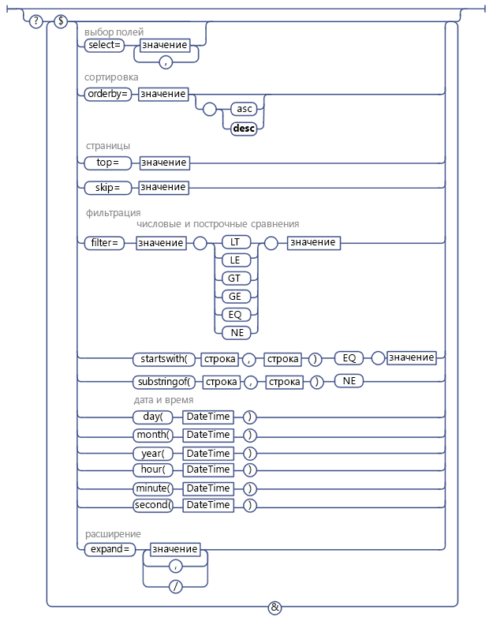

# Использование операций запросов OData в запросах SharePoint REST
Узнайте, как использовать широкий спектр операторов строки запроса OData для выбора, фильтрации и упорядочивания данных, запрашиваемых у службы REST SharePoint.
 **Прежде чем начать**

-  [Знакомство со службой REST для SharePoint 2013](get-to-know-the-sharepoint-2013-rest-service.md)

-  [Навигация по структуре данных SharePoint, представленной в службе REST](navigate-the-sharepoint-data-structure-represented-in-the-rest-service.md)

-  [Определение универсальных кодов ресурсов (URI) конечных точек службы SharePoint REST](determine-sharepoint-rest-service-endpoint-uris.md)

Служба REST SharePoint поддерживает широкий диапазон операторов строки запроса OData, который позволяет выбирать, фильтровать и упорядочивать запрашиваемые данные.

> **Совет**
> Служба RESTSharePoint Online (а также локальной версии SharePoint 2016 и последующих выпусков) поддерживает объединение нескольких запросов в одном вызове службы с помощью параметра запроса OData  `$batch`. Дополнительные сведения и ссылки на примеры кода см. в разделе  [Создание пакетного запроса с помощью интерфейсов REST API](make-batch-requests-with-the-rest-apis.md). 

## Выбор полей для возврата

Используйте параметр  [$select](http://www.odata.org/documentation/odata-version-2-0/uri-conventions#SelectSystemQueryOption), чтобы указать поля, которые необходимо получить для данного списка, элемента списка или другого объекта SharePoint, представленного набором объектов. Вы можете использовать  `$select=*`, чтобы получить все доступные поля.

> **Примечание**
> Как правило, если вы не указываете параметр запроса  `$select`, служба REST по умолчанию возвращает все доступные поля. Тем не менее, в некоторых случаях ряд объектов SharePoint содержат свойства, для извлечения которых требуется много ресурсов. Чтобы оптимизировать производительность службы REST, эти свойства не включаются в запрос по умолчанию и должны быть запрошены явно. > Например, свойство **SPWeb.EffectiveBasePermissions** не возвращается по умолчанию и должно быть явно запрошено с помощью параметра запроса `$select`. 

Кроме того, вы можете указать, что запрос возвращает планируемые поля из других списков и значений подстановки. Для этого укажите имя поля в обоих параметрах запроса  `$select` и `$expand`. Например:

 `http://server/site/_api/web/lists('guid')/items?$select=Title,Products/Name&amp;$expand=Products/Name`

Массовое расширение и выбор соответствующих элементов не поддерживается.

## Выбор элементов для возврата

Используйте параметр запроса  [$filter](http://www.odata.org/documentation/odata-version-2-0/uri-conventions#FilterSystemQueryOption), чтобы выбрать элементы для получения. В разделе  [Операторы запросов OData, поддерживаемые службой REST SharePoint](#bk_supported) представлен список параметров сравнения запросов фильтра и функции, которые вы можете использовать со службой REST в SharePoint.

## Запрос полей подстановки одиночного значения

Поля подстановки одиночного значения представлены двумя отдельными полями в службе REST SharePoint: одно поле представляет фактическое значение поля, а другое — имя поля. Вы можете выполнять запросы значения поля подстановки так же, как для любого другого поля этого типа данных. Например, если значением поля подстановки является строка, вы можете использовать в вашем запросе параметры сравнения строк.

## Запрос пользователей

В службе REST SharePoint пользователи представлены понятным (отображаемым) именем пользователя, а не их псевдонимами или комбинацией домена и псевдонима. Следовательно, вам необходимо сформировать запросы к понятным именам пользователей.

> **Примечание**
> Запросы пользователей на основе участия в группах не поддерживаются. > Использование оператора **Current** для выполнения запросов с использованием идентификатора текущего пользователя не поддерживается.

## Запрос полей подстановки с несколькими значениями и пользователей

Поскольку поля подстановки с несколькими значениями возвращаются как строка из нескольких значений, то их нельзя запросить (например, эквивалент элемента **Includes** или элемента **NotIncludes** не поддерживается).

## Сортировка возвращенных элементов

Используйте параметр запроса  [$orderby](http://www.odata.org/documentation/odata-version-2-0/uri-conventions#OrderBySystemQueryOption), чтобы указать способ сортировки элементов в вашем наборе возврата запросов. Чтобы сортировать по нескольким полям, следует указать разделенный запятыми список полей. Вы можете также указать, следует ли сортировать элементы в порядке возрастания или убывания, добавив в запрос ключевое слово **asc** или **desc**.

## Постраничное разбиение возвращаемых элементов

Используйте параметры  [$top](http://www.odata.org/documentation/odata-version-2-0/uri-conventions#TopSystemQueryOption) и [$skiptoken](http://msdn.microsoft.com/library/dd942121.aspx), чтобы выбрать подмножество элементов, которые в противном случае были бы возвращены по вашему запросу.

> **Примечание**
> Параметр запроса $skip не работает с запросами для элементов списков SharePoint. 

Параметр  `$top` позволяет выбрать первые *n*  элементов набора возврата для получения. Например, следующий URI запрашивает возврат только первых десяти элементов из потенциального набора результатов:

 `http://server/site/_api/web/lists('<guid>')/items$top=10`

Параметр $skiptoken позволяет пропустить указанное количество элементов и получить остальные.

 `$skiptoken=Paged=TRUE&amp;p_ID=5`

> **Примечание**
> При использовании этих параметров запроса следует учитывать, что постраничное разбиение в OData выполняется по порядку. Предположим, что вы реализуете кнопку следующей страницы для отображения элементов списка SharePoint. Вы используете службу REST, чтобы кнопка возвращала элементы с 1 по 20, затем элементы с 21 по 40 и так далее. Однако, предположим, что другой пользователь удаляет элемент 4 и 18 между нажатиями кнопки "Далее". В этом случае порядковое размещение остающихся элементов сбрасывается и при отображении элементов с 21 по 40 фактически пропускаются два элемента. 

## Операторы запросов OData, поддерживаемые службой REST SharePoint

|**Поддерживается**|**Не поддерживается**|
|:-----|:-----|
|**Числовые сравнения**    Lt    Le    Gt    Ge    Eq    Ne   | Арифметические операторы           (Add, Sub, Mul, Div, Mod)    Базовые математические функции          (округление, пол, потолок)    |
|**Сравнение строк**    startsWith    substringof    Eq    Ne   | endsWith    replace    substring    tolower    toupper    trim    concat   |
|**Функции даты и времени**    day()    month()    year()    hour()    minute()    second()   | Оператор DateTimeRangesOverlap    Выполнение запроса относительно того, попадает ли срок в повторяющийся формат времени   |
 
На следующем рисунке показаны поддерживаемые параметры запроса OData.

**Поддерживаемые параметры запроса OData**

## Дополнительные ресурсы

-  [Знакомство со службой REST для SharePoint 2013](get-to-know-the-sharepoint-2013-rest-service.md)

-  [Выполнение базовых операций с использованием конечных точек SharePoint 2013 REST](complete-basic-operations-using-sharepoint-2013-rest-endpoints.md)

-  [Работа со списками и элементами списков в службе REST](working-with-lists-and-list-items-with-rest.md)

-  [Работа с папками и файлами в службе REST](working-with-folders-and-files-with-rest.md)

-  [Навигация по структуре данных SharePoint, представленной в службе REST](navigate-the-sharepoint-data-structure-represented-in-the-rest-service.md)

-  [Определение универсальных кодов ресурсов (URI) конечных точек службы SharePoint REST](determine-sharepoint-rest-service-endpoint-uris.md)

-  [SharePoint 2013 REST API, конечные точки и примеры](02128c70-9d27-4388-9374-a11bce68fdb8.md)

