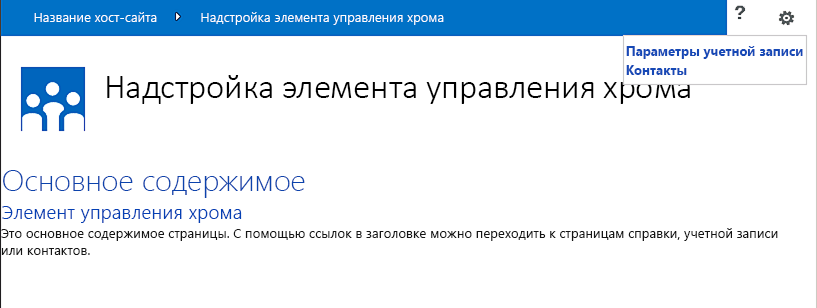
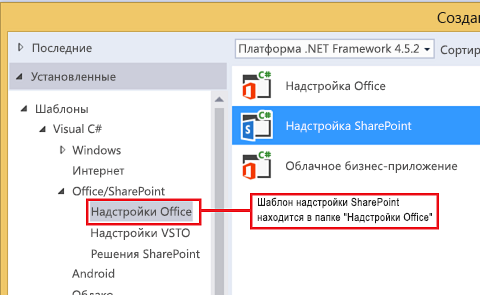
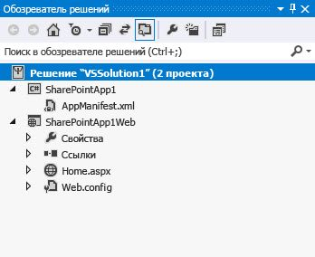
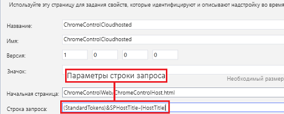
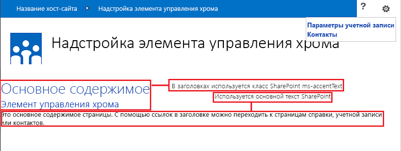

# Использование клиентского элемента управления хрома в надстройках для SharePoint
Узнайте, как использовать элемент управления хрома в надстройках в SharePoint 2013.
Элемент управления хрома в SharePoint 2013 позволяет использовать стиль заголовка определенного сайта SharePoint в надстройке, не регистрируя серверную библиотеку и не применяя специальные технологии или средства. Чтобы воспользоваться этой возможностью, вам нужно зарегистрировать библиотеку JavaScript SharePoint с помощью стандартного тега <script>. Вы можете добавить заполнитель с помощью элемента HTML **div**, а затем настроить элемент управления, используя доступные параметры. Элемент управления наследует внешний вид от указанного веб-сайта SharePoint.


## Предварительные требования для использования примеров в этой статье
<a name="SP15Usechromecontrol_Prereq"> </a>

Для выполнения действий, описанных в этом примере, вам необходимо следующее:


- Visual Studio 2015.


- Среда разработки SharePoint 2013 (для локальных сценариев требуется изоляция надстроек).


Руководство по настройке среды разработки, соответствующей вашим потребностям, можно найти в статье  [Начало создания приложений для Office и SharePoint](http://msdn.microsoft.com/library/187f8c8c-1b15-471c-80b5-69a40e67deea%28Office.15%29.aspx).


### Основные понятия, которые необходимо знать, перед тем как использовать элемент управления хрома

В следующей таблице перечислены полезные статьи, которые могут помочь вам ознакомиться с основными понятиями, связанными с использованием элемента управления хрома.


**Таблица 1. Основные понятия, связанные с использованием элемента управления хрома**


|**Название статьи**|**Описание**|
|:-----|:-----|
| [Надстройки SharePoint](sharepoint-add-ins.md) <br/> |Узнайте о новой модели надстроек в SharePoint 2013, которая позволяет вам создавать небольшие, простые в использовании решения для конечных пользователей.  <br/> |
| [Проектирование пользовательского интерфейса для надстроек SharePoint](ux-design-for-sharepoint-add-ins.md) <br/> |Ознакомьтесь с параметрами и вариантами построения пользовательского интерфейса при создании Надстройки SharePoint.  <br/> |
| [Хост-сайты, сайты надстроек и компоненты SharePoint в SharePoint 2013](host-webs-add-in-webs-and-sharepoint-components-in-sharepoint-2013.md) <br/> |Узнайте, в чем разница между хост-сайтами и сайтами надстроек. Узнайте, какие компоненты SharePoint 2013 можно включать в надстройку SharePoint, какие компоненты развертываются на хост-сайте, а какие на сайте надстройки и как развертывается сайт надстройки в изолированном домене.  <br/> |
 

## Пример кода: использование элемента управления хрома в размещенной в облаке надстройке
<a name="SP15Usechromecontrol_Codeexample"> </a>

Размещенная в облаке надстройка включает по крайней мере один удаленный компонент. Чтобы узнать больше, см.  [Выбор шаблонов для разработки и размещения надстройки SharePoint](choose-patterns-for-developing-and-hosting-your-sharepoint-add-in.md). Чтобы использовать элемент управления хрома в размещенной в облаке надстройке, сделайте следующее:


1. Создайте проекты Надстройка SharePoint и удаленного сайта.


2. Отправьте параметры конфигурации по умолчанию в строке запроса.


3. Добавьте в веб-проект веб-страницу.


На рис. 1 показана удаленная веб-страница с элементом управления хрома.


**Рис. 1. Удаленная веб-страница с элементом управления хрома**





### Создание проектов Надстройка SharePoint и удаленного сайта


1. Откройте Visual Studio 2015 от имени администратора. Для этого щелкните правой кнопкой мыши значок Visual Studio 2015 в меню **Пуск** и выберите пункт **Запуск от имени администратора**.


2. Создайте новый проект с помощью шаблона **Надстройка SharePoint**.

    На рисунке 2 показано расположение шаблона **Надстройка SharePoint** в Visual Studio 2015: **Шаблоны** > **Visual C#** > **Office/SharePoint** > **Надстройки Office**.


   **Рис. 2. Шаблон надстройки SharePoint в Visual Studio**





3. Предоставьте URL-адрес веб-сайта SharePoint, который планируется использовать для отладки.


4. Выберите **Размещено у поставщика** в качестве варианта размещения надстройки. Пример кода с размещением в SharePoint: [SharePoint-Add-in-JSOM-BasicDataOperations](https://github.com/OfficeDev/SharePoint-Add-in-JSOM-BasicDataOperations).

    После завершения работы мастера вы получите в **Обозревателе решений** структуру, которая напоминает структуру, показанную на рис. 3.


   **Рис. 3. Надстройка для проектов SharePoint в обозревателе решений**





### Отправка параметров конфигурации по умолчанию в строке запроса


1. Откройте файл Appmanifest.xml в редакторе манифеста.


2. Добавьте в строку запроса маркер **{StandardTokens}** и дополнительный параметр _SPHostTitle_. На рис. 4 показан редактор манифеста с настроенными параметрами строки запроса.

   **Рис. 4. Редактор манифеста с параметрами строки запроса для элемента управления хрома**





   Элемент управления хрома автоматически принимает из строки запроса следующие значения:

  - **SPHostUrl**


  - **SPHostTitle**


  - **SPAppWebUrl**


  - **SPLanguage**


    Маркер **{StandardTokens}** включает параметры **SPHostUrl** и **SPAppWebUrl**.


### Добавление в веб-проект страницы с элементом управления хрома


1. Щелкните правой кнопкой мыши веб-проект и добавьте новую веб-форму.


2. Скопируйте следующие исправления и вставьте их на страницу ASPX. Исправления выполняют следующие действия:

  - загружает библиотеку AJAX из сети доставки содержимого Майкрософт (CDN);


  - загружает библиотеку jQuery из сети CDN Майкрософт;


  - загружает файл SP.UI.Controls.js с помощью функции jQuery **getScript**;


  - определяет функцию обратного вызова для события **onCssLoaded**;


  - подготавливает параметры для элемента управления хрома;


  - инициализирует элемент управления хрома.


 ```HTML

<!DOCTYPE html>
<html xmlns="http://www.w3.org/1999/xhtml">
<head>
    <title>Chrome control host page</title>
    <script 
        src="//ajax.aspnetcdn.com/ajax/4.0/1/MicrosoftAjax.js" 
        type="text/javascript">
    </script>
    <script 
        type="text/javascript" 
        src="//ajax.aspnetcdn.com/ajax/jQuery/jquery-1.7.2.min.js">
    </script>  
    <script 
        type="text/javascript"
        src="ChromeLoader.js">
    </script>
<script type="text/javascript">
"use strict";

var hostweburl;

//load the SharePoint resources
$(document).ready(function () {
    //Get the URI decoded URL.
    hostweburl =
        decodeURIComponent(
            getQueryStringParameter("SPHostUrl")
    );

    // The SharePoint js files URL are in the form:
    // web_url/_layouts/15/resource
    var scriptbase = hostweburl + "/_layouts/15/";

    // Load the js file and continue to the 
    //   success handler
    $.getScript(scriptbase + "SP.UI.Controls.js", renderChrome)
});

// Callback for the onCssLoaded event defined
//  in the options object of the chrome control
function chromeLoaded() {
    // When the page has loaded the required
    //  resources for the chrome control,
    //  display the page body.
    $("body").show();
}

//Function to prepare the options and render the control
function renderChrome() {
    // The Help, Account and Contact pages receive the 
    //   same query string parameters as the main page
    var options = {
        "appIconUrl": "siteicon.png",
        "appTitle": "Chrome control add-in",
        "appHelpPageUrl": "Help.html?"
            + document.URL.split("?")[1],
        // The onCssLoaded event allows you to 
        //  specify a callback to execute when the
        //  chrome resources have been loaded.
        "onCssLoaded": "chromeLoaded()",
        "settingsLinks": [
            {
                "linkUrl": "Account.html?"
                    + document.URL.split("?")[1],
                "displayName": "Account settings"
            },
            {
                "linkUrl": "Contact.html?"
                    + document.URL.split("?")[1],
                "displayName": "Contact us"
            }
        ]
    };

    var nav = new SP.UI.Controls.Navigation(
                            "chrome_ctrl_placeholder",
                            options
                        );
    nav.setVisible(true);
}

// Function to retrieve a query string value.
// For production purposes you may want to use
//  a library to handle the query string.
function getQueryStringParameter(paramToRetrieve) {
    var params =
        document.URL.split("?")[1].split("&amp;");
    var strParams = "";
    for (var i = 0; i < params.length; i = i + 1) {
        var singleParam = params[i].split("=");
        if (singleParam[0] == paramToRetrieve)
            return singleParam[1];
    }
}
</script>
</head>

<!-- The body is initally hidden. 
     The onCssLoaded callback allows you to 
     display the content after the required
     resources for the chrome control have
     been loaded.  -->
<body style="display: none">

    <!-- Chrome control placeholder -->
    <div id="chrome_ctrl_placeholder"></div>

    <!-- The chrome control also makes the SharePoint
          Website stylesheet available to your page -->
    <h1 class="ms-accentText">Main content</h1>
    <h2 class="ms-accentText">The chrome control</h2>
    <div id="MainContent">
        This is the page's main content. 
        You can use the links in the header to go to the help, 
        account or contact pages.
    </div>
</body>
</html>
 ```

3. Элемент управления хрома также можно использовать декларативным способом. В следующем примере кода в разметке HTML элемент управления объявляется без использования кода JavaScript для его настройки и инициализации. Эта разметка выполняет следующие задачи:

  - предоставляет заполнитель для файла SP.UI.Controls.js JavaScript;


  - динамически загружает файл SP.UI.Controls.js;


  - предоставляет заполнитель для элемента управления хрома и задает его параметры.


 ```HTML

<!DOCTYPE html>
<html xmlns="http://www.w3.org/1999/xhtml">
<head>
    <title>Chrome control host page</title>
    <script 
        src="http://ajax.aspnetcdn.com/ajax/4.0/1/MicrosoftAjax.js" 
        type="text/javascript">
    </script>
    <script 
        type="text/javascript" 
        src="http://ajax.aspnetcdn.com/ajax/jQuery/jquery-1.7.2.min.js">
    </script>  
    <script type="text/javascript">
    var hostweburl;

    // Load the SharePoint resources.
    $(document).ready(function () {

        // Get the URI decoded add-in web URL.
        hostweburl =
            decodeURIComponent(
                getQueryStringParameter("SPHostUrl")
        );

        // The SharePoint js files URL are in the form:
        // web_url/_layouts/15/resource.js
        var scriptbase = hostweburl + "/_layouts/15/";

        // Load the js file and continue to the 
        // success handler.
        $.getScript(scriptbase + "SP.UI.Controls.js")
    });

    // Function to retrieve a query string value.
    // For production purposes you may want to use
    // a library to handle the query string.
    function getQueryStringParameter(paramToRetrieve) {
        var params =
            document.URL.split("?")[1].split("&amp;");
        var strParams = "";
        for (var i = 0; i < params.length; i = i + 1) {
            var singleParam = params[i].split("=");
            if (singleParam[0] == paramToRetrieve)
                return singleParam[1];
        }
    }
    </script>
</head>
<body>

    <!-- Chrome control placeholder 
           Options are declared inline.  -->
    <div 
        id="chrome_ctrl_container"
        data-ms-control="SP.UI.Controls.Navigation"
        data-ms-options=
            '{
                "appHelpPageUrl" : "Help.html",
                "appIconUrl" : "siteIcon.png",
                "appTitle" : "Chrome control add-in",
                "settingsLinks" : [
                    {
                        "linkUrl" : "Account.html",
                        "displayName" : "Account settings"
                    },
                    {
                        "linkUrl" : "Contact.html",
                        "displayName" : "Contact us"
                    }
                ]
             }'>
    </div>

    <!-- The chrome control also makes the SharePoint
          Website style sheet available to your page. -->
    <h1 class="ms-accentText">Main content</h1>
    <h2 class="ms-accentText">The chrome control</h2>
    <div id="MainContent">
        This is the page's main content. 
        You can use the links in the header to go to the help, 
        account or contact pages.
    </div>
</body>
</html>
 ```


    Библиотека SP.UI.Controls.js автоматически отображает элемент управления, если обнаруживает атрибут **data-ms-control="SP.UI.Controls.Navigation"** в элементе **div**.


### Изменение элемента StartPage в манифесте надстройки


1. Дважды щелкните файл **AppManifest.xml** в **обозревателе решений**.


2. В раскрывающемся меню **Начальная страница** выберите веб-страницу, использующую элемент управления хрома.


### Построение и запуск решения


1. Убедитесь, что проект Надстройка SharePoint выбран как запускаемый проект.


2. Нажмите клавишу F5.

    > **Примечание**
      > Когда вы нажимаете клавишу F5, Visual Studio выполняет построение решения, разворачивает надстройку и открывает страницу разрешений для надстройки. 
3. Нажмите кнопку **Trust It (Доверять)**.


4. Щелкните значок надстройки **ChromeControlCloudhosted**.


5. При использовании элемента управления хрома на веб-страницах вы также можете использовать таблицу стилей веб-сайта SharePoint, как показано на рис. 4.

   **Рис. 5. Использование таблицы стилей веб-сайта SharePoint на странице**





**Таблица 2. Устранение неполадок решения**


|**Проблема**|**Решение**|
|:-----|:-----|
|Необработанное исключение **SP не определен**. <br/> |Убедитесь, что браузер загружает файл SP.UI.Controls.js.  <br/> |
|Элемент управления хрома не выполняет обработку должным образом.  <br/> |Элемент управления хрома поддерживает только режимы документов Internet Explorer 8 и более поздних версий. Убедитесь, что браузер отображает страницу в режиме документов Internet Explorer 8 и более поздних версий.  <br/> |
|Ошибка сертификата.  <br/> |Задайте свойство **SSL включено** веб-проекта равным "false". В проекте Надстройка SharePoint задайте свойство **Веб-проект** равнымNone, а затем верните в свойстве имя своего веб-проекта.  <br/> |
 

## Дальнейшие действия
<a name="SP15Usechromecontrol_Nextsteps"> </a>

В этой статье показано, как использовать элемент управления хрома в надстройке SharePoint. Далее вы можете узнать о других компонентах UX, доступных для надстроек SharePoint. Дополнительные сведения см. в следующих статьях:


-  [Пример кода: использование элемента управления хрома в размещенной в облаке надстройке](http://code.msdn.microsoft.com/SharePoint-2013-Work-with-089ecc6f)


-  [Пример кода: использование элемента управления хрома и междоменной библиотеки (CSOM)](http://code.msdn.microsoft.com/SharePoint-2013-Use-the-97c30a2e)


-  [Пример кода: использование элемента управления хрома и междоменной библиотеки (REST)](http://code.msdn.microsoft.com/SharePoint-2013-Use-the-a759e9f8)


-  [Использование таблицы стилей веб-сайта SharePoint в надстройках для SharePoint](use-a-sharepoint-website-s-style-sheet-in-sharepoint-add-ins.md)


-  [Выполнение пользовательских действий для развертывания надстроек для SharePoint](create-custom-actions-to-deploy-with-sharepoint-add-ins.md)


-  [Создание веб-частей надстройки для установки совместно с надстройкой для SharePoint](create-add-in-parts-to-install-with-your-sharepoint-add-in.md)


## Дополнительные ресурсы
<a name="SP15Usechromecontrol_Addresources"> </a>


-  [Настройка локальной среды разработки надстроек SharePoint](set-up-an-on-premises-development-environment-for-sharepoint-add-ins.md)


-  [Проектирование пользовательского интерфейса для надстроек SharePoint](ux-design-for-sharepoint-add-ins.md)


-  [Рекомендации по UX design для надстроек для SharePoint](sharepoint-add-ins-ux-design-guidelines.md)


-  [Создание компонентов UX в SharePoint 2013](create-ux-components-in-sharepoint-2013.md)


-  [Существует три способа рассмотрения возможностей проектирования надстроек SharePoint](three-ways-to-think-about-design-options-for-sharepoint-add-ins.md)


-  [Важные аспекты архитектуры и разработки надстройки SharePoint](important-aspects-of-the-sharepoint-add-in-architecture-and-development-landscap.md)


