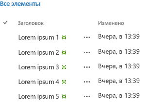

# Использование экспериментального мини-приложения "Просмотр списка на рабочем столе" в надстройках для SharePoint
Узнайте, как использовать мини-приложение "Представление списка на рабочем столе" на любой веб-странице, даже если она не размещена в SharePoint. Используйте мини-приложение "Представление списка на рабочем столе" в своих надстройках, чтобы отображать данные в списках, размещаемых на сайте SharePoint.
> [!Примечание]
> Экспериментальная версия веб-виджетов Office предназначена только для ознакомления и сбора отзывов. Не используйте их в производстве. Работа веб-виджетов Office в следующих выпусках может значительно измениться. Прочтите статью  [Условия лицензии веб-виджетов Office (экспериментальная версия)](office-web-widgetsexperimental-license-terms.md). 
  
    
    

С помощью мини-приложения "Представление списка" вы можете отображать данные в списке SharePoint подобно тому, как это делается с помощью обычного мини-приложения "Представление списка", но вы можете использовать его даже в тех надстройках и на веб-сайтах, которые не размещены в SharePoint.
**Рисунок 1. Виджет "Представление списка на рабочем столе", в котором показаны данные в списке**

  
    
    

  
    
    

  
    
    

  
    
    

  
    
    

## Введение

Вы можете указать в списке SharePoint представление, которое вы хотите использовать для отображения данных. Виджет "Представление списка" отображает столбцы и элементы в порядке, который указывает представление.
  
    
    
Виджет "Представление списка" использует междоменную библиотеку для получения данных списка. Поэтому связь происходит на уровне клиента.
  
    
    

> [!Внимание!]
> Виджет "Представление списка на рабочем столе" позволяет выполнять не все сценарии собственного "Представления списка". 
  
    
    

В текущей версии виджета не включены следующие сценарии:
  
    
    

- использование виджета в схемах проверки подлинности, неподдерживаемых междоменной библиотекой;
    
  
- использование виджета с другими источниками данных, кроме библиотек и списков SharePoint;
    
  
- привязка виджета к данным;
    
  
- представления с сенсорным управлением;
    
  
- встроенная правка пользователями;
    
  
- показ информации о присутствии;
    
  
- настраиваемые шаблоны отрисовки;
    
  
- локальные сценарии. В данный момент виджет работает только в SharePoint Online.
    
  

## Необходимые условия для использования примеров в этой статье

Для выполнения примеров, описанных в этой статье, вам необходимо следующее.
  
    
    

- Visual Studio 2013
    
  
- Диспетчер пакетов NuGet. Подробнее см. в статье  [Установка NuGet](http://go.microsoft.com/fwlink/?LinkId=271465).
    
  
- Среда разработки SharePoint 2013 (для локальных сценариев требуется изоляция приложений). 
    
  
- Пакет NuGet экспериментальной версии веб-виджетов Office. Подробнее о том, как устанавливать пакет NuGet, см. в статье  [Управление пакетами NuGet в диалоговом окне](http://docs.nuget.org/docs/start-here/managing-nuget-packages-using-the-dialog). Вы можете также просмотреть  [страницу коллекции NuGet](http://www.nuget.org/packages/Microsoft.Office.WebWidgets.Experimental/).
    
  

## Использование виджета "Представление списка на рабочем столе" в размещаемом у поставщика надстройки SharePoint

В этом примере показана простая страница, размещенная вне SharePoint, которая объявляет виджет "Представление списка на рабочем столе".
  
    
    
Чтобы использовать виджет "Представление списка на рабочем столе":
  
    
    

- создайте надстройку SharePoint и веб-проекты;
    
  
- создайте список на сайте надстройки. Этот шаг также гарантирует, что сайт надстройки будет создан, когда пользователи развернут надстройку;
    
    > [!Примечание]
      > Для междоменной библиотеки требуется наличие сайта надстройки. Мини-приложение "Представление списка" связывается с SharePoint, используя междоменную библиотеку. 
- создайте страницу надстройки, объявляющую экземпляр мини-приложения "Представление списка" с использованием разметки HTML.
    
  

### Создание надстройки SharePoint и веб-проектов


1. Откройте Visual Studio 2013 как администратор (для этого выберите Visual Studio 2013 в меню **Пуск** и выберите пункт **Запуск от имени администратора**).
    
  
2. Создайте новые проект, используя шаблон **Надстройка SharePoint 2013**. Расположение шаблона Надстройка SharePoint 2013: **Шаблоны**> **Visual C#**, **Office/SharePoint**> **Надстройки**.
    
  
3. Укажите URL-адрес веб-сайта SharePoint, который вы хотите использовать для отладки.
    
  
4. Выберите для надстройки вариант размещения **Размещено у поставщика**.
    
    > [!Примечание]
      > Вы можете также использовать мини-приложение "Представление списка на рабочем столе" с другими вариантами размещения или даже с надстройками для Office или собственным веб-сайтом. 
5. В качестве типа проекта веб-приложения выберите **Приложение веб-форм ASP.NET**.
    
  
6. Выберите вариант проверки подлинности **Служба контроля доступа Windows Azure**.
    
  

### Создание списка на сайте надстройки


1. Выберите проект надстройки SharePoint в **обозревателе решений**. Выберите **Добавить** > **Новый элемент…**
    
  
2. Выберите **Элементы Visual C#**> **Office/SharePoint**> **Список**. В текстовое поле **Имя** введите **Объявления**. Выберите **Добавить**.
    
  
3. Выберите **Создать экземпляр списка на основе существующего шаблона списка:**. Выберите шаблон **Объявления**. Нажмите кнопку **Готово**.
    
  

### Добавление новой страницы, использующей виджет "Представление списка на рабочем столе"


1. В веб-проекте **Обозреватель решений** выберите папку **Страницы**.
    
  
2. Скопируйте следующий код и вставьте его в файл **ASPX** в проекте. Этот код выполняет следующие задачи.
    
  - добавляет ссылки на необходимые библиотеки и ресурсы Office;
    
  
  - предоставляет заполнитель для виджета "Представление списка";
    
  
  - инициализирует среду выполнения элементов управления;
    
  
  - запускает метод **renderAll** среды выполнения элементов управления Office.
    
  

  ```
  
<!DOCTYPE html>
<html>
<head>
    <!-- IE9 or superior -->
    <meta http-equiv="x-ua-compatible" content="IE=10">
    <title>Desktop List View HTML Markup</title>

    <!-- Controls Specific CSS File -->
    <link rel="stylesheet" type="text/css" href="/Scripts/Office.Controls.css" />

    <!-- Ajax, jQuery, and utils -->
    <script 
        src=" https://ajax.aspnetcdn.com/ajax/4.0/1/MicrosoftAjax.js.js">
    </script>
    <script 
        src=" https://ajax.aspnetcdn.com/ajax/jQuery/jquery-1.9.1.min.js">
    </script>
    <script type="text/javascript">

        // Function to retrieve a query string value.
        // For production purposes you may want to use
        //  a library to handle the query string.
        function getQueryStringParameter(paramToRetrieve) {
            var params =
                document.URL.split("?")[1].split("&amp;");
            var strParams = "";
            for (var i = 0; i < params.length; i = i + 1) {
                var singleParam = params[i].split("=");
                if (singleParam[0] == paramToRetrieve)
                    return singleParam[1];
            }
        }
    </script>

    <!-- Cross-Domain Library and Office controls runtime -->
    <script type="text/javascript">
        //Register namespace and variables used through the sample
        Type.registerNamespace("Office.Samples.ListViewBasic");
        //Retrieve context tokens from the querystring
        Office.Samples.ListViewBasic.appWebUrl =
            decodeURIComponent(getQueryStringParameter("SPAppWebUrl"));
        Office.Samples.ListViewBasic.hostWebUrl =
            decodeURIComponent(getQueryStringParameter("SPHostUrl"));
        Office.Samples.ListViewBasic.ctag =
            decodeURIComponent(getQueryStringParameter("SPClientTag"));

        //Pattern to dynamically load JSOM and the cross-domain library
        var scriptbase =
            Office.Samples.ListViewBasic.hostWebUrl + "/_layouts/15/";

        //Get the cross-domain library
        $.getScript(scriptbase + "SP.RequestExecutor.js", 
            //Get the Office controls runtime and 
            //  continue to the createControl function
            function () {
                $.getScript("../Scripts/Office.Controls.js", createControl);
            }
        );
    </script>

    <!-- List View -->
    <script 
        src="../Scripts/Office.Controls.ListView.debug.js" 
        type="text/javascript">
    </script>

    <!-- SharePoint CSS -->
    <script type="text/javascript">
        document.addEventListener("DOMContentLoaded", function () {
            // The resource files are in a URL in the form:
            // web_url/_layouts/15/Resource.ashx
            var scriptbase =
                Office.Samples.ListViewBasic.appWebUrl + "/_layouts/15/";

            // Dynamically create the invisible iframe.
            var blankiframe;
            var blankurl;
            var body;
            blankurl =
                Office.Samples.ListViewBasic.appWebUrl + "/Pages/blank.html";
            blankiframe = document.createElement("iframe");
            blankiframe.setAttribute("src", blankurl);
            blankiframe.setAttribute("style", "display: none");
            body = document.getElementsByTagName("body");
            body[0].appendChild(blankiframe);

            // Dynamically create the link element.
            var dclink;
            var head;
            dclink = document.createElement("link");
            dclink.setAttribute("rel", "stylesheet");
            dclink.setAttribute("href",
                                scriptbase +
                                "defaultcss.ashx?ctag=" +
                                Office.Samples.ListViewBasic.ctag
                                );
            head = document.getElementsByTagName("head");
            head[0].appendChild(dclink);
        }, false);
    </script>
</head>
<body>
    Basic List View sample (HTML markup declaration):
    <div id="ListViewDiv"
         data-office-control="Office.Controls.ListView"
         data-office-options='{"listUrl" : getListUrl()}'>
    </div>

    <script type="text/javascript">
        function createControl() {
            //Initialize Controls Runtime
            Office.Controls.Runtime.initialize({
                sharePointHostUrl: Office.Samples.ListViewBasic.hostWebUrl,
                appWebUrl: Office.Samples.ListViewBasic.appWebUrl
            });

            //Render the widget, this must be executed after the
            //placeholder DOM is loaded
            Office.Controls.Runtime.renderAll();
        }

        function getListUrl() {
            return Office.Samples.ListViewBasic.appWebUrl +
                    "/_api/web/lists/getbytitle('Announcements')";
        }
    </script>
</body>
</html>
  ```


> [!Примечание]
> В приведенном выше примере кода явно указываются URL-адреса хост-сайта и сайта надстройки для инициализации среды выполнения элементов управления Office. Однако если URL-адреса хост-сайта и сайта надстройки указаны в параметрах строк запроса **SPAppWebUrl** и **SPHostUrl** соответственно, можно передать пустой объект, и код попытается получить параметры автоматически. Параметры **SPAppWebUrl** и **SPHostUrl** включаются в строку запроса, когда вы используете маркер **{StandardTokens}**.
  
    
    

В следующем примере показано, как передавать пустой объект в метод инициализации:
  
    
    


```

// Initialize with an empty object and the code
// will attempt to get the tokens from the
// query string directly.
Office.Controls.Runtime.initialize({});
```


### Создание и запуск решения


1. Нажмите клавишу F5.
    
    > [!Примечание]
      > Когда вы нажимаете клавишу F5, Visual Studio выполняет сборку решения, развертывает надстройку и открывает для нее страницу разрешений. 
2. Нажмите кнопку **Доверять**.
    
  
3. Выберите значок надстройки на странице **Содержимое сайта**.
    
  
Вы также можете загрузить этот пример из коллекции кода, см. пример кода  [Использование экспериментальной версии мини-приложения "Представление списка на рабочем столе" в надстройке](http://code.msdn.microsoft.com/SharePoint-2013-Use-the-c3edb076).
  
    
    

## 

В этой статье показано, как использовать мини-приложение "Представление списка на рабочем столе" в своей надстройке с помощью HTML. Вы также можете ознакомиться со следующими сценариями и сведениями о мини-приложении.
  
    
    

### Использование JavaScript для объявления виджета "Представление списка на рабочем столе"

В зависимости от своих предпочтений вы можете объявлять виджет, используя JavaScript вместо HTML. В таком случае вы можете использовать следующую разметку в качестве заполнителя для виджета.
  
    
    

```HTML

<div id="ListViewDiv"></div>
```

Используйте следующий код JavaScript, чтобы создавать экземпляры представления списка.
  
    
    


```
new Office.Controls.ListView(
    document.getElementById("ListViewDiv"), {
        listUrl: Office.Samples.ListViewBasic.appWebUrl + "/_api/web/lists/getbytitle('Announcements')"
    });
```

Пример выполнения задач см. на странице **JSSimple.html** в примере кода [Использование экспериментального мини-приложения "Представление списка на рабочем столе" в надстройке](http://code.msdn.microsoft.com/SharePoint-2013-Use-the-c3edb076).
  
    
    

### Указание представления для показа данных

Вы можете указать существующее представление в своем списке SharePoint. Виджет "Представление списка" отображает данные, используя спецификацию представления.
  
    
    
Если вы объявляете виджет с помощью разметки HTML, вы можете использовать следующий синтаксис для указания представления.
  
    
    


```

<div id="ListViewDiv"
        data-office-control="Office.Controls.ListView"
        data-office-options="{listUrl: 'list URL',
                            viewID: 'GUID'
                            }">
</div> 

```

Если вы объявляете виджет с использованием JavaScript, вы можете использовать следующий синтаксис для указания представления.
  
    
    


```

new Office.Controls.ListView(
    document.getElementById("ListViewDiv"), {
        listUrl: "list URL",
        viewID: "GUID"
    });
```


## Заключение

Вы можете использовать экспериментальную версию виджета "Представление списка на рабочем столе" для отображения данных в списках SharePoint. Виджет показывает данные в режиме только для чтения. Оставляйте свои идеи и комментарии на  [сайте Office Developer Platform UserVoice](http://officespdev.uservoice.com/).
  
    
    

## Дополнительные ресурсы
<a name="bk_addresources"> </a>


-  [Обзор веб-виджетов Office (экспериментальная версия)](office-web-widgetsexperimental-overview.md)
    
  
-  [Условия лицензии веб-виджетов Office (экспериментальная версия)](office-web-widgetsexperimental-license-terms.md)
    
  
-  [Страница коллекции экспериментальных веб-виджетов Office NuGet](http://www.nuget.org/packages/Microsoft.Office.WebWidgets.Experimental/)
    
  
-  [Пример кода: использование экспериментального мини-приложения "Представление списка на рабочем столе" в надстройке](http://code.msdn.microsoft.com/SharePoint-2013-Use-the-c3edb076)
    
  
-  [Использование экспериментального мини-приложения "Просмотр списка на рабочем столе" в надстройках для SharePoint](use-the-experimental-desktop-list-view-widget-in-sharepoint-add-ins.md)
    
  

