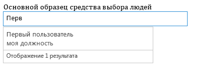
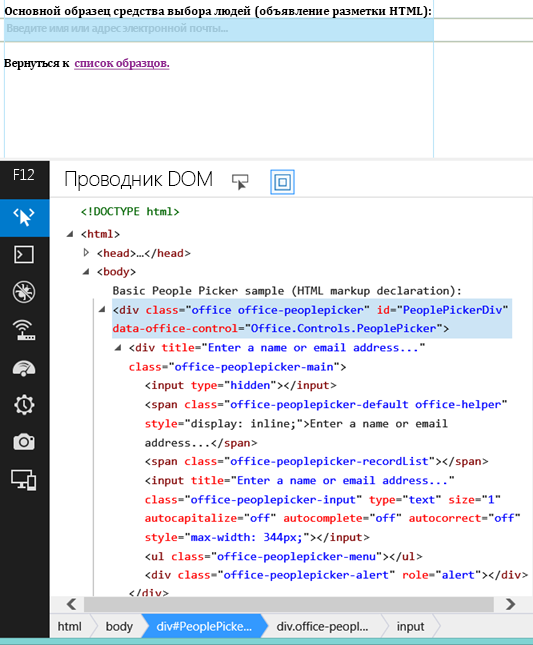

# Использование экспериментального мини-приложения "Выбор людей" в надстройках для SharePoint
Узнайте, как использовать мини-приложение "Выбор людей" на любой веб-странице, даже если страница не размещена в SharePoint. С помощью мини-приложения "Выбор людей" можно помочь пользователям надстройки находить и выбирать людей и группы.
> **Внимание!**
> Веб-виджеты Office (экспериментальная версия) предоставляются только в целях исследований и обратной связи. Не следует использовать их в производственных сценариях. Режим работы веб-виджетов Office может существенно измениться в будущих выпусках. Ознакомьтесь с  [Условия лицензии веб-виджетов Office (экспериментальная версия)](office-web-widgetsexperimental-license-terms.md). 


Используя в надстройках экспериментальное мини-приложение "Выбор людей", можно помочь пользователям находить и выбирать людей и группы в клиенте. Когда пользователь вводит текст в текстовое поле, мини-приложение загружает контакты, чьи имена или адреса электронной почты соответствуют тексту.
**Рисунок 1. Обработка запроса мини-приложением "Выбор людей"**





Ваша надстройка может получить доступ к выбранным контактам путем считывания свойства **selectedItems** мини-приложения. Свойство selectedItems является массивом объектов, которые представляют собой людей или группы. В таблице ниже приведены доступные свойства объекта пользователя.

|**Свойство**|**Описание**|
|:-----|:-----|
|**department** <br/> |Представляет подразделение пользователя или группы.  <br/> |
|**displayName** <br/> |Представляет отображаемое имя пользователя или группы.  <br/> |
|**email** <br/> |Представляет адрес электронной почты пользователя или группы.  <br/> |
|**isResolved** <br/> |Указывает на то, что мини-приложение успешно сопоставило введенный в него текст пользователю или группе у владельца.  <br/> |
|**jobTitle** <br/> |Представляет должность пользователя.  <br/> |
|**loginName** <br/> |Представляет имя для входа пользователя или группы.  <br/> |
|**mobile** <br/> |Представляет номер мобильного телефона пользователя или группы.  <br/> |
|**principalId** <br/> |Представляет идентификатор участника пользователя или группы.  <br/> |
|**principalType** <br/> |Указывает, является ли элемент пользователем или группой. Принимает значение 1, если это пользователь, и 4, если это группа.  <br/> |
|**sipAddress** <br/> |Представляет собой SIP-адрес пользователя или группы.  <br/> |
|**text** <br/> |Представляет текстовый заголовок имени пользователя или группы.  <br/> |
 
Мини-приложение "Выбор людей" имеет кэш последних использовавшихся записей (MRU). В кэше хранятся пять последних записей, которые были обработаны мини-приложением.
## Необходимые компоненты для использования примеров приведены в этой статье

Для использования примеров, описанных в этой статье, вам необходимо следующее:


- Visual Studio 2013.


- Диспетчер пакетов NuGet. Дополнительные сведения содержатся в разделе  [Установка NuGet](http://go.microsoft.com/fwlink/?LinkId=271465).


- Среда разработки SharePoint 2013 (для локальных сценариев требуется изоляция приложений).


- Пакет NuGet "Веб-виджеты Office (экспериментальная версия)". Дополнительные сведения об установке пакетов NuGet см. в разделе  [Управление пакетами NuGet с помощью диалогового окна](http://docs.nuget.org/docs/start-here/managing-nuget-packages-using-the-dialog). Вы также можете просмотреть  [коллекцию NuGet](http://www.nuget.org/packages/Microsoft.Office.WebWidgets.Experimental/).


## Использование мини-приложения "Выбор людей" в размещенной у поставщика надстройке SharePoint

В этом примере представлена простая страница, размещенная вне SharePoint, которая объявляет мини-приложение "Выбор людей" с использованием разметки. Для простоты в этом примере не объявлено никаких параметров. Пример с параметрами приведен в разделе  [Следующие шаги](use-the-experimental-people-picker-widget-in-sharepoint-add-ins.md#NextSteps).


Для использования мини-приложения "Выбор людей" необходимо сделать следующее.


- Создайте надстройку SharePoint и веб-проекты.


- Создайте модуль на сайте надстройки. Этот шаг обеспечит создание сайта надстройки при развертывании надстройки пользователями.

    > **Примечание**
      > Междоменная библиотека требует наличия сайта надстройки. Мини-приложение "Выбор людей" взаимодействует с SharePoint посредством междоменной библиотеки. 
- Создайте страницу надстройки, которая объявляет экземпляр мини-приложения "Выбор людей" с помощью разметки.


### Создание надстройки SharePoint и веб-проектов


1. Откройте Visual Studio 2013 как администратор. Для этого нажмите значок Visual Studio 2013 в меню **Пуск** и выберите пункт **Запуск от имени администратора**.


2. Создайте новый проект с помощью шаблона Надстройка SharePoint 2013. Шаблон **Надстройка SharePoint 2013** находится в меню **Шаблоны**> **Visual C#**, **Office/SharePoint**> **Надстройки**.


3. Укажите URL-адрес веб-сайта SharePoint, который будет использован для отладки.


4. Выберите для надстройки вариант размещения **Размещено у поставщика**.

    > **Примечание**
      > Мини-приложение "Выбор людей" можно использовать и с другими вариантами размещения, с надстройками для Office и собственным веб-сайтом. 
5. Выберите **Приложение веб-форм ASP.NET** в качестве типа проекта веб-приложения.


6. Выберите **службу контроля доступа Windows Azure** в качестве способа проверки подлинности.


### Создание модуля на сайте надстройки


1. Выберите проект надстройки SharePoint в **Обозревателе решений**. Выберите команду **Добавить**> **Создать элемент…**


2. Выберите **Элементы Visual C#**> **Office/SharePoint**> **Модуль**. Введите имя своего модуля.

    > **Примечание**
      > При построении Надстройки, размещаемые в SharePoint нет необходимости создавать дополнительный модуль. 

### Добавление новой страницы, которая использует мини-приложение "Выбор людей"


1. Выберите папку **Страницы** веб-проекта в **Обозревателе решений**.


2. Скопируйте следующий код и вставьте его в **ASPX** -файл проекта. Код выполняет следующие действия:

  - добавляет ссылки на необходимые библиотеки и ресурсы Office;


  - инициализирует среду выполнения элементов управления;


  - запускает метод **renderAll** среды выполнения элементов управления Office;


  - объявляет прототип для мини-приложения "Выбор людей".


 ```

<!DOCTYPE html>
<html>
<head>
    <!-- IE9 or superior -->
    <meta http-equiv="X-UA-Compatible" content="IE=9" >
    <title>People Picker HTML Markup</title>

    <!-- Widgets Specific CSS File -->
    <link 
        rel="stylesheet" 
        type="text/css" 
        href="../Scripts/Office.Controls.css" 
    />

    <!-- Ajax, jQuery, and utils --> 
    <script 
        src=" https://ajax.aspnetcdn.com/ajax/4.0/1/MicrosoftAjax.js.js">
    </script>
    <script 
        src=" https://ajax.aspnetcdn.com/ajax/jQuery/jquery-1.9.1.min.js">
    </script>
    <script type="text/javascript">
        // Function to retrieve a query string value.
        // For production purposes you may want to use
        //  a library to handle the query string.
        function getQueryStringParameter(paramToRetrieve) {
            var params =
                document.URL.split("?")[1].split("&amp;");
            var strParams = "";
            for (var i = 0; i < params.length; i = i + 1) {
                var singleParam = params[i].split("=");
                if (singleParam[0] == paramToRetrieve)
                    return singleParam[1];
            }
        }
    </script>

    <!-- Cross-Domain Library and Office controls runtime -->
    <script type="text/javascript">
        //Register namespace and variables used through the sample
        Type.registerNamespace("Office.Samples.PeoplePickerBasic");
        //Retrieve context tokens from the querystring
        Office.Samples.PeoplePickerBasic.appWebUrl =
            decodeURIComponent(getQueryStringParameter("SPAppWebUrl"));
        Office.Samples.PeoplePickerBasic.hostWebUrl =
            decodeURIComponent(getQueryStringParameter("SPHostUrl"));

        //Pattern to dynamically load JSOM and and the cross-domain library
        var scriptbase =
            Office.Samples.PeoplePickerBasic.hostWebUrl + "/_layouts/15/";

        //Get the cross-domain library
        $.getScript(scriptbase + "SP.RequestExecutor.js",
            //Get the Office controls runtime and 
            //  continue to the createControl function
            function () {
                $.getScript("../Scripts/Office.Controls.js", createControl)
            }
        );
    </script>

    <!--People Picker -->
    <script 
        src="../Scripts/Office.Controls.PeoplePicker.js" 
        type="text/javascript">
    </script>
</head>
<body>
Basic People Picker sample (HTML markup declaration):
<div 
        id="PeoplePickerDiv" 
        data-office-control="Office.Controls.PeoplePicker">
</div>

<script type="text/javascript">
    function createControl() {
        //Initialize Controls Runtime
        Office.Controls.Runtime.initialize({
            sharePointHostUrl: Office.Samples.PeoplePickerBasic.hostWebUrl,
            appWebUrl: Office.Samples.PeoplePickerBasic.appWebUrl
        });

        //Render the widget, this must be executed after the
        //placeholder DOM is loaded
        Office.Controls.Runtime.renderAll();
    }
</script>
</body>
</html>

 ```


> **Примечание**
> В приведенном выше примере кода явно виде указываются URL-адреса хост-сайта и сайта надстройки для инициализации среды выполнения элементов управления Office. Однако если URL-адреса хост-сайта и сайта надстройки указаны в параметрах строк запроса **SPAppWebUrl** и **SPHostUrl** соответственно, можно передать пустой объект, и код попытается получить параметры автоматически. Параметры **SPAppWebUrl** и **SPHostUrl** включаются в строку запроса, когда вы используете маркер **{StandardTokens}**.


В следующем примере показан способ передачи пустого объекта в метод инициализации:



```

// Initialize with an empty object and the code
// will attempt to get the tokens from the
// query string directly.
Office.Controls.Runtime.initialize({});
```


### Создание и запуск решения


1. Нажмите клавишу F5.

    > **Примечание**
      > При нажатии клавиши F5 Visual Studio создает решение, развертывает надстройку и открывает для нее страницу разрешений. 
2. Нажмите кнопку **Доверять**.


3. Выберите значок надстройки на странице **Содержимое сайта**.


Этот пример также можно скачать в коллекции исходных кодов  [Использование экспериментального мини-приложения "Выбор людей" в надстройке](http://code.msdn.microsoft.com/SharePoint-2013-Use-the-57859f85). 


## 
<a name="NextSteps"> </a>

В этой статье описано, как использовать мини-приложение "Выбор людей" в своей надстройке с помощью HTML. Кроме того, вы можете ознакомиться со следующими сценариями и сведениями о мини-приложении.


### Использование JavaScript для объявления мини-приложения "Выбор людей"

В зависимости от своих предпочтений, вы можете использовать JavaScript вместо HTML для объявления мини-приложения. В этом случае вы можете применить следующую разметку в качестве заполнителя для мини-приложения.



```HTML

<div id="PeoplePickerDiv"></div>
```

Используйте следующий код JavaScript для создания экземпляра мини-приложения "Выбор людей".



```
new Office.Controls.PeoplePicker(
    document.getElementById("PeoplePickerDiv"), {});
```

Пример кода, который показывает, как выполнять эти действия, размещен на странице **JSSimple.html** в разделе [Использование экспериментального мини-приложения "Выбор людей" в надстройке](http://code.msdn.microsoft.com/SharePoint-2013-Use-the-57859f85).


### Укажите параметры для мини-приложения

Параметры мини-приложения можно задать с помощью атрибута **data-office-options** в объявлении мини-приложения. Следующий HTML-код демонстрирует способ задания параметров мини-приложения "Выбор людей".



```HTML

<div id="PeoplePickerDiv"
        data-office-control="Office.Controls.PeoplePicker"
        data-office-options='{
        "allowMultipleSelections" : true,
        "onChange" : handleChange,
        "placeholder" : "Check the count message, it changes when you add names..."
    }'>
</div>
```

Следующий код демонстрирует способ задания параметров при объявлении мини-приложения "Выбор людей" с помощью JavaScript.



```

new Office.Controls.PeoplePicker(
    document.getElementById("PeoplePickerDiv"), {
        allowMultipleSelections: true,
        placeholder: "Check the count message, it changes when you add names...",
        onChange: function (ctrl) {
            document.getElementById("count").textContent = 
ctrl.selectedItems.length.toString();
        }
    });
```

Кроме того, можно указать обработчики для таких событий, как **onChange**, **onAdded** и **onRemoved**. Обратите внимание, что в приведенном коде обработчик события onChange принимает единственный параметр **ctrl**, который является ссылкой на мини-приложение.


Пример указания параметров приведен на страницах **MarkupOptions.html** и **JSOptions.html** в разделе [Использование экспериментального мини-приложения "Выбор людей" в надстройке](http://code.msdn.microsoft.com/SharePoint-2013-Use-the-57859f85).


### Определение людей или групп, выбранных в мини-приложении

Чтобы определить, какие люди выбраны в мини-приложении, необходимо выполнить следующие действия.


- Получите ссылку на мини-приложение.


- Получите доступ к свойству **selectedItems** мини-приложения.


Чтобы получить ссылку на мини-приложение, можно использовать следующий синтаксис.



```

var pplPicker = document.getElementById("PeoplePickerDiv")._officeControl;
```

Кроме того, ссылку можно сохранить при создании экземпляра мини-приложения.



```
var pplPicker = new Office.Controls.PeoplePicker(
                        document.getElementById("PeoplePickerDiv"), {});
```

Свойство **selectedItems** является массивом объектов, которые представляют собой людей или группы. Люди или группы в массиве selectedItems могут быть разрешенными или неразрешенными. Это можно проверить с помощью свойства **isResolved**. Следующий пример показывает, как получить доступ к элементу *i*  в массиве и использовать имя человека или группы.



```

var principal = pplPicker.selectedItems[i];
$("#msg").text(principal.text + " is selected in the control.");
```

Пример способа загрузки выбранных людей или групп из мини-приложения приведен на странице **demo.html** в разделе [Веб-виджеты Office экспериментальная демо-версия](http://code.msdn.microsoft.com/SharePoint-2013-Office-Web-6d44aa9e).


### Настройка стиля мини-приложения

Разработчику может потребоваться настроить пользовательский интерфейс мини-приложения. На следующем рисунке показана HTML-иерархия в мини-приложении после его преобразования.


**Рисунок 2. HTML-иерархия в мини-приложении "Выбор людей"**





Мини-приложение определяет множество классов, предварительно заданных с помощью **office-peoplepicker**, которые можно найти и настроить в таблице стилей **Office.Controls.css**.


## Заключение
<a name="NextSteps"> </a>

С помощью экспериментального мини-приложения "Выбор людей" можно искать людей и группы в клиенте, после чего ваша надстройка сможет использовать участников, выбранных вашими пользователями. Свои идеи и комментарии вы можете оставить на сайте  [Office Developer Platform UserVoice](http://officespdev.uservoice.com/).


## Дополнительные ресурсы
<a name="bk_addresources"> </a>


-  [Обзор веб-виджетов Office (экспериментальная версия)](office-web-widgetsexperimental-overview.md)


-  [Условия лицензии веб-виджетов Office (экспериментальная версия)](office-web-widgetsexperimental-license-terms.md)


-  [Страница веб-виджетов Office (экспериментальная версия) в коллекции NuGet](http://www.nuget.org/packages/Microsoft.Office.WebWidgets.Experimental/)


-  [Пример кода. Использование экспериментального мини-приложения "Выбор людей" в надстройке](http://code.msdn.microsoft.com/SharePoint-2013-Use-the-57859f85).


-  [Использование экспериментального мини-приложения "Просмотр списка на рабочем столе" в надстройках для SharePoint](use-the-experimental-desktop-list-view-widget-in-sharepoint-add-ins.md) .


