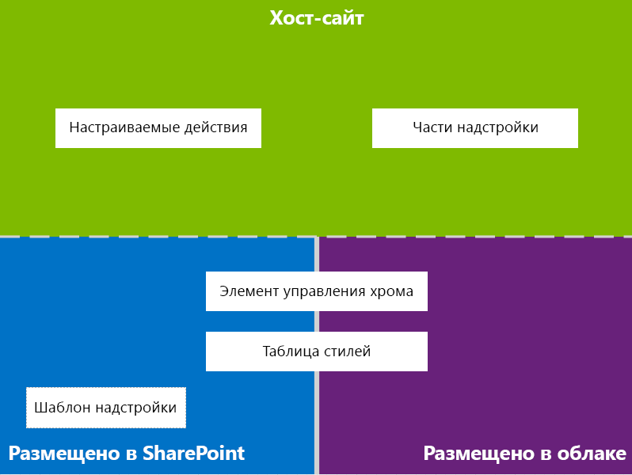
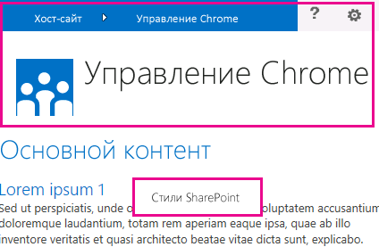
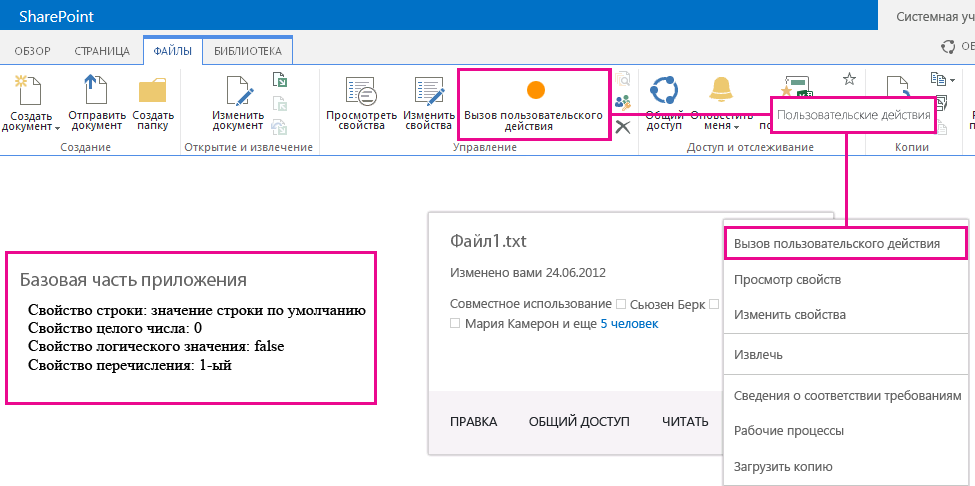

# Проектирование пользовательского интерфейса для надстроек SharePoint
Узнайте о параметрах пользовательской рабочей среды (UX), доступных вам при создании надстроек в SharePoint 2013.
В качестве разработчика при создании надстроек вы всегда должны уделять огромное внимание пользовательской рабочей среде (UX). Модель для надстроек SharePoint предлагает множество компонентов пользовательской рабочей среды и механизмов для создания её великолепных версий. Пользовательская рабочая среда в модели надстройки также обладает достаточной степенью гибкости, чтобы дать вам возможность использовать технологии и платформы, оптимально подходящие для потребностей конечных пользователей.
  
    
    

## Общий обзор пользовательской рабочей среды надстройки в SharePoint 2013

Вы, как разработчик надстроек, должны знать архитектуру своей надстройки. Если вы уже решили, как ваша надстройка будет распределена по удаленным и SharePoint-платформам, можно определяться с выбором доступных вариантов создания пользовательского рабочего интерфейса для вашей надстройки. Вы можете задать себе следующие вопросы:
  
    
    

- Чем мне можно пользоваться при создании надстройки с размещением в облаке?
    
  
- Чем можно пользоваться при созданиинадстройки с хостингом, предоставляемым SharePoint? Дополнительные сведения см. в статье  [Выбор шаблонов для разработки и размещения надстройки SharePoint](choose-patterns-for-developing-and-hosting-your-sharepoint-add-in.md).
    
  
- Как подключить пользовательскую рабочую среду к хост-сети? Дополнительные сведения см. в статье  [Хост-сайты, сайты надстроек и компоненты SharePoint в SharePoint 2013](host-webs-add-in-webs-and-sharepoint-components-in-sharepoint-2013.md).
    
  
На следующей схеме представлены основные сценарии и варианты, которые можно использовать при проектировании пользовательской рабочей среды надстройки.
  
    
    

**Рисунок 1. Основные сценарии и варианты пользовательской рабочей среды надстройки**

  
    
    

  
    
    

  
    
    
При выборе дизайна необходимо основательно продумать, какие части вашей надстройки будут размещены в SharePoint, а какие нет. Необходимо также продумать, каким образом ваша надстройка будет взаимодействовать с хост-сетью.
  
    
    

## Сценарии пользовательской рабочей среды в надстройках с размещением в облаке

Предположим, что вы решаете не размещать определенную рабочую среду в SharePoint. В данных сценариях предполагается, что ваши конечные пользователи будут перемещаться между веб-сайтом SharePoint и надстройкой в облаке. Вы можете использовать технологии и инструменты платформы, но SharePoint также предоставляет ресурсы, которые помогут спроектировать удобную рабочую среду для пользователей.
  
    
    
Следующие ресурсы рабочих сред доступны для надстроек с размещением в облаке SharePoint 2013:
  
    
    

- **Элемент управления хрома.**Элемент управления хрома позволяет использовать заголовок навигации определенного веб-сайта SharePoint в вашей надстройке, не прибегая к регистрации серверной библиотеки или использованию конкретной технологии или инструмента. Чтобы использовать данную функцию необходимо зарегистрировать библиотеку SharePoint JavaScript с помощью стандартных тегов <script>. Вы можете установить заполнитель с помощью элемента HTML **div** и затем настроить управление с помощью доступных вариантов. Управление имеет такой же вид, что и указанный веб-сайт SharePoint. Дополнительные сведения см. в статье [Использование клиентского элемента управления хрома в надстройках для SharePoint](use-the-client-chrome-control-in-sharepoint-add-ins.md).
    
   **Посмотрите видео об элементе управления хрома в SharePoint 2013**

  

  
    
    

  
    
    

  
    
    

  
    
    
- **Таблица стилей.** Вы можете оставить ссылку на таблицу стилей веб-сайта SharePoint в Надстройка SharePoint и использовать её для оформления стилей ваших веб-страниц с помощью доступных классов. Помимо этого, если конечные пользователи меняют тему веб-сайта SharePoint, вы можете назначить новые наборы стилей, не меняя ссылку в надстройке. Дополнительные сведения см. в статье [Использование таблицы стилей веб-сайта SharePoint в надстройках для SharePoint](use-a-sharepoint-website-s-style-sheet-in-sharepoint-add-ins.md).
    
  
На рис. 2 показаны ресурсы в Модель для надстроек SharePoint для надстроек с размещением в облаке.
  
    
    

**Рис. 2. Ресурсы пользовательских рабочих сред для надстроек с размещением в облаке**

  
    
    

  
    
    

  
    
    

  
    
    

  
    
    

## Сценарии пользовательских рабочих сред в надстройках с хостингом, предоставляемым SharePoint

Если ваша надстройка размещена в SharePoint, маловероятно, что пользовательская рабочая среда значительно изменится, когда пользователи будут перемещаться между хост-сетью и сетью надстройки. После развертывания надстройки сеть надстройки использует таблицу стилей и тему из хост-сети. Вы можете по прежнему пользоваться элементом управления хрома и таблицей стилей в надстройке, размещенной в SharePoint, но наиболее значительным отличием от сценариев, размещенных в облаке, является доступность шаблона надстройки.
  
    
    
Для надстроек, размещенных в SharePoint, доступен следующий ресурс пользовательских рабочих сред:
  
    
    

- **Шаблон надстройки.** В шаблон надстройки входит главная страница (masterpage) **app.master**. При создании сети надстройки этот параметр задается по умолчанию.
    
  
Надстройки, размещенные в SharePoint, также имеют возможность использовать существующие в SharePoint ресурсы и технологии, такие как лента, инфраструктура веб-частей и отображение со стороны клиента.
  
    
    

## Сценарии для подключения пользовательского интерфейса надстройки к хост-сети

В некоторых случаях используемые вами надстройки могут запускаться изнутри хост-сети. Дополнительно к отображениям некоторых рабочих сред вашей надстройки на страницах, размещенных в SharePoint, доступны способы открытия надстроек из библиотеки документов и списка.
  
    
    
Для подключения интерфейса вашей надстройки к хост-сети доступны следующие ресурсы пользовательских рабочих сред:
  
    
    

- **Настраиваемые действия.** Настраиваемые действия могут использоваться для подключения к вашей надстройки пользовательской рабочей среды. Существует два типа настраиваемых действий:Лента илиECB. Настраиваемое действие способно посылать параметры, такие как список или элемент, на которых оно было вызвано, в удаленную сеть. Дополнительные сведения см. в статье  [Выполнение пользовательских действий для развертывания надстроек для SharePoint](create-custom-actions-to-deploy-with-sharepoint-add-ins.md).
    
  
- **Веб-части надстройки.** С помощью веб-частей надстроек вы можете добавлять в хост-сеть рабочие среды ваших надстроек. Веб-часть надстройки доступна в галерее Web Part хост-сети после развертывания надстройки. Пользователи могут добавлять веб-часть надстройки на страницу с помощью элемента управления **Web Part Adder**. Дополнительные сведения см. в статье [Создание веб-частей надстройки для установки совместно с надстройкой для SharePoint](create-add-in-parts-to-install-with-your-sharepoint-add-in.md).
    
  
На рисунке 3 показаны ресурсы Модель для надстроек SharePoint для подключения среды надстройки к хост-сети.
  
    
    

**Рис. 3. Ресурсы пользовательской рабочей среды надстройки для хост-сети**

  
    
    

  
    
    

  
    
    

  
    
    

  
    
    

## Дополнительные ресурсы

Чтобы узнать, как использовать параметры пользовательской рабочей среды надстройки в Надстройки SharePoint, см. следующие ресурсы:
  
    
    

-  [Проектирование надстроек для SharePoint](design-sharepoint-add-ins.md)
    
  
-  [Надстройки SharePoint](sharepoint-add-ins.md)
    
  
-  [Существует три способа рассмотрения возможностей проектирования надстроек SharePoint](three-ways-to-think-about-design-options-for-sharepoint-add-ins.md)
    
  
-  [Важные аспекты архитектуры и разработки надстройки SharePoint](important-aspects-of-the-sharepoint-add-in-architecture-and-development-landscap.md)
    
  
-  [Хост-сайты, сайты надстроек и компоненты SharePoint в SharePoint 2013](host-webs-add-in-webs-and-sharepoint-components-in-sharepoint-2013.md)
    
  
-  [Рекомендации по UX design для надстроек для SharePoint](sharepoint-add-ins-ux-design-guidelines.md)
    
  
-  [Создание компонентов UX в SharePoint 2013](create-ux-components-in-sharepoint-2013.md)
    
  
-  [Использование таблицы стилей веб-сайта SharePoint в надстройках для SharePoint](use-a-sharepoint-website-s-style-sheet-in-sharepoint-add-ins.md)
    
  
-  [Использование клиентского элемента управления хрома в надстройках для SharePoint](use-the-client-chrome-control-in-sharepoint-add-ins.md)
    
  
-  [Создание веб-частей надстройки для установки совместно с надстройкой для SharePoint](create-add-in-parts-to-install-with-your-sharepoint-add-in.md)
    
  
-  [Выполнение пользовательских действий для развертывания надстроек для SharePoint](create-custom-actions-to-deploy-with-sharepoint-add-ins.md)
    
  

