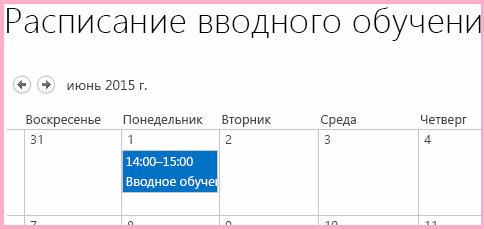
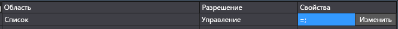
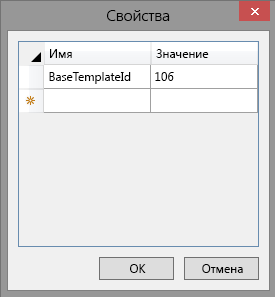
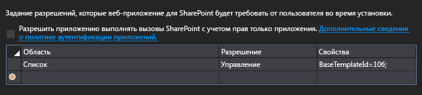
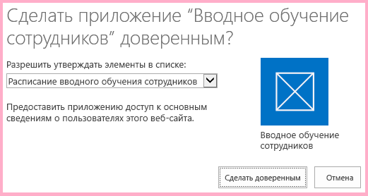
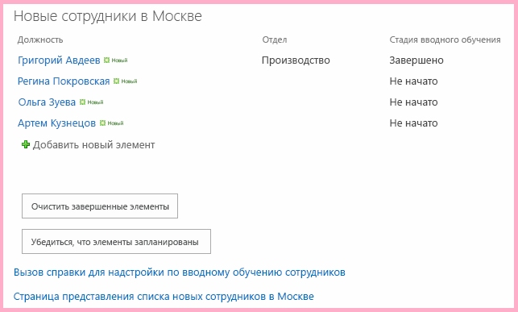
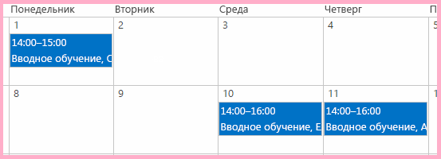

# Работа с данными хост-сайта из JavaScript на сайте надстройки
В данной статье речь идет об использовании объектной модели JavaScript (JSOM) в SharePoint для работы с данными SharePoint на хост-сайте из JavaScript на страницах сайта надстройки.
Это одиннадцатая часть из серии статей о том, как разрабатывать Надстройки SharePoint, размещаемые в SharePoint. Сначала вам необходимо ознакомиться со статьей  [Надстройки SharePoint](sharepoint-add-ins.md) и с указанными ниже предыдущими статьями серии.


-  [Знакомство с созданием надстроек SharePoint с размещением в SharePoint](get-started-creating-sharepoint-hosted-sharepoint-add-ins.md)


-  [Развертывание и установка надстроек для SharePoint](deploy-and-install-a-sharepoint-hosted-sharepoint-add-in.md)


-  [Добавление настраиваемых столбцов в надстройку с размещением в SharePoint](add-custom-columns-to-a-sharepoint-hostedsharepoint-add-in.md)


-  [Добавление настраиваемого типа контента в надстройку для SharePoint с размещением в SharePoint](add-a-custom-content-type-to-a-sharepoint-hostedsharepoint-add-in.md)


-  [Добавление веб-части на страницу в надстройку для SharePoint с размещением в SharePoint](add-a-web-part-to-a-page-in-a-sharepoint-hosted-sharepoint-add-in.md)


-  [Добавление рабочего процесса в надстройку для SharePoint с размещением в SharePoint](add-a-workflow-to-a-sharepoint-hosted-sharepoint-add-in.md)


-  [Добавление настраиваемой страницы и стиля для надстройки с размещением в SharePoint](add-a-custom-page-and-style-to-a-sharepoint-hosted-sharepoint-add-in.md)


-  [Добавление настраиваемой функции отрисовки в клиенте в надстройку SharePoint, размещаемую в SharePoint](add-custom-client-side-rendering-to-a-sharepoint-hosted-sharepoint-add-in.md)


-  [Создание настраиваемой кнопки ленты на хост-сайте надстройки SharePoint](create-a-custom-ribbon-button-in-the-host-web-of-a-sharepoint-add-in.md)


-  [Использование API JavaScript для SharePoint для работы с данными SharePoint](use-the-sharepoint-javascript-apis-to-work-with-sharepoint-data.md)


> **Примечание**
> Если вы изучали предыдущие статьи этой серии о надстройках, размещаемых в SharePoint, то у вас уже есть решение Visual Studio, которое можно использовать для продолжения работы с данной статьей. Кроме того, вы можете скачать репозиторий  [SharePoint_SP-hosted_Add-Ins_Tutorials](https://github.com/OfficeDev/SharePoint_SP-hosted_Add-Ins_Tutorials) и открыть файл BeforeHostWebData.sln.


По умолчанию SharePoint запрещает JavaScript в надстройке получать доступ к данным на других сайтах SharePoint в ферме. Это позволяет предотвратить доступ сценариев во вредоносных надстройках к конфиденциальным данным. Но зачастую надстройке необходимо иметь доступ к хост-сайту или другим веб-сайтам в том же семействе сайтов, в котором находится хост-сайт. В этом случае можно воспользоваться двумя указанными ниже способами.
- Запросить разрешение на доступ к хост-сайту в файле манифеста надстройки. При установке надстройки пользователю будет предложено предоставить ей это разрешение. Если пользователь не даст разрешения, то ему не удастся установить надстройку.


- Для совершения вызовов JSOM к хост-сайту вместо объекта **SP.ClientContext** использовать объект **SP.AppContextSite**. Этот объект дает надстройке возможность получать объекты контекста для веб-сайтов, отличных от сайта надстройки, но входящих в то же семейство веб-сайтов. Существует еще один способ доступа к любому веб-сайту в подписке SharePoint Online (или локальном веб-приложении SharePoint), но это более сложная тема. 


 В данной статье вы будете использовать JSOM для поиска еще не запущенных процессов вводного обучения и проверки того, что они запланированы в календаре на хост-сайте.
## Подготовка календаря хост-сайта

Откройте хост-сайт (ваш тестовый веб-сайт разработчика) и убедитесь, что на нем есть календарь Employee Orientation Schedule (Расписание вводного обучения для сотрудников) с одним событием Orient Cassie Hicks (Вводное обучение для Cassie Hicks). Если его нет, выполните указанные ниже действия.


1. На домашней странице сайта последовательно выберите пункты **Site Contents** (Содержание сайта), **add an add-in** (Добавить надстройку) и **Calendar** (Календарь).


2. В диалоговом окне **Adding Calendar** (Добавление календаря) в поле **Name** (Имя) введитеEmployee Orientation Schedule (Расписание вводного обучения для сотрудников), а затем нажмите кнопку **Create** (Создать).


3. Когда откроется календарь, переместите курсор на любую дату, чтобы на ней появилась ссылка **Add** (Добавить), и перейдите по этой ссылке.


4. В диалоговом окне **Employee Orientation Schedule - New Item** (Расписание вводного обучения для сотрудников: новый элемент) в поле **Title** (Название) введитеOrient Cassi Hicks (Вводное обучение для Cassi Hicks). В остальных полях оставьте значения, используемые по умолчанию, а затем нажмите кнопку **Save** (Сохранить).

    Календарь должен иметь примерно следующий вид:


   **Настраиваемый календарь**





## Создание JavaScript и кнопки для его вызова


1. В **обозревателе решений** откройте файл Add-in.js в узле **Scripts** (Сценарии).


2. Под объявлением  `completedItems` добавьте указанные ниже объявления.

  - Переменная  `notStartedItems` ссылается на элементы в списке **New Employees in Seattle** (Новые сотрудники в Сиэтле), в котором параметр **Orientation Stage** (Этап вводного обучения) имеет значение **Not Started** (Не начат).


  - Переменная  `calendarList` ссылается на календарь, который вы создали на хост-сайте.


  - Переменная  `scheduledItems` ссылается на коллекцию элементов в календаре.


 ```

var notStartedItems;
var calendarList;
var scheduledItems;
 ```

3. Когда Надстройка SharePoint запущена, SharePoint вызывает ее начальную страницу и добавляет в URL-адрес страницы несколько параметров запроса. Один из этих параметров —  `SPHostUrl`, который представляет собой URL-адрес хост-сайта. Надстройке необходима эта информация, чтобы совершать вызовы к данным хост-сайта, поэтому в начале файла Add-in.js сразу же после объявления переменных для  `scheduledItems` добавьте указанную ниже строку. Обратите внимание на указанные ниже особенности этого кода.

  -  `getQueryStringParameter` — это служебная функция, которую вы создадите на следующем этапе.


  -  `decodeUriComponent` — это стандартная функция JavaScript, выполняющая обратное преобразование кодировки универсального кода ресурса (URI), которое SharePoint совершает для параметров запроса. Например, код %2F для косой черты будет преобразован обратно в символ /.


 ```

var hostWebURL = decodeURIComponent(getQueryStringParameter("SPHostUrl"));
 ```

4. Добавьте указанный ниже код в конец файла. Эту функцию можно использовать для чтения параметров запроса. 

 ```
  // Utility functions

function getQueryStringParameter(paramToRetrieve) {
     var params = document.URL.split("?")[1].split("&amp;");
     var strParams = "";
     for (var i = 0; i < params.length; i = i + 1) {
         var singleParam = params[i].split("=");
         if (singleParam[0] == paramToRetrieve) {
             return singleParam[1];
        }
     }
 }
 ```

5. Добавьте указанную ниже функцию в файл Add-in.js перед разделом обратных вызовов при сбоях. Обратите внимание на указанные ниже особенности этого кода.

  - Этот код практически идентичен методу для запросов к спискам, который получает элементы с состоянием **Completed** (Завершен), за тем исключением, что он получает элементы с состоянием **Not Started** (Не начат), а не **Completed** (Завершен). Нас интересуют только элементы с состоянием **Not Started** (Не начат), так как в сценарии применяется упрощающее допущение о том, что если процесс вводного обучения прошел этап **Not Started** (Не начат), то обучение должно уже быть запланирована.


  -  На следующих этапах вы создадите два метода обратного вызова в вызове **executeQueryAsync**.


 ```

function ensureOrientationScheduling() {

    var camlQuery = new SP.CamlQuery();
    camlQuery.set_viewXml(
        '<View><Query><Where><Eq>' +
            '<FieldRef Name=\\'OrientationStage\\'/><Value Type=\\'Choice\\'>Not started</Value>' +
        '</Eq></Where></Query></View>');
    notStartedItems = employeeList.getItems(camlQuery);

    clientContext.load(notStartedItems);
    clientContext.executeQueryAsync(getScheduledOrientations, onGetNotStartedItemsFail);
    return false;
}
 ```

6. Добавьте указанную ниже функцию в файл Add-in.js сразу же после предыдущей функции. Обратите внимание, что она использует объект  `hostWebContext` для идентификации списка, к которому выполняется запрос.

    > **Примечание**
      > Обратите внимание, что в запрос CAML не добавляется никакой разметки запроса. Последствия отсутствия реального запроса в объекте запроса состоят в том, что будут получены  *все*  значения времени из списка. Если список слишком большой, то запрос к серверу может выполняться неприемлемо долго. В этом случае нам понадобится другой способ достижения цели. Тем не менее в этом примере с очень маленьким списком (списки календарей почти всегда маленькие) мы получаем весь список, поэтому можем выполнять итерации в списке в клиенте, что позволит нам свести к минимуму количество вызовов к серверу, то есть вызовов **executeQueryAsync**. 

 ```

function getScheduledOrientations() {

    var hostWebContext = new SP.AppContextSite(clientContext, hostWebURL);
    calendarList = hostWebContext.get_web().get_lists().getByTitle('Employee Orientation Schedule');

    var camlQuery = new SP.CamlQuery();
    scheduledItems = calendarList.getItems(camlQuery);

    clientContext.load(scheduledItems);
    clientContext.executeQueryAsync(scheduleAsNeeded, onGetScheduledItemsFail);
}
 ```

7. Добавьте указанную ниже функцию в файл. Обратите внимание на указанные ниже особенности этого кода.

  - Этот метод проверяет, содержится ли название элемента с состоянием **Not Started** (Не начат) из списка **New Employees In Seattle** (Новые сотрудники в Сиэтле), представляющего собой имя сотрудника, в названии события в календаре **Employee Orientation Schedule** (Расписание вводного обучения для сотрудников). При этом применяется упрощающее допущение, что при создании всех записей в календаре в названиях событий используются полные имена сотрудников.


  - Если ни одно из уже имеющихся в календаре событий не совпадает с элементом с состоянием **Not Started** (Не начат), то сценарий создает элемент календаря для элемента с состоянием **Not Started** (Не начат).


  - JSOM использует "легковесный" объект **ListItemCreationInformation** вместо объекта **SPListItem**, чтобы свести к минимуму объем полезных данных, отправляемых на сервер SharePoint.


  - Двум полям типа DateTime нового события календаря присвоены даты месяца, в котором была написана эта статья:  `2015-06`.  *Измените эти даты на день текущих месяца и года, чтобы не нужно было прокручивать календарь для поиска этих элементов.* 


  - Если будет обнаружено, что каких-либо элементов с состоянием **Not Started** (Не начат) нет в расписании, то первый элемент будет внесен в расписание на 10-е число месяца. Каждый дополнительный элемент, которого нет в расписании, будет вноситься в расписание со сдвигом на один день. В примере используется упрощающее допущение, подразумевающее, что элементов не так много и они не будут запланированы на несуществующие дни месяца, например, на 32-е число.


  - Большая часть кода представляет собой стандартный JavaScript. Строки, в которых используется JSOM для SharePoint, сопровождаются комментариями.


 ```

function scheduleAsNeeded() {

    var unscheduledItems = false;
    var dayOfMonth = '10';

    var listItemEnumerator = notStartedItems.getEnumerator();

    while (listItemEnumerator.moveNext()) {
        var alreadyScheduled = false;
        var notStartedItem = listItemEnumerator.get_current();

        var calendarEventEnumerator = scheduledItems.getEnumerator();
        while (calendarEventEnumerator.moveNext()) {
            var scheduledEvent = calendarEventEnumerator.get_current();

             // The SP.ListItem.get_item('field_name ') method gets the value of the specified field.
            if (scheduledEvent.get_item('Title').indexOf(notStartedItem.get_item('Title')) > -1) {
                alreadyScheduled = true;
                break;
            }
        }
        if (alreadyScheduled === false) {

             // SP.ListItemCreationInformation holds the information the SharePoint server needs to
             // create a list item
            var calendarItem = new SP.ListItemCreationInformation();

             // The some_list .additem method tells the server which list to add 
             // the item to.
            var itemToCreate = calendarList.addItem(calendarItem);

             // The some_item .set_item method sets the value of the specified field.
            itemToCreate.set_item('Title', 'Orient ' + notStartedItem.get_item('Title'));

             // The EventDate and EndDate are the start and stop times of an event.
            itemToCreate.set_item('EventDate', '2015-06-' + dayOfMonth + 'T21:00:00Z');
            itemToCreate.set_item('EndDate', '2015-06-' + dayOfMonth + 'T23:00:00Z');
            dayOfMonth++;

             // The update method tells the server to commit the changes to the SharePoint database.
            itemToCreate.update();
            unscheduledItems = true;
        }
    }
    if (unscheduledItems) {
        calendarList.update();
        clientContext.executeQueryAsync(onScheduleItemsSuccess, onScheduleItemsFail);
    }
}
 ```

8. Добавьте указанный ниже обработчик успешного выполнения, который вызывается при добавлении элементов, которых ранее не было в расписании, в календарь.

 ```

function onScheduleItemsSuccess() {
    alert('There was one or more unscheduled orientations and they have been added to the '
              + 'Employee Orientation Schedule calendar.');
}
 ```

9. Добавьте указанные ниже функции обработки сбоев в раздел Failure callbacks файла.

 ```

function onGetNotStartedItemsFail(sender, args) {
    alert('Unable to get the not-started items. Error:' 
        + args.get_message() + '\\n' + args.get_stackTrace());
}

function onGetScheduledItemsFail(sender, args) {
    alert('Unable to get scheduled items from host web. Error:' 
        + args.get_message() + '\\n' + args.get_stackTrace());
}

function onScheduleItemsFail(sender, args) {
    alert('Unable to schedule items on host web calendar. Error:' 
        + args.get_message() + '\\n' + args.get_stackTrace());
}
 ```

10. Откройте файл default.aspx и найдите элемент **asp:Content** с идентификатором **PlaceHolderMain**.


11. Добавьте указанную ниже разметку сразу же после кнопки  `purgeCompletedItems`.

 ```HTML

<p><asp:Button runat="server" OnClientClick="return ensureOrientationScheduling()"
  ID="ensureorientationschedulingbutton" Text="Ensure all items are on the Calendar" /></p>
 ```

12. Перестройте проект в Visual Studio.


13. Чтобы при тестировании надстройки свести к минимуму ручную работу по присвоению полям **Orientation Stage** (Этап вводного обучения) элементов списка значенийNot Started (Не начат), откройте файл elements.xml для экземпляра списка **NewEmployeesInSeattle** (это не файл elements.xml для шаблона списка **NewEmployeeOrientation**) и проверьте, что параметр Orientation Stage (Этап вводного обучения) для трех самых маленьких элементов **Row**,  *, включая строку для Cassie Hicks*  , имеет значениеNot Started (Не начат). Так как это значение, используемое по умолчанию, то самый простой способ сделать это — убедиться, что отсутствуют элементы **Field** для `OrientationStage` для этих трех (или большего количества) строк.

    Ниже показано, как должен выглядеть элемент **Rows**.


 ```

<Rows>
  <Row>
    <Field Name="Title">Tom Higginbotham</Field>
    <Field Name="Division">Manufacturing</Field>
    <Field Name="OrientationStage">Completed</Field>
  </Row>
  <Row>
    <Field Name="Title">Satomi Hayakawa</Field>
  </Row>
  <Row>
    <Field Name="Title">Cassi Hicks</Field>
  </Row>
  <Row>
    <Field Name="Title">Lertchai Treetawatchaiwong</Field>
  </Row>
</Rows>
 ```


## Указание необходимых надстройке разрешений на доступ к хост-сайту

Ваша надстройка автоматически получает разрешение на полный контроль над ее сайтом, поэтому до сих пор вам не нужно было указывать, какие разрешения необходимы для надстройки. Для взаимодействия с данными на хост-сайте вам потребуется отдельно запросить разрешения на доступ к хост-сайту. Надстройке Employee Orientation необходимо разрешение для добавления элементов в календарь на хост-сайте. 


1. В **обозревателе решений** откройте файл appmanifest.xml.


2. В конструкторе манифеста перейдите на вкладку **Разрешения**.


3. В верхней строке столбца **Область** в раскрывающемся списке выберите значение **Список**.


4. В столбце **Разрешение** выберите **Управление**.


5. Если оставить столбец **Свойства** пустым, надстройка будет запрашивать разрешение на запись в каждый список на хост-сайте. Рекомендуется предоставлять надстройкам только те разрешения, которые необходимы для их работы. В манифесте надстройки вам не удастся предоставить разрешения только для определенного экземпляра списка, но можно предоставить надстройке разрешения только для тех экземпляров списков, которые созданы на основе определенного базового шаблона списка. Базовый шаблон списка календаря — это шаблон **Events** с числовым идентификатором 106.

    В той же строке щелкните ячейку **Свойства**, чтобы в ней появилась кнопка **Изменить**. Теперь список разрешений должен иметь примерно следующий вид:


   **Список разрешений с отображенной кнопкой "Изменить"**





6. Нажмите кнопку **Изменить**. Откроется диалоговое окно **Свойства**.


7. Присвойте параметру **Имя** значениеBaseTemplateID, а параметру **Значение** —106. Теперь диалоговое окно должно иметь указанный ниже вид.

   **Диалоговое окно со свойствами разрешений для списка**





    Нажмите кнопку **OK**. Теперь вкладка **Разрешения** должна иметь примерно следующий вид:


   **Вкладка "Разрешения" в конструкторе манифеста надстройки в Visual Studio**





## Запуск и тестирование надстройки


1. Убедитесь, что календарь хост-сайта подготовлен, как описано ранее в данной статье. В нем должно быть одно событие с именем "Orient Cassi Hicks" (Вводное обучение для Cassi Hicks).


2. Включите всплывающие окна в браузере, который Visual Studio использует при отладке.


3. Нажмите клавишу F5, чтобы развернуть и запустить надстройку. Visual Studio выполнит временную установку надстройки на тестовом сайте SharePoint и сразу же запустит ее. 


4. Откроется форма согласия на предоставление разрешения, в которой вы можете предоставить надстройке необходимые ей разрешения. На странице имеется раскрывающийся список, в котором представлены все календари на хост-сайте. Выберите **Employee Orientation Schedule** (Расписание вводного обучения для сотрудников), а затем — **Доверять**.

   **Запрос на согласие для надстройки SharePoint**





5. После полной загрузки начальной страницы надстройки нажмите кнопку **Ensure Items are Scheduled** (Добавить элементы в расписание).

   **Домашняя страница надстройки Employee Orientation с новой кнопкой**





6. Если будет запущена любая из функций обработки сбоев, то отобразится созданное ею сообщение об ошибке. В противном случае отобразится сообщение об успешном выполнении, созданное обратным вызовом успешного выполнения: **There was one or more unscheduled orientations and they have been added to the Employee Orientation Schedule calendar** (Имелся один или несколько не внесенных в список процессов вводного обучения. Все они добавлены в календарь Employee Orientation Schedule).


7. Перейдите к календарю **Employee Orientation Schedule** (Расписание вводного обучения для сотрудников) на хост-сайте. Например, щелкните ссылку навигации на начальную страницу вашего сайта разработчика, а затем — **Site Contents** (Содержание сайта). Затем выберите плитку **Employee Orientation Schedule** (Расписание вводного обучения для сотрудников), но не плитку **Employee Orientation** (Вводное обучение для сотрудников).

    Календарь должен выглядеть примерно так, как показано ниже. В ходе выполнения сценария было обнаружено, что уже имеется событие для сотрудника Cassi Hicks, поэтому еще одно событие для этого сотрудника не создавалось. Вместо этого были созданы события для двух других сотрудников, для процесса вводного обучения которых было установлено состояние **Not Started** (Не начат). Кроме того, не было создано событие для сотрудника, чей процесс вводного обучения уже прошел этап **Not Started** (Не начат).


   **Календарь после добавления двух событий**





8.  *Прежде чем еще раз нажать кнопку **Ensure Items are Scheduled** (Добавить элементы в расписание), обязательно удалите два новых события из календаря.* 


9. Чтобы завершить сеанс отладки, закройте окно браузера или остановите отладку в Visual Studio. При каждом нажатии клавиши F5 Visual Studio будет отзывать предыдущую версию надстройки и устанавливать ее последнюю версию.


10. Вы будете работать с этой надстройкой и решением Visual Studio и при изучении других статей, поэтому при перерывах в работе рекомендуется отзывать надстройку. В **обозревателе решений** щелкните проект правой кнопкой мыши и выберите пункт **Отозвать**.


## 
<a name="Nextsteps"> </a>

Теперь вы можете более глубоко изучить Надстройки SharePoint, размещаемые в SharePoint. Для этого прочитайте указанные ниже статьи. 


-  [Проектирование надстроек для SharePoint](design-sharepoint-add-ins.md)


-  [Разработка надстроек для SharePoint](develop-sharepoint-add-ins.md)


-  [Публикация надстроек для SharePoint](publish-sharepoint-add-ins.md)


-  [Средства и среды для разработки надстроек для SharePoint](tools-and-environments-for-developing-sharepoint-add-ins.md)


