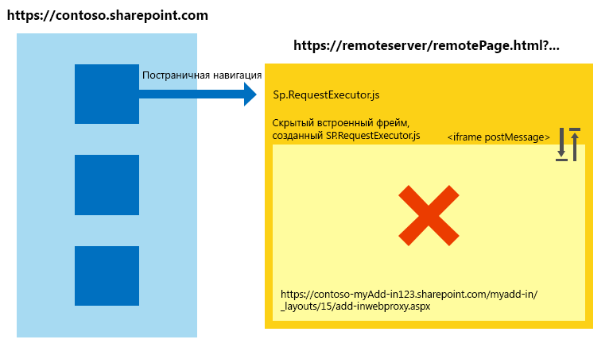
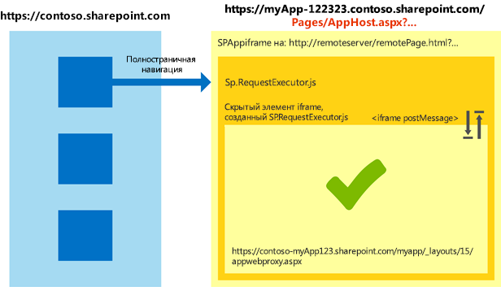

# Работа с междоменной библиотекой в различных зонах безопасности Internet Explorer в надстройках SharePoint
Узнайте, как использовать междоменную библиотеку в SharePoint 2013, если страницы хост-сайта и надстройки находятся в разных зонах безопасности в Windows Internet Explorer.
Если вы используете междоменную библиотеку SharePoint 2013 для своих надстроек, вы должны понимать, как работают зоны безопасности в Internet Explorer. Если веб-сайт SharePoint и надстройка находятся в разных зонах, то могут возникнуть проблемы со связью между ними. В этой статье объясняется, что происходит при использовании междоменной библиотеки в разных зонах безопасности Internet Explorer.


## Сценарии использования междоменной библиотеки SharePoint в разных зонах в Internet Explorer
<a name="bk_crosszonescenarios"> </a>

В целях обеспечения безопасности браузер Internet Explorer запрещает обмениваться файлами cookie страницам с разными уровнями целостности (также называемыми зонами безопасности), так как каждый уровень целостности имеет собственное хранилище файлов cookie. Уровень целостности определяется страницей верхнего уровня. Каждый фрейм на ней будет иметь один и тот же уровень целостности. Подробнее см. в записи блога  [Проблемы, связанные с обменом файлами cookie между разными зонами](http://blogs.msdn.com/b/ieinternals/archive/2011/03/10/internet-explorer-beware-cookie-sharing-in-cross-zone-scenarios.aspx).


Междоменная библиотека SharePoint использует скрытый элемент **IFrame** и клиентскую прокси-страницу, размещенную в SharePoint, для обеспечения взаимодействия на стороне клиента с помощью JavaScript. Чтобы получить доступ к междоменной библиотеке, нужно сослаться на странице на файл sp.requestexecutor.js. Узнать больше можно в разделе [Обращение к данным SharePoint 2013 из надстроек с помощью междоменной библиотеки](access-sharepoint-2013-data-from-add-ins-using-the-cross-domain-library.md).


Если страница удаленной надстройки и веб-сайт SharePoint находятся в разных зонах безопасности, отправка файлов cookie авторизации невозможна. Если эти файлы отсутствуют и элемент **IFrame** пытается загрузить прокси-страницу, он перенаправляется на страницу входа SharePoint. В целях безопасности страница входа SharePoint не может содержаться в элементе **IFrame**. В такой ситуации библиотека не может загрузить прокси-страницу, и связь с SharePoint невозможна.


На следующей схеме показан сценарий с разными зонами, в котором загрузка прокси-страницы невозможна. Страница верхнего уровня помещает фрейм в ту же зону безопасности, что и страницу  `http://remoteserver/remotepage.html`. Прокси-страница не загружается.


**Рис. 1. Сценарий с разными зонами, в котором загрузка прокси-страницы невозможна**





Ниже приведены некоторые примеры ситуаций, в которых междоменной библиотеке может не удасться загрузить прокси-страницу.


- Ваши клиенты используют SharePoint Online, а страница вашей удаленной надстройки размещена на сервере в интрасети. В такой ситуации с большой долей вероятности будут возникать проблемы с загрузкой прокси-страницы, так как URL-адрес SharePoint Online обычно не находится в зоне местной интрасети. Это весьма распространенный сценарий при начальной разработке надстройки, так как вы можете использовать IIS Express или другой локальный сервер для размещения страницы без реального интернет-домена.


- Ваши клиенты используют локальное развертывание SharePoint с проверкой подлинности на основе форм, а ваша удаленная страница размещена в облачной службе (например, Microsoft Azure).


## Сценарии с разными зонами в приложениях для Надстройки SharePoint
<a name="bk_handlingcrosszone"> </a>

Существует два способа решить эту проблему как при разработке надстройки (настоятельно рекомендуется), так и во время ее выполнения.


### Рекомендованный способ: использование шаблона apphost

Чтобы устранить проблемы, связанные с взаимодействием между разными зонами, мы рекомендуем вам использовать страницу apphost в SharePoint. Страница apphost — это страница SharePoint, содержащая удаленную страницу в элементе **IFrame**. Все содержимое элемента **IFrame** на странице apphost находится в той же зоне безопасности, что и сайт надстройки. Междоменная библиотека на удаленной странице может получать файлы cookie авторизации и успешно загружает прокси-страницу.


На следующей схеме показано, как решается проблема с разными зонами при использовании шаблона страницы apphost. 


**Рис. 2. Решение проблемы с разными зонами при использовании шаблона страницы apphost**





Код, требуемый для страницы apphost, прост. Основной ее частью является элемент **SPAppIFrame**. Вам нужно сделать элемент **IFrame** невидимым с помощью CSS, чтобы он не мешал работе надстройки.


Ниже приведен пример разметки для простой страницы apphost. В нем выполняются следующие действия:


- объявляются директивы, необходимые при использовании компонентов SharePoint;


- объявляются стили, чтобы сделать элемент **IFrame** невидимым;


- объявляется элемент **SPAppIFrame**, который связывается с начальной страницей надстройки.



```HTML

<%@ Page
    Inherits="Microsoft.SharePoint.WebPartPages.WebPartPage, Microsoft.SharePoint, Version=15.0.0.0, Culture=neutral, PublicKeyToken=71e9bce111e9429c" 
    language="C#" %>
<%@ Register 
    Tagprefix="SharePoint" 
    Namespace="Microsoft.SharePoint.WebControls" 
    Assembly="Microsoft.SharePoint, Version=15.0.0.0, Culture=neutral, PublicKeyToken=71e9bce111e9429c" %>
<%@ Register 
    Tagprefix="Utilities" 
    Namespace="Microsoft.SharePoint.Utilities" 
    Assembly="Microsoft.SharePoint, Version=15.0.0.0, Culture=neutral, PublicKeyToken=71e9bce111e9429c" %>
<%@ Register 
    Tagprefix="WebPartPages" 
    Namespace="Microsoft.SharePoint.WebPartPages" 
    Assembly="Microsoft.SharePoint, Version=15.0.0.0, Culture=neutral, PublicKeyToken=71e9bce111e9429c" %>

<html>
<head>
    <title>Your add-in page title</title>
    <style type="text/css">
        html, body
        {
            overflow:hidden;
        }
    
        body
        {
            margin:0px;
            padding:0px;
        }
     
        iframe 
        {
            border:0px;
            height:100%;
            width:100%;
        }
    </style>
</head>

<body>
    <SharePoint:SPAppIFrame 
        runat="server" 
        src="~remoteAppUrl/StartPage.html?{StandardTokens}" 
        frameborder="0">
    </SharePoint:SPAppIFrame>
</body>
</html>
```

Если вы хотите, чтобы пользователи могли переходить по прямым ссылкам к частям надстройки, этого можно добиться, реализовав взаимодействие между страницей apphost и содержимым **IFrame**. Одним из вариантов является использование метода postMessage элемента **IFrame** и отдельных URL-адресов для каждой страницы удаленной надстройки. Чтобы реализовать отдельные URL-адреса для каждой страницы, вы можете создать отдельные страницы на сайте надстройки или использовать строковые параметры запроса на одной странице.


### Альтернативный подход: добавление сайтов в одну зону безопасности в Internet Explorer

Если при разработке надстройки шаблон apphost не использовался, вы все же можете обеспечить его работу, добавив следующие домены в одну зону безопасности: 


- домен сайта SharePoint (например,  `https://contoso.sharepoint.com`);


- домен надстройки, размещенной в облаке ( `http://remoteserver`);


- домен служб и страниц входа, размещенных на серверах Майкрософт ( `*.microsoftonline.com`).


Чтобы применить изменения ко всем компьютерам в организации, администраторы могут использовать политики Active Directory.


## Влияние использования шаблона apphost на безопасность
<a name="bk_securityimplications"> </a>

Важно заметить, что при использовании шаблона apphost удаленная страница, по сути, помещается в ту же зону безопасности, что и сайт надстройки. Вы должны понимать, какое влияние оказывает добавление сайта в зону на безопасность. Дополнительные сведения см. в статье  [Использование зон безопасности в Internet Explorer](http://support.microsoft.com/kb/174360/ru-ru).


## Работа в других браузерах: Chrome, Firefox и Safari
<a name="bk_otherbrowsers"> </a>

В других браузерах, таких как Google Chrome, Mozilla Firefox и Apple Safari, зоны безопасности не реализованы. Если браузер не помещает файлы cookie в изолированные хранилища, возможно, при его использовании не будут возникать трудности, описанные в этой статье. Мы рекомендуем вам использовать шаблон apphost в своих надстройках, чтобы гарантировать их правильную работу как в Internet Explorer, так и в других названных браузерах вне зависимости от зоны безопасности, в которой находится SharePoint.


## Дополнительные ресурсы
<a name="bk_addresources"> </a>


-  [Безопасный доступ к данным и клиентские объектные модели для надстроек SharePoint](secure-data-access-and-client-object-models-for-sharepoint-add-ins.md)


-  [Обращение к данным SharePoint 2013 из надстроек с помощью междоменной библиотеки](access-sharepoint-2013-data-from-add-ins-using-the-cross-domain-library.md)


-  [Надстройки SharePoint](sharepoint-add-ins.md)


-  [Авторизация и проверка подлинности для надстроек в SharePoint 2013](authorization-and-authentication-of-sharepoint-add-ins.md)


-  [Существует три способа рассмотрения возможностей проектирования надстроек SharePoint](three-ways-to-think-about-design-options-for-sharepoint-add-ins.md)


-  [Важные аспекты архитектуры и разработки надстройки SharePoint](important-aspects-of-the-sharepoint-add-in-architecture-and-development-landscap.md)


-  [Хост-сайты, сайты надстроек и компоненты SharePoint в SharePoint 2013](host-webs-add-in-webs-and-sharepoint-components-in-sharepoint-2013.md)


-  [Данные в надстройках SharePoint](important-aspects-of-the-sharepoint-add-in-architecture-and-development-landscap.md#Data)


-  [Создание пользовательской прокси-страницы для междоменной библиотеки в SharePoint 2013](create-a-custom-proxy-page-for-the-cross-domain-library-in-sharepoint-2013.md)


-  [Междоменная безопасность на стороне клиента](http://msdn.microsoft.com/ru-ru/library/cc709423%28vs.85%29.aspx)


