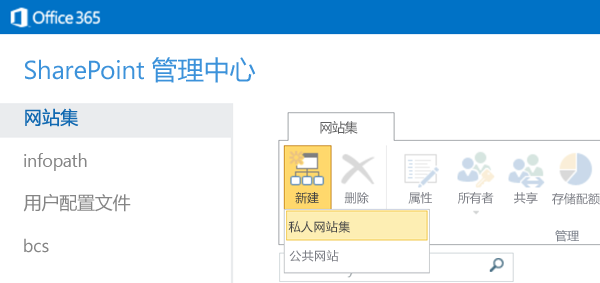
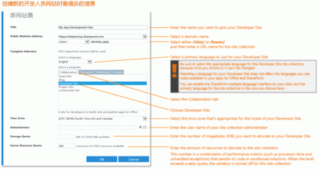
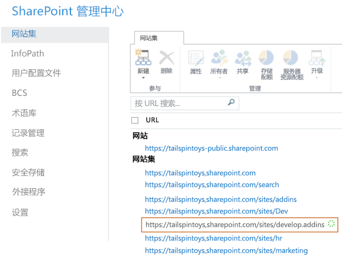

# 在现有 Office 365 订阅中创建开发人员网站
Office 365 开发人员网站 让创建、测试和部署 Office 和 SharePoint 外接程序 的设置和启动变得更加简单快捷。很多 Office 365 业务、企业、教育和政府订阅均包含一个站点模板，可以用于创建 开发人员网站。
 **准备工作**
  
    
    

- **确保您拥有支持开发人员网站的 Office 365 订阅。** 如果您拥有下列 Office 365 订阅计划之一，您可以在现有订阅中创建 开发人员网站：
    

  
    
    
> Office 365 中型企业
    
  

  
    
    
> Office 365 企业 E1、E3、E4、E5 或 K1
    
  

  
    
    
> Office 365 教育 A2、A3 或 A4
    
  

  
    
    
> Office 365 政府 G1、G3、G4 或 K1
    
  
- **如果您拥有 Office 365 小型企业订阅，** 它仅支持单个网站集，因此您不能创建开发人员网站网站集。如果您想详细了解您企业的 Office 365 计划，请参阅 [SharePoint Online：软件边界和限制](http://office.microsoft.com/zh-cn/office365-sharepoint-online-enterprise-help/sharepoint-online-software-boundaries-and-limits-HA102694293.aspx)。
    
  
- 有关 Office 365 Enterprise 产品的详细信息，请参阅 [计划和定价](http://products.office.com/zh-cn/business/office-365-enterprise-e1-business-software)。
    
  

## 创建开发人员网站

1. 作为全局或 SharePoint Online 管理员登录 Office 365。
    
    **您必须以全局或 SharePoint Online 管理员身份登录，才能创建新网站集，**例如 开发人员网站。只有管理员在登录 Office 365 时才能看到"管理员"选项。如果您不是管理员，请与公司的管理员联系，并让他们执行以下操作之一：
    
  - 为您授予管理员权限，以便您可以自己创建开发人员网站。
    
  
  - 替您创建开发人员网站，然后将您指定为网站集的管理员。
    
  
2. 单击顶部导航栏上最左侧的应用启动器按钮。
    
  
3. 单击"管理"磁贴。
    
  
4. 在左侧导航树中，展开"管理"，并选择"SharePoint"。
    
  
5. 在"SharePoint 管理中心"中，在"网站集"选项卡上，单击"新建">"专用网站集"。
    
     
  

  

  
6. 在"新建网站集"对话框中，提供有关开发人员网站的信息。
    
    **单击以下图像在对话框中浏览新的网站集选项，或者参阅图像下的表格获取指导。**
     

|||
|:-----|:-----|
|**标题**   |要赋予您开发人员网站的名称。    |
|**公共网址** 列表   |一个域名和 URL 路径 - **/sites/** 或 **/teams/** - 然后为网站集键入一个 URL 名称。   |
|"模板选择"部分中的"选择语言"列表    |您的开发人员网站使用的主要语言。    **确保为开发人员网站的网站集选择适合的语言，因为语言一旦选择，便无法更改。**   为开发人员网站选择语言不会影响您在 Office 和 SharePoint 外接程序中可以提供的语言。    可以在网站上启用 SharePoint 多语言界面，但您在此处选择的语言将成为网站集的主要语言。    |
|"模板选择"部分，在"选择模板"下的"协作"选项卡上    |选择"开发人员网站"。    |
|**时区**   |适用于开发人员网站的区域设置的时区。    |
|**管理员**   |您的网站管理员的用户名。    |
|**存储配额**   |您想要分配给此开发人员网站网站集的兆字节 (MB) 数。    |
|**服务器资源配额**   |要分配到网站集的资源量。    此数字是与沙盒解决方案中的代码相关的性能指标（如处理器时间和未处理异常）的组合。如果设置的级别超出每日配额，将对此网站集关闭沙盒。    |
   
7. 单击"确定"。
    
    新开发人员网站 URL 将出现在"网站集"列表中。网站创建完成后，您可以导航到该 URL 以打开您的开发人员网站。
    
     
  

  

  

## 其他资源

-  [SharePoint 外接程序](sharepoint-add-ins.md)
    
  
-  [创建或删除网站集](http://office.microsoft.com/zh-cn/office365-sharepoint-online-enterprise-help/create-or-delete-a-site-collection-HA102772354.aspx?CTT=1)
    
  

