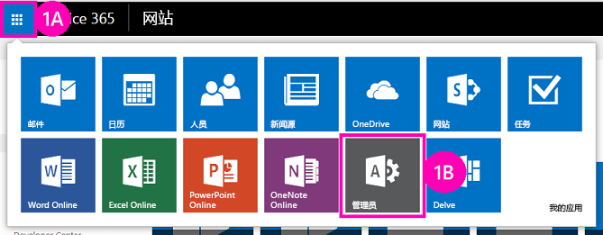

# 部署和安装 SharePoint 托管的 SharePoint 外接程序
了解如何部署和安装 SharePoint 外接程序。
这是关于开发 SharePoint 托管的 SharePoint 外接程序的基础知识系列文章中的第二篇文章。您应该首先熟悉  [SharePoint 外接程序](sharepoint-add-ins.md)主题以及本系列中之前的主题：
  
    
    

-  [开始创建 SharePoint 承载的 SharePoint 外接程序](get-started-creating-sharepoint-hosted-sharepoint-add-ins.md)
    
  

> **注释**
> 如果您阅读过关于 SharePoint 托管的外接程序的此系列文章，那么您应该具有 Visual Studio 解决方案，可以继续阅读本主题。您还可以从  [SharePoint_SP-hosted_Add-Ins_Tutorials](https://github.com/OfficeDev/SharePoint_SP-hosted_Add-Ins_Tutorials) 下载存储库并打开 BeforeColumns.sln 文件。
  
    
    

如果您熟悉用户如何部署和安装您的外接程序，您将发现开发 SharePoint 托管的 SharePoint 外接程序将容易得多。因此，在本文中，我们将暂时中断编码的话题，转为介绍创建和使用外接程序目录，然后安装您创建的外接程序。
## 创建外接程序目录

  
    
    

1. 以管理员身份登录到您的 Office 365 订阅。选择外接程序启动程序图标，然后选择"管理"外接程序。
    
   **Office 365 外接程序启动程序**

  

     
  

    
    
  
2. 在"管理中心"，在任务窗格中展开"管理员"节点，然后选择"SharePoint"。
    
  
3. 在"SharePoint 管理中心"，在任务窗格中选择"外接程序"。
    
  
4. 在"外接程序"页上，选择"外接程序目录"。（如果订阅中已有外接程序目录网站集，它将打开，表示您已完成操作。您不能在订阅中创建多个外接程序目录。
    
  
5. 在"外接程序目录网站"页上，选择"确定"以接受默认选项并创建新的外接程序目录网站。
    
  
6. 在"创建外接程序目录网站集"对话框中，指定外接程序目录网站的标题和网站地址。我们建议您在标题和 URL 中包含"目录"，使其在"SharePoint 管理中心"便于记忆和区分。
    
  
7. 指定"时区"，将您自己设置为"管理员"。
    
  
8. 将"存储配额"设置为最低的可能值（当前为 110，但可以更改），因为您将上载到此网站集的外接程序包很小。
    
  
9. 将"服务器资源配额"设置为 0（零），然后选择"确定"。（服务器资源配额与限制性能不佳的沙盒解决方案有关，但是您不会在外接程序目录网站上安装任何沙盒解决方案。）
    
  
创建网站集时，SharePoint 会让您返回到"SharePoint 管理中心"。几分钟之后, 您将看到已创建该集合。
## 打包外接程序并将其上载到目录

  
    
    

1. 打开 Visual Studio 解决方案，然后在"解决方案资源管理器"中右键单击项目节点。选择"发布"。
    
  
2. 在"发布"窗格中，选择"打包外接程序"。外接程序将打包并在解决方案的 \\bin\\debug\\web.publish\\1.0.0.0 文件夹中另存为 *.app 文件。
    
  
3. 在浏览器中打开您的外接程序目录网站，然后在导航栏中选择 **SharePoint 外接程序**。
    
  
4. "SharePoint 外接程序"目录是标准的 SharePoint 资产库。使用任一上载文件的方法，将外接程序包上载到 SharePoint 库中。
    
  

## 像最终用户一样安装外接程序

1. 在 SharePoint Online 订阅中导航到任何网站，打开"网站内容"页面。
    
  
2. 选择"添加外接程序"打开"您的外接程序"页面。
    
  
3. 在"可以添加的外接程序"部分中找到"员工向导"外接程序，单击其磁贴。
    
  
4. 在同意对话框中选择"信任它"。"网站内容"页面会自动打开，并且该外接程序将出现一个符号，表明其正在安装。安装后，用户可选择磁贴来运行该外接程序。
    
  

## 删除外接程序

要继续增强 Visual Studio 中的同一个 SharePoint 外接程序（请参阅 [后续步骤](#Nextsteps)），请执行以下步骤删除外接程序：
  
    
    

1. 在"网站内容"页上，将光标移动到该外接程序上方，将出现标注按钮"..."。
    
  
2. 选择标注按钮，然后在标注上选择"删除"。
    
  
3. 导航回您的外接程序目录网站，然后在导航栏中选择"SharePoint 外接程序"。
    
  
4. 突出显示外接程序，在列表上方的任务栏中选择"管理"，然后在管理菜单中选择"删除"。
    
  

## 

我们强烈建议您继续阅读有关 SharePoint 托管的外接程序的此系列文章，然后再继续更高级的主题。接下来在 [向 SharePoint 托管的 SharePoint 外接程序添加自定义列](add-custom-columns-to-a-sharepoint-hostedsharepoint-add-in.md)中，我们将重新回到编码话题。
  
    
    

