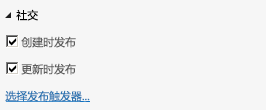

# 为云企业外接程序启用新闻源
SharePoint for Office 365 中的社交和协作功能允许用户跟踪列表中的活动并添加注释。您可以通过启用多个属性，为云企业外接程序轻松创建新闻源。
## 先决条件

要承载新闻源，您需要在 Office 365 上具有 SharePoint 开发人员网站，您可从 [注册 Office 365 开发人员网站](http://go.microsoft.com/fwlink/?LinkId=263490)开始。
  
    
    

## 过程

### 启用新闻源

1. 在解决方案资源管理器中，打开表示您要在其中添加新闻源的列表的实体，然后在"角度"栏上选择"服务器"选项卡。
    
  
2. 在"属性"窗口中，选中"创建时发布"和/或"更新时发布"复选框。
    
     
  

    "创建时发布"可为每个新的列表项添加新闻源的线程。"更新时发布"可在列表中某个项目的值更改时添加线程。发布触发器确定项目中的哪些字段将触发发布。
    
  
3. 选择"选择发布触发器"链接。
    
    将出现"选择发布触发器"对话框。
    
  
4. 在"选择发布触发器" 对话框中，选中您希望触发发布的所有字段的复选框，然后选择"确定"按钮。
    
    无论您选择了多少个字段，将为某个项目的所有更改创建一个线程。
    
  

### 访问新闻源

1. 在菜单栏上，选择"调试"，然后选择"启动调试"运行应用程序。
    
  
2. 在运行的应用程序中，打开表示您要在其中添加新闻源的列表的浏览屏幕。如果您启用"创建时发布"，添加新项。如果您启用"更新时发布"，请编辑您在"选择发布触发器"对话框中选择的字段。
    
  
3. 在 SharePoint 部件版式栏中，选择"新闻源"链接。
    
     
  

    "新闻源"页面将在新的浏览器窗口中打开，并显示所添加和/或更新的项目的条目。您可以选择文章的"赞"链接，也可以选择"回复"链接添加评论。
    
  

## 其他资源

-  [开发云企业外接程序](develop-cloud-business-add-ins.md)
    
  
-  [SharePoint 2013 中的社交和协作功能](http://msdn.microsoft.com/zh-cn/library/office/jj163280.aspx)
    
  
-  [使用社交新闻源创建云企业外接程序](create-a-cloud-business-add-in-with-a-social-newsfeed.md)
    
  

