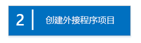
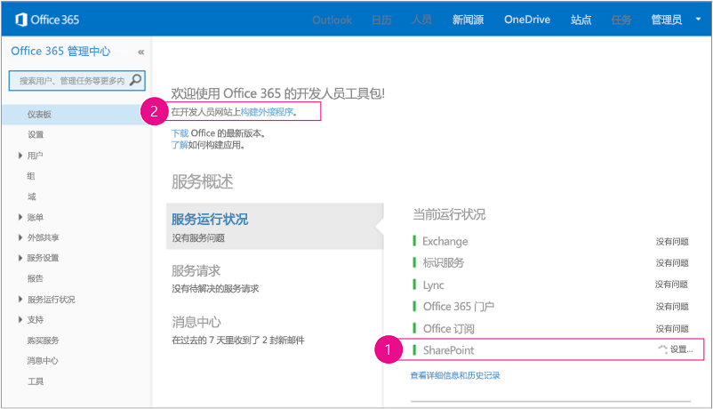
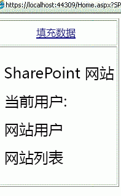

# 开始创建提供程序承载的 SharePoint 加载项
设置开发环境，然后创建您的第一个提供程序承载的 SharePoint 外接程序。
提供程序承载的外接程序是 SharePoint 外接程序的两个主要类型之一。有关 SharePoint 外接程序和这两种不同类型的概述，请参阅  [SharePoint 外接程序](sharepoint-add-ins.md)。以下是提供程序承载的外接程序的摘要：
  
    
    


- 其中包括在 SharePoint 服务器场或 SharePoint Online 订阅外部托管的 Web 应用程序、服务或数据库。还可能包括 SharePoint 组件。外部组件可以托管在任何 Web 托管堆栈中，包括 LAMP（Linux、Apache、MySQL 和 PHP）堆栈。
    
  
- 加载项中的自定义业务逻辑必须运行在外部组件上或自定义 SharePoint 页的 JavaScript 中。
    
  

 [
  
    
    
](get-started-creating-provider-hosted-sharepoint-add-ins.md#Setup) [
  
    
    
](get-started-creating-provider-hosted-sharepoint-add-ins.md#Create) [
  
    
    
](get-started-creating-provider-hosted-sharepoint-add-ins.md#Code)
  
    
    


## 设置开发环境
<a name="Setup"> </a>

有多种途径可为 SharePoint 外接程序设置开发环境。此部分说明了最简单的方法。有关其他方法，请参阅 [其他资源](#bk_addresources)。
  
    
    

### 获取工具


- 如果您还没有安装 **Visual Studio** 2013 或更高版本，请按照 [Install Visual Studio](http://msdn.microsoft.com/library/da049020-cfda-40d7-8ff4-7492772b620f.aspx) 中的说明进行安装。建议使用 [从 Microsoft 下载中心获取的最新版本](https://www.visualstudio.com/downloads/download-visual-studio-vs)。
    
  
- Visual Studio 包括 **Visual Studio Microsoft Office 开发人员工具** ，但有时该工具的最新版本会在 Visual Studio 的更新版本之间发布。若要确保您拥有该工具的最新版本，请使用 [Visual Studio 2013 的 Office 开发人员工具的安装程序](http://aka.ms/OfficeDevToolsForVS2013)。
    
  

### 注册 Office 365 开发人员网站
<a name="o365_signup"> </a>


> **注释**
>  您可能已经拥有 Office 365 开发人员网站的访问权限：> **已经是 MSDN 订阅者？** Visual Studio Ultimate 和 Visual Studio Premium with MSDN 订阅者可以享受 Office 365 开发人员订阅权益。 [立即索取您的权益](https://msdn.microsoft.com/subscriptions/manage/default.aspx)。 > **您是否具有下列 Office 365 订阅计划之一？**> **如果有的话，Office 365 订阅的管理员可以创建一个开发人员网站** ，方法是使用 [Office 365 管理中心](https://portal.microsoftonline.com/admin/default.aspx)。有关详细信息，请参阅 [在现有 Office 365 订阅中创建开发人员网站](create-a-developer-site-on-an-existing-office-365-subscription.md)。 
  
    
    

有三种获取 Office 365 计划的方法。
  
    
    

- 可通过 Office 365 开发人员计划免费注册一年的 Office 365 开发人员帐户。 [获取更多信息](http://dev.office.com/devprogram)，或直接转到 [注册表](https://profile.microsoft.com/RegSysProfileCenter/wizardnp.aspx?wizid=14b845d0-938c-45af-b061-f798fbb4d170)。您通过用于注册开发人员帐户的链接注册了开发人员计划后，将收到一封电子邮件。请使用以下说明。
    
  
- 开始 [免费 30 天试用](https://portal.microsoftonline.com/Signup/MainSignUp.aspx?OfferId=6881A1CB-F4EB-4db3-9F18-388898DAF510&amp;DL=DEVELOPERPACK)，获取一个用户许可证。
    
  
- 购买  [Office 365 开发人员订阅](https://portal.microsoftonline.com/Signup/MainSignUp.aspx?OfferId=C69E7747-2566-4897-8CBA-B998ED3BAB88&amp;DL=DEVELOPERPACK)。
    
  

> **提示**
> 为了方便您使用以下说明，请在另一个窗口或选项卡中打开这些链接。 
  
    
    


**图 1. Office 365 开发人员网站域名**

  
    
    

  
    
    

  
    
    

  
    
    

  
    
    

1. 注册表单的第一页（未显示）很容易理解：提供请求的信息，然后选择"下一步"。
    
  
2. 在第二页（如图 1 所示）上指定订阅管理员的用户 ID。
    
  
3. 创建".onmicrosoft.com"的子域，例如 contoso.onmicrosoft.com。
    
    注册后，您使用生成的凭据（格式： _UserID_@ _yourdomain_.onmicrosoft.com）登录到您的 Office 365 门户网站以便管理您的帐户。您的 SharePoint Online 开发人员网站将在您的新域中进行设置： **http:// _yourdomain_.sharepoint.com** 。
    
  
4. 选择"下一步"并填写表单的最后一页。如果您选择提供电话号码来获取确认代码，您可以提供一个移动或有线电话号码，但"不能是"VoIP（Internet 语音协议）号码。
    
  

    
> **注释**
> 当您尝试登录开发人员帐户时，如果您已经登录到其他 Microsoft 帐户，则有可能收到这样的消息："对不起，您输入的用户 ID 无法使用。它似乎是无效的。确保输入的是您的组织分配给您的用户 ID。通常，您的用户 ID 类似于  *someone@example.com*  或 *someone@example.onmicrosoft.com*  。"> 如果您看到该消息，请注销正在使用的 Microsoft 帐户并重试。如果您仍然收到这种消息，请清除浏览器缓存或切换到"InPrivate 浏览"，然后填写表单。 
  
    
    

在完成注册过程后，您的浏览器会打开 Office 365 安装页。选择管理员图标以打开管理中心页。
  
    
    

**图 2. Office 365 管理中心页**

  
    
    

  
    
    

  
    
    

  
    
    

1. 等待开发人员网站完成设置。设置完成后，在浏览器中刷新 管理中心页。
    
  
2. 然后，选择页面左上角的"构建加载项"链接，以打开您的开发人员网站。您会看到如图 3 所示的网站。页面上"测试中的加载项"列表证实该网站是使用 SharePoint 开发人员网站模板构建的。如果您看到的是一个一般的工作组网站，请稍等几分钟，然后重新启动网站。
    
  
3. 记下网站的 URL；当在 Visual Studio 中创建 SharePoint 外接程序项目时将会用到它。
    
  

**图 3. 您的开发人员网站主页，其中包含"测试中的加载项"列表**

  
    
    

  
    
    

  
    
    

  
    
    

  
    
    

## 创建加载项项目
<a name="Create"> </a>


1. 使用"以管理员身份运行"选项启动 Visual Studio。
    
  
2. 在 Visual Studio 中，选择"文件">"新建">"项目"。
    
  
3. 在"新建项目"对话框中，依次展开"Visual C#"节点和"Office/SharePoint"节点，然后选择"加载项">"SharePoint 外接程序"。
    
  
4. 将项目命名为 SampleAddIn，然后选择"确定"。
    
  
5. 在第一个"指定 SharePoint 外接程序设置"对话框中，执行下列操作：
    
  - 提供您想要用于调试您的外接程序的 SharePoint 网站的完整 URL。这是一个 开发人员网站 的 URL。在 URL 中使用 HTTPS，而不要使用 HTTP。（在此过程中的某一时刻，或在完成安装后的短暂时间里，系统会提示您登录到此网站。提示时间会有所不同。使用管理员凭据。（在 *.onmicrosoft.com 域中）当您注册开发人员网站时创建；例如 MyName@contoso.onmicrosoft.com。
    
  
  - 在"您希望如何承载 SharePoint 加载项"下，选择"提供程序承载"。
    
  
  - 选择"下一步"。
    
  
6. 在"指定目标 SharePoint 版本"页面上，选择"SharePoint Online"，然后选择"下一步"。
    
  
7. 在"要创建哪些类型的 Web 应用程序项目?"下，选择"ASP.NET Web 表单应用程序"。选择"下一步"。
    
  
8. 在"您希望外接程序如何进行身份验证?"下，选择"使用 Windows Azure 访问控制服务"。
    
  
9. 在向导中，选择"完成"。
    
    许多配置将在解决方案打开时完成。将在 Visual Studio 解决方案中创建两个项目，一个适用于 SharePoint 外接程序，另一个适用于 ASP.NET Web 应用程序。
    
  

## 对外接程序编码
<a name="Code"> </a>


1. 打开 AppManifest.xml 文件。在"权限"选项卡上，指定"网站集"范围和"阅读"权限级别。
    
  
2. 在 Web 应用程序的 Pages/Default.aspx 文件的 **<body>** 标记中删除所有标记，然后在 **<body>** 中添加以下 HTML 和 ASP.NET 控件。本示例使用 [UpdatePanel](https://msdn.microsoft.com/library/System.Web.UI.UpdatePanel.aspx) 控件实现部分页面呈现。
    
 ```HTML
  
<form id="form1" runat="server">
  <div>
    <asp:ScriptManager ID="ScriptManager1" runat="server"
            EnablePartialRendering="true" />
    <asp:UpdatePanel ID="PopulateData" runat="server" UpdateMode="Conditional">
      <ContentTemplate>      
        <table border="1" cellpadding="10">
         <tr><th><asp:LinkButton ID="CSOM" runat="server" Text="Populate Data" 
                               OnClick="CSOM_Click" /></th></tr>
         <tr><td>

        <h2>SharePoint Site</h2>
        <asp:Label runat="server" ID="WebTitleLabel"/>

        <h2>Current User:</h2>
        <asp:Label runat="server" ID="CurrentUserLabel" />

        <h2>Site Users</h2>
        <asp:ListView ID="UserList" runat="server">     
            <ItemTemplate >
              <asp:Label ID="UserItem" runat="server" 
                                Text="<%# Container.DataItem.ToString()  %>">
              </asp:Label><br />
           </ItemTemplate>
        </asp:ListView>

        <h2>Site Lists</h2>
               <asp:ListView ID="ListList" runat="server">
                   <ItemTemplate >
                     <asp:Label ID="ListItem" runat="server" 
                                Text="<%# Container.DataItem.ToString()  %>">
                    </asp:Label><br />
                  </ItemTemplate>
              </asp:ListView>
            </td>              
          </tr>
         </table>
       </ContentTemplate>
     </asp:UpdatePanel>
  </div>
</form>
 ```

3. 将以下声明添加到 Web 应用程序的 Default.aspx.cs 文件中。
    
 ```cs
  
using Microsoft.SharePoint.Client;
using Microsoft.IdentityModel.S2S.Tokens;
using System.Net;
using System.IO;
using System.Xml;
 ```

4. 在 Web 应用程序的 Default.aspx.cs 文件中，将这些变量添加到  [Page](https://msdn.microsoft.com/library/System.Web.UI.Page.aspx) 类中。
    
 ```cs
  
SharePointContextToken contextToken;
string accessToken;
Uri sharepointUrl;
string siteName;
string currentUser;
List<string> listOfUsers = new List<string>();
List<string> listOfLists = new List<string>();
 ```

5. 将  `RetrieveWithCSOM` 方法添加到 [Page](https://msdn.microsoft.com/library/System.Web.UI.Page.aspx) 类中。此方法使用 SharePoint CSOM 检索有关您的网站的信息并在页面上显示该信息。
    
 ```cs
  
// This method retrieves information about the host web by using the CSOM.
private void RetrieveWithCSOM(string accessToken)
{

    if (IsPostBack)
    {
        sharepointUrl = new Uri(Request.QueryString["SPHostUrl"]);
    }            

    ClientContext clientContext =
                    TokenHelper.GetClientContextWithAccessToken(
                        sharepointUrl.ToString(), accessToken);

    // Load the properties for the web object.
    Web web = clientContext.Web;
    clientContext.Load(web);
    clientContext.ExecuteQuery();

    // Get the site name.
    siteName = web.Title;

    // Get the current user.
    clientContext.Load(web.CurrentUser);
    clientContext.ExecuteQuery();
    currentUser = clientContext.Web.CurrentUser.LoginName;

    // Load the lists from the Web object.
    ListCollection lists = web.Lists;
    clientContext.Load<ListCollection>(lists);
    clientContext.ExecuteQuery();

    // Load the current users from the Web object.
    UserCollection users = web.SiteUsers;
    clientContext.Load<UserCollection>(users);
    clientContext.ExecuteQuery();

    foreach (User siteUser in users)
    {
        listOfUsers.Add(siteUser.LoginName);
    }


    foreach (List list in lists)
    {
        listOfLists.Add(list.Title);
    }
}
 ```

6. 将  `CSOM_Click` 方法添加到 [Page](https://msdn.microsoft.com/library/System.Web.UI.Page.aspx) 类中。当用户单击"填充数据"链接时，此方法将触发事件。
    
 ```cs
  
protected void CSOM_Click(object sender, EventArgs e)
{
    string commandAccessToken = ((LinkButton)sender).CommandArgument;
    RetrieveWithCSOM(commandAccessToken);
    WebTitleLabel.Text = siteName;
    CurrentUserLabel.Text = currentUser;
    UserList.DataSource = listOfUsers;
    UserList.DataBind();
    ListList.DataSource = listOfLists;
    ListList.DataBind();    
 }
 ```

7. 将现有  `Page_Load` 方法替换为此方法。 `Page_Load` 方法使用 TokenHelper.cs 文件中的方法从 `Request` 对象中检索上下文并从 Microsoft Azure 访问控制服务 (ACS) 获取访问令牌。
    
 ```cs
  
// The Page_load method fetches the context token and the access token.
// The access token is used by all of the data retrieval methods.
protected void Page_Load(object sender, EventArgs e)
{
     string contextTokenString = TokenHelper.GetContextTokenFromRequest(Request);

    if (contextTokenString != null)
    {
        contextToken =
            TokenHelper.ReadAndValidateContextToken(contextTokenString, Request.Url.Authority);

        sharepointUrl = new Uri(Request.QueryString["SPHostUrl"]);
        accessToken =
                    TokenHelper.GetAccessToken(contextToken, sharepointUrl.Authority)
                    .AccessToken;

         // For simplicity, this sample assigns the access token to the button's CommandArgument property. 
         // In a production add-in, this would not be secure. The access token should be cached on the server-side.
        CSOM.CommandArgument = accessToken;
    }
    else if (!IsPostBack)
    {
        Response.Write("Could not find a context token.");
        return;
    }
}
 ```

8. 完成后，Default.aspx.cs 文件将如下所示。
    
 ```cs
  
using System;
using System.Collections.Generic;
using System.Linq;
using System.Web;
using System.Web.UI;
using System.Web.UI.WebControls;

using Microsoft.SharePoint.Client;
using Microsoft.IdentityModel.S2S.Tokens;
using System.Net;
using System.IO;
using System.Xml;

namespace SampleAddInWeb
{
    public partial class Default : System.Web.UI.Page
    {
        SharePointContextToken contextToken;
        string accessToken;
        Uri sharepointUrl;
        string siteName;
        string currentUser;
        List<string> listOfUsers = new List<string>();
        List<string> listOfLists = new List<string>();

        protected void Page_PreInit(object sender, EventArgs e)
        {
            Uri redirectUrl;
            switch (SharePointContextProvider.CheckRedirectionStatus(Context, out redirectUrl))
            {
                case RedirectionStatus.Ok:
                    return;
                case RedirectionStatus.ShouldRedirect:
                    Response.Redirect(redirectUrl.AbsoluteUri, endResponse: true);
                    break;
                case RedirectionStatus.CanNotRedirect:
                    Response.Write("An error occurred while processing your request.");
                    Response.End();
                    break;
            }
        }

        protected void CSOM_Click(object sender, EventArgs e)
        {
            string commandAccessToken = ((LinkButton)sender).CommandArgument;
            RetrieveWithCSOM(commandAccessToken);
            WebTitleLabel.Text = siteName;
            CurrentUserLabel.Text = currentUser;
            UserList.DataSource = listOfUsers;
            UserList.DataBind();
            ListList.DataSource = listOfLists;
            ListList.DataBind();
        }

        // This method retrieves information about the host web by using the CSOM.
        private void RetrieveWithCSOM(string accessToken)
        {

            if (IsPostBack)
            {
                sharepointUrl = new Uri(Request.QueryString["SPHostUrl"]);
            }


            ClientContext clientContext =
                    TokenHelper.GetClientContextWithAccessToken(
                        sharepointUrl.ToString(), accessToken);


            // Load the properties for the web object.
            Web web = clientContext.Web;
            clientContext.Load(web);
            clientContext.ExecuteQuery();

            // Get the site name.
            siteName = web.Title;

            // Get the current user.
            clientContext.Load(web.CurrentUser);
            clientContext.ExecuteQuery();
            currentUser = clientContext.Web.CurrentUser.LoginName;

            // Load the lists from the Web object.
            ListCollection lists = web.Lists;
            clientContext.Load<ListCollection>(lists);
            clientContext.ExecuteQuery();

            // Load the current users from the Web object.
            UserCollection users = web.SiteUsers;
            clientContext.Load<UserCollection>(users);
            clientContext.ExecuteQuery();

            foreach (User siteUser in users)
            {
                listOfUsers.Add(siteUser.LoginName);
            }

            foreach (List list in lists)
            {
                listOfLists.Add(list.Title);
            }
        }

        protected void Page_Load(object sender, EventArgs e)
        {
            string contextTokenString = 
                 TokenHelper.GetContextTokenFromRequest(Request);

            if (contextTokenString != null)
            {
                contextToken =
                    TokenHelper.ReadAndValidateContextToken(contextTokenString, Request.Url.Authority);

                sharepointUrl = new Uri(Request.QueryString["SPHostUrl"]);
                accessToken =
                    TokenHelper.GetAccessToken(contextToken, sharepointUrl.Authority)
                               .AccessToken;
                CSOM.CommandArgument = accessToken;
            }
            else if (!IsPostBack)
            {
                Response.Write("Could not find a context token.");
                return;
            }
        }
    }
}
 ```

9. 使用 F5 键部署和运行您的加载项。如果您看到"安全警报"窗口，询问您是否要信任自签名的本地主机证书，请选择"是"。
    
    在许可页上选择"信任它"可向外接程序授予权限。Visual Studio 将 Web 外接程序安装到 IIS Express，然后将外接程序安装到您的测试 SharePoint 站点并启动它。您将看到一个页面，以下屏幕截图显示了其中的表。选择"填充数据"可查看有关您的 SharePoint 网站的摘要信息。
    

   **提供程序托管的基本外接程序示例的启动页面**

  

     
  

  

  

## 后续步骤
<a name="SP15createprovider_nextsteps"> </a>

请参阅 [使提供程序托管的外接程序具有 SharePoint 的外观](give-your-provider-hosted-add-in-the-sharepoint-look-and-feel.md)，了解如何将外接程序集成到 SharePoint 的 UI 方案中。
  
    
    

## 其他资源
<a name="bk_addresources"> </a>


- 有关设置开发环境（如"所有内部部署"环境）的其他方式，请参阅 SharePoint 外接程序目录中的 [工具](tools-and-environments-for-developing-sharepoint-add-ins.md)一节。
    
  

