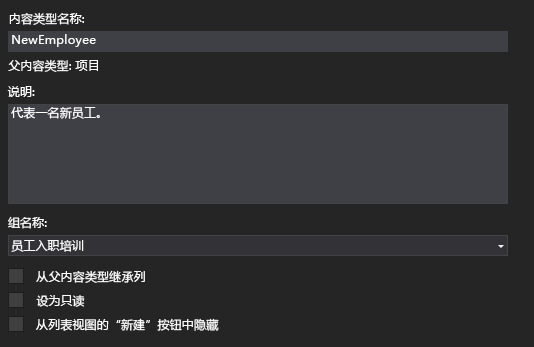
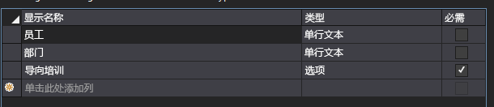
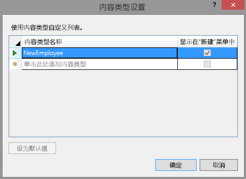
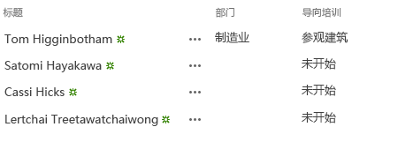

# 向 SharePoint 托管的 SharePoint 外接程序添加自定义内容类型
了解如何在 SharePoint 外接程序中加入内容类型。
这是关于开发 SharePoint 托管的 SharePoint 外接程序的基础知识系列文章中的第四篇文章。您应该首先熟悉  [SharePoint 外接程序](sharepoint-add-ins.md)以及本系列中的其他文章：


-  [开始创建 SharePoint 承载的 SharePoint 外接程序](get-started-creating-sharepoint-hosted-sharepoint-add-ins.md)


-  [部署和安装 SharePoint 托管的 SharePoint 外接程序](deploy-and-install-a-sharepoint-hosted-sharepoint-add-in.md)


-  [向 SharePoint 托管的 SharePoint 外接程序添加自定义列](add-custom-columns-to-a-sharepoint-hostedsharepoint-add-in.md)


> **注释**
> 如果您阅读过关于 SharePoint 托管的外接程序的系列文章，那么您应该具有 Visual Studio 解决方案，可以继续阅读本主题。您还可以从  [SharePoint_SP-hosted_Add-Ins_Tutorials](https://github.com/OfficeDev/SharePoint_SP-hosted_Add-Ins_Tutorials) 下载存储库并打开 BeforeContentType.sln 文件。


在本文中，您向员工向导 SharePoint 外接程序添加自定义内容类型。
## 创建自定义内容类型


1. 在"解决方案资源管理器"中，右键单击项目，然后选择"添加">"新文件夹"。将文件夹命名为内容类型。


2. 右键单击新文件夹，然后选择"添加">"新项目"。"添加新项目"对话框将打开到"Office/SharePoint"节点。


3. 选择"内容类型"，将其命名为 NewEmployee，然后选择"添加"。当向导提示选择基内容类型时，请选择"项"，然后选择"完成"。


4. 如果内容类型设计器没有自动打开，请在"解决方案资源管理器"中选择"NewEmployee"内容类型以打开它。


5. 在设计器中打开"内容类型"选项卡，并按如下所示填写文本框：

  - **内容类型名称**：NewEmployee


  - **说明**：代表一名新员工。


  - **组名称**：员工入职培训


6. 验证选项卡上的复选框 *未*  选中。 "从父内容类型继承列"复选框默认情况下可能选中。 *请务必将其清除。*  现在，选项卡应该如下所示：

   **"内容类型"选项卡**





7. 在设计器中打开"列"选项卡。


8. 在网格中，选择"单击此处添加列"打开列的下拉列表，并添加"部门"列。该列在下拉列表中按其显示名称列出："部门"。对"导向培训"列执行相同的操作。（如果未列出，说明您可能尚未开始使用正确的 Visual Studio 解决方案。请从 BeforeContentType.sln 开始。）完成后，网格应该如下所示：

   **"列"选项卡**





9. 保存文件并关闭设计器。


10. 下一步需要您直接在内容类型的原始 XML 中工作，因此，在"解决方案资源管理器"中，选择"NewEmployee"内容类型的 elements.xml 文件子项。


11. 文件中已有针对您添加的两个栏的 **FieldRef** 元素。为两个内置的 SharePoint 栏添加 **FieldRef** 元素作为已存在的两个项的对应项。以下是这些元素的标记。 *您必须为 ID 属性使用相同的 GUID，因为这些是具有固定 ID 的内置字段类型。*  为自定义网站栏在这两个 **FieldRef** 元素 *上*  添加它们。

  ```

<FieldRef Name="LinkTitle" ID="{82642ec8-ef9b-478f-acf9-31f7d45fbc31}" DisplayName="Employee" />
<FieldRef Name="Title" ID="{fa564e0f-0c70-4ab9-b863-0177e6ddd247}" DisplayName="Employee" />
  ```


    请注意，我们已为这些字段指定自定义显示名称："员工"。


12. 保存并关闭该文件。


13. 在"解决方案资源管理器"中展开"列表"节点，然后选择"NewEmployeeOrientation"打开列表类型设计器。


14. 在设计器中打开"列"选项卡，然后选择"内容类型"按钮。


15. 在"内容类型设置"对话框中，添加"NewEmployee"内容类型。


16. 在类型列表中选择"NewEmployee"内容类型，然后选择"设置为默认值"按钮。


17. 选择"项"内容类型，右键单击内容类型名称左侧显示的小箭头，然后选择"删除"。


18. 对"文件夹"内容类型重复上述步骤，使"NewEmployee"成为列出的唯一内容类型。现在，对话框应该如下所示：

   **"内容类型设置"对话框**





19. 选择"确定"关闭该对话框，然后保存并关闭该文件。


20. 打开 schema.xml 文件。


21. 查找 **Fields** 元素。它应该具有三个 **Field** 元素： **Title**、Division 和OrientationStage。（这些元素在此生成的文件中可能位于单独的行。如果是这样，请使用换行符将其分隔。


22. 将文件保持打开状态，在"解决方案资源管理器"中，展开"网站列"文件夹和部门节点，然后打开 部门的 elements.xml 文件。schema.xml 中部门的 **Field** 元素应该与部门的 **Field** 元素完全相同。请从网站列 elements.xml 文件复制 **Field** 元素并粘贴以取代 schema.xml 文件中不匹配的 **Field** 元素。然后关闭 element.xml 文件。


23. 打开 OrientationStage 的 elements.xml 文件。OrientationStage 的两个文件中必须与 **Field** 元素完全匹配，包括所有子元素，例如 **CHOICES** 和 **MAPPINGS** 元素。如果没有，请复制 elements.xml 文件中的 **Field** 并粘贴，取代 schema.xml 文件中不匹配的 **Field** 元素。然后关闭 element.xml 文件。


24. 还是在 schema.xml 文件中，在 **BaseViewID** 值为"1"的 **View** 元素中，查找子 **ViewFields** 元素，然后添加以下两个 **FieldRef** 元素作为其子元素。这两个元素可能已经存在，但缺少 **ID** 属性。如果是这样，请添加 ID 属性。

  ```

<FieldRef Name="Division" ID="{GUID from the Field element}" />
<FieldRef Name="OrientationStage" ID="{GUID from the Field element}" />

  ```

25. 将两个占位符 **ID** 属性值替换为 schema.xml 文件中之前的 **NewEmployee** 的 **ContentType** 元素中对应的 **Field** 元素的 GUID。别忘了大括号"{}"。

    "1" **View** 的 **ViewFields** 应该如下所示。（您的 GUID 可能会有所不同。）


  ```

<ViewFields>
   <FieldRef Name="LinkTitle" ID="{82642ec8-ef9b-478f-acf9-31f7d45fbc31}" DisplayName="Employee" />
   <FieldRef Name="Division" ID="{509d2d67-9a96-4596-9b3b-58449cdcc6ff}" />
   <FieldRef Name="OrientationStage" ID="{38a3b54c-acf3-4ddf-b748-55c7c28d4cc2}" />    
</ViewFields>
  ```

26. 还是在 schema.xml 文件中，查找 **BaseViewID** 值为"0"的 **View**。查找其中的 **ViewFields** 元素。


27. 将视图"1"中的整个 **ViewFields** 部分复制覆盖视图"0"的 **ViewFields** 部分。这两个视图现在应该具有相同的 **ViewFields** 部分。


28. 保存并关闭 schema.xml 文件。


29. 在"列表"文件夹中，展开"NewEmployeeOrientation"节点及其子列表实例"NewEmployeesInSeattle"。您应该能清楚地看到并区分模板的 elements.xml 和实例的 elements.xml。打开实例的 elements.xml。


30. 将两个 **Field** 元素添加到第一个 **Row** 元素，使 **Row** 元素如下所示。

  ```

<Row>
  <Field Name="Title">Tom Higginbotham</Field>
  <Field Name="Division">Manufacturing</Field>
  <Field Name="OrientationStage">Tour of building</Field>
</Row>
 
  ```

31. 保存并关闭该文件。


## 运行并测试外接程序


1. 使用 F5 键部署并运行您的外接程序。Visual Studio 在测试 SharePoint 网站上临时安装此外接程序并立即运行。


2. 当外接程序的默认页面打开时，选择"西雅图新员工"链接以打开自定义列表实例。


3. 列表页将打开，部门和 OrientationStage 列位于其中。用户无需手动添加，因为它们是列表的内容类型的一部分。顶部的项目具有您添加的数据。

   **西雅图新员工列表**





4. 尝试向列表添加新项目并编辑现有项目。


5. 要结束调试会话，请关闭浏览器窗口或在 Visual Studio 中停止调试。每次按 F5 时，Visual Studio 将撤回外接程序的之前版本并安装最新版本。


6. 您将在其他文章中使用此外接程序和 Visual Studio 解决方案，因此最好是当您使用一段时间后，最后一次撤回外接程序。在"解决方案资源管理器"中右键单击此项目，然后选择"撤回"。


## 
<a name="Nextsteps"> </a>

在本系列的下一篇文章中，您将向 SharePoint 外接程序的默认页面添加列表视图 Web 部件： [向 SharePoint 托管的 SharePoint 外接程序中的页面添加 Web 部件](add-a-web-part-to-a-page-in-a-sharepoint-hosted-sharepoint-add-in.md)。


