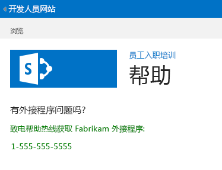

# 向 SharePoint 托管的 SharePoint 外接程序添加自定义页面和样式
了解如何在 SharePoint 外接程序中加入自定义页面和 CSS 文件。
这是关于开发 SharePoint 托管的 SharePoint 外接程序的基础知识系列文章中的第七篇文章。您应该首先熟悉  [SharePoint 外接程序](sharepoint-add-ins.md)以及本系列中之前的文章：


-  [开始创建 SharePoint 承载的 SharePoint 外接程序](get-started-creating-sharepoint-hosted-sharepoint-add-ins.md)


-  [部署和安装 SharePoint 托管的 SharePoint 外接程序](deploy-and-install-a-sharepoint-hosted-sharepoint-add-in.md)


-  [向 SharePoint 托管的 SharePoint 外接程序添加自定义列](add-custom-columns-to-a-sharepoint-hostedsharepoint-add-in.md)


-  [向 SharePoint 托管的 SharePoint 外接程序添加自定义内容类型](add-a-custom-content-type-to-a-sharepoint-hostedsharepoint-add-in.md)


-  [向 SharePoint 托管的 SharePoint 外接程序中的页面添加 Web 部件](add-a-web-part-to-a-page-in-a-sharepoint-hosted-sharepoint-add-in.md)


-  [向 SharePoint 托管的 SharePoint 外接程序添加工作流](add-a-workflow-to-a-sharepoint-hosted-sharepoint-add-in.md)


> **注释**
> 如果您阅读过关于 SharePoint 托管的外接程序的此系列文章，那么您应该具有 Visual Studio 解决方案，可以继续阅读本主题。您还可以从  [SharePoint_SP-hosted_Add-Ins_Tutorials](https://github.com/OfficeDev/SharePoint_SP-hosted_Add-Ins_Tutorials) 下载存储库并打开 BeforePage.sln 文件。


在本文中，您向员工向导 SharePoint 外接程序添加一个帮助页面，并将其配置为使用自定义 CSS 样式表。
## 添加一个页面


1. 在"解决方案资源管理器"中，右键单击"页面"文件夹，然后选择"添加">"新项目"。"添加新项目"对话框将打开到"Office/SharePoint"节点。


2. 选择"页面"并将其命名为 Help.aspx。


3. 查找文件中的两个 **asp:Content** 元素，在两者之间添加第三个 **asp:Content** 标记。

  ```HTML

<asp:Content ContentPlaceHolderID="PlaceHolderPageTitleInTitleArea" runat="server">
    Help
</asp:Content> 
  ```

4. 查找 ID 为 **PlaceholderAdditionalPageHead** 的 **asp:Content**，并向其添加以下标记。

  ```HTML

<link rel="Stylesheet" type="text/css" href="../Content/App.css" />
  ```

5. 查找 ID 为 **PlaceHolderMain** 的 **asp:Content**，并移除其中的任何子元素。


6. 将以下内容作为内容添加到同一个 **asp:Content** 元素。

  ```HTML
  <H3>Having a problem with the add-in?</H3>
<p> Call the help line for Fabrikam Add-ins:</p>
<p>1-555-555-5555</p>
  ```

7. 保存并关闭该文件。


8. 打开 Default.aspx 文件。


9. 查找 ID 为 **PlaceHolderMain** 的 **asp:Content**，并将以下标记添加到其末尾。

  ```HTML

<p><asp:HyperLink runat="server" NavigateUrl="JavaScript:window.location = _spPageContextInfo.webAbsoluteUrl + '/Pages/Help.aspx';"
    Text="Get help for the Employee Orientation add-in" /></p>

  ```

10. 保存并关闭该文件。


## 向样式表添加样式类


1. 在"解决方案资源管理器"中，打开"内容"文件夹中的 app.css 文件，然后将以下行添加到该文件。

  ```

p {color: green;}
  ```

2. 保存并关闭该文件。


## 运行并测试外接程序


1. 使用 F5 键部署并运行您的外接程序。Visual Studio 在测试 SharePoint 网站上临时安装外接程序并立即运行该外接程序。


2. 外接程序的默认页面打开后，单击"获取员工定位外接程序的帮助"链接以打开"帮助"页面。

    您的自定义页面将打开，您放在 <p> 标记中的两行显示为绿色。


   **帮助页面**





3. 要结束调试会话，请关闭浏览器窗口或在 Visual Studio 中停止调试。每次按 F5 时，Visual Studio 将撤回外接程序的之前版本并安装最新版本。


4. 您将在其他文章中使用此外接程序和 Visual Studio 解决方案，因此最好是当您最后一次使用一段时间后撤回外接程序。在"解决方案资源管理器"中右键单击项目，然后选择"撤回"。


## 
<a name="Nextsteps"> </a>

在本系列的下一篇文章中，您将向 SharePoint 外接程序中的列表列添加自定义的客户端呈现： [向 SharePoint 托管的 SharePoint 外接程序添加自定义客户端呈现](add-custom-client-side-rendering-to-a-sharepoint-hosted-sharepoint-add-in.md)。


