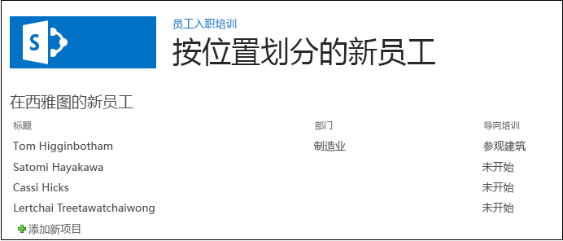

# 向 SharePoint 托管的 SharePoint 外接程序中的页面添加 Web 部件
了解如何在 SharePoint 外接程序中的页面上加入 Web 部件。
这是关于开发 SharePoint 托管的 SharePoint 外接程序的基础知识系列文章中的第五篇文章。您应该首先熟悉  [SharePoint 外接程序](sharepoint-add-ins.md)以及本系列中之前的文章：


-  [开始创建 SharePoint 承载的 SharePoint 外接程序](get-started-creating-sharepoint-hosted-sharepoint-add-ins.md)


-  [部署和安装 SharePoint 托管的 SharePoint 外接程序](deploy-and-install-a-sharepoint-hosted-sharepoint-add-in.md)


-  [向 SharePoint 托管的 SharePoint 外接程序添加自定义列](add-custom-columns-to-a-sharepoint-hostedsharepoint-add-in.md)


-  [向 SharePoint 托管的 SharePoint 外接程序添加自定义内容类型](add-a-custom-content-type-to-a-sharepoint-hostedsharepoint-add-in.md)


> **注释**
> 如果您阅读过关于 SharePoint 托管的外接程序的系列文章，那么您应该具有 Visual Studio 解决方案，可以继续阅读本主题。您还可以从  [SharePoint_SP-hosted_Add-Ins_Tutorials](https://github.com/OfficeDev/SharePoint_SP-hosted_Add-Ins_Tutorials) 下载存储库并打开 BeforeWebPart.sln 文件。


在本文中，您将向员工向导 SharePoint 外接程序的默认页面添加一个 Web 部件。
## 将 Web 部件添加到页面


1. 在"解决方案资源管理器"中，打开 Default.aspx 文件。


2. 我们将在显示西雅图新员工列表的页面中添加一个列表视图 Web 部件，因此无需再具有列表的列表视图页面链接。将 **<asp:HyperLink>** 元素从 **ContentPlaceHolderId** 为 `PlaceHolderMain` 的 **<asp:Content>** 元素中删除。


3. 在同一个 **<asp:Content>** 元素内，添加以下 **WebPartZone**。

  ```XML

<WebPartPages:WebPartZone runat="server" FrameType="TitleBarOnly"
      ID="HomePage1" Title="loc:full" />

  ```

4. 保存并关闭该文件。


5. 在"解决方案资源管理器"中，打开"页面"节点中页面的 elements.xml 文件。


6. 如果 **File** 元素是自闭合的，请从中删除"/"字符并添加结束标记 `</File>`。


7. 在 **File** 元素中，添加 **AllUsersWebPart** 子元素并将 **WebPartZoneID** 设置为您在页面上创建的 Web 部件区域的 ID。文件的内容现在应该如下所示。此标记通知 SharePoint 在名为"HomePage1"的 Web 部件区域中插入 **AllUsersWebPart**。

  ```

<Elements xmlns="http://schemas.microsoft.com/sharepoint/">
  <Module Name="Pages">
    <File Path="Pages\\Default.aspx" Url="Pages/Default.aspx" ReplaceContent="TRUE" >
      <AllUsersWebPart WebPartZoneID="HomePage1" WebPartOrder="1">

      </AllUsersWebPart>
    </File>
  </Module>
</Elements>

  ```

8. 添加 **CDATA** 元素作为 **AllUsersWebPart** 的子元素，然后添加 **webParts** 元素作为 **CDATA** 的子元素，如以下标记中所示。

  ```

<AllUsersWebPart WebPartZoneID="HomePage1" WebPartOrder="1">
  <![CDATA[
    <webParts>

    </webParts>
  ]]>
</AllUsersWebPart>
  ```

9. 添加以下 **webPart** 标记作为 **webParts** 元素的子元素。此标记可添加 **XsltListViewWebPart** 并通知 Web 部件显示西雅图新员工列表。请注意， **ViewContentTypeId** 属性值为"0x"，而不是NewEmployee 内容类型的实际 ID。

  ```

  <webPart xmlns="http://schemas.microsoft.com/WebPart/v3">
    <metaData>
      <type name="Microsoft.SharePoint.WebPartPages.XsltListViewWebPart, 
                   Microsoft.SharePoint, Version=15.0.0.0, Culture=neutral, 
                   PublicKeyToken=71e9bce111e9429c" />
    </metaData>
    <data>
      <properties>
        <property name="ListUrl">Lists/NewEmployeesInSeattle</property>
        <property name="IsIncluded">True</property>
        <property name="NoDefaultStyle">True</property>
        <property name="Title">New Employees in Seattle</property>
        <property name="PageType">PAGE_NORMALVIEW</property>
        <property name="Default">False</property>
        <property name="ViewContentTypeId">0x</property>
      </properties>
    </data>
  </webPart>
  ```


## 运行并测试外接程序


1. 使用 F5 键部署并运行您的外接程序。Visual Studio 在测试 SharePoint 网站上临时安装此外接程序并立即运行。


2. 当外接程序的默认页面打开时，列表视图 Web 部件将位于此页面，列表将显示。

   **包含列表视图 Web 部件的默认页面**





3. 尝试向列表添加新项目并编辑现有项目。


4. 要结束调试会话，请关闭浏览器窗口或在 Visual Studio 中停止调试。每次按 F5 时，Visual Studio 将撤回外接程序的之前版本并安装最新版本。


5. 您将在其他文章中使用此外接程序和 Visual Studio 解决方案，因此最好是当您使用一段时间后，最后一次撤回外接程序。在"解决方案资源管理器"中右键单击此项目，然后选择"撤回"。


## 
<a name="Nextsteps"> </a>

在本系列的下一篇文章中，您将向 SharePoint 外接程序添加工作流： [向 SharePoint 托管的 SharePoint 外接程序添加工作流](add-a-workflow-to-a-sharepoint-hosted-sharepoint-add-in.md)。


