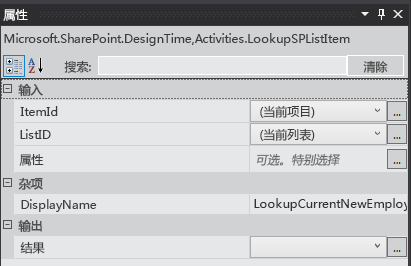
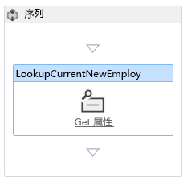
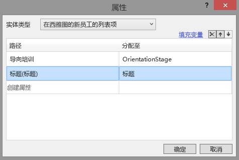
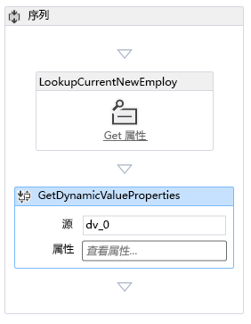
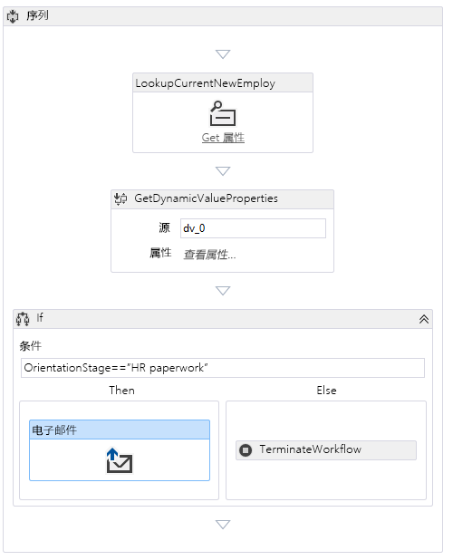
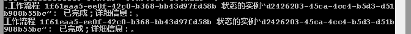
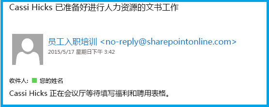

# 向 SharePoint 托管的 SharePoint 外接程序添加工作流
了解如何在 SharePoint 外接程序中包括工作流。
这是关于开发 SharePoint 托管的 SharePoint 外接程序的基础知识系列文章中的第六篇文章。您应该首先熟悉  [SharePoint 外接程序](sharepoint-add-ins.md)以及本系列中之前的文章：

-  [开始创建 SharePoint 承载的 SharePoint 外接程序](get-started-creating-sharepoint-hosted-sharepoint-add-ins.md)

-  [部署和安装 SharePoint 托管的 SharePoint 外接程序](deploy-and-install-a-sharepoint-hosted-sharepoint-add-in.md)

-  [向 SharePoint 托管的 SharePoint 外接程序添加自定义列](add-custom-columns-to-a-sharepoint-hostedsharepoint-add-in.md)

-  [向 SharePoint 托管的 SharePoint 外接程序添加自定义内容类型](add-a-custom-content-type-to-a-sharepoint-hostedsharepoint-add-in.md)

-  [向 SharePoint 托管的 SharePoint 外接程序中的页面添加 Web 部件](add-a-web-part-to-a-page-in-a-sharepoint-hosted-sharepoint-add-in.md)

> **注释**
> 如果您阅读过关于 SharePoint 托管的外接程序的此系列文章，那么您应该具有 Visual Studio 解决方案，可以继续阅读本主题。您还可以从  [SharePoint_SP-hosted_Add-Ins_Tutorials](https://github.com/OfficeDev/SharePoint_SP-hosted_Add-Ins_Tutorials) 下载存储库并打开 BeforeWorkflow 文件。

在本文中，您将在员工向导 SharePoint 外接程序中添加一个工作流，通知人力资源 (HR) 部门有一个新员工已准备好填写 HR 文件。
## 向加载项中添加工作流

1. 在"解决方案资源管理器"中，右键单击项目，然后选择"添加">"新文件夹"。将文件夹命名为 Workflows。

2. 右键单击新文件夹，然后选择"添加">"新项目"。"添加新项目"对话框将打开到"Office/SharePoint"节点。

3. 选择"工作流"并将其命名为 HR_Intake。当系统提示您选择工作流类型时，选择"列表工作流"，然后选择"下一步"。

4. 在向导的下一页上，启用"是，关联..."选项，并将下拉控件设置为下列值：

  - **要与您的工作流关联的库或列表**

    西雅图新员工

  - **历史记录列表 ...**

    <新建>

  - **任务列表 ...**

    <新建>

    单击"下一步"。

5. 在向导的最后一页上， *仅*  启用当某个项目 *更改*  时自动启动工作流的选项。

6. 选择"完成"。

    然后 Visual Studio Office 开发人员工具 将执行下列操作：

  - 在"工作流"文件夹中创建 HR_Intake 工作流，其中有一个子 Workflow.xaml 文件在工作流设计器中打开。

  - 创建一个"WorkflowTaskList"列表实例，其中任务是创建和更新的工作流的一部分。

  - 创建一个"WorkflowHistoryList"列表实例，这是每次执行工作流时执行的各个步骤的日志。

7. 将两个新的列表实例拖到"列表"文件夹中。

## 设计工作流

工作流发送一封电子邮件，通知 HR 员工该新员工已完成向导的"办公楼一览"阶段，并已准备好填写 HR 接收文件。"西雅图新员工"列表中现有项目的任何变更都会触发工作流，但工作流不会执行任何操作，除非列表项的向导阶段字段设置为 HR 文件。如果是，将向 HR 员工发送一封电子邮件，并在"WorkflowTaskList"中添加针对该员工的任务。

> **注释**
> 在设计工作流的不同时间，工作流设计器中的一个或多个项目上将会出现一个内含感叹号的蓝色菱形符号。  这些符号报告临时错误。（将光标悬停在符号上可查看简要消息，也可在 Visual Studio 的"错误列表"中查看详细信息。）这是由于工作流未完成所致。当您完成此过程后，这些符号应该都会消失。 

1. 在 Visual Studio 中打开"工具箱"窗格，展开"SP - 列表"节点，然后将"LookupSPListItem"拖到设计器的"序列"中。

2. 选择"LookupSPListItem"，使其属性出现在 Visual Studio 的"属性"窗格中。将以下属性设置为下列值：

  - **ItemID：**（当前项）

  - **ListID：**（当前列表）

  - **DisplayName：**LookupCurrentNewEmployee

    现在，"属性"窗格应该如下所示：

   **LookupSPListItem 的"属性"窗格**

在窗格外的任意位置单击以保存您的更改，现在设计器表面应该如下所示。

   **工作流设计器中的序列**

3. 在设计器中单击（刚刚重命名的）LookupCurrentNewEmployee 活动的"获取属性"链接。这会在序列中添加一个"GetDynamicValueProperties"活动。

4. 在"GetDynamicValueProperties"活动中单击"定义…"文本。这将打开"属性"对话框。

5. 将"实体类型"设置为" _list_instance_name_ 的列表项"，其中 _list_instance_name_ 为西雅图新员工。

6. 在"路径"列中，单击顶部单元格，然后从下拉列表中选择向导阶段。

7. 单击其下方的单元格，然后从下拉列表中选择"标题(标题)"。

8. 单击"填充变量"。这将创建一个名为 OrientationStage 的变量，"标题"在西雅图新员工列表的当前项中分配相应字段的各个值。现在，"属性"对话框应该如下所示：

   **工作流活动的"属性"对话框**

9. 选择"确定"。现在，设计器表面应该如下所示：

   **工作流设计器**

10. 在 Visual Studio 中打开"工具箱"窗格，展开"控件流"节点，然后将"If"拖到"GetDynamicValueProperties"下方的"序列"底部。

11. 在"If"的"条件"框中，输入 OrientationStage=="HR paperwork"。

12. 在 Visual Studio 中打开"工具箱"窗格，展开"SP - 实用程序"节点，然后将"电子邮件"拖到"If"活动的"Then"框中。

13. 选择"电子邮件"活动。在"属性"窗格中，设置"正文"、"主题"和"收件人"属性的值。在每种情况下，选择属性的标注按钮 **. . .**，并使用打开的"表达式编辑器"设置属性的值，如下表中所示。这些是 C# 字符串表达式，因此请如下所示使用引号。此处的  `Title` 是您之前分配到列表项的"标题"字段的变量（它存储员工的姓名）。

  - **正文：** `Title + " is waiting in the lobby to fill out benefits and employment forms."`

  - **主题：** `Title + " is ready for HR paperwork"`

  - **收件人：** `new System.Collections.ObjectModel.Collection<string>() {"your_O365_email"}`

    将占位符  *your_O365_email*  替换为您登录到 Office 365 开发人员帐户使用的标识，例如 *alias*  @ *O365domain*  .sharepoint.com。这是一个 C# 字符串，因此必须加上引号。

14. 在 Visual Studio 中打开"工具箱"窗格，展开"运行时"节点，然后将"TerminateWorkflow"拖到"If"活动的"Else"框中。

15. 选择"TerminateWorkflow"活动，在"属性"窗格中，将"原因"设置如下 *（包括引号）*  ："Not at HR paperwork stage."。现在，设计器应该如下所示：

   **工作流完成时的工作流设计器**

## 运行并测试外接程序

1. 使用 F5 键部署并运行您的外接程序。Visual Studio 在测试 SharePoint 网站上临时安装外接程序并立即运行该外接程序。工作流管理器的"测试服务主机"控制台也将打开。

2. 当外接程序的默认页面打开时，打开某一项进行编辑，并将向导阶段设置为 HR 文件。

    在"测试服务主机"控制台中，将出现工作流已启动的指示，然后很快将出现工作流已完成的指示。下面是一个示例：

   **测试服务主机控制台**

> **注释**
> 如果"测试服务主机"控制台未打开，您可能需要启用工作流调试。右键单击"解决方案资源管理器"中的项目名称并选择"属性"。打开"属性"窗格上的"SharePoint"选项卡，并选中"启用工作流调试"复选框。 
3. 导航到 Office 365 开发人员帐户的电子邮件收件箱 (Outlook)，其中有一封电子邮件，主题为" *Employee*  is ready for HR paperwork"，此处 *Employee*  是您编辑其项目的员工的姓名。电子邮件的正文是" *Employee*  is waiting in the lobby to fill out benefits and employment forms"。下面是一个示例：

   **工作流发送的电子邮件**

> **提示**
> 如果工作流开始但未完成，则不会发送电子邮件，请尝试结束调试会话并再次尝试 F5 几次，然后才能确定是代码中存在错误。有时问题在于 SharePoint Online。   如果仍有问题，请尝试添加名为 **ListFieldsContentType** 的内容类型；如果还没有此内容类型，请将其添加到 schema.xml 文件的 **ContentTypes** 部分。下面是标记的一个示例。   `<ContentType ID="0x0100781dd48170b94fdc9706313c82b3d04c" Name="ListFieldsContentType" Hidden="TRUE">`   `</ContentType>`  然后将 **NewEmployee** 内容类型的整个 **FieldRefs** 部分复制到此新的内容类型。  保存项目，将其撤回，然后重试 F5。 
4. 要结束调试会话，请关闭浏览器窗口或在 Visual Studio 中停止调试。每次按 F5 时，Visual Studio 将撤回外接程序的之前版本并安装最新版本。

5. 您将在其他文章中使用此外接程序和 Visual Studio 解决方案，因此最好是当您最后一次使用一段时间后撤回外接程序。在"解决方案资源管理器"中右键单击项目，然后选择"撤回"。

## 

在本系列的下一篇文章中，您将向 SharePoint 外接程序添加自定义页面和样式： [向 SharePoint 托管的 SharePoint 外接程序添加自定义页面和样式](add-a-custom-page-and-style-to-a-sharepoint-hosted-sharepoint-add-in.md)。

