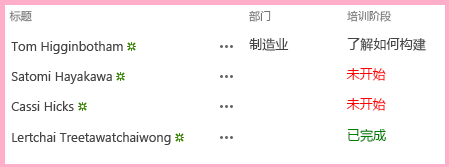

# 向 SharePoint 托管的 SharePoint 外接程序添加自定义客户端呈现
对 SharePoint 外接程序页面中控件的呈现和验证进行自定义设置。
这是关于开发 SharePoint 托管的 SharePoint 外接程序的基础知识系列文章中的第八篇文章。您应该首先熟悉  [SharePoint 外接程序](sharepoint-add-ins.md)以及本系列中之前的文章：


-  [开始创建 SharePoint 承载的 SharePoint 外接程序](get-started-creating-sharepoint-hosted-sharepoint-add-ins.md)


-  [部署和安装 SharePoint 托管的 SharePoint 外接程序](deploy-and-install-a-sharepoint-hosted-sharepoint-add-in.md)


-  [向 SharePoint 托管的 SharePoint 外接程序添加自定义列](add-custom-columns-to-a-sharepoint-hostedsharepoint-add-in.md)


-  [向 SharePoint 托管的 SharePoint 外接程序添加自定义内容类型](add-a-custom-content-type-to-a-sharepoint-hostedsharepoint-add-in.md)


-  [向 SharePoint 托管的 SharePoint 外接程序中的页面添加 Web 部件](add-a-web-part-to-a-page-in-a-sharepoint-hosted-sharepoint-add-in.md)


-  [向 SharePoint 托管的 SharePoint 外接程序添加工作流](add-a-workflow-to-a-sharepoint-hosted-sharepoint-add-in.md)


-  [向 SharePoint 托管的 SharePoint 外接程序添加自定义页面和样式](add-a-custom-page-and-style-to-a-sharepoint-hosted-sharepoint-add-in.md)


> **注释**
> 如果您阅读过关于 SharePoint 托管的外接程序的系列文章，那么您应该具有 Visual Studio 解决方案，可以继续阅读本主题。您还可以从  [SharePoint_SP-hosted_Add-Ins_Tutorials](https://github.com/OfficeDev/SharePoint_SP-hosted_Add-Ins_Tutorials) 下载存储库并打开 BeforeClientRenderedControl.sln 文件。


您可以使用一些客户端 JavaScript 对 Web 部件、大多数类型的字段（列）和某些其他控件的呈现进行自定义设置，方法是将 JavaScript 文件分配到控件的 **JSLink** 属性，例如 **SPField.JSLink**。您也可以通过这种方式添加客户端验证逻辑。在本文中，您可以使用客户端呈现，对员工定向 SharePoint 外接程序列表中的字段呈现进行自定义设置。
> **注释**
> 如果最终用户在浏览器中禁用了 JavaScript，SharePoint 将回退到服务器端呈现和验证。 


> **注释**
> 调查列表或事件列表不支持 JSLink 属性。SharePoint 日历是事件列表。 


## 创建和注册 JavaScript


1. 在"解决方案资源管理器"中，右键单击"脚本"节点并选择"添加">"新项目">"Web"。


2. 选择"JavaScript 文件"并将其命名为 OrientationStageRendering.js。


3. 字段的自定义呈现应该自动执行，因此请将匿名方法添加到在文件加载以下代码时自动运行的 JavaScript。

  ```

(function () {

})();
  ```

4. 在此方法的正文中（{ } 字符之间），添加以下代码以创建 JSON（Javascript 对象表示法）对象，以便于呈现覆盖上下文、上下文中的模板以及字段的模板。

  ```

var customRenderingOverride = {};
customRenderingOverride.Templates = {};
customRenderingOverride.Templates.Fields = {

}
  ```

5. 在  `Fields` 模板对象的正文中，添加以下 JSON。属性名称 `OrientationStage` 标识已经对呈现进行自定义的字段。属性的值是另一个 JSON 对象。 `View` 属性标识应用自定义呈现的页面上下文。在这种情况下，对象将通知 SharePoint 在列表视图中使用自定义呈现。（其他选项用于编辑、新建和显示表单。）属性 `renderOrientationStage` 的值是您在后续步骤中创建的自定义呈现方法的名称。

  ```

"OrientationStage": { "View": renderOrientationStage }
  ```

6. 匿名方法必须执行的最后一项操作是向 SharePoint 的模板管理器通知呈现覆盖。将以下行添加到该方法的正文结尾。

  ```
  SPClientTemplates.TemplateManager.RegisterTemplateOverrides(customRenderingOverride);
  ```


    现在方法看起来应该如下所示：


  ```
  (function () {
    var customRenderingOverride = {};
    customRenderingOverride.Templates = {};
    customRenderingOverride.Templates.Fields = {
        "OrientationStage": { "View": renderOrientationStage }
    }

    SPClientTemplates.TemplateManager.RegisterTemplateOverrides(customRenderingOverride);
})();
  ```

7. 将以下方法添加到该文件。如果值为"未启动"，它将"定向阶段"列值的颜色设置为红色；如果值为"已完成"，则设置为绿色。（ `ctx` 对象是由自带 SharePoint 脚本声明的一个客户端上下文对象。）

  ```

function renderOrientationStage(ctx) {
    var orientationStageValue = ctx.CurrentItem[ctx.CurrentFieldSchema.Name];
    if (orientationStageValue == "Not Started")  {
        return "<span style='color:red'>" + orientationStageValue + "</span>"
    }
    else if (orientationStageValue == "Completed") {
        return "<span style='color:green'>" + orientationStageValue + "</span>"
    }
    else {
        return orientationStageValue;
    }
}
  ```

8. 在"解决方案资源管理器"中，展开"网站栏"和"OrientationStage"，然后打开 elements.xml 文件。


9. 要通知 SharePoint 使用您的自定义 JavaScript，请将新属性 **JSLink** 添加到 **Field** 元素，然后将以下 URL 指定为它的值： `~site/Scripts/OrientationStageRendering.js`。

    > **注释**
      > **JSLink** 属性始终是一个文件，而不是方法。暂无方法通知 SharePoint 运行的是哪个方法。这就是为什么文件包含自动运行的方法的原因。

    现在 **Field** 元素的开始标记看起来将如下所示。


  ```

<Field
       ID="{some_guid_here}"
       Name="OrientationStage"
       Title="OrientationStage"
       DisplayName="Orientation Stage"
       Description="The current orientation stage of the employee."
       Type="Choice"
       Required="TRUE"
       Group="Employee Orientation" 
       JSLink="~site/Scripts/OrientationStageRendering.js">
<!-- child elements and end tag omitted -->
  ```

10. 打开 Default.aspx 页面并添加以下代码作为 **asp:Content** 元素的最后一个子项，其中 **ContentPlaceHolderID** 设置为 **PlaceHolderMain**。

  ```XML

<p><asp:HyperLink runat="server" NavigateUrl="JavaScript:window.location = _spPageContextInfo.webAbsoluteUrl + '/Lists/NewEmployeesInSeattle/AllItems.aspx';"
    Text="List View Page for New Employees in Seattle" /></p>

  ```


## 运行并测试外接程序


1. 使用 F5 键部署并运行您的外接程序。Visual Studio 在测试 SharePoint 网站上临时安装此外接程序并立即运行。


2. 您已配置的客户端呈现只会影响列表视图页面上的字段呈现，不会影响我们在主页上放置的列表视图 Web 部件。这是因为 Web 部件默认设置为服务器端呈现。有方法可以撤消此操作，但这些方法对于这个简单示例太过高级。因此，要查看所使用的客户端呈现，请单击"西雅图新员工的列表视图页面"底部的链接。


3. 当列表视图页面打开时，将某些项目的"定向阶段"值设置为"未启动"，将其他项目设置为"已完成"以查看自定义颜色呈现。

   **使用自定义客户端呈现的列表**





4. 要结束调试会话，请关闭浏览器窗口或在 Visual Studio 中停止调试。每次按 F5 时，Visual Studio 将撤回外接程序的之前版本并安装最新版本。


5. 您将在其他文章中使用此外接程序和 Visual Studio 解决方案，因此最好是当您使用一段时间后，最后一次撤回外接程序。在"解决方案资源管理器"中右键单击此项目，然后选择"撤回"。


## 
<a name="Nextsteps"> </a>

在本系列的下一篇文章中，您将在 SharePoint 外接程序中的功能区添加一个自定义菜单项和自定义按钮： [在 SharePoint 外接程序的主机 Web 中创建自定义功能区按钮](create-a-custom-ribbon-button-in-the-host-web-of-a-sharepoint-add-in.md)。


