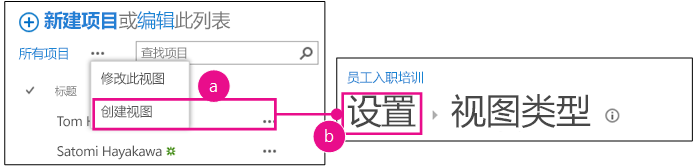
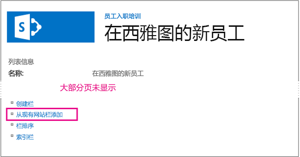
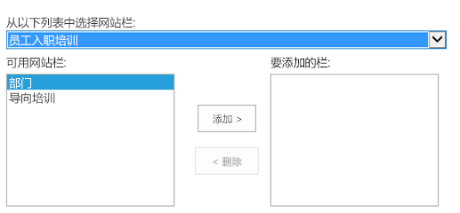
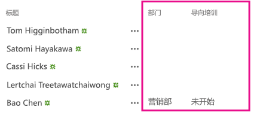

# 向 SharePoint 托管的 SharePoint 外接程序添加自定义列
了解如何在 SharePoint 外接程序中包括自定义栏。
这是关于开发 SharePoint 托管的 SharePoint 外接程序的基础知识系列文章中的第三篇文章。您应该首先熟悉  [SharePoint 外接程序](sharepoint-add-ins.md)以及本系列中之前的文章：


-  [开始创建 SharePoint 承载的 SharePoint 外接程序](get-started-creating-sharepoint-hosted-sharepoint-add-ins.md)


-  [部署和安装 SharePoint 托管的 SharePoint 外接程序](deploy-and-install-a-sharepoint-hosted-sharepoint-add-in.md)


> **注释**
> 如果您阅读过关于 SharePoint 托管的外接程序的此系列文章，那么您应该具有 Visual Studio 解决方案，可以继续阅读本主题。您还可以从  [SharePoint_SP-hosted_Add-Ins_Tutorials](https://github.com/OfficeDev/SharePoint_SP-hosted_Add-Ins_Tutorials) 下载存储库并打开 BeforeColumns.sln 文件。


在本文中，我们将向员工向导 SharePoint 外接程序添加一些网站栏，重新回到编码。
## 创建自定义栏类型


1. 在"解决方案资源管理器"中，右键单击项目，然后选择"添加">"新文件夹"。将文件夹命名为网站栏。


2. 右键单击新文件夹，然后选择"添加">"新项目"。"添加新项目"对话框将打开到"Office/SharePoint"节点。


3. 选择"网站栏"，将其命名为部门，然后选择"添加"。


4. 在新网站栏的 elements.xml 文件中，编辑 **Field** 元素，使其属性和值如以下示例中所示，除了 *您 **不应** 更改 Visual Studio 为* **ID** 属性的 GUID 生成的值， *因此，当您使用复制和粘贴时，请务必小心*  。

  ```

<Field ID="{generated GUID}"
       Name="Division" 
       Title="Division" 
       DisplayName="Division" 
       Description="The division of the company where the employee works." 
       Group="Employee Orientation" 
       Type="Text" 
       Required ="FALSE">
</Field>
  ```

5. 将另一个"网站栏"添加到名为向导阶段的相同文件夹。


6. 在新网站栏的 elements.xml 文件中，编辑 **Field** 元素，使其属性和值如以下示例中所示，除了您不应更改 Visual Studio 为 **ID** 属性的 GUID 生成的值。

  ```

<Field ID="{generated GUID}"
       Name="OrientationStage" 
       Title="OrientationStage"
       DisplayName="Orientation Stage" 
       Group="Employee Orientation" 
       Description="The current orientation stage of the employee." 
       Type="Choice"
       Required ="TRUE">
</Field>
  ```

7. 因为这是选择字段，您必须指定可能的选项以及用户在进行选择时它们应在下拉列表中出现的顺序。因为这是必填字段，您必须指定一个默认值。将以下子标记添加到 **Field** 元素。

  ```

<CHOICES>
      <CHOICE>Not Started</CHOICE>
      <CHOICE>Tour of building</CHOICE>
      <CHOICE>HR paperwork</CHOICE>
      <CHOICE>Corporate network access</CHOICE>
      <CHOICE>Completed</CHOICE>
</CHOICES>
<MAPPINGS>
      <MAPPING Value="1">Not Started</MAPPING>
      <MAPPING Value="2">Tour of building</MAPPING>
      <MAPPING Value="3">HR paperwork</MAPPING>
      <MAPPING Value="4">Corp network access</MAPPING>
      <MAPPING Value="5">Completed</MAPPING>
</MAPPINGS>
<Default>Not Started</Default>
  ```

8. 保存所有文件。


## 运行外接程序并测试栏


1. 使用 F5 键部署并运行您的外接程序。Visual Studio 在测试 SharePoint 网站上临时安装外接程序并立即运行该外接程序。


2. 当外接程序的默认页面打开时，选择"西雅图新员工"链接以打开自定义列表实例。


3. 打开列表的"设置"页面，执行以下步骤向其添加两列。

1. 单击标注按钮"· · ·"（就在列表上方），然后选择"创建视图"。


2. "视图类型"页面打开，在靠近顶部的位置显示痕迹导航结构"设置和视图类型"。单击"设置"痕迹导航。

   **打开列表设置页的步骤**





3. 在"设置"页上，打开页面向下一半左右位置左侧的"从现有网站栏添加"链接。

   **列表设置页**





4. 在"从网站栏添加栏"页上，在"从中选择网站栏"下拉列表中选择"员工向导"。

   **"从网站栏添加栏"页面**





5. 将"部门"和"向导阶段"栏添加到"要添加的栏"框中。


6. 选择"确定"返回到"设置"页面，然后单击页面顶部附近的"西雅图新员工"痕迹导航。


4. 新栏现在已在列表中。向列表中添加一个新项。在编辑表单中，"向导阶段"字段已经具有默认值未启动。（此字段中的现有项将为空，因为它们是在列表中出现此字段之前创建的。）

**具有新列的列表**





5. 要结束调试会话，请关闭浏览器窗口或在 Visual Studio 中停止调试。每次按 F5 时，Visual Studio 将撤回外接程序的之前版本并安装最新版本。


6. 您将在其他文章中使用此外接程序和 Visual Studio 解决方案，因此最好是当您最后一次使用一段时间后撤回外接程序。在"解决方案资源管理器"中右键单击项目，然后选择"撤回"。


## 
<a name="Nextsteps"> </a>

您确实不希望您的用户必须手动向列表中添加自定义列，因此在本系列的下一篇文章中，您将创建一个自定义内容类型，其中包括自定义列，且将自动与"新员工"列表模板关联： [向 SharePoint 托管的 SharePoint 外接程序添加自定义内容类型](add-a-custom-content-type-to-a-sharepoint-hostedsharepoint-add-in.md)。


