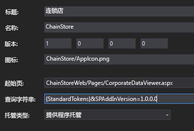
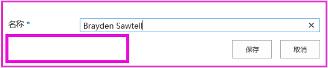

# 将首次运行逻辑添加到提供程序托管的外接程序
了解如何在提供程序托管的 SharePoint 外接程序中包括"首次运行"代码。
这是关于开发 SharePoint 托管的 SharePoint 外接程序的基础知识系列文章中的第八篇文章。您应该首先熟悉  [SharePoint 外接程序](sharepoint-add-ins.md)以及本系列中之前的文章：


-  [开始创建提供程序承载的 SharePoint 加载项](get-started-creating-provider-hosted-sharepoint-add-ins.md)


-  [使提供程序托管的外接程序具有 SharePoint 的外观](give-your-provider-hosted-add-in-the-sharepoint-look-and-feel.md)


-  [在提供程序托管的外接程序中包含自定义按钮](include-a-custom-button-in-the-provider-hosted-add-in.md)


-  [获取 SharePoint 对象模型的快速概述](get-a-quick-overview-of-the-sharepoint-object-model.md)


-  [将 SharePoint 写入操作添加到提供程序托管的外接程序](add-sharepoint-write-operations-to-the-provider-hosted-add-in.md)


-  [在提供程序托管的外接程序中包括外接程序部件](include-an-add-in-part-in-the-provider-hosted-add-in.md)


-  [处理提供程序托管的外接程序中的外接程序事件](handle-add-in-events-in-the-provider-hosted-add-in.md)


> **注释**
> 如果您阅读过关于提供程序托管的外接程序的系列文章，那么您应该具有 Visual Studio 解决方案，可以继续阅读本主题。您还可以从  [SharePoint_Provider-hosted_Add-Ins_Tutorials](https://github.com/OfficeDev/SharePoint_Provider-hosted_Add-ins_Tutorials) 下载存储库并打开 BeforeFirstRunLogic.sln 文件。


在本文中，您将代码添加到连锁店 SharePoint 外接程序的起始页，该代码将检查外接程序的当前实例是否为首次运行。如果是，您的代码将部署"本地员工"列表和自定义功能区按钮。
## 创建用于部署 SharePoint 组件的基本类


> **注释**
>  Visual Studio 中的启动项目的设置可能会在重新打开解决方案时恢复为默认值。重新打开本系列文章中的示例解决方案后，请始终立即执行下列步骤：<BR /><BR />  右键单击"解决方案资源管理器"顶部的解决方案节点，然后选择"设置启动项目"。<BR />  确保所有三个项目在"操作"列中均设置为"启动"。


1. 在"解决方案资源管理器"中的"ChainStoreWeb"项目中，右键单击"实用程序"文件夹并选择"添加 | 现有项目"。


2. 在打开的"文件资源管理器"中，导航到解决方案文件夹"ChainStoreWeb"文件夹，然后打开"实用程序"文件夹。


3. 选择 SharePointComponentDeployer.cs 并按"添加"。


4. 打开文件 SharePointComponentDeployer.cs。该文件有一个静态类和两个静态方法，静态方法可在公司数据库的"租户"表中获取并设置外接程序的版本。我们不讨论这些方法，因为本系列文章的目的不是教您进行 ASP.NET 或 SQL Server/Azure 编程。


5. 将以下 **using** 语句添加到文件顶部。

  ```

using System.Web;
using System.Linq;
using System.Collections.Generic;
using Microsoft.SharePoint.Client;
  ```

6. 在  `SharePointComponentDeployer` 类顶部，添加以下两个静态字段。两个字段都将在外接程序起始页的 **Page_Load** 方法中初始化。您可在后续步骤中添加该代码。第一个字段保存在 SharePoint 上执行 CRUD 操作所需的 **SharePointContext** 对象。第二个字段保存主机 Web 上安装的外接程序的版本号。该值一开始与默认值 ( **0000.0000.0000.0000** ) 不同，默认值在安装处理程序注册租户时记录在公司"租户"表中。例如，外接程序的第一个版本为 **1.0.0.0** 。

  ```cs

internal static SharePointContext sPContext;
internal static Version localVersion;
  ```

7. 创建以下静态属性，以保存当前记录在公司"租户"表中的外接程序版本。它使用文件中已有的两个方法来获取和设置该值。

  ```cs

internal static Version RemoteTenantVersion
{
    get
    {
        return GetTenantVersion();
    }
    set
    {
        SetTenantVersion(value);
    }
}
  ```

8. 现在创建以下  `IsDeployed` 属性。对于此代码，请注意以下事项：

  - 外接程序起始页的 **Page_Load** 方法将使用该属性的值确定外接程序是否是首次运行。 **false** 值发出信号，指示外接程序以前未在当前主机 Web 上运行过，因此需要部署其组件。


  - 标准是"租户"表中注册的版本号是否低于实际安装的版本。外接程序第一次运行时，版本较低。您在后续步骤中编写的代码会将"租户"表中的版本设置为与实际安装的版本相同，因此当再次运行外接程序时， `IsDeployed` 将返回 **true**，不会再次执行部署逻辑。


  ```cs

public static bool IsDeployed
{
    get
    {
        if (RemoteTenantVersion < localVersion)
            return false; 
        else
            return true; 
    }
}
  ```

9. 将以下方法添加到  `SharePointComponentDeployer` 类。请注意，该方法执行的最后一个操作是更新公司数据库中的注册租户版本 ( **0000.0000.0000.0000** )，使其与主机 Web 上的外接程序实际版本 ( **1.0.0.0** ) 匹配。您将在后续步骤中完成该方法。

  ```cs

internal static void DeployChainStoreComponentsToHostWeb(HttpRequest request)
{
    // TODO4: Deployment code goes here.

    RemoteTenantVersion = localVersion;
}
  ```


> **注释**
> 现在，您可能想知道为什么外接程序要使用版本号和"小于"测试来确定一个简单的是/否问题的答案，即外接程序是否为首次运行。我们也可以将"租户"表中的一个简单字符串字段在安装处理程序中设置为"尚未运行"，然后在部署 SharePoint 组件后由首次运行逻辑更改为"已运行一次"。 <BR /> 对于连锁店外接程序，进行一个简单测试即可。但是，使用版本号通常是比较好的做法。这是因为未来生产外接程序很可能会就地更新，即在安装后更新。届时，您的外接程序逻辑必须对更多可能性做出响应，而不仅仅是尚未运行和已运行一次这两种。例如，假定您希望在从版本 1.0.0.0 升级到 2.0.0.0 时向主机 Web 添加一个额外列表，您可以在升级事件处理程序中或在更新后首次运行逻辑中执行此操作。不论采用哪种方法，您的部署逻辑都需要部署新组件，但也需要避免尝试重新部署在外接程序之前版本中已部署的组件。版本号 1.0.0.0 表示已部署但更新后首次运行逻辑尚未运行版本 1.0.0.0 的组件。 


## 添加基本启动逻辑


1. SharePoint 主机 Web 需要将它已安装的外接程序版本告知远程 Web 应用程序。我们将使用查询参数执行此操作。打开"ChainStore"项目中的 AppManifest.xml 文件。在设计器中，您将看到占位符 **{StandardTokens}** 作为"查询字符串"框的值。将字符串"&amp;SPAddInVersion=1.0.0.0"添加到结尾。清单设计器看起来应该如下所示。 *请注意，您在查询字符串中传递的版本号必须与设计器的"版本"框中的值匹配。*  （如果之前更新了外接程序，您的任务之一是增加这两个值，使其保持一致。）




2. 打开 CorporateDataViewer.aspx.cs 文件，并将以下代码添加到 **Page_Load** 方法中初始化 `spContext` 对象的行下方。对于此代码，请注意以下事项：

  - 它首先在静态  `SharePointComponentDeployer` 类中设置两个静态字段。它会传递 **SharePointContext** 对象，因为 `SharePointComponentDeployer` 中的代码将会调用 SharePoint，并且使用您添加的查询参数来设置 `localVersion` 属性。


  - 如果  `IsDeployed` 为 true，它不执行任何操作，即，如果"首次运行"逻辑已运行。否则它将调用部署方法并传递 ASP.NET 请求对象。


  ```cs

SharePointComponentDeployer.sPContext = spContext;
SharePointComponentDeployer.localVersion = new Version(Request.QueryString["SPAddInVersion"]);

if (!SharePointComponentDeployer.IsDeployed)
{
    SharePointComponentDeployer.DeployChainStoreComponentsToHostWeb(Request);
}
  ```


## 以编程方式部署 SharePoint 列表


1. 在 SharePointComponentDeployer.cs 文件中，将  `TODO4` 替换为以下行。您将在下一步中创建该方法。

  ```cs

CreateLocalEmployeesList();
  ```

2. 将以下方法添加到  `SharePointComponentDeployer` 类。对于此代码，请注意以下事项。

  - 它具有 **ExecuteQuery** 的两个调用。第一个调用确定列表是否已存在，第二个调用执行创建列表的操作。


  - **ClientContext.LoadQuery** 方法与 **ClientContext.Load** 类似，除了它不是将列表等实体，而是将查询的可枚举结果带到客户端。


  ```cs
  private static void CreateLocalEmployeesList()
{
    using (var clientContext = sPContext.CreateUserClientContextForSPHost())
    {
        var query = from list in clientContext.Web.Lists
                    where list.Title == "Local Employees"
                    select list;
        IEnumerable<List> matchingLists = clientContext.LoadQuery(query);
        clientContext.ExecuteQuery();

        if (matchingLists.Count() == 0)
        {
           // TODO5: Create the list 

           // TODO6: Rename the Title field on the list 

           // TODO7: Add "Added to Corporate DB" field to the list 

           clientContext.ExecuteQuery();
        }
    }
}
  ```

3. 将  `TODO5` 替换为以下代码。对于此代码，请注意以下事项。

  - **ListCreationInformation** 类与您在本系列前一篇文章中看到的 **ListItemCreationInformation** 类相似。它是一个轻型类，比完整的 **List** 类更适合用于从 Web 应用程序发送信息到 SharePoint。


  - 有很多类型的列表模板，例如"待办事项"列表的"任务"类型和日历的"事件"类型。"本地员工"列表基于最简单的"通用"类型。


  - **ListCreationInformation.Url** 属性保留相对于主机 Web 的列表 URL。通过指定"Lists/LocalEmployees"，代码将列表的完整 URL 设置为 https:// *{SharePointDomain}*  /hongkong/_layouts/15/start.aspx#/Lists/Local%20Employees。


  ```cs

ListCreationInformation listInfo = new ListCreationInformation();
listInfo.Title = "Local Employees";
listInfo.TemplateType = (int)ListTemplateType.GenericList;
listInfo.Url = "Lists/Local Employees";
List localEmployeesList = clientContext.Web.Lists.Add(listInfo);
  ```

4. 将  `TODO6` 替换为以下代码，它会将"Title"字段（列）的公用名称从"Title"更改为"Name"。这是您在手动创建列表时在"列表设置"页面上执行的操作。

  ```cs

Field field = localEmployeesList.Fields.GetByInternalNameOrTitle("Title");
field.Title = "Name";
field.Update();
  ```

5. 您还手动创建了一个名为"已添加到公司数据库"的字段。要执行此操作，请以编程方式添加以下代码以替换  `TODO7`。对于此代码，请注意以下事项。

  - 字段的关键属性使用 XML blob 指定。这是旧版的 SharePoint 体系结构：网站、列表、字段、内容类型和大多数其他类型的 SharePoint 组件定义为 XML。在这种情况下，我们将指定字段的显示名称、数据类型和默认值。


  - 第二个参数确定字段在列表的默认视图中是否可见。我们将其设置为 **true**。


  - 第三个参数可用于确定字段将添加到哪些内容类型。传递 **DefaultValue** 意味着它仅添加到列表的默认内容类型。


  ```cs

localEmployeesList.Fields.AddFieldAsXml("<Field DisplayName='Added to Corporate DB'"
                                         +"Type='Boolean'>"
                                         + "<Default>FALSE</Default></Field>",
                                         true,
                                         AddFieldOptions.DefaultValue);
  ```

6. "已添加到公司数据库"默认为"否"（即 false），但外接程序中的自定义功能区按钮在将员工添加到公司数据库后将其设置为"是"。仅当用户不能手动更改该字段的值时，该系统运行得最好。要确保这一点，在用于创建和编辑"本地员工"列表中的项目的表单中，请将该字段设置为不可见。我们可通过将另外两个属性添加到第一个参数执行此操作，如下所示：

  ```cs

localEmployeesList.Fields.AddFieldAsXml("<Field DisplayName='Added to Corporate DB'"
                                         + " Type='Boolean'"
                                         + " ShowInEditForm='FALSE' "
                                         + " ShowInNewForm='FALSE'>"
                                         + "<Default>FALSE</Default></Field>",
                                         true,
                                         AddFieldOptions.DefaultValue);
  ```


    现在整个  `CreateLocalEmployeesList` 看起来应该如下所示。


  ```cs

private static void CreateLocalEmployeesList()
{
    using (var clientContext = sPContext.CreateUserClientContextForSPHost())
    {
        var query = from list in clientContext.Web.Lists
                    where list.Title == "Local Employees"
                    select list;
        IEnumerable<List> matchingLists = clientContext.LoadQuery(query);
        clientContext.ExecuteQuery();

        if (matchingLists.Count() == 0)
        {
            ListCreationInformation listInfo = new ListCreationInformation();
            listInfo.Title = "Local Employees";
            listInfo.TemplateType = (int)ListTemplateType.GenericList;
            listInfo.Url = "LocalEmployees";
            List localEmployeesList = clientContext.Web.Lists.Add(listInfo);

            Field field = localEmployeesList.Fields.GetByInternalNameOrTitle("Title");
            field.Title = "Name";
            field.Update();

            localEmployeesList.Fields.AddFieldAsXml("<Field DisplayName='Added to Corporate DB'" 
                                                    + " Type='Boolean'"
                                                   + " ShowInEditForm='FALSE' "
                                                   + " ShowInNewForm='FALSE'>"
                                                   + "<Default>FALSE</Default></Field>",
                                                    true,
                                                    AddFieldOptions.DefaultValue);
            clientContext.ExecuteQuery();
        }
    }
}
  ```


## 从项目中暂时删除自定义按钮

出于技术原因（将在下一篇文章中讨论），我们创建的自定义按钮放置在以编程方式部署的列表的功能区上时，必须进行修改后才能安装。我们将把它从项目中暂时删除，以便测试首次运行逻辑。下一篇文章中将重新添加该按钮。


在"解决方案资源管理器"的"ChainStore"项目中，右键单击"AddEmployeeToCorpDB"节点并选择"从项目中排除"。


## 请求管理主机 Web 上的列表的权限

由于外接程序正在向主机 Web 添加列表，而不是向现有列表添加项目，我们需要将外接程序请求的权限从"写入"提升为"管理"。请执行以下步骤。


1. 在"解决方案资源管理器"中，打开"ChainStore"项目中的 AppManifest.xml 文件。


2. 打开"权限"选项卡并将"作用域"值保留为"Web"，但在"权限"字段中，从下拉列表中选择"管理"。


3. 保存该文件。


## 运行外接程序并测试"首次运行"逻辑


1. 打开香港分店网站的"网站内容"页面， *然后删除"本地员工"列表。* 


2. 使用 F5 键部署并运行您的外接程序。Visual Studio 在 IIS Express 中托管远程 Web 应用程序，在 SQL Express 中托管 SQL 数据库。它还会在 SharePoint 测试网站上临时安装外接程序并立即运行它。在起始页打开之前，将提示您向外接程序授予权限。


3. 当外接程序的起始页打开时，选择顶部部件版式控件上的"返回到网站"链接。


4. 导航到"网站内容"页面。"本地员工"列表已存在，因为您的首次运行逻辑添加了它。

    > **注释**
      > 如果该列表不存在或者有其他指示称首次运行代码未执行，可能是当您按 F5 时，"租户"表未恢复为空。最常见的原因是"ChainCorporateDB"项目在 Visual Studio 中不再设置为启动项目。请参阅本文顶部附近的注释，了解如何解决此问题。另外，请确保您已按照 [将 Visual Studio 配置为在每次调试会话时重建公司数据库](give-your-provider-hosted-add-in-the-sharepoint-look-and-feel.md#Rebuild)中所述，将数据库配置为重建。 
5. 打开列表并添加项目。请注意，在新项目表单上，"已添加到公司数据库"字段不再存在，因此无法手动设置。这也适用于编辑项目表单。




6. 使用浏览器的后退按钮返回到外接程序的起始页。


7. 按顶部的部件版式控件上的齿轮图标并选择"帐户设置"。


8. 在"帐户"页面上，按"显示外接程序版本"按钮。版本显示为"1.0.0.0"，因为首次运行逻辑对其进行了更改。


9. 要结束调试会话，请关闭浏览器窗口或在 Visual Studio 中停止调试。每次按 F5 时，Visual Studio 将撤回外接程序的之前版本并安装最新版本。


10. 您将在其他文章中使用此外接程序和 Visual Studio 解决方案，因此最好是当您使用一段时间后，最后一次撤回外接程序。在"解决方案资源管理器"中右键单击此项目，然后选择"撤回"。


## 
<a name="Nextsteps"> </a>

在下一篇文章中，您将了解如何将"本地员工"功能区的自定义按钮重新添加到列表正在以编程方式部署的外接程序中： [以编程方式在提供程序托管的外接程序中部署自定义按钮](programmatically-deploy-a-custom-button-in-the-provider-hosted-add-in.md)


