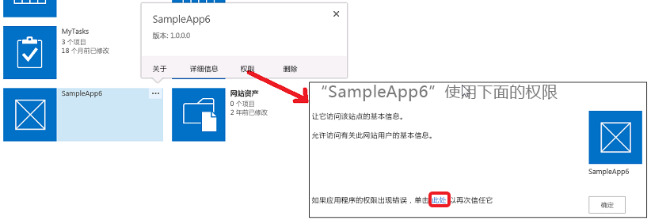

# SharePoint 2013 中的外接程序权限
了解 SharePoint 中的外接程序权限，包括外接程序权限的类型、权限请求范围和管理权限。本文还讨论了外接程序权限、用户权限和 Office 商店应用程序权限之间的区别。
您应首先熟悉  [SharePoint 外接程序的授权和身份验证](authorization-and-authentication-of-sharepoint-add-ins.md)主题，然后再阅读本文。
  
    
    


**观看关于外接程序权限的视频。**

  
    
    

  
    
    

  
    
    

  
    
    

  
    
    

## 获取 SharePoint 中外接程序权限的概述
<a name="Perm_intro"> </a>

SharePoint 外接程序在安装过程中从其安装用户那里请求它需要的权限。外接程序开发人员必须通过外接程序清单文件请求特定外接程序运行所需的权限。（对于访问 SharePoint，但未安装到 SharePoint 网站的设备和 Web 应用程序，必须由执行外接程序的用户在运行时向其授予权限。有关详细信息，请参阅 [获取从 SharePoint 实时请求访问权限的外接程序的概述](authorization-code-oauth-flow-for-sharepoint-add-ins.md#Overview)。）用户可以仅授予他们所具有的权限。用户必须授予外接程序请求的所有权限，或者不授予任何权限。无法进行选择性授权。（对于实时请求权限的外接程序，仅具有外接程序所需 SharePoint 资源的管理权限的用户才能运行外接程序，即使外接程序仅需要更低的权限，例如读取。）
  
    
    
外接程序已授予的权限也存储在 SharePoint 服务器场或 SharePoint Online 租户的内容数据库中。它们不会存储在安全令牌服务中，如 Microsoft Azure 访问控制服务 (ACS)。当用户第一次向外接程序授予权限时，SharePoint 从 ACS 获取关于外接程序的信息。SharePoint 然后会将关于外接程序的基本信息以及外接程序的权限存储在外接程序管理服务和内容数据库中。有关 ACS 的详细信息，请参阅 [创建使用低信任授权的 SharePoint 外接程序](creating-sharepoint-add-ins-that-use-low-trust-authorization.md)。
  
    
    
如果外接程序已被授予权限的对象被删除，也将删除相应的授权。当外接程序已被授予权限的对象被回收时，SharePoint 不会修改相应的授权。当对象从回收站中还原时也是如此，授权仍保持不变。
  
    
    
删除外接程序时，将在从其删除了外接程序的范围中撤消向外接程序授予的所有权限。这是为了确保当用户从 SharePoint 删除某个外接程序后，该外接程序不会使用其凭据继续以远程方式访问受保护的 SharePoint 资源。
  
    
    

## 了解外接程序权限的类型和权限范围
<a name="Perm_types"> </a>

SharePoint 外接程序使用权限请求指定正常运行所需的权限。权限请求同时指定外接程序所需的权限以及所需权限所属范围。请求这些权限作为外接程序清单的一部分。
  
    
    

> [!注释]
> 本节中介绍的范围仅适用于列表内容和库内容。有关其他功能的范围的信息，请参阅本文的 [了解外接程序权限的类型和权限范围](#Perm_types)一节。 
  
    
    

权限请求范围指示其中应用权限请求的 SharePoint 层次结构中的位置。
  
    
    

> [!注释]
> SharePoint 外接程序具有其自己的标识，它是一个安全主体，称为外接程序主体。与用户和组一样，外接程序主体具有特定权限。外接程序主体具有对外接程序 Web 的完全控制权限，因此它只需要对位于主机 Web 或外接程序 Web 之外的其他位置的 SharePoint 资源的请求权限。有关外接程序 Web 的详细信息，请参阅 [SharePoint 外接程序体系结构的重要方面和开发前景](important-aspects-of-the-sharepoint-add-in-architecture-and-development-landscap.md)和 [SharePoint 2013 中的主机 Web、外接程序 Web 和 SharePoint 组件](host-webs-add-in-webs-and-sharepoint-components-in-sharepoint-2013.md)。 
  
    
    

SharePoint 在内容数据库和租户中支持四个不同的权限范围，如表 1 中所示。权限范围使用 URI 命名，其中包括"http:"前缀，但它们不是 URL，不包含占位符。本表和本文中的权限范围属于文本字符串。
  
    
    

**表 1. SharePoint 外接程序权限请求范围 URI 和说明**

|||
|:-----|:-----|
|**范围 URI** <br/> |**说明** <br/> |
|租赁  <br/> http://sharepoint/content/tenant  <br/> |安装外接程序的租户。包括此范围的所有子级。  <br/> |
|网站集  <br/> http://sharepoint/content/sitecollection  <br/> |安装外接程序的网站集。包括此范围的所有子级。  <br/> |
|网站  <br/> http://sharepoint/content/sitecollection/web  <br/> |安装外接程序的网站。包括此范围的所有子级。  <br/> |
|列表  <br/> http://sharepoint/content/sitecollection/web/list  <br/> |安装外接程序的网站中的单个列表。当系统提示安装外接程序的用户授予权限时，用户能够通过该对话框选择已对外接程序授予权限的列表。如果外接程序需要对多个列表的权限，必须请求对 Web 范围的权限。此外，作为开发人员，由于您无法控制哪个列表列出用户选择或告诉用户选择哪一个列表，如果外接程序 *必须*  具有对某个列表的权限，您就必须使用 Web 范围。（有一个方法可以缩小到特定的列表子集的用户选择。请参阅下方的 [包含关联属性的权限请求范围](#AssociatedProperties)。)  <br/> |
   
如果向外接程序授予了对其中一个范围的权限，则该权限适用于范围的所有子级。例如，如果授予了外接程序对网站的权限，则将授予外接程序对网站中所包含的每个列表以及每个列表中包含的所有列表项的权限。
  
    
    
由于权限请求是在没有其中安装了外接程序的网站集的拓扑信息的情况下发出的，因此范围将表示为类型而不是特定实例的 URL。 这些范围类型将表示为 URI。将按以下 URI 组织存储在 SharePoint 内容数据库中的资源权限： `http://sharepoint/content`。
  
    
    

## 了解外接程序权限和用户权限之间的区别
<a name="Perm_diff"> </a>

权限指示允许外接程序在请求的范围内执行的活动。SharePoint 在内容数据库中支持下列四个权限级别。对于每个范围，外接程序可具有下列权限：
  
    
    

- 阅读
    
  
- 写入
    
  
- 管理
    
  
- 完全控制
    
  

> [!注释]
> 有关读取、写入、管理和完全控制权限的详细信息，请参阅 [规划外接程序权限管理](http://technet.microsoft.com/zh-cn/library/jj219576%28office.15%29.aspx)。 
  
    
    


> [!注释]
> 这些权限对应于 SharePoint 的下列默认权限级别：读者、参与者、设计者和完全控制。有关用户权限级别的详细信息，请参阅 [用户权限和权限级别](http://technet.microsoft.com/zh-cn/library/cc288074.aspx)。 > 外接程序权限名称与 SharePoint 用户角色权限名称不匹配，目的是为了避免混淆用户角色权限和外接程序权限。由于自定义与 SharePoint 用户角色关联的权限不会影响外接程序权限请求级别，因此外接程序权限名称与对应的 SharePoint 用户角色不匹配，但完全控制权限除外，其不可通过权限管理用户界面进行自定义。 
  
    
    

此外：
  
    
    

- 对于仅搜索，外接程序只能具有查询权限。
    
  
- 对于某些 Microsoft Project Server 2013 范围，还具有 SubmitStatus 权限或提升权限。对于大多数 Project Server 2013 范围，仅提供了读取和写入权限。有关详细信息，请参阅本文的 [了解外接程序权限的类型和权限范围](#Perm_types)一节。
    
  
- 对于分类，仅提供读取和写入权限。
    
  

> [!注释]
> Office 商店应用程序在外接程序可请求的权限类型上具有一些限制。有关详细信息，请参阅本文的 [了解外接程序权限的类型和权限范围](#Perm_types)一节。 
  
    
    

与 SharePoint 用户角色不同，这些权限级别不可进行自定义。这是为了确保向外接程序授予权限请求时，保证外接程序具有一组可预计的功能，并且它不必对授予的权限少于其所预期的权限这一可能性负责。
  
    
    
用户不能授予他/她自己不具有的外接程序权限。如果用户尝试安装请求超过用户所具有权限的外接程序，将向用户显示一条错误消息，通知用户他们没有足够的权限向外接程序授予请求的权限。
  
    
    
将忽略对 SharePoint 未知的权限。这意味着，如果外接程序请求 SharePoint 无法识别的权限，则仍将安装外接程序，但不会提示用户授予权限，并且不会向外接程序授予该权限。
  
    
    

## 了解可用范围和权限，以及关于 Office 商店应用程序权限的限制
<a name="Perm_rightlist"> </a>

不同的范围具有不同的可供外接程序请求的权限集。 本节介绍可供每个范围使用的权限集。此外，它重点介绍了通过 Office 商店出售的 SharePoint 外接程序的限制。
  
    
    

### Office 商店应用程序的权限

仅允许 Office 商店应用程序使用读取、写入和管理权限。 如果您尝试将应用程序提交给需要完全控制权限的 Office 商店，则您的应用程序的提交将受阻。由于阻止位于 Office 商店提交管道中，因此请求管理权限之外的权限的应用程序仍将通过外接程序目录部署。
  
    
    

### 列表内容和库内容的权限请求范围
<a name="PermissionsForLists"> </a>

表 2 显示的是列表和库内容的权限请求范围。它还列出了可为每个范围 URI 指定的权限。
  
    
    

> [!注释]
> 表 2 中使用的 URI 是文本值。 
  
    
    


**表 2. SharePoint 外接程序权限范围 URI 和可用权限**

|||
|:-----|:-----|
|**范围 URI** <br/> |**可用权限** <br/> |
|http://sharepoint/content/sitecollection  <br/> |读取、写入、管理、完全控制  <br/> |
|http://sharepoint/content/sitecollection/web  <br/> |读取、写入、管理、完全控制  <br/> |
|http://sharepoint/content/sitecollection/web/list  <br/> |读取、写入、管理、完全控制  <br/> |
|http://sharepoint/content/tenant  <br/> |读取、写入、管理、完全控制  <br/> |
   
以下代码演示如何使用 AppManifest.xml 文件中的权限范围和权限。在第一个示例中，外接程序需要列表范围的写入访问权限。
  
    
    


```XML

<?xml version="1.0" encoding="utf-8" ?>
<App xmlns="http://schemas.microsoft.com/sharepoint/2012/app/manifest"
     ProductID="{4a07f3bd-803d-45f2-a710-b9e944c3396e}"
     Version="1.0.0.0"
     SharePointMinVersion="15.0.0.0"
     Name="MySampleAddIn"
>
  <Properties>
    <Title>My Sample Add-in</Title>
    <StartPage>~remoteAppUrl/Home.aspx?{StandardTokens}</StartPage>
  </Properties>

  <AppPrincipal>
    <RemoteWebApplication ClientId="1ee82b34-7c1b-471b-b27e-ff272accd564" />
  </AppPrincipal>

  <AppPermissionRequests>
    <AppPermissionRequest Scope="http://sharepoint/content/sitecollection/web/list" Right="Write"/>
  </AppPermissionRequests>
</App>
```

以下代码演示要求 Web 范围的读取访问权限和列表范围的写入访问权限的外接程序。
  
    
    


```XML

<?xml version="1.0" encoding="utf-8" ?>
<App xmlns="http://schemas.microsoft.com/sharepoint/2012/app/manifest"
     ProductID="{4a07f3bd-803d-45f2-a710-b9e944c3396e}"
     Version="1.0.0.0"
     SharePointMinVersion="15.0.0.0"
     Name="MySampleAddIn"
>
  <Properties>
    <Title>My Sample Add-in</Title>
    <StartPage>~remoteAppUrl/Home.aspx?{StandardTokens}</StartPage>
  </Properties>

  <AppPrincipal>
    <RemoteWebApplication ClientId="6daebfdd-6516-4506-a7a9-168862921986" />
  </AppPrincipal>

  <AppPermissionRequests>
    <AppPermissionRequest Scope="http://sharepoint/content/sitecollection/web" Right="Read"/>
    <AppPermissionRequest Scope="http://sharepoint/content/sitecollection/web/list" Right="Write"/>
  </AppPermissionRequests>
</App>
```


### 其他 SharePoint 功能的权限请求范围
<a name="PermissionsForLists"> </a>

下列表中列出了其他 SharePoint 功能的权限请求范围。 
  
    
    

> [!注释]
> 这些表中使用的 URI 为文本值。 
  
    
    

表 3 显示的是 Business Connectivity Services (BCS) 的权限请求范围。它还列出了可为该范围 URI 指定的权限。
  
    
    

**表 3. BCS 外接程序权限请求范围 URI 和可用权限**

|||
|:-----|:-----|
|**范围 URI** <br/> |**可用权限** <br/> |
|http://sharepoint/bcs/connection  <br/> |阅读  <br/> |
   

> [!注释]
> 有关 BCS 外接程序权限请求范围的详细信息，请参阅  [SharePoint 2013 中的 Business Connectivity Services](http://msdn.microsoft.com/library/64b7d032-4b83-4e9e-bc08-f0a161af5457%28Office.15%29.aspx)。 
  
    
    


  
    
    
表 4 显示的是搜索的权限请求范围。它还列出了可为该范围 URI 指定的权限。
  
    
    

**表 4. 搜索外接程序权限请求范围 URI 和可用权限**

|||
|:-----|:-----|
|**范围 URI** <br/> |**可用权限** <br/> |
|http://sharepoint/search  <br/> |QueryAsUserIgnoreAppPrincipal  <br/> |
   

> [!注释]
> 有关搜索外接程序权限请求范围的详细信息，请参阅  [SharePoint 2013 中的搜索](http://msdn.microsoft.com/library/59220f81-0e5e-4945-8056-cf0a116446cb%28Office.15%29.aspx)。 
  
    
    


  
    
    
表 5 显示的是 Project Server 2013 的权限请求范围。它还列出了可为每个范围 URI 指定的权限。
  
    
    

> [!注释]
> 应在具有所需 Project Server 功能和服务的环境中测试使用 Project Server 2013 功能和服务的外接程序。默认情况下不会使用 SharePoint Server 安装了解 Project Server 2013 权限范围的 Project Server 2013 权限提供程序程序集。有关详细信息，请参阅 Project Server 2013 开发人员文档。 
  
    
    


**表 5. Project Server 外接程序权限请求范围 URI 和可用权限**

|||
|:-----|:-----|
|**范围** <br/> |**可用权限** <br/> |
|http://sharepoint/projectserver  <br/> |管理  <br/> |
|http://sharepoint/projectserver/projects  <br/> |读取、写入  <br/> |
|http://sharepoint/projectserver/projects/project  <br/> |读取、写入  <br/> |
|http://sharepoint/projectserver/enterpriseresources  <br/> |读取、写入  <br/> |
|http://sharepoint/projectserver/statusing  <br/> |SubmitStatus  <br/> |
|http://sharepoint/projectserver/reporting  <br/> |阅读  <br/> |
|http://sharepoint/projectserver/workflow  <br/> |提升  <br/> |
   

  
    
    
表 6 显示的是社会功能的权限请求范围。它还列出了可为每个范围 URI 指定的权限。
  
    
    

**表 6. 社交功能外接程序权限请求范围 URI 和可用权限**

|||
|:-----|:-----|
|**范围 URI** <br/> |**可用权限** <br/> |
|http://sharepoint/social/tenant  <br/> |读取、写入、管理、完全控制  <br/> |
|http://sharepoint/social/core  <br/> |读取、写入、管理、完全控制  <br/> |
|http://sharepoint/social/microfeed  <br/> |读取、写入、管理、完全控制  <br/> |
   

> [!注释]
> 有关社交功能外接程序权限请求范围的详细信息，请参阅 [访问社交功能的外接程序权限请求](http://msdn.microsoft.com/library/8852ce36-8309-45a7-a141-2e10ac17a123%28Office.15%29.aspx#bkmk_AppPerms)。 
  
    
    


  
    
    
表 7 显示的是分类的权限请求范围。它还列出了可为该范围 URI 指定的权限。
  
    
    

**表 7. 分类外接程序权限请求范围 URI 和可用权限**

|||
|:-----|:-----|
|**范围 URI** <br/> |**可用权限** <br/> |
|http://sharepoint/taxonomy  <br/> |读取、写入  <br/> |
   

> [!注释]
> 有关分类外接程序权限请求范围的详细信息，请参阅  [添加 SharePoint 2013 功能](http://msdn.microsoft.com/library/11ecb65e-6dc5-4cf1-80ca-3c16418697b6%28Office.15%29.aspx)。 
  
    
    


### 包含关联属性的权限请求范围
<a name="AssociatedProperties"> </a>

列表权限请求范围具有其他可选属性。列表范围可采用名为 **BaseTemplateId** 的属性，以及与列表基本模板对应的整数值，如下面的标记示例中所示。在没有基本模板 ID 的情况下，安装外接程序的用户可以选择授予其对 Web 中的所有列表中的 *一个列表*  的权限。指定基本模板 ID 会将用户的选择限制到与 **BaseTemplateId** 属性指定的内容匹配的列表集。
  
    
    
 **BaseTemplateId** 属性 (Property) 是子元素，不是 **AppPermissionRequest** 元素的属性 (Attribute)。以下代码演示如何使用 **BaseTemplateId** 属性。
  
    
    


```XML

<AppPermissionRequest Scope="http://sharepoint/content/sitecollection/web/list" Right="Write">
  <Property Name="BaseTemplateId" Value="101"/>
</AppPermissionRequest>
```


**表 7. 包含关联属性的权限请求范围**

||||
|:-----|:-----|:-----|
|**范围 URI** <br/> |**属性** <br/> |**类型** <br/> |
|http://sharepoint/content/sitecollection/web/list  <br/> |**BaseTemplateId** <br/> |Integer  <br/> > [!注释]> 有关 **BaseTemplateId** 和列表基本模板对应的整数值的详细信息，请参阅 [List 元素（列表）](http://msdn.microsoft.com/library/b2b26fee-eb45-48ac-99f1-65f725da293f%28Office.15%29.aspx) 的 **Type** 属性。          |
   

## 管理外接程序权限并进行故障排除
<a name="Perm_manage"> </a>

安装到 SharePoint 的 SharePoint 外接程序在安装时即被授予权限。安装到其他平台但访问 SharePoint 的外接程序在运行时由运行外接程序的用户授权权限。有时，第一种外接程序可能会失去自己的权限。可以通过下列步骤向外接程序重新授予权限：
  
    
    

1. 在外接程序似乎已失去权限的网站的"网站内容"页面，单击外接程序图块上的"…"按钮。这将打开一个带有"权限"链接或另一个"…"按钮的标注。 
    
  
2. 单击"权限"链接（如果存在）并跳过下一步，或者单击"…"按钮。
    
  
3. 单击"权限"链接。
    
  
4. 在打开的页面上，单击最后一句中的"此处"链接。这将向外接程序重新授予权限，并将浏览器重定向回"网站内容"页面。
    
  

  
    
    

  
    
    
当您开发外接程序或进行外接程序故障排除时，可能会想更改或重新授予已安装外接程序的权限。您可以通过执行以下步骤实现此目的：
  
    
    

  
    
    

1. 导航到  `http://<SharePointWebSite>/_layouts/15/AppInv.aspx`，其中  _<SharePointWebSite>_ 是安装外接程序的网站的 URL。请小心不要在 URL 上添加任何查询参数。如果 URL 与此处所示一样，您需要的表单将仅显示在此页面上。
    
  
2. 在"外接程序 ID"框中输入外接程序的 ID（也称为客户端 ID）并单击"查找"。表单上的其他文本框将填充关于外接程序的信息。
    
  
3. 使用与在外接程序清单中输入的一样的权限请求填充"权限请求 XML"框。有关示例，请参阅上面的"列表和库内容的权限请求范围" [列表内容和库内容的权限请求范围](#PermissionsForLists)。有关完整语法信息，请参阅  [AppPermissionRequest 元素](http://msdn.microsoft.com/library/4ad90fb0-33b2-aee5-69c2-5b97ca5334f8%28Office.15%29.aspx)。
    
  
4. 单击"创建"。 
    
  
当外接程序从该范围中删除时，将撤消特定范围的外接程序权限。
  
    
    

## 了解为什么外接程序无法对用户隐藏
<a name="CannotBeHidden"> </a>

任何用户只要具有 SharePoint 网站的浏览权限，即可启动网站上安装的任何 SharePoint 外接程序。用户能否对外接程序执行操作取决于用户的其他权限，以及外接程序使用的 [授权策略类型](add-in-authorization-policy-types-in-sharepoint-2013.md)。如果用户尝试对外接程序执行用户没有权限执行的操作，并且 SharePoint 调用使用用户+外接程序的策略，调用将失败。
  
    
    

## 其他资源
<a name="Filename_AdditionalResources"> </a>


-  [SharePoint 外接程序的授权和身份验证](authorization-and-authentication-of-sharepoint-add-ins.md)
    
  
-  [SharePoint 外接程序](sharepoint-add-ins.md)
    
  
-  [设置 SharePoint 加载项的本地开发环境](set-up-an-on-premises-development-environment-for-sharepoint-add-ins.md)
    
  
-  [开始创建提供程序承载的 SharePoint 加载项](get-started-creating-provider-hosted-sharepoint-add-ins.md)
    
  
-  [开始创建 SharePoint 承载的 SharePoint 外接程序](get-started-creating-sharepoint-hosted-sharepoint-add-ins.md)
    
  
