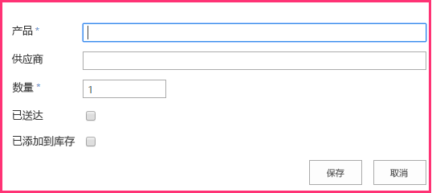
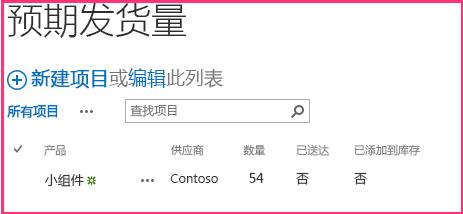

# 将 SharePoint 写入操作添加到提供程序托管的外接程序
了解如何将数据写入 SharePoint 提供程序托管的 SharePoint 外接程序。
这是关于开发 SharePoint 托管的 SharePoint 外接程序的基础知识系列文章中的第五篇文章。您应该首先熟悉  [SharePoint 外接程序](sharepoint-add-ins.md)以及本系列中之前的文章：


-  [开始创建提供程序承载的 SharePoint 加载项](get-started-creating-provider-hosted-sharepoint-add-ins.md)


-  [使提供程序托管的外接程序具有 SharePoint 的外观](give-your-provider-hosted-add-in-the-sharepoint-look-and-feel.md)


-  [在提供程序托管的外接程序中包含自定义按钮](include-a-custom-button-in-the-provider-hosted-add-in.md)


-  [获取 SharePoint 对象模型的快速概述](get-a-quick-overview-of-the-sharepoint-object-model.md)


> **注释**
> 如果您阅读过关于提供程序托管的外接程序的系列文章，那么您应该具有 Visual Studio 解决方案，可以继续阅读本主题。您还可以从  [SharePoint_Provider-hosted_Add-Ins_Tutorials](https://github.com/OfficeDev/SharePoint_Provider-hosted_Add-ins_Tutorials) 下载存储库并打开 BeforeSharePointWriteOps.sln 文件。


在本文中，我们将继续讲述编码，增加一些功能将数据写入连锁店 SharePoint 外接程序。
## 更改 SharePoint 列表项上的列值

我们的外接程序具有一个自定义功能区按钮，可将员工从香港分店的"本地员工"列表添加到公司数据库。但是用户务必将"已添加到公司数据库"字段的值手动更改为 Yes。现在我们来添加代码以自动执行此操作。


> **注释**
>  Visual Studio 中的启动项目的设置可能会在重新打开解决方案时恢复为默认值。重新打开本系列文章中的示例解决方案后，请始终立即执行下列步骤：<BR /><BR />  右键单击"解决方案资源管理器"顶部的解决方案节点，然后选择"设置启动项目"。<BR />  确保所有三个项目在"操作"列中均设置为"启动"。


1. 在"解决方案资源管理器"，打开 EmployeeAdder.cs 文件。


2. 将以下行添加到 **Page_Load** 方法中的 `AddLocalEmployeeToCorpDB` 调用和 **Response.Redirect** 调用之间。您将在下一步中创建  `SetLocalEmployeeSyncStatus` 方法。

  ```cs

// Write to SharePoint
SetLocalEmployeeSyncStatus();
  ```

3. 将以下新方法添加到  `EmployeeAdder` 类。对于此代码，请注意以下事项。

  - "已添加到公司数据库"字段的内部名称看起来有点奇怪。内部字段名称不能包含空格，因此，当用户创建了一个显示名称中包含空格的字段时，SharePoint 会在设置内部名称时将每个空格替换为字符串"_x0020_"。这会将"Added to Employee DB"变为"Added_x0020_to_x0020_Corporate_x0020_DB"。内部名称不能超过 32 个字符，因此名称将截断为"Added_x0020_to_x0020_Corporate_x"。


  - 尽管"已添加到公司数据库"列在 SharePoint UI 中被称为"是/否"字段，但它实际上是一个布尔值，因此它的值设置为 **true**，而不是"Yes"。


  - 必须调用 **ListItem** 类的 **Update** 方法，将更改提交到 SharePoint 的内容数据库。这是一个一般原则，但并不是十分普遍，当您更改存储在 SharePoint 数据库中的对象的属性值时，您必须调用对象的 **Update** 方法。


  ```cs

private void SetLocalEmployeeSyncStatus()
{
    using (var clientContext = spContext.CreateUserClientContextForSPHost())
    {
        List localEmployeesList = clientContext.Web.Lists.GetByTitle("Local Employees");
        ListItem selectedLocalEmployee = localEmployeesList.GetItemById(listItemID);
        selectedLocalEmployee["Added_x0020_to_x0020_Corporate_x"] = true;
        selectedLocalEmployee.Update();
        clientContext.ExecuteQuery();
    }
}
  ```


## 请求写入主机 Web 列表的权限

由于外接程序现在可写入列表，也可读取列表，我们需要将外接程序请求的权限从"读取"提升为"写入"。请执行以下步骤。


1. 在"解决方案资源管理器"中，打开"ChainStore"项目中的 AppManifest.xml 文件。


2. 打开"权限"选项卡，在"权限"字段中，从下拉列表中选择"写入"。


3. 保存该文件。


## 运行外接程序并测试按钮


1. 使用 F5 键部署并运行您的外接程序。Visual Studio 在 IIS Express 中托管远程 Web 应用程序，在 SQL Express 中托管 SQL 数据库。它还会在 SharePoint 测试网站上临时安装外接程序并立即运行它。在起始页打开之前，将提示您向外接程序授予权限。


2. 在权限表上，从列表中选择"本地员工"，然后单击"信任它"。


3. 当外接程序的起始页打开时，单击顶部部件版式控件上的"返回到网站"。


4. 从网站的主页中导航到"网站内容 | 本地员工"。列表视图页将打开。


5. 如果列表中没有员工的"已添加到公司数据库"列为"否"，请向列表中添加一个员工，并且 *请勿选中"已添加到公司数据库"复选框。* 


6. 在功能区上，打开"项目"选项卡。选项卡的"操作"部分中是自定义按钮"添加到公司数据库"。


7. 在列表中选择"已添加到公司数据库"列为"否"的员工。


8. 按"添加到公司数据库"按钮。 * **必须先选择一个项！*** 


9. 页面似乎会重新加载，因为 EmployeeAdder 页面的 **Page_Load** 方法会重定向回该页面。员工的"已添加到公司数据库"字段的值已变为"是"。

    > **注释**
      > 如何防止用户手动更改"已添加到公司数据库"的值而导致列表和公司数据库不一致？目前尚无解决办法。您可在本系列的后续文章中获取此问题的解决方案。 
10. 要结束调试会话，请关闭浏览器窗口或在 Visual Studio 中停止调试。每次按 F5 时，Visual Studio 将撤回外接程序的之前版本并安装最新版本。


11. 在"解决方案资源管理器"中右键单击此项目，然后选择"撤回"。


## 在主机网站上创建新自定义列表

对连锁店外接程序的下一项改进是在列表中创建新项目，而不仅仅是更改现有项目中的字段。具体地说，当在公司级别下达新订单时，将在 SharePoint 列表中自动创建一个项目，提醒本地员工订单已装运。该列表称为"预期装运"，您可以通过以下步骤进行创建。在本系列的后续文章中，您将了解如何以编程方式将自定义列表添加到主机网站，但现在您需手动添加。


1. 从 Fabrikam 香港分店的主页，导航到"网站内容 | 添加外接程序 |自定义列表"。


2. 在"添加自定义列表"对话框中，指定 Expected Shipments 作为名称并按"创建"。


3. 在"网站内容"页面上，打开"Expected Shipments"列表。


4. 在功能区上打开"列表"选项卡，然后单击"列表设置"按钮。


5. 在"列表设置"页面的"列"部分，单击"标题"列。


6. 在"编辑列"表单中，将"列名称"从 Title 更改为 Product，然后单击"确定"。


7. 在"设置"页面上，单击"创建列"。


8. 在本系列的前一篇文章中，您学习了如何为列表创建自定义列。对于"预期装运"列表，使用下表中的值添加四个列。将所有其他设置保留为默认值。


|**列名称**|**类型**|**必需？**|**默认值**|
|:-----|:-----|:-----|:-----|
|供应商 <br/> |**单行文本** <br/> |不是必需  <br/> |无  <br/> |
|数量 <br/> |**数字** <br/> |必需  <br/> |1 <br/> |
|到达 <br/> |**是/否** <br/> |不是必需  <br/> |否 <br/> |
|已添加到库存 <br/> |**是/否** <br/> |不是必需  <br/> |否 <br/> |
 
9. 在列表设置页上创建列后，单击"网站内容"打开"网站内容"页面。打开"预期装运"列表。


10. 单击"新建项目"。项目创建窗体应完全如下所示，包括指示必填字段的两个星号。




11. 我们不想在该列表上手动创建项目，因此请单击"取消"。


## 将项目插入到 SharePoint 列表

现在您向外接程序添加了一个函数，可在公司级别为香港分店下达订单时在"预期装运"列表中创建一个项目。


1. 在"解决方案资源管理器"中，打开 OrderForm.aspx.cs 文件。


2. 将 **Microsoft.SharePoint.Client** 的 **using** 语句添加到文件顶部。


3. 在  `btnCreateOrder_Click` 方法中，将以下行添加到 `CreateOrder` 调用下方。您将在下一步中创建 CreateExpectedShipment 方法。

  ```cs

CreateExpectedShipment(txtBoxSupplier.Text, txtBoxItemName.Text, quantity);
  ```

4. 将以下方法添加到  `OrderForm` 类。对于此代码，请注意以下事项。

  - 使用构造函数无法创建 **ListItem** 对象。这是出于性能考虑。 **ListItem** 对象有很多属性（为默认值）。如果使用构造函数，整个对象都会包含在 **ExecuteQuery** 方法发送到服务器的 XML 消息中。 **ListItemCreationInformation** 对象是一个轻型对象，仅包含服务器创建 **ListItem** 对象所需的最少的非默认值。可能有一行会创建 **ListItem** 对象，但该行仅会将某些 XML 标记添加到发送至服务器的消息。将在服务器上创建 **ListItem** 对象。


  - 无需将 **ListItem** 对象返回到客户端，因此不会调用 **ClientContext.Load** 方法。


  - 代码无需显式设置"已到达"或"已添加到库存"字段，因为它们的默认值为"否，这是我们需要的。


  ```
  private void CreateExpectedShipment(string supplier, string product, UInt16 quantity)
{
    using (var clientContext = spContext.CreateUserClientContextForSPHost())
    {
        List expectedShipmentsList = clientContext.Web.Lists.GetByTitle("Expected Shipments");
        ListItemCreationInformation itemCreateInfo = new ListItemCreationInformation();
        ListItem newItem = expectedShipmentsList.AddItem(itemCreateInfo);
        newItem["Title"] = product;
        newItem["Supplier"] = supplier;
        newItem["Quantity"] = quantity;
        newItem.Update();
        clientContext.ExecuteQuery();
    }
}
  ```


## 检查已删除的组件

具有 SharePoint 列表的所有者权限的用户均可删除列表。如果外接程序将列表部署到主机 Web，主机 Web 的网站所有者即可将其删除。如果所有者决定在不使用列表提供的功能的情况下将其删除，可能会出现这种情况。（如果所有者改变主意，可从 SharePoint 回收站中将其还原。）


 `CreateExpectedShipment` 方法取决于"预期装运"列表是否存在。假定网站所有者决定删除列表。稍后，当使用外接程序的"订单表"添加订单时，将调用 `CreateExpectedShipment` 并会抛出一个异常，指示 SharePoint 网站上没有"预期装运"列表。


您可能希望该方法在对  `expectedShipmentsList` 执行任何操作之前检查其有效性。当您使用 CSOM 时，您无法使用这样的简单结构进行此检查：


 `if (expectedShipmentsList != null) { ... }`


相反，您需要使用一个名为 **ConditionalScope** 的特殊 CSOM 类。其原因是已连接到 CSOM 批处理系统，这在本系列的前一篇文章中进行了说明。（请参阅 [客户端运行时和批处理](get-a-quick-overview-of-the-sharepoint-object-model.md#CSOMBatching)。） **ConditionalScope** 和批处理系统是高级主题，超出了本入门系列的范围，但您可在完成本系列教程后查看 MSDN 上的文档。


这是检查列表是否存在的备选方法：无需使用 **GetByTitle** 方法获取对列表的引用，而可以使用如下所示的代码检查具有指定名称的列表在网站的"列表列表"中是否存在。


```cs

var query = from list in clientContext.Web.Lists
             where list.Title == "Expected Shipments" 
             select list; 
IEnumerable<List> matchingLists = clientContext.LoadQuery(query); 
clientContext.ExecuteQuery(); 
if (matchingLists.Count() != 0) 
{ 
    List expectedShipmentsList = matchingLists.Single(); 
    // Do something with the list. 
}
clientContext.ExecuteQuery(); 
```

前一个代码的优势是可以避免 **ConditionalScope** 类的并发症，我们可将此代码用于本系列文章中的其他地方。但也有一个缺陷：此代码需要单独额外调用 **ExecuteQuery**，以获取您希望在 **if** 语句中检查的值。如果我们在 `CreateExpectedShipment` 中使用此技术检查列表是否存在，该方法将调用 **ExecuteQuery** 两次，每次都会从远程 Web 服务器向 SharePoint 发出 HTTP 请求。这些请求是任何 CSOM 方法最耗时的部分，因此尽量减少这些请求通常是比较好的做法。


我们将  `CreateExpectedShipment` 保留原样，但在生产外接程序中，您需要思考如果代码引用的组件被删除，代码如何运行。以编程方式从回收站还原列表是一个选项，但这会干扰有意决定删除列表的用户。您还应该想到，不执行任何操作来阻止异常可能是最佳选择。SharePoint 异常将会警告用户列表删除存在外接程序的残缺部分，即用户删除的操作可能未实现。然后用户可以决定从回收站中还原列表，还是在缺少部分外接程序功能（不再运行）的情况下执行操作。


## 请求管理网站的权限

当外接程序使用列表作用域请求读取或写入权限时，SharePoint 会提示用户信任外接程序，对话中将包含一个下拉列表，用户可在其中选择外接程序可访问的列表。只能选择一个列表。但连锁店外接程序现在可写入两个不同的列表。要获取对多个列表的访问权限，外接程序必须使用 Web 作用域请求权限。请执行以下步骤：


1. 在"解决方案资源管理器"中，打开"ChainStore"项目中的 AppManifest.xml 文件。


2. 打开"权限"选项卡，在"作用域"字段中，从下拉列表中选择"Web"。


3. 在"权限"字段中，从下拉列表中选择"写入"。


4. 保存该文件。


## 运行外接程序并测试项目创建


1. 使用 F5 键部署并运行您的外接程序。Visual Studio 在 IIS Express 中托管远程 Web 应用程序，在 SQL Express 中托管 SQL 数据库。它还会在 SharePoint 测试网站上临时安装外接程序并立即运行它。在起始页打开之前，将提示您向外接程序授予权限。


2. 外接程序的起始页打开后，单击页面底部的"订单表"链接。


3. 在表中输入一些值并按"下订单"。


4. 使用浏览器的后退按钮导航回起始页，然后单击顶部的部件版式控件上的"返回站点"。


5. 从香港分店的主页导航到"网站内容"，然后打开"预期装运"列表。现在列表中有一个与订单对应的项目。以下屏幕截图显示了一个示例。




6. 要结束调试会话，请关闭浏览器窗口或在 Visual Studio 中停止调试。每次按 F5 时，Visual Studio 将撤回外接程序的之前版本并安装最新版本。


7. 在"解决方案资源管理器"中右键单击此项目，然后选择"撤回"。


## 
<a name="Nextsteps"> </a>

在下一篇文章中，您将了解在 SharePoint 页面中如何将远程订单表显示为 Web 部件： [在提供程序托管的外接程序中包括外接程序部件](include-an-add-in-part-in-the-provider-hosted-add-in.md)


