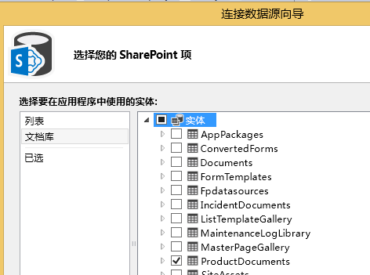
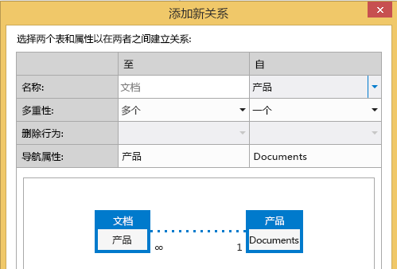
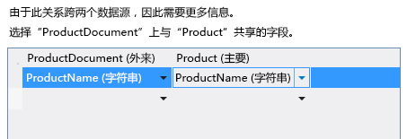
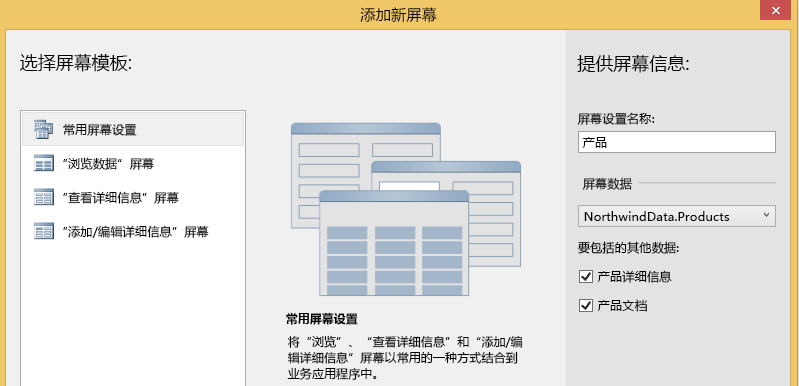
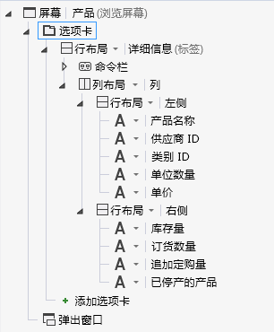
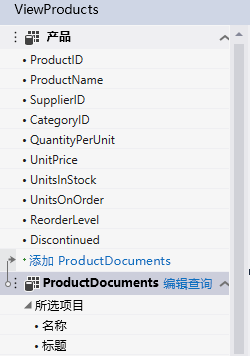
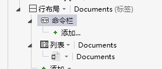
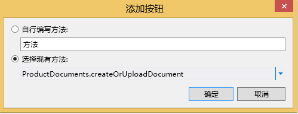

# 将文档库与实体相关联
通过使用 SharePoint 中的文档库功能，您可以创建或上载与列表或实体中单个项目相关的文档。例如，您可以使用文档库存储列表中每个产品的销售资料和产品手册。在云企业外接程序中，您可以通过创建关系，将文档库与实体相关联。
## 关联文档库

将文档库与实体相关联的过程涉及以下三个步骤：

1. 将 SharePoint 文档库作为数据源添加到项目。

    > **重要信息**
      > 您必须先在 SharePoint 网站上创建文档库。它必须包含映射到实体中唯一字段的自定义列。 
2. 在文档库和实体之间创建关系。

3. 将文档库添加到屏幕。根据您是创建新屏幕还是将其添加到现有屏幕，此过程可能有所不同。

### 添加文档库

1. 在"解决方案资源管理器"中，打开"数据源"节点的快捷菜单并选择"添加数据源"。

2. 在"附加数据源向导"中，选择"SharePoint"图标，然后选择"下一步"按钮。

3. 在"输入连接信息"页面，在"指定 SharePoint 网站地址"文本框中，输入 SharePoint 开发人员网站的 URL，然后选择"下一步"按钮。

4. 在"选择 SharePoint 项"页面上的左侧窗格中，选择"文档库"列表项，在右侧窗格中选中您的文档库对应的复选框，如图 1 中所示。

   **图 1. 选择文档库**

图 2 显示了 SharePoint 网站上的文档库。

   **图 2. 记下自定义 ProductName 列**

> **重要信息**
> 文档库必须已存在，且必须包含映射到实体中唯一字段的自定义列。 
5. 在"指定数据源的名称"中，输入一个名称，然后选择"完成"按钮。

### 创建关系

1. 在"解决方案资源管理器"中，打开文档库实体，然后在"视角"栏上选择"服务器"选项卡。

2. 在工具栏上，选择"关系"。

3. 在"添加新关系"对话框的"至"下拉列表中，选择您想关联的实体，如图 3 中所示。

   **图 3. 创建关系**

4. 在"外键"下拉列表中，从文档库中选择自定义列。

5. 在"主键"下拉列表中，从实体中选择映射到文档库中自定义列的字段，然后选择"确定"按钮。例如，对于 ProductName 自定义列，选择 ProductName 字段，如图 4 中所示。

   **图 4. 相关的外键和主键**

> **注释**
> 字段的数据类型必须与"外键"字段相同。 

### 将文档库添加到新的屏幕集

1. 在"解决方案资源管理器"中，打开与文档库相关的实体，然后在"角度"栏上选择"HTMLClient"选项卡。

2. 在工具栏上，选择"屏幕"。

3. 在"添加新屏幕"对话框中，在"屏幕集名称"文本框中，为屏幕集输入一个名称。

4. 在"屏幕数据"列表中，选择您的实体。

5. 在"要包含的其他数据"列表中，选中您的文档库的复选框，然后选择"确定" 按钮。

    图 5 显示了产品实体的屏幕集。

   **图 5. 产品屏幕集**

为实体创建的"查看"屏幕包含"文档"选项卡，其中具有"添加文档"按钮。单击按钮可显示用于添加或上载文档的弹出框。

### 将文档库添加到现有屏幕

1. 在"解决方案资源管理器"中，打开您希望将其与文档库关联的屏幕的快捷菜单，然后选择"打开"。

2. 在屏幕设计器中，选择"选项卡"节点（如图 6 中所示），然后选择"添加选项卡"节点。

   **图 6. "选项卡"节点**

3. 在"属性"窗口中，选择"显示名称"属性，为新添加的选项卡输入一个有意义的名称。例如"文档"。

4. 在屏幕设计器的左侧窗格中，选择"添加  _DocumentLibraryName_"链接，如图 7 中所示，其中  _DocumentLibraryName_ 是您的文档库的名称。

   **图 7. "添加 ProductDocuments"链接**

5. 在中央窗格中，选择新选项卡的节点，展开"添加"列表，然后选择  _DocumentLibraryName_。

6. 展开新选项卡的"命令栏"节点（如图 8 中所示），然后选择"添加"。

   **图 8. "命令栏"节点**

7. 在"添加按钮"对话框中，接受默认选择并选择"确定"按钮。

    图 9 显示了使用默认方法 **createOrUploadDocument** 的"添加按钮"对话框。

   **图 9. "添加按钮"对话框**

8. 在"属性"窗口中，选择"显示名称"属性，为按钮输入一个有意义的名称。例如"添加文档"。

    现在屏幕包含"文档"选项卡，其在命令栏上有一个按钮。单击按钮可显示用于添加或上载文档的弹出框。

## 其他资源

-  [开发云企业外接程序](develop-cloud-business-add-ins.md)

-  [事件管理器：云企业外接程序教程](incident-manager-a-cloud-business-add-in-tutorial.md)

