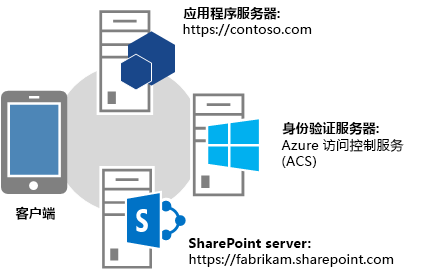
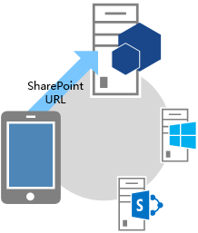
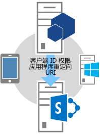
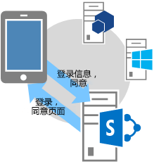
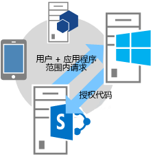
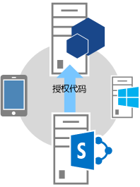
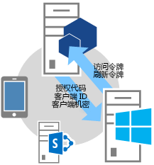
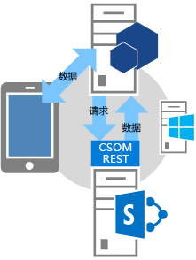

# SharePoint 外接程序的身份验证代码 OAuth 流
了解实时请求访问 SharePoint 资源的权限的外接程序的 OAuth 流以及如何使用 OAuthAuthorize.aspx 页面和 SharePoint 重定向 URI。
## 获取从 SharePoint 实时请求访问权限的外接程序的概述
<a name="Overview"> </a>


> **注释**
> 本文假定您熟悉 [创建使用低信任授权的 SharePoint 外接程序](creating-sharepoint-add-ins-that-use-low-trust-authorization.md)以及 OAuth 背后的概念和原理。有关 OAuth 的详细信息，请参阅  [OAuth.net](http://oauth.net/) 和 [Web 授权协议 (oauth)](http://datatracker.ietf.org/doc/active/#oauth)。 
  
    
    

在某些情况下，外接程序可以实时请求访问 SharePoint 资源的权限；即， **外接程序可以在运行时而不是安装外接程序时动态请求访问 SharePoint 资源的权限** 。此类型的外接程序不必从 SharePoint 启动，甚至不必在其上安装。例如，它可以是从任何网站启动的本机设备外接程序，或者是从 Office 应用程序启动、需要实时访问 SharePoint 上的资源的 Office 外接程序。
  
    
    

> **注释**
> 运行此类外接程序的用户必须对外接程序要访问的资源拥有管理权限。例如，当外接程序仅请求对网站的读取权限时，如果用户拥有对该网站的读取权限，但没有管理权限，则不能运行该外接程序。 
  
    
    

若要能够调入 SharePoint，必须首先通过卖家面板或 appregnew.aspx 页注册此类型的外接程序。有关通过卖家面板或 appregnew.aspx 注册外接程序的详细信息，请参阅 [注册 SharePoint 2013 外接程序](register-sharepoint-add-ins-2013.md)。
  
    
    
注册外接程序后，它就是 *安全主体*  ，且具有与用户和组相同的标识。此标识称为外接程序主体。与用户和组一样，外接程序主体具有特定权限。有关外接程序主体的详细信息，请参阅 [注册 SharePoint 2013 外接程序](register-sharepoint-add-ins-2013.md)。
  
    
    
注册外接程序时，您将收到外接程序主体的客户端 ID、客户端机密、外接程序域和重定向 URI。此信息可注册到授权服务器 Microsoft Azure 访问控制服务 (ACS) 中。
  
    
    

## 了解实时请求外接程序权限的 OAuth 流
<a name="Flow"> </a>

本节总结了实时请求权限的 SharePoint外接程序的 OAuth 身份验证和授权流。该流称为 **授权代码流** 。相关过程介绍不从 SharePoint 中启动的外接程序如何访问 SharePoint 中的资源。
  
    
    

> **注释**
> 该流 **涉及您的外接程序、SharePoint、授权服务器（即 ACS）和最终用户** 之间在运行时的一系列交互。因此，该流要求 SharePoint Online 或 SharePoint 服务器场连接到 Internet，以便可与 ACS 通信。未连接到 Internet 的 SharePoint 服务器场必须使用 [高信任授权系统](creating-sharepoint-add-ins-that-use-high-trust-authorization.md)。 
  
    
    

必须有一个 Web 应用程序或服务与 SharePoint 分开托管。即使外接程序是设备外接程序，也必须具有可在 ACS（见上文）中注册的 Web 应用程序或服务 URL，即使 Web 组件不用于任何目的。为简单起见，本文假定外接程序是一个 Web 应用程序，称为 Contoso.com。应用程序使用 SharePoint 客户端对象模型 (CSOM) 或 SharePoint REST API 来调用 SharePoint。当应用程序首次尝试访问 SharePoint 时，SharePoint 会从 ACS 请求授权代码，发送至 Contoso.com 应用程序。然后应用程序使用授权代码从 ACS 请求访问令牌。收到访问令牌后，Contoso.com 应用程序会将其包含在它向 SharePoint 发出的所有请求中。
  
    
    

### 参阅详细的流示例
<a name="Fly"> </a>

假定 Contoso 可提供联机照片打印服务。某用户希望打印一些照片。该用户希望允许 Contoso 照片打印服务访问用户保存在 SharePoint Online 网站  `fabrikam.sharepoint.com` 上的一组照片库，并打印其中的照片。
  
    
    

  
    
    

  
    
    
照片打印应用程序已注册，因此具有客户端 ID、客户端机密和重定向 URI。Contoso 在注册外接程序时提供的重定向 URI 是  `https://contoso.com/RedirectAccept.aspx`。客户端 ID 和客户端机密信息存储在照片打印应用程序的 web.config 文件中。下面举例说明如何将客户端 ID 和客户端机密输入到 web.config 文件中。
  
    
    


```XML

<configuration>
  <appSettings>
    <add key="ClientId" value="c78d058c-7f82-44ca-a077-fba855e14d38 "/>
    <add key="ClientSecret" value="SbALAKghPXTjbBiLQZP+GnbmN+vrgeCMMvptbgk7T6w= "/>

  </appSettings>

</configuration>
```

以下是身份验证代码流中的步骤。
  
    
    

    
> **提示**
> 这些步骤参照 TokenHelper.cs（或 .vb）文件中的方法。此托管代码未编译，因此没有相关参考主题。然而，文件本身添加了全面注释，带有每个类、成员参数和返回值的说明。请考虑在阅读这些步骤时打开一个副本作为参考。 
  
    
    


||||
|:-----|:-----|:-----|
|**1** <br/> ||**客户端打开应用程序，然后将其定向到 SharePoint 网站以获取数据。** <br/> 用户浏览到 Contoso 照片打印网站，其中 UI 指示用户可以打印保存在任何 SharePoint Online 网站上的照片。在本示例中， URL 为  `https://contoso.com/print/home.aspx`。  <br/> 照片打印外接程序要求用户输入照片集的 URL。用户输入指向 SharePoint Online 网站的 URL： `https://fabrikam.sharepoint.com/`。  <br/> |
|**2** <br/> ||**外接程序重定向到 SharePoint 网站授权 URL。** <br/> 当用户单击按钮获取照片时，Contoso 照片打印外接程序将浏览器重定向到  `https://fabrikam.sharepoint.com/`。此重定向为 HTTP 302 重定向响应。  <br/> 如果您使用 Microsoft .NET，则 **Response.Redirect** 是您可以从代码中执行重定向的多种方法之一。您的代码可以使用项目中的 TokenHelper.cs（或 .vb）文件调用重载的 **GetAuthorizationUrl** 方法（使用包含三个参数的重载）。此方法为您构造 OAuthAuthorize.aspx 重定向 URL。您的代码也可以手动构造 URL。 <br/> 例如，如果您选择调用 **GetAuthorizationUrl** 方法来构造 OAuthAuthorize.aspx 重定向 URL，可使用项目中的 TokenHelper.cs（或 .vb），代码如下所示： <br/>  `Response.Redirect(TokenHelper.GetAuthorizationUrl(`           `sharePointSiteUrl.ToString(),`           `"Web.Read List.Write",`           `"https://contoso.com/RedirectAccept.aspx"));` <br/> 如果您查看 TokenHelper.cs（或 .vb）中 **GetAuthorizationUrl** 方法的三个参数重载，则会发现第二个参数是权限范围参数，是外接程序请求的权限的空格分隔列表，采用速记格式。有关权限范围的详细信息，请参阅 [了解权限范围别名以及 OAuthAuthorize.aspx 页面的用途](#Scope)。第三个参数必须为外接程序注册时使用的同一个重定向 URI。有关注册的详细信息，请参阅 [注册 SharePoint 2013 外接程序](register-sharepoint-add-ins-2013.md)。您还会发现返回的字符串是包含查询字符串参数的 URL。  <br/> 如果愿意，您还可以手动构造 OAuthAuthorize.aspx 重定向 URL。例如，在本例中，Contoso 照片打印外接程序将用户重定向到以下 URL：  <br/>  `https://fabrikam.sharepoint.com/_layouts/15/OAuthAuthorize.aspx?client_id=client_GUID&amp;scope=app_permissions_list&amp;response_type=code&amp;redirect_uri=redirect_uri` <br/> 如示例中所示，Contoso 照片打印外接程序将 OAuth 客户端 ID 和重定向 URI 作为查询字符串参数发送到 Fabrikam 网站。下面是使用查询字符串示例值的 GET 请求的示例。为清楚起见，添加了换行符。实际目标 URL 是一行。  <br/>  `GET /authcode HTTP/1.1`           `Host: fabrikam.sharepoint.com`                     `/oauthauthorize.aspx`           `?client_id= c78d058c-7f82-44ca-a077-fba855e14d38`           `&amp;scope=list.read`           `&amp;response_type=code`           `&amp;redirect_uri= https%3A%2F%2Fcontoso%2Ecom%2Fredirectaccept.aspx`           <br/> 如果您需要单独的许可弹出对话框，可以将查询参数 **IsDlg=1** 添加到 URL 构造中，如下所示： <br/>  `/oauthauthorize.aspx?IsDlg=1&amp;client_id= c78d058c-7f82-44ca-a077-fba855e14d38&amp;scope=list.read&amp;response_type=code&amp;redirect_uri= https%3A%2F%2Fcontoso%2Ecom%2Fredirectaccept.aspx` <br/> |
|**3** <br/> ||**SharePoint 显示许可页，使用户可以授予外接程序权限。** <br/> 如果用户尚未登录到 Fabrikam SharePoint Online 网站，则将提示用户登录。如果用户已登录，则 SharePoint 将呈现 HTML 许可页。  <br/> 许可页提示用户向 Contoso 照片打印外接程序授予（或拒绝）该外接程序请求的权限。在本例中，用户将授予外接程序对 Fabrikam 上用户图片库的读取访问权限。  <br/> |
|**4** <br/> ||**SharePoint 从 ACS 请求短期授权代码。** <br/> Fabrikam SharePoint Online 网站要求 ACS 创建短期（约 5 分钟）授权代码，该代码对此用户和外接程序组合具有唯一性。  <br/> ACS 将授权代码发送到 Fabrikam 网站。  <br/> |
|**5** <br/> ||**SharePoint Online 网站重定向到应用程序的注册重定向 URI，将授权代码传递到外接程序。** <br/> Fabrikam SharePoint Online 网站通过 HTTP 302 响应将浏览器重定向回 Contoso。此重定向的 URL 构造使用在注册照片打印外接程序时指定的重定向 URI。它还包括授权代码作为查询字符串。重定向 URL 的结构如下：  <br/>  `https://contoso.com/RedirectAccept.aspx?code=<authcode>` <br/> |
|**6** <br/> ||**外接程序使用授权代码从 ACS 请求访问令牌，ACS 检验请求、使授权代码失效，然后将访问和刷新令牌发送到外接程序。** <br/> Contoso 从查询参数检索授权代码，然后将其与客户端 ID 和客户端机密一起包含在向 ACS 发出的访问令牌请求中。  <br/> 如果您使用托管代码和 SharePoint CSOM，则 TokenHelper.cs（或 .vb）文件（向 ACS 发出请求的方法）为 **GetClientContextWithAuthorizationCode**。在这种情况下，代码将如下所示（其中  `authCode` 是已向其分配授权代码的变量）： <br/>  `TokenHelper.GetClientContextWithAuthorizationCode(`           `"https://fabrikam.sharepoint.com/",`           `"00000003-0000-0ff1-ce00-000000000000",`           `authCode,`           `"1ee82b34-7c1b-471b-b27e-ff272accd564",`           `new Uri(Request.Url.GetLeftPart(UriPartial.Path)));`           <br/> 如果您查看 TokenHelper.cs（或 .vb）文件， **GetClientContextWithAuthorizationCode** 方法的第二个参数为 `targetPrincipalName`。该值在访问 SharePoint 的外接程序中始终为常量" `00000003-0000-0ff1-ce00-000000000000`"。您还会看到，如果您从 **GetClientContextWithAuthorizationCode** 跟踪调用层次结构，则可从 web.config 文件获取客户端 ID 和机密。 <br/> ACS 接收 Contoso 的请求并验证客户端 ID、客户端密钥、重定向 URI 和授权代码。如果所有值都是有效的，ACS 将使授权代码无效（它只能使用一次）并创建其返回到 Contoso 的刷新令牌和访问令牌。  <br/> Contoso 应用程序可以缓存此访问令牌，以供在后续请求中重复使用。默认情况下，访问令牌适合缓存大约 12 个小时。 每个访问令牌均特定于在授权的原始请求中指定的用户帐户，并且仅授予对在该请求中指定的服务的访问权限。您的外接程序应该安全地存储访问令牌。  <br/> Contoso 应用程序还可以缓存刷新令牌。默认情况下，刷新令牌适合使用 6 个月。当访问令牌过期时，刷新令牌可以随时从 ACS 兑换一个新的访问令牌。有关令牌的详细信息，请参阅 [在提供程序托管的低信任 SharePoint 外接程序中处理安全令牌](handle-security-tokens-in-provider-hosted-low-trust-sharepoint-add-ins.md)。  <br/> |
|**7** <br/> ||**现在外接程序可以使用访问令牌从向用户显示的 SharePoint 网站请求数据。** <br/> Contoso 包括向 SharePoint 发出 REST API 调用或 CSOM 请求的访问令牌，在 HTTP **Authorization** 标头中传递 OAuth 访问令牌。 <br/> SharePoint 返回 Contoso 请求的信息。有关如何发出该请求的详细信息，请参阅 [在提供程序托管的低信任 SharePoint 外接程序中处理安全令牌](handle-security-tokens-in-provider-hosted-low-trust-sharepoint-add-ins.md)。  <br/> |
   

## 了解权限范围别名以及 OAuthAuthorize.aspx 页面的用途
<a name="Scope"> </a>

本节假定您熟悉文章  [SharePoint 2013 中的外接程序权限](add-in-permissions-in-sharepoint-2013.md)。表 1 显示了与该文章中相同的外接程序权限请求范围 URI，除了它具有一个额外的列（ **范围别名** ）以外，FullControl 权限在"可用权限"列中不可用，因为实时请求访问 SharePoint 资源的权限的外接程序不能请求完全控制权限。
  
    
    
"范围别名"列中列出的值是"范围 URI"列中其对应部分的简写形式。别名只能由实时请求访问 SharePoint 资源的权限的外接程序使用。（范围 URI 值用于从 SharePoint 启动的外接程序的外接程序清单中。这些外接程序在外接程序安装期间请求权限。）
  
    
    
范围别名仅在使用 OAuthAuthorize.aspx 重定向页的上下文中使用。如前一节中 OAuth 流的步骤 2 所示，如果外接程序使用托管代码，则当您调用项目中 TokenHelper.cs（或 .vb）的 **GetAuthorizationUrl** 方法时，将使用别名。下面是另一个示例：
  
    
    


```cs

Response.Redirect(TokenHelper.GetAuthorizationUrl(
    sharePointSiteUrl.ToString(), 
    "Web.Read List.Write ", 
    "https://contoso.com/RedirectAccept.aspx "));
```

 _scope_ 参数值 `Web.Read List.Write` 是您将如何使用范围别名请求权限的示例。 _scope_ 参数是权限范围和权限请求的空格分隔集。
  
    
    
如果您不使用托管代码，范围别名用于重定向 URL 中的范围字段。例如：
  
    
    
 `https://fabrikam.sharepoint.com/_layout/15/OAuthAuthorize.aspx?client_id=c78d058c-7f82-44ca-a077-fba855e14d38&amp;scope=list.write&amp;response_type=code&amp;redirect_uri=https%3A%2F%2Fcontoso%2Ecom%2Fredirectaccept.aspx`
  
    
    

> **注释**
> 有关范围的说明，请参阅  [SharePoint 2013 中的外接程序权限](add-in-permissions-in-sharepoint-2013.md)。 
  
    
    


**表 1. SharePoint 外接程序权限请求范围 URI 及其对应的别名**

||||
|:-----|:-----|:-----|
|**范围 URI** <br/> |**范围别名** <br/> |**可用权限** <br/> |
|http://sharepoint/content/sitecollection  <br/> |Site  <br/> |读取、写入、管理  <br/> |
|http://sharepoint/content/sitecollection/web  <br/> |Web  <br/> |读取、写入、管理  <br/> |
|http://sharepoint/content/sitecollection/web/list  <br/> |列表  <br/> |读取、写入、管理  <br/> |
|http://sharepoint/content/tenant  <br/> |AllSites  <br/> |读取、写入、管理  <br/> |
|http://sharepoint/bcs/connection  <br/> |无（当前不支持）  <br/> |阅读  <br/> |
|http://sharepoint/search  <br/> |搜索  <br/> |QueryAsUserIgnoreAppPrincipal  <br/> |
|http://sharepoint/projectserver  <br/> |ProjectAdmin  <br/> |管理  <br/> |
|http://sharepoint/projectserver/projects  <br/> |Projects  <br/> |读取、写入  <br/> |
|http://sharepoint/projectserver/projects/project  <br/> |Project  <br/> |读取、写入  <br/> |
|http://sharepoint/projectserver/enterpriseresources  <br/> |ProjectResources  <br/> |读取、写入  <br/> |
|http://sharepoint/projectserver/statusing  <br/> |ProjectStatusing  <br/> |SubmitStatus  <br/> |
|http://sharepoint/projectserver/reporting  <br/> |ProjectReporting  <br/> |阅读  <br/> |
|http://sharepoint/projectserver/workflow  <br/> |ProjectWorkflow  <br/> |提升  <br/> |
|http://sharepoint/social/tenant  <br/> |AllProfiles  <br/> |读取、写入、管理  <br/> |
|http://sharepoint/social/core  <br/> |社交  <br/> |读取、写入、管理  <br/> |
|http://sharepoint/social/microfeed  <br/> |Microfeed  <br/> |读取、写入、管理  <br/> |
|http://sharepoint/taxonomy  <br/> |TermStore  <br/> |读取、写入  <br/> |
   

## 了解如何使用重定向 URI 并查看示例重定向页
<a name="RedirectURI"> </a>


  
    
    
实时请求权限的外接程序使用的 **重定向 URI** 为 **SharePoint 在获得许可后将浏览器重定向到的 URI** （包含授权代码作为查询参数）。上面流描述中的步骤 2 给出了一个示例，其中 URI 在对 **GetAuthorizationUrl** 方法的调用中进行硬编码。或者，ASP.NET 外接程序也可以在 web.config 文件中存储重定向 URI，如本示例中所示：
  
    
    


```XML

<configuration>
  <appSettings>
    <add key="RedirectUri" value="https://contoso.com/RedirectAccept.aspx" />
  </appSettings>
<configuration>
```

可以通过调用  `WebConfigurationManager.AppSettings.Get("RedirectUri")` 来检索值。
  
    
    
 **位于重定向 URI 的终结点从查询参数获取授权代码并使用授权代码来获取访问令牌** ，然后可以使用访问令牌来访问 SharePoint。终结点通常为同一个页面或控制器方法，或者最初尝试访问 SharePoint 的 Web 方法。但是，也可以是仅接收授权代码的页面或方法，然后将授权代码重定向到另一个页面或方法。特殊页面或方法可以传递或缓存授权令牌。（有效期为 5 分钟。）或者，终结点也可以使用授权令牌获取它缓存的访问令牌。
  
    
    
下面是 ASP.NET 应用程序中此类页面背后的代码示例。对于此代码，请注意以下事项：
  
    
    

- 它使用 Visual Studio Office 开发人员工具 生成的 TokenHelper.cs 文件。
    
  
- 代码假定存在一个保存授权代码的"代码"查询参数。这是安全的，因为页面仅由 SharePoint 调用，且仅在其传递授权代码时调用。
    
  
- 它使用 CSOM 客户端上下文对象访问 SharePoint，但是它可能也仅在服务器上缓存该对象，并重定向到另一个页面。
    
  
- **GetClientContextWithAuthorizationCode** 方法使用授权代码获取访问代码。然后它创建 SharePoint 客户端上下文对象并修改对象对 **ExecutingWebRequest** 事件的处理程序，以便处理程序将在对 SharePoint 的所有请求中包含访问令牌。访问令牌实际上缓存在对象内部。
    
  
- **GetClientContextWithAuthorizationCode** 方法在 `rUrl` 参数中将重定向 URL 发送回 ACS，但是 ACS 将其作为一种标识，以防授权代码被窃取。ACS 不会使用它再次重定向，因此该代码不会无限制地循环，并重定向到它本身。
    
  
- 代码不对过期访问令牌的处理做出规定。创建客户端上下文对象后，它将始终使用同一个访问令牌。它根本不使用刷新令牌。对于仅用于会话持续时间短于访问令牌有效期的外接程序，这是有效策略。
    
  
有关使用刷新令牌获取新访问令牌的更复杂示例，请参阅下一节。
  
    
    


```cs

public partial class RedirectAccept : System.Web.UI.Page
{
    protected void Page_Load(object sender, EventArgs e)
    {
        string authCode = Request.QueryString["code"];
        Uri rUri = new Uri("https://contoso.com/RedirectAccept.aspx");

        using (ClientContext context = TokenHelper.GetClientContextWithAuthorizationCode(
            "https://fabrikam.sharepoint.com/", 
            "00000003-0000-0ff1-ce00-000000000000",
            authCode,
            "1ee82b34-7c1b-471b-b27e-ff272accd564".
            rUri))
       {
           context.Load(context.Web);
           context.ExecuteQuery();

           Response.Write("<p>" + context.Web.Title + "</p>");
       }
    }
}

```


## 获取访问 SharePoint 的页面的后台示例代码
<a name="Default"> </a>

下面是 Default.aspx 页面的后台代码。该页面假定方案中默认页面是外接程序的启动页面，并且也是外接程序的注册重定向 URL。请注意关于此代码的以下信息：
  
    
    

- **Page_Load** 方法首先检查查询字符串中是否有授权代码。如果浏览器由 SharePoint 重定向到页面，则将有授权代码。如果有，则代码会使用它获取新的刷新令牌，刷新令牌缓存在跨会话的持久性缓存中。
    
  
- 然后方法检查缓存中是否存在刷新令牌。 
    
  - 如果不存在，它会告知 SharePoint 所需的权限（Web 范围的写入权限）并请求 SharePoint 提供授权代码，从而获取一个刷新令牌。将提示用户授予权限，如果授予，SharePoint 将从 ACS 获取授权代码并将其作为重定向的查询参数发送回该同一页面。
    
  
  - 如果存在缓存的刷新令牌，方法将使用它直接从 ACS 获取访问令牌。如本文前一节结尾的示例中所示，访问令牌用于创建 SharePoint 客户端上下文对象。使用缓存刷新令牌直接从 ACS 获取访问令牌，可以避免在会话启动时向 SharePoint 发出额外的网络调用，因此在刷新令牌缓存有效期内重新运行外接程序的用户将能更快地完成启动。
    
  
- 与上一节结尾的示例中一样，该代码未对过期访问令牌的处理做出任何规定。创建客户端上下文对象后，它将始终使用同一个访问令牌。防止过期访问令牌的一种方法是，除了刷新令牌以外，还缓存访问令牌。您可如下修改代码，使其仅在缓存中的所有访问令牌均已过期时调用 **GetAccessToken** 方法。但是，尽管将刷新令牌缓存在客户端上（例如，在 Cookie 中）可接受，但出于安全考虑，访问令牌应仅位于服务器端缓存中。刷新令牌会进行加密，且只能由 ACS 解密。但是访问令牌仅进行编码（使用 Base 64 编码），且在中间人攻击中可被轻松解码。
    
  
- 此代码中引用的 **TokenCache** 类定义如下。
    
  

```cs

using System;
using System.Collections.Generic;
using System.Linq;
using System.Web;
using System.Web.UI;
using System.Web.UI.WebControls;
using Microsoft.SharePoint.Samples;
using Microsoft.SharePoint.Client;

namespace DynamicAppPermissionRequest
{
    public partial class Default : System.Web.UI.Page
    {
        protected void Page_Load(object sender, EventArgs e)
        {
            Uri sharePointSiteUrl = new Uri("https://fabrikam.sharpoint.com/print/");

            if (Request.QueryString["code"] != null)
            {
                TokenCache.UpdateCacheWithCode(Request, Response, sharePointSiteUrl);
            }

            if (!TokenCache.IsTokenInCache(Request.Cookies))
            {
                Response.Redirect(TokenHelper.GetAuthorizationUrl(sharePointSiteUrl.ToString(), 
                                                                  "Web.Write"));
            }
            else
            {
                string refreshToken = TokenCache.GetCachedRefreshToken(Request.Cookies);
                string accessToken = 
                TokenHelper.GetAccessToken(
                           refreshToken, 
                           "00000003-0000-0ff1-ce00-000000000000", 
                           sharePointSiteUrl.Authority, 
                           TokenHelper.GetRealmFromTargetUrl(sharePointSiteUrl)).AccessToken;

                using (ClientContext context = 
                       TokenHelper.GetClientContextWithAccessToken(sharePointSiteUrl.ToString(), 
                                                                   accessToken))
                {
                    context.Load(context.Web);
                    context.ExecuteQuery();

                    Response.Write("<p>" + context.Web.Title + "</p>");
                }
            }
        }
    }
}
```

下面是前一个示例代码调用的令牌缓存模块的代码示例。提供其他缓存选项。有关详细信息，请参阅 [在提供程序托管的低信任 SharePoint 外接程序中处理安全令牌](handle-security-tokens-in-provider-hosted-low-trust-sharepoint-add-ins.md)。
  
    
    


```cs

using System;
using System.Collections.Generic;
using System.Linq;
using System.Web;
using Microsoft.SharePoint.Samples;

namespace DynamicAppPermissionRequest
{
    public static class TokenCache
    {
        private const string REFRESH_TOKEN_COOKIE_NAME = "RefreshToken";

        public static void UpdateCacheWithCode(HttpRequest request, 
                                               HttpResponse response, 
                                               Uri targetUri)
        {
            string refreshToken = 
                TokenHelper.GetAccessToken(
                    request.QueryString["code"], 
                    "00000003-0000-0ff1-ce00-000000000000", 
                    targetUri.Authority, 
                    TokenHelper.GetRealmFromTargetUrl(targetUri), 
                    new Uri(request.Url.GetLeftPart(UriPartial.Path)))
                   .RefreshToken;
            SetRefreshTokenCookie(response.Cookies, refreshToken);
            SetRefreshTokenCookie(request.Cookies, refreshToken);
        }

        internal static string GetCachedRefreshToken(HttpCookieCollection requestCookies)
        {
            return GetRefreshTokenFromCookie(requestCookies);
        }

        internal static bool IsTokenInCache(HttpCookieCollection requestCookies)
        {
            return requestCookies[REFRESH_TOKEN_COOKIE_NAME] != null;
        }

        private static string GetRefreshTokenFromCookie(HttpCookieCollection cookies)
        {
            if (cookies[REFRESH_TOKEN_COOKIE_NAME] != null)
            {
                return cookies[REFRESH_TOKEN_COOKIE_NAME].Value;
            }
            else
            {
                return null;
            }
        }

        private static void SetRefreshTokenCookie(HttpCookieCollection cookies, 
                                                  string refreshToken)
        {
            if (cookies[REFRESH_TOKEN_COOKIE_NAME] != null)
            {
                cookies[REFRESH_TOKEN_COOKIE_NAME].Value = refreshToken;
            }
            else
            {
                HttpCookie cookie = new HttpCookie(REFRESH_TOKEN_COOKIE_NAME, 
                                                   refreshToken);
                cookie.Expires = DateTime.Now.AddDays(30);
                cookies.Add(cookie);
            }
        }
    }
}

```


## 其他资源
<a name="AR"> </a>


-  [SharePoint 外接程序的授权和身份验证](authorization-and-authentication-of-sharepoint-add-ins.md)
    
  
-  [创建使用低信任授权的 SharePoint 外接程序](creating-sharepoint-add-ins-that-use-low-trust-authorization.md)
    
  
-  [SharePoint 外接程序](sharepoint-add-ins.md)
    
  
-  [设置 SharePoint 加载项的本地开发环境](set-up-an-on-premises-development-environment-for-sharepoint-add-ins.md)
    
  
-  [开始创建提供程序承载的 SharePoint 加载项](get-started-creating-provider-hosted-sharepoint-add-ins.md)
    
  
