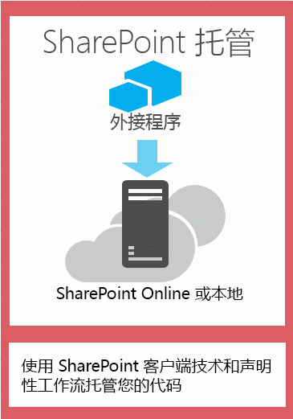
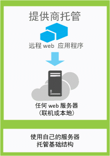

# 为开发和托管 SharePoint 外接程序选择模式
了解承载 SharePoint 外接程序的组件的不同方法。
SharePoint 2013 加载项模型引入了许多承载和开发模式。部分模式可以相互结合使用。例如，加载项可以将 SharePoint 承载的组件和远程承载的组件混合使用。要确定需要使用的模式，最有用的方法就是从您自己的需求、技术和目标出发，将它们与 SharePoint 外接程序支持的选项和可能性匹配。
  
    
    

## 选择开发模式时需要考虑的事项

SharePoint 外接程序扩大了使用 SharePoint 资源和服务时可以使用的可能的编程语言和技术堆栈的范围。选项的准确范围取决于加载项的类型和选择的承载模式。还可以将模式混合使用。
  
    
    

### SharePoint 承载的加载项

从 SharePoint 承载的加载项这一最简单的选项入手，即所有组件都承载在本地或 Office 365 SharePoint 场中的加载项。SharePoint 承载的加载项安装在 SharePoint 2013 网站中，称为主机 Web。它们将其资源承载在主机 Web 的某个隔离子网站上，称为加载项 Web。了解 [主机 Web 和加载项 Web 之间的区别](host-webs-add-in-webs-and-sharepoint-components-in-sharepoint-2013.md)很重要。图 1 所示为 SharePoint 承载的加载项的基本体系结构。
  
    
    

**图 1. SharePoint 承载的加载项的体系结构**

  
    
    

  
    
    

  
    
    
可以将 SharePoint 承载的加载项与具有远程承载组件的加载项结合使用，但是任何在加载项 Web 上运行的加载项或加载项的部分在加载项的承载位置、加载项获取授权的方式和加载项可使用的语言这三个关键组件方面都有以下一系列要求。
  
    
    

|**组件**|**SharePoint 承载的加载项的要求**|
|:-----|:-----|
|加载项组件的承载位置    |在 SharePoint 场的隔离加载项域中    |
|加载项获取授权的方式    |已登录用户的权限    |
|加载项可使用的语言    |JavaScript（带 SharePoint 2013 JSOM 库）+ HTML    |
   
此模式最容易部署，您可以使用 [使用 Napa Office 365 开发工具创建 SharePoint 托管的基本的外接程序](create-a-basic-sharepoint-hosted-add-in-by-using-napa-office-365-development-too.md)。在决定创建 SharePoint 承载的加载项之前，您需要考虑以下事项。
  
    
    

|**获取这些益处**|**但请考虑以下事项**|
|:-----|:-----|
|重用常用 SharePoint 项目，如列表和 Web 部件。    |您只能在加载项中使用 JavaScript，且无法使用任何服务器端代码。    |
|创建和部署相对简单，所以适合业务规则复杂性较低的小型团队工作效率加载项和业务流程自动化。    |您的加载项只有已登录用户的授权权限。    |
   
 [开始创建 SharePoint 承载的 SharePoint 外接程序](get-started-creating-sharepoint-hosted-sharepoint-add-ins.md)
  
    
    

### 提供程序承载的加载项

提供程序托管的 SharePoint 外接程序包括在 SharePoint 场之外部署和托管的组件。它们安装在主机 Web 上，但是其远程组件托管在 *不应为 SharePoint 场中的服务器的*  其他服务器上。图 2 所示为提供程序托管的外接程序的基本体系结构。
  
    
    

**图 2. 提供程序承载的加载项的体系结构**

  
    
    

  
    
    

  
    
    
下表显示了在对承载位置、加载项授权和语言的要求方面，提供程序承载的加载项比 SharePoint 承载的加载项更加不固定。
  
    
    

|**组件**|**提供程序承载的加载项的要求**|
|:-----|:-----|
|加载项组件的承载位置    |任何 Web 服务器或托管服务    |
|加载项获取授权的方式    |OAuth 或 JavaScript 跨域库    |
|加载项可使用的语言    |Web 服务器或托管服务支持的任何语言    |
   
提供程序承载的加载项与 SharePoint 网站交互，但也使用位于远程网站上的资源和服务。在决定创建提供程序承载的加载项之前，您需要考虑以下事项。
  
    
    

|**获取这些益处**|**但请考虑以下事项**|
|:-----|:-----|
|将加载项承载在 Microsoft Azure 或任何远程 web 平台上，包括非 Microsoft 平台。    |您需要负责创建远程组件的安装、升级和卸载逻辑。    |
|使用 SharePoint 客户端对象模型之一，JavaScript 跨域库或基于 SharePoint 2013  [REST/OData 的 Web 服务](https://msdn.microsoft.com/magazine/dn198245.aspx)与 SharePoint 交互。    |与 SharePoint 交互的每种方式都有 [相应的数据访问方法选项](secure-data-access-and-client-object-models-for-sharepoint-add-ins.md)。    |
|使用以下 [三个授权系统](three-authorization-systems-for-sharepoint-add-ins.md)之一获取对 SharePoint 数据的授权。    |需要在 OAuth 和跨域库之间做出决定，以授权加载项对 SharePoint 的访问。    |
   

## 将承载模式与开发目标相匹配

除了考虑每个选项的技术优势和限制外，在决定承载模式时还需要考虑开发目标。可以使用下表选出最能满足您需要的承载模式。
  
    
    

|**您的需求**|**推荐的承载模式**|**示例**|
|:-----|:-----|:-----|
|以独占方式使用和配置新的 SharePoint 实体    |SharePoint 承载    |包含人员选取器控件并且将有关 SharePoint 用户的信息存储在 SharePoint 列表中的加载项    |
|使用现有 SharePoint 实体并与外部（非 SharePoint）Web 服务交互    |提供程序承载    |从主机 Web 中的现有 SharePoint 列表中获取客户地址并使用 Web 应用程序中的映射服务显示其位置的加载项    |
|配置新的 SharePoint 实体并与外部 Web 服务交互    |结合 SharePoint 承载和提供程序承载    |在应用程序 Web 上配置 SharePoint 列表，以便能够存储地址（用户提供或从现有 SharePoint 列表中提取）的纬度和经度坐标的映射加载项    |
   

## 为提供程序承载的加载项选择承载模式时需要考虑的事项

SharePoint 托管的加载项在加载项 Web 上托管，因此它们有固定的托管模式。提供程序承载的加载项提供了多种灵活的方式来托管加载项各种组件，因此，如果选择创建一个加载项，您需要将您的目标和要求与相应的托管模式匹配起来。 
  
    
    

### OAuth 或跨域库

考虑提供程序承载的加载项以及如何构建时需要询问的一个最重要的问题是加载项如何获取与 SharePoint 交互的授权。提供程序承载的加载项为您提供了两个选择：JavaScript 跨域库和 OAuth。 
  
    
    
通过 [跨域库](access-sharepoint-2013-data-from-add-ins-using-the-cross-domain-library.md)，您能够通过代理与来自加载项的远程组件的多个域交互。如果客户端代码和登录到 SharePoint 的用户的权限足够，跨域库是一个不错的选择。通过防火墙进行远程调用时，使用跨域库也很方便。 
  
    
    
OAuth 是一个用于授权的开放协议，它通过一种易于管理的方式实现了从客户端应用程序（桌面、Web 和移动应用程序）的安全授权。如果计划生成在远程 Web 应用程序中运行并向 SharePoint 2013 回信的 SharePoint 加载项，则通常需要使用 OAuth。从无法以独占方式使用客户端代码 (HTML + JavaScript) 的远程承载 Web 应用程序调用到 SharePoint 时，需要 OAuth。 [了解有关 OAuth 如何在 SharePoint 加载项中发挥作用的详细信息。](creating-sharepoint-add-ins-that-use-low-trust-authorization.md)
  
    
    
 [SharePoint 外接程序的安全数据访问和客户端对象模型](secure-data-access-and-client-object-models-for-sharepoint-add-ins.md) 和 [SharePoint 外接程序的三个授权系统](three-authorization-systems-for-sharepoint-add-ins.md)更加全面地介绍了 OAuth 和跨域库之间的选择。
  
    
    

### 包含本地 SharePoint 场的 OAuth

如果您正在使用 SharePoint 2013 的本地部署，则可以使用 OAuth，但是必须在创建高信任加载项和使用 Office 365 租户之间进行选择。Office 365 使用 Microsoft Azure 访问控制服务 (ACS) 作为信任代理，如果没有对 Office 365 租户的访问权，则需要使用 [创建 SharePoint 高信任外接程序](create-high-trust-sharepoint-add-ins.md)，该模式使用证书建立加载项和 SharePoint 之间的信任。可以将高信任加载项添加到 SharePoint 场的加载项目录中，但不能在 Office 商店中销售。如果拥有对 Office 365 租户的访问权，可以将其链接到 SharePoint 2013 的本地安装并 [使用 ACS 作为安装在本地 SharePoint 上的加载项的信任代理](use-an-office-365-sharepoint-site-to-authorize-provider-hosted-add-ins-on-an-on.md)。
  
    
    
下表列出了承载加载项的 SharePoint 组件和远程组件的所有可能模式，以及使用 OAuth 时可用的信任代理。请注意，您需要拥有对 Office 365 租户的访问权，才能使用 ACS 在 SharePoint 和安装到 SharePoint 2013 本地安装的 SharePoint 外接程序之间建立信任。
  
    
    

|**SharePoint 组件位置**|**远程组件位置**|**信任代理**|
|:-----|:-----|:-----|
|本地    |在云中    |ACS、证书    |
|本地    |本地    |ACS、证书    |
|Office 365 SharePoint 网站    |在云中    |ACS    |
|Office 365 SharePoint 网站    |本地    |ACS    |
   

## 将提供程序承载与 SharePoint 承载结合

您还可以构建包含 SharePoint 承载和云承载的组件的加载项。例如，可以创建 [包括自定义 SharePoint 列表和内容类型的云承载加载项](create-a-provider-hosted-add-in-that-includes-a-custom-sharepoint-list-and-conte.md)。如果选择使用此体系结构，则您的设计和方法必须考虑模型中固有的安全限制。只有 JavaScript 能在由 SharePoint 承载的代码组件中使用，远程承载的组件必须使用 OAuth 或跨域库才能与 SharePoint 网站交互。考虑此方法时，确保了解 [加载项授权如何在 SharePoint 2013 中发挥作用](authorization-and-authentication-of-sharepoint-add-ins.md)。图 4 显示了使用 Microsoft Azure 承载加载项的远程组件并使用 OAuth 时此体系结构如何工作。
  
    
    

**图 4. 使用 OAuth 和 Windows Azure 时的 SharePoint 加载项服务器到服务器通信**

  
    
    

  
    
    

  
    
    
 [了解如何创建结合了云承载和 SharePoint 承载的加载项。](create-a-provider-hosted-add-in-that-includes-a-custom-sharepoint-list-and-conte.md)
  
    
    
下面列出了结合使用提供程序承载和 SharePoint 承载时需要考虑的事项。
  
    
    

|**获取这些益处**|**但请考虑以下事项**|
|:-----|:-----|
|两种方法的所有优点。    |体系结构更加复杂，需要您对服务器到服务器通信和跨网站脚本限制进行更仔细的规划。    |
   

## 使用 Azure Web 角色的提供程序承载的加载项

您可以使用 Microsoft Azure Web 角色托管提供程序承载的 SharePoint 外接程序，而不是在 Web 应用程序上托管（不论 Web 应用程序是内部部署还是 Azure 网站）。Azure Web 角色本质上一个基于 Internet 信息服务 (IIS) 且在 Azure 上承载的网站。您可以利用 Azure Web 角色的托管服务和可伸缩性。您还可以改进 SharePoint 外接程序的性能和可用性，尤其是当加载项频繁使用或需求随时间变化时。如果 SharePoint 外接程序需要更多服务器资源，Azure 可以动态分配给加载项。
  
    
    
有关 Azure Web 角色的详细信息，请参阅以下链接。
  
    
    

-  [什么是云服务？](http://www.windowsazure.com/zh-cn/manage/services/cloud-services/what-is-a-cloud-service/)
    
  
-  [介绍 Microsoft Azure](http://www.windowsazure.com/zh-cn/develop/net/fundamentals/intro-to-windows-azure/)
    
  
-  [自动缩放和 Microsoft Azure](http://msdn.microsoft.com/zh-cn/library/hh680945%28v=pandp.50%29.aspx)
    
  
作为先决条件，您需要适用于 .NET (VS 2012) 1.8.1 的 Microsoft Azure SDK，可以使用  [Web 平台安装程序](http://www.microsoft.com/web/downloads/platform.aspx)进行安装。
  
    
    
您在 vsnv 中用于创建项目的方式取决于您是先从 SharePoint 加载项项目开始，然后添加 Azure Web 角色项目，还是先从 Azure 项目开始，然后添加 SharePoint 项目。
  
    
    

### 将云服务添加到现有加载项

如果已经拥有要承载在 Azure 中的提供程序承载的 SharePoint 外接程序，选择 SharePoint 加载项解决方案中的 Web 应用程序项目。在菜单栏中，依次选择"项目"、"添加 Microsoft Azure 云服务项目"。一个名为  _NameOfTheWebAppProject_.Azure 的 Azure 项目将添加到 SharePoint 外接程序解决方案。Web 项目的一个 Web 角色也将添加到 Azure 云服务项目。Visual Studio 2012 Office 开发人员工具 设置必要的项目属性，以将 Web 角色用于 SharePoint 外接程序。
  
    
    

### 将加载项添加到现有 Web 角色

如果要用作提供程序承载的 SharePoint 外接程序主机的 Azure 云服务中已经有 Web 角色，在 Visual Studio 中打开 Azure 云项目，然后在"解决方案资源管理器"中，选择 Web 角色项目。在菜单栏中，依次选择"项目"、"添加用于 SharePoint 项目的加载项"。将为提供程序承载的 SharePoint 外接程序创建一个名为  _NameOfTheWebAppProject_.Azure 的项目，并添加到解决方案。Visual Studio 引用 Azure Web 角色作为 SharePoint 外接程序的 Web 项目主机。
  
    
    

## 其他资源

有关详细信息，请参阅以下资源：
  
    
    

-  [SharePoint 外接程序体系结构的重要方面和开发前景](important-aspects-of-the-sharepoint-add-in-architecture-and-development-landscap.md)
    
  
-  [SharePoint 外接程序](sharepoint-add-ins.md)
    
  
-  [SharePoint 2013 中的主机 Web、外接程序 Web 和 SharePoint 组件](host-webs-add-in-webs-and-sharepoint-components-in-sharepoint-2013.md)
    
  
-  [SharePoint 外接程序的授权和身份验证](authorization-and-authentication-of-sharepoint-add-ins.md)
    
  
-  [SharePoint 外接程序的上下文令牌 OAuth 流](context-token-oauth-flow-for-sharepoint-add-ins.md)
    
  
-  [使用 Office 365 SharePoint 网站在本地 SharePoint 网站中对提供程序托管的外接程序进行授权](use-an-office-365-sharepoint-site-to-authorize-provider-hosted-add-ins-on-an-on.md)
    
  
-  [SharePoint 加载项与 SharePoint 解决方案比较](http://msdn.microsoft.com/library/0e9efadb-aaf2-4c0d-afd5-d6cf25c4e7a8%28Office.15%29.aspx)
    
  
-  [开始创建提供程序承载的 SharePoint 加载项](get-started-creating-provider-hosted-sharepoint-add-ins.md)
    
  
-  [开始创建 SharePoint 承载的 SharePoint 外接程序](get-started-creating-sharepoint-hosted-sharepoint-add-ins.md)
    
  
-  [创建包括自定义 SharePoint 列表和内容类型的提供商托管的外接程序](create-a-provider-hosted-add-in-that-includes-a-custom-sharepoint-list-and-conte.md)
    
  

