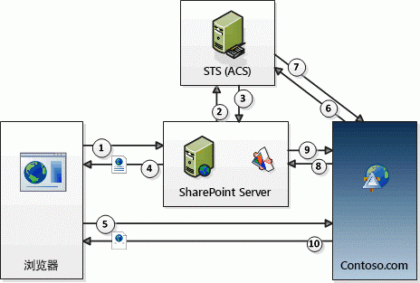

# SharePoint 外接程序的上下文令牌 OAuth 流
了解有关针对 SharePoint 中提供程序托管的低信任外接程序的 OAuth 身份验证和授权流。
## 获取 OAuth 和 SharePoint 提供程序承载的 SharePoint 外接程序的概述

在 SharePoint 中， **针对提供程序托管的低信任外接程序的 OAuth 身份验证和授权流包含外接程序、SharePoint、授权服务器和浏览器之间** 在运行时的一系列交互。此方案中的授权服务器是 Microsoft Azure 访问控制服务 (ACS)。

在提供程序托管的外接程序中，您具有一个与 SharePoint 分开，而不属于 SharePoint 服务器场或 SharePoint Online 租户的远程 Web 应用程序或服务。它可以托管在云中或本地服务器上。在本文中，远程组件称为 Contoso.com。

> **注释**
> 远程组件也可以承载对 SharePoint 项目所发生的事件做出响应的事件接收器，例如列表或列表项。Contoso.com 可能会响应的远程事件示例包括列表事件，如添加或删除列表项；或 Web 事件，如添加或删除网站。有关如何创建远程事件接收器的详细信息，请参阅 [在 SharePoint 外接程序中创建远程事件接收器](create-a-remote-event-receiver-in-sharepoint-add-ins.md)。 

Contoso.com 使用 SharePoint 客户端对象模型 (CSOM) 或 SharePoint REST API 调用 SharePoint。Contoso.com 应用程序使用 OAuth 令牌传递流向 SharePoint 进行身份验证。 **SharePoint 和 Contoso.com 相互不信任，但都信任 ACS** 并将接受 ACS 颁发的令牌。涉及三种令牌：SharePoint 让 ACS 创建上下文令牌，将 SharePoint 转发到 Constoso.com。Contoso.com 验证 ACS 颁发的上下文令牌，使其信任它。然后 Contoso.com 从上下文令牌提取刷新令牌，并使用刷新令牌直接从 ACS 获取访问令牌。它将访问令牌包含在对 SharePoint 的所有请求中。SharePoint 验证访问令牌由 ACS 颁发，从而对从 Contoso.com 发出的请求做出响应。

 **您在远程组件中提供令牌处理代码** 。（但是，如果您的远程组件托管在 .NET 上，Visual Studio Microsoft Office 开发人员工具 将提供示例代码，为您执行大部分工作。）有关令牌处理代码的详细信息，请参阅 [在提供程序托管的低信任 SharePoint 外接程序中处理安全令牌](handle-security-tokens-in-provider-hosted-low-trust-sharepoint-add-ins.md)。

## 完成使用流的先决条件

必须完成一些初步步骤，SharePoint 外接程序才能使用上下文令牌流。

- 如果 SharePoint 外接程序将安装在内部部署 SharePoint 服务器场上，有些设置要求将不适用于仅安装到 SharePoint Online 的情况：

  - **服务器场必须配置** 为支持外接程序。（这实际上是要求在服务器场安装任何 SharePoint 外接程序，即使它们不使用上下文令牌流。）有关详细信息，请参阅 [为 SharePoint 外接程序配置环境](http://technet.microsoft.com/zh-cn/library/fp161236%28v=office.15%29.aspx)。

  - **安装此外接程序的** 客户 **必须具有 Office 365 帐户** 。这是获取 ACS 访问权限的必要条件。客户无需将其帐户用于任何其他目的。

  - 服务器场必须配置为共享 Office 365 与 ACS 之间的信任关系。这可以通过 Windows PowerShell 脚本轻松实现。有关详细信息，请参阅 [使用 Office 365 SharePoint 网站在本地 SharePoint 网站中对提供程序托管的外接程序进行授权](use-an-office-365-sharepoint-site-to-authorize-provider-hosted-add-ins-on-an-on.md)。

- 不论外接程序是安装到 SharePoint Online 还是本地 SharePoint 服务器场， **SharePoint 外接程序都必须在 ACS 中注册** 。有关如何执行此操作的详细信息，请参阅 [注册 SharePoint 2013 外接程序](register-sharepoint-add-ins-2013.md)。除此之外，外接程序提供 ACS，将其客户端 ID 和客户端密码作为注册的一部分。

## 参阅上下文令牌流中的步骤

下图中显示了针对 SharePoint 提供程序托管的外接程序的 OAuth 身份验证和授权流。

**OAuth 上下文令牌流**

下列步骤与图中的数字对应：

1. 用户从 SharePoint 启动 SharePoint 外接程序。外接程序的设计决定了如何执行此操作：

  - 如果外接程序设计为在外接程序部件（本质上是关于 **IFRAME** 的包装程序）中显示远程 Web 应用程序（在 Contoso.com 上），那么启动外接程序就是表示导航到包含外接程序部件的 SharePoint 页面。（如果用户尚未登录，SharePoint 将提示用户登录。）SharePoint 处理页面并检测到页面上有一个 Contoso.com 应用程序中的组件。（有关外接程序部件的详细信息，请参阅 [创建外接程序部件以安装 SharePoint 外接程序](create-add-in-parts-to-install-with-your-sharepoint-add-in.md)。）

  - 如果外接程序设计为在浏览器中使用完整页面，用户可通过在 SharePoint 网站的 **Site Contents**页面上单击外接程序磁贴来启动此外接程序。（一种变体是，当外接程序包含启动远程组件的自定义菜单或功能区项目时。）

2. 不论外接程序如何启动，SharePoint 必须获取可以发送到 Contoso.com 应用程序的上下文令牌，因此它要求 ACS 创建包含 SharePoint 上下文相关信息的上下文令牌，其中包括当前用户、远程应用程序 URL 和其他信息。上下文令牌还包含加密刷新令牌。

3. ACS 签署上下文令牌以及使用 Contoso.com 外接程序密码的算法，并将其返回到 SharePoint。只有 ACS 和 Contoso.com 外接程序知道密码。

4. 如果 Contoso.com 应用程序显示在外接程序部件中，SharePoint 将呈现托管外接程序部件的页面，并将上下文令牌添加到外接程序部件调用中的 **IFRAME** 以获取其内容的 URL。如果 Contoso.com 应用程序为完整页面，SharePoint 会将浏览器重定向到 Constoso.com 并将上下文令牌包含为重定向响应的一部分。

5. 上下文令牌包含在将发送到 Contoso.com 服务器的浏览器请求中。

6. Contoso.com 服务器获取上下文令牌并验证它可以执行的签名，因为它知道客户端机密。这可向 Contoso.com 保证令牌由 ACS 颁发，而不是冒充 SharePoint 的骗子。Contoso.com 从上下文令牌中提取刷新令牌，并通过请求将允许其访问 SharePoint 的访问令牌的形式，将其与其他信息（包括客户端 ID 和客户端机密）一起发送到 ACS。

7. ACS 验证刷新令牌，确保令牌由 ACS 颁发，然后将访问令牌返回到 Contoso.com。Contoso.com 可以选择缓存此访问令牌，因此不会在每次访问 SharePoint 时都要求 ACS 提供访问令牌。默认情况下，访问令牌一次适合缓存几小时。（截至本文撰写时，ACS 颁发的 SharePoint 访问令牌的默认过期时间为 12 小时，但这可能会更改。）每个访问令牌仅供在初始授权请求中指定的用户帐户使用，仅授予对该请求中指定的服务（本示例中为 SharePoint）的访问权限。刷新令牌的有效期更长（截至本文撰写时为六个月），并且也可以缓存。因此，同一个刷新令牌可以从 ACS 兑换新的访问令牌，直到刷新令牌本身过期。（有关缓存令牌的详细信息，请参阅 [在提供程序托管的低信任 SharePoint 外接程序中处理安全令牌](handle-security-tokens-in-provider-hosted-low-trust-sharepoint-add-ins.md)。）当刷新令牌过期时，Contoso.com 可以通过获取新的上下文令牌，获取一个新的刷新令牌。有关如何执行此操作的详细信息，请参阅 [获取新的上下文令牌](handle-security-tokens-in-provider-hosted-low-trust-sharepoint-add-ins.md#GetNewContextToken)。

8. Contoso.com 使用访问令牌发出 SharePoint REST API 调用或对 spnv 的 CSOM 请求。它通过在 HTTP **Authorization** 头中传递 OAuth 访问令牌来执行此操作。（如果您的远程组件承载在 .NET 平台上，则创建头的示例代码在 Visual Studio Office 开发人员工具 中提供。）

9. SharePoint 验证访问令牌，确保其由 ACS 颁发，然后它将 Contoso.com 请求的数据的发送到 Contoso.com，或执行 Contoso.com 请求的创建、读取、更新或删除 (CRUD) 操作，

10. Contoso.com 应用程序页面在浏览器（或外接程序部件的 **IFRAME**）中显示。

## 其他资源

-  [SharePoint 外接程序的授权和身份验证](authorization-and-authentication-of-sharepoint-add-ins.md)

-  [SharePoint 2013 中的外接程序权限](add-in-permissions-in-sharepoint-2013.md)

-  [SharePoint 外接程序体系结构的重要方面和开发前景](important-aspects-of-the-sharepoint-add-in-architecture-and-development-landscap.md)

-  [开始创建 SharePoint 承载的 SharePoint 外接程序](get-started-creating-sharepoint-hosted-sharepoint-add-ins.md)

