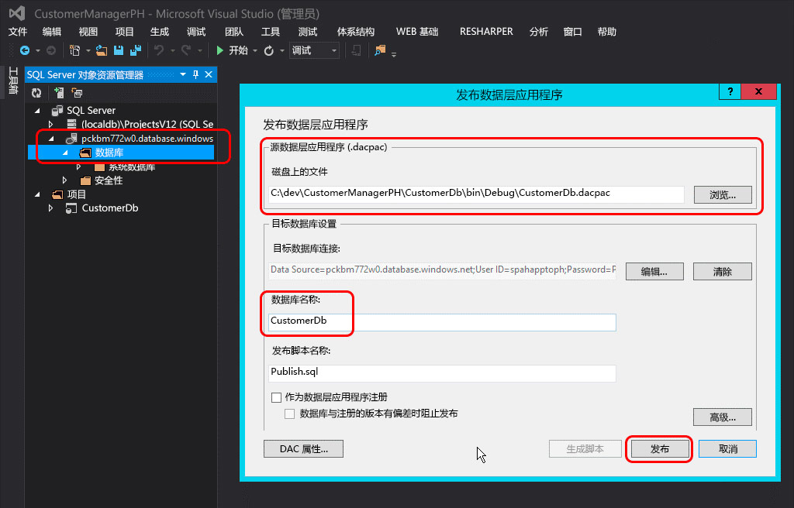

# 将自动托管的 SharePoint 外接程序转换为提供商托管的外接程序
了解如何将自动托管的 SharePoint 外接程序转换为提供程序托管的外接程序。
除了前面使用基于解决方案的自定义项的方法之外，Microsoft SharePoint 2013 还引入了一种用来扩展 SharePoint 网站的新方法。这种用于 SharePoint 的新扩展模型称为外接程序模型，它使开发人员无论在本地、SharePoint Online，还是在混合部署中运行，都能够创建可部署到 SharePoint 环境中的自定义实现。

开发人员可以构建两种不同类型的 SharePoint 外接程序。第一种类型是 SharePoint 托管的外接程序，主要运行在浏览器中；支持它的所有资产（如 HTML、CSS、图像和 JavaScript）都由 SharePoint 进行存储和支持。另一种类型的外接程序属于云外接程序模型 (CAM)，主要在 SharePoint 之外的另一台服务器上运行，使用客户端对象模型 (CSOM) 和 REST API 与 SharePoint 进行通信。他们建立使用 SharePoint 2013 所支持的通用 OAuth 2.0 协议的标识。
开发人员可以使用外接程序模型以提供程序托管的外接程序或自动托管的外接程序这两种方式中任一方式来实现外接程序。当 SharePoint 2013 发布时自动托管的外接程序发布为预览计划，但在 2014 年 5 月，Microsoft 宣布他们将关闭预览计划，不再支持创建自动托管的外接程序。有关通知的信息，请参阅 [自动托管的外接程序的预览计划更新](http://blogs.office.com/2014/05/16/update-on-autohosted-apps-preview-program/)。

本文介绍了如何将自动托管的外接程序转换和迁移到提供程序托管的外接程序。然而，重要的是开发人员要理解这两种方法之间的一些特定差异，因为具备这方面的知识可以大大简化转换过程。
## 将自动托管的外接程序转换为提供程序托管的外接程序的先决条件

- 开发提供程序托管的外接程序的所有 [先决条件](get-started-creating-provider-hosted-sharepoint-add-ins.md#SP15createselfhostapp_bk_prereq)。

- Azure SDK v2.3。从此处的 [下载中心页面](http://azure.microsoft.com/downloads)安装它。

### 要了解的核心概念。

将自动托管的外接程序转换为提供程序托管的外接程序之前，应当对 SharePoint 外接程序以及 SharePoint 托管的、提供程序托管的、自动托管的 SharePoint 外接程序有一个基本的了解。您可以通过表 1 中所列的文章了解这些信息。

**表 1. 将自动托管的外接程序转换为提供程序托管的外接程序的核心概念**

|**文章标题**|**说明**|
|:-----|:-----|
| [SharePoint 外接程序](sharepoint-add-ins.md)   |了解 SharePoint 2013 中新的外接程序模型，您可以利用此模型来创建对最终用户来说是小型的易于使用的解决方案的外接程序。    |
| [SharePoint 外接程序体系结构的重要方面和开发前景](important-aspects-of-the-sharepoint-add-in-architecture-and-development-landscap.md)   |了解 SharePoint 外接程序和 SharePoint 外接程序的模型的体系结构的各个方面，包括外接程序托管选项、用户界面 (UI) 选项、部署系统、安全系统和生命周期。    |
| [为开发和托管 SharePoint 外接程序选择模式](choose-patterns-for-developing-and-hosting-your-sharepoint-add-in.md)   |了解您可以托管 SharePoint 外接程序的各种方式。    |
| [SharePoint 2013 中的主机 Web、外接程序 Web 和 SharePoint 组件](host-webs-add-in-webs-and-sharepoint-components-in-sharepoint-2013.md)   |了解主机 Web 和外接程序 Web 之间的差异。另外了解 SharePoint 外接程序中可以包含哪些 SharePoint 2013 组件，哪些已部署到主机 Web 中，哪些已部署到外接程序 Web 中，以及如何在独立的域中部署外接程序 Web。    |
 

## 转换外接程序

将自动托管的 SharePoint 外接程序转换为提供程序托管的外接程序会涉及对两个或三个组件的修改。

- SharePoint 外接程序本身

- 远程 Web 应用程序或服务

- 外接程序中的 Microsoft Azure SQL 数据库（如果有）

安装时，SharePoint 自动托管的外接程序自动部署 Azure 网站和 Microsoft Azure SQL 数据库，但提供程序托管的外接程序可以有自己的远程 Web 应用程序，并且其他服务可存在于任何 Web 平台。本文假定自动托管外接程序的远程组件仍是遵循向提供程序托管的外接程序转换的 Azure 服务。

以下各部分逐步介绍将一个自动托管的外接程序转换为提供程序托管的外接程序的过程。为了着重介绍转换步骤而非实际的外接程序，该示例中使用的自动托管外接程序 - Customer Manager - 简单易懂。它由三个项目组成：

- CustomersDb：将生成必要 *.dacpac 的 SQL 数据库项目。请注意，此项目中没有已定义的架构。它只用于创建数据库，因为架构是由 ASP.NET Web 应用程序创建的。

- CustomerManagerAH：SharePoint 自动托管的外接程序，配置为将 ASP.NET Web 应用程序项目和 Azure SQL 数据层应用程序包含在生成的 SharePoint 外接程序包中 。

- CustomerManagerAHWeb：ASP.NET MVC Web 应用程序，使用 Entity Framework Code First 迁移方法来创建数据库架构以及对数据库进行读取和写入。

该外接程序是一个 ASP.NET MVC Web 应用程序，既可以显示 Microsoft Azure SQL 数据库表中的客户，也能够添加新客户。这是一个使任何人都可查看或添加客户的匿名 Web 应用程序。可以从以下公共库下载用于自动托管的外接程序和相关项目的 Visual Studio 解决方案： [Autohosted-Migration-Code-Samples](https://github.com/OfficeDev/Auto-Hosted-Migration-Code-Samples)。

将 SharePoint 2013 自动托管的外接程序转换为提供程序托管的外接程序包含多个步骤。以下各节列出了这些步骤。

1. 部署 Microsoft Azure SQL 数据库

2. 创建用于托管远程 Web 应用程序的 Azure 网站

3. 使用您的 SharePoint 网站注册外接程序

4. 更新和部署用于远程 Web 应用程序的 Azure 网站

5. 更新和部署 SharePoint 提供程序托管的外接程序

### 部署 Azure SQL 数据库

将自动托管的外接程序转换为提供程序托管的外接程序的第一步是部署 ASP.NET Web 应用程序将依赖的 Microsoft Azure SQL 数据库。创建 Microsoft Azure SQL 数据库有许多不同方法，有些方法记录在 Microsoft Azure 文档网站上： [如何将数据库部署到 Azure](http://azure.microsoft.com/documentation/articles/sql-database-deploy/)。

以下步骤中所述方法使用数据层应用程序部署模式，因为这是将数据库部署在 SharePoint 自动托管的外接程序中的方法。这涉及到生成数据层应用程序包 (*.dacpac) 和使用它来创建数据库。

#### 创建和部署 Azure SQL 数据库

首先在 Visual Studio 中打开自动托管的解决方案。右键单击数据库项目"CustomerDb"，然后选择"生成"。这将在  `[..]\\bin\\[debug | release]` 文件夹中生成 CustomerDb.dacpac 文件。

下一步将创建新的 Microsoft Azure SQL 数据库。登录到"Azure 管理门户"(https://manage.windowsazure.com)，并在加载仪表板后，选择边缘中的"SQL 数据库"链接：

**Azure 管理门户中的 Azure SQL 数据库仪表板**

单击顶部导航栏中的"服务器"链接，然后单击页脚的"添加"按钮，如下图所示：

**Azure 管理门户中的 Azure SQL 数据库仪表板**

在出现的"创建服务器"对话框中，为将有权访问服务器的用户选择 Azure"订阅"、"登录名"和"密码"，然后选择在之前创建 Azure 网站时使用的同一"区域"。记下登录名和密码以供后面的步骤使用。

**在 Azure 管理门户中创建 Azure SQL 数据库**

填写表单后，单击右下方的"检查图标"，以创建数据库。虽然现在创建了服务器，但可以访问它的唯一资源是其他 Azure 服务。记下 Microsoft Azure SQL 数据库的名称以供后面的步骤使用。

为了连接 Microsoft Azure SQL 数据库并部署该数据库，必须创建防火墙规则，让来自将部署数据库的计算机流量可以通过。否则会因类似于下图中的错误而被拒绝连接到 Microsoft Azure SQL 数据库。

**连接到 Azure SQL 数据库时出错**

若要在"Azure 管理门户"中创建防火墙规则，请选择之前创建的 Microsoft Azure SQL 数据库，然后单击顶部导航栏中的"配置"链接。在"允许的 IP 地址"部分下，您的 IP 地址当前显示如下图所示。单击"添加到允许的 IP 地址"添加防火墙规则。这样就可以连接到 Microsoft Azure SQL 数据库，并可以部署该数据库。请确保单击页脚的"保存"按钮。

**在 Azure 管理门户中为 Azure SQL 数据库创建防火墙规则**

下一步是部署数据库。可以使用 Azure SDK v2.3 从 Visual Studio 来实现该操作。从此 [下载中心页](http://azure.microsoft.com/downloads)对其进行安装。在 Visual Studio 中打开"SQL Server 对象资源管理器"工具窗口，右键单击"SQL 服务器"节点并选择"添加 SQL 服务器"：

**在服务器资源管理器中添加 Azure SQL 数据库**

在"连接到服务器"对话框中，输入"服务器名称"，将"身份验证"设置为"SQL Server 身份验证"，然后输入与创建 Microsoft Azure SQL 数据库时定义的相同的"登录"和"密码"。服务器名称应当是该服务器的完全限定名称，即  `[server-name].database.windows.net`，如下图所示：

**在 Visual Studio 中连接 Azure SQL 数据库**

连接到 Microsoft Azure SQL 数据库之后，为新添加的服务器扩展节点，在"数据库"节点上右键单击，并选择"发布数据层应用程序"以弹出发布向导。

在"源数据层应用程序 (.dacpac)"中，使用"浏览"按钮找到上一步骤中构建数据库项目时生成的 *.dacpac 文件，并确保将"数据库名称"设置为 CustomerDb，然后单击"发布"来发布 Microsoft Azure SQL 数据库中的 CustomerDb。

**使用 Visual Studio 将数据层应用程序发布到 Azure SQL 数据库**

刷新 Visual Studio"SQL Server 对象资源管理器"工具窗口查看"数据库"节点下列出的 CustomerDb。

> **注释**
>  根据针对自动托管的外接程序创建数据库的方式，可能需要做一些额外工作将其部署到 Azure。请参阅以下 MSDN 文章获取其他指南：>  [Converting between Data-tier Application Projects and Database Projects](http://msdn.microsoft.com/library/40b51f5a-d52c-44ac-8f84-037a0917af33.aspx)>  [Creating &amp; Managing Data-Tier Application](http://msdn.microsoft.com/library/18907b6c-7678-4182-9304-fe56fdb9f0bd.aspx)

#### 部署后操作

创建了 Microsoft Azure SQL 数据库之后，复制用于建立到数据库的连接的连接字符串。有两种方法可以实现此操作。一种方法是登录到"Azure 管理门户"(https://manage.windowsazure.com) 并导航到最后步骤中创建的 Microsoft Azure SQL 数据库：CustomerDb。在该数据库的"仪表板"页面上，单击"显示连接字符串"链接查看连接字符串列表。复制"ADO.NET"连接字符串以便以后使用。

**从 Azure 管理门户获取 Azure SQL 数据库连接字符串**

假如安装了 Azure SDK v2.3，则另一种方法是从 Visual Studio 中获取连接字符串。在 Visual Studio 中的"SQL Server 对象资源管理器"工具窗口中，选择数据库"CustomerDb"。选择该数据库后，查看"属性"工具窗口，以查看连接字符串。它具有与以上"Azure 管理门户"中相同的值。

**通过 Azure SDK 从 Visual Studio 获取 Azure SQL 数据库连接字符串**

### 创建 Azure 网站

下一步是创建新的 Azure 网站，其中将驻留用于提供程序托管的外接程序的远程 Web 应用程序。这是首先要做的事情，因为注册外接程序之前需要远程 Web 应用程序的 URL。但是，在 SharePoint 中注册外接程序要先于部署 ASP.NET Web 应用程序的文件，因为部署 ASP.NET Web 应用程序文件之前需要从注册过程获得两个输出（客户端 ID 和客户端密码）。

若要创建一个新的 Azure 网站，首先要登录到"Azure 管理门户"(https://manage.windowsazure.com)。当加载仪表板时，单击左边距中的"网站"导航链接，然后单击页脚的"新建"按钮，如下图所示：

**Azure 管理门户中的 Azure 网站仪表板**

接下来，在新网站向导中选择"计算"、"网站"、"快速创建"，然后指定一个"URL"和"Web 宿主计划"。最后指定要创建网站的"区域"。请务必记住所选的区域，因为在后面创建 Microsoft Azure SQL 数据库时还要用到同一个区域。另外，如果目前 Web 宿主计划尚不存在或需要新建一个 Web 宿主计划，请选择"创建新的 Web 宿主计划"选项。下图显示了一个示例。

**在 Azure 管理门户中创建 Azure 网站**

创建了 Azure 网站之后，请记下该网站所使用的 URL。在上图中，创建的网站是  `http://spahapptoph.azurewebsites.net`。

### 注册新外接程序

使用外接程序模型创建的所有 SharePoint 外接程序都必须使用托管 SharePoint 场或租户进行注册，以便能够在 SharePoint 和远程 Web 应用程序之间建立信任。这涉及到通过使用 SharePoint 指定下列值来注册一个新的外接程序主体：

- **客户端 ID** - 外接程序 ID

- **客户端密码** - 外接程序密码

- **标题** - 外接程序的名称

- **外接程序域** - 远程 Web 应用程序的顶级域

当自动托管的外接程序安装在 SharePoint Online 中时，Office 365 会自动创建外接程序主体。它知道远程 Web 应用程序的 URL，因为它自动创建该站点。它还会获取客户端 ID 和客户端密码，并将它们添加到远程 Web 应用程序的 web.config。Microsoft 提供的类（在 TokenHelper.cs 或 .vb 文件中）在通过 SharePoint 验证请求和进行身份验证时可从 web.config 中寻找客户端 ID 和客户端密码。

但是，在提供程序托管的外接程序中，开发人员必须手动注册外接程序，并手动更新 ASP.NET Web 项目中的 web.config。

若要注册新的外接程序，请浏览从其中安装该外接程序的 SharePoint 网站的外接程序注册页面。此页面位于  `http://[SharePoint-site-url]/_layouts/15/appregnew.aspx` 中。在外接程序注册页面上，将"外接程序类型"设置为"在 Web 服务器上运行的外接程序"，然后单击两个"生成"按钮创建一个新的"客户端 ID"和"客户端密码"。在"标题"字段中输入该外接程序的名称，并输入在上一步的"外接程序域"字段中所创建的目标 Azure 网站的 URL。最后，单击"创建"按钮。

注册了该外接程序之后，SharePoint 将显示表单中用于创建注册的信息摘要。非常重要的是，复制这些信息妥善进行保管，特别是复制客户端 ID 和客户端密码，因为在后面的步骤中会需要这些信息。

### 远程 Web 应用程序/Azure 网站配置更改

下一步是重新配置远程 Web 应用程序，以便它可以部署为提供程序托管的外接程序，而不是自动托管的外接程序。有多种方法可将 ASP.NET 站点部署到 Azure 网站，包括直接从 Visual Studio 部署、自动从 Visual Studio Online 之类的源控件部署，或从 GitHub 部署，甚至使用尝试性的真正 FTP 选项来部署。本文使用的是 Visual Studio。但是，在开始部署 Web 应用程序之前，首先需要进行一些更新，以便能够同时使用提供程序托管的外接程序。

#### 更新远程 Web 应用程序项目

需要在 ASP.NET MVC Web 应用程序中进行的大型更改存在于 web.config 文件中。在此文件中，有三个设置位于 **<appSettings>** 节点中。它们是 **ClientId**、 **ClientSecret** 和 **SqlAzureConnectionString**。前两个供 Microsoft 提供的类（在 TokenHelper.cs 或 .vb 中）使用，以便进行身份验证及从远程 Web 应用程序与 SharePoint 进行通信。后者 ( `SqlAzureConnectionString`) 供该外接程序使用，以连接到 Microsoft Azure SQL 数据库。

在 SharePoint 自动托管的外接程序中，安装该外接程序时会创建 Azure 网站和 Microsoft Azure SQL 数据库，与此同时，Office 365 会填充这些设置的值。但是，在提供程序托管的外接程序中，在部署该外接程序之前，必须手动设置这些值。

一个选项是粘贴用于上述步骤中的三个设置的值，但这种方法的缺点是，如果它们需要更改，就需要手动将 web.config 更新并重新部署到 Azure 网站。

另一个选项是简单地清除这些设置（原地保留设置键，仅将 **value=""** 属性设置为一个空字符串），转为通过"Azure 管理门户" 在 Azure 网站设置中对它们进行定义。这种方法意味着可以在不更新基本代码的情况下更改设置。

为此，登录到"Azure 管理门户"(https://manage.windowsazure.com)，并导航到在之前的步骤中创建的 Azure 网站。在 Azure 网站仪表板页面上，单击顶部导航菜单中的"配置"，然后向下滚动到"外接程序设置"部分。使用相同的设置名称从 web.config 文件添加三个新的外接程序设置。对 ClientId、ClientSecret 和 SqlAzureConnectionString 使用之前步骤中获得的值。

确保 Microsoft Azure SQL 数据库连接字符串正确有效，因为当连接字符串通过"Azure 管理门户"和 Visual Studio 而暴露时，密码属性将用掩码替换。应将连接字符串中的掩码密码更改为使用在为 Microsoft Azure SQL 数据库创建登录时所定义的正确密码。

#### 将远程 Web 应用程序部署到 Azure 网站

现在需要将 ASP.NET MVC Web 应用程序文件部署到 Azure 网站作为远程 Web 应用程序。在 Visual Studio 中，右键单击该 Web 项目，然后选择"发布"。这会启动"发布 Web"向导对话框。在该对话框中选择"Windows Azure 网站"选项，然后单击"发布"。

**Visual Studio 的发布 Web 对话框**

在接下来的步骤中，选择在上一步骤中创建的 Azure 网站的名称，如下图所示，单击"确定"，并确保站点的 URL 是 HTTPS。

**将 ASP.NET Web 应用程序发布到现有的 Azure 网站**

在最后的步骤中，单击"验证连接"按钮确保设置和连接的工作顺序是正确的，最后单击"发布"。这会触发 Visual Studio 将 ASP.NET Web 应用程序部署到 Azure 网站。

部署了网站之后，Visual Studio 将启动默认的调试浏览器，然后导航到 Azure 网站。但是网站会显示错误。这是因为 ASP.NET MVC 控制器附有一个属性（特别是  `SharePointContextFilter`），该属性希望 SharePoint 能够在 HTTP POST 请求的标头中将特定值发送到该控制器，但默认情况下，该浏览器会启动 HTTP GET 请求，所以预计会出现此错误。

> **注释**
> 请参阅 Azure 文档了解将 ASP.NET Web 应用程序部署到 Azure 网站的其他选项： [如何部署 Microsoft Azure 网站](http://azure.microsoft.com/documentation/articles/web-sites-deploy)。 

#### 部署后操作

下一步是复制该站点的 URL。

#### Azure 网站的自定义域和 SSL 证书

所有 Azure 网站都使用以下命名约定： `http[s]://[site-name].azurewebsites.net`。Microsoft 已经将通配符 SSL 证书添加到  `*.azurewebsites.net` 域下的所有网站，但客户可以使用自己的 Azure 网站自由地与自定义域关联，也可以将自己的 SSL 证书用于这些自定义域。

有关使用自定义域的信息，请参阅 Azure 文档： [为 Microsoft Azure 网站配置自定义域名](http://azure.microsoft.com/documentation/articles/web-sites-custom-domain-name)。有关为自定义域名添加自定义 SSL 证书的信息，请参阅 Azure 文档： [为 Microsoft Azure 网站启用 HTTPS](http://azure.microsoft.com/documentation/articles/web-sites-configure-ssl-certificate)。

### 重新配置 SharePoint 外接程序项目

最后一步是重新配置 SharePoint 外接程序项目。用于 SharePoint 外接程序的 Visual Studio 项目已将外接程序类型配置为自动托管。首先通过打开 SharePoint 外接程序项目中的 AppManifest.xml 文件，以及将"托管类型"选项从"自动托管"更改为"提供程序托管"，来将此类型从自动托管更改为提供程序托管。

此外，将外接程序的"起始页"设置为指向作为 Azure 网站的 URL 的远程 Web 应用程序的起始页的 URL。请确保包含查询字符串值 {StandardTokens}（如果它尚未存在）。这确保了 SharePoint 在打开远程 Web 应用程序时将核心查询字符串令牌添加到该 URL。

接下来，通过在 Visual Studio "解决方案资源管理器"中和在"属性"工具窗口中选择 SharePoint 外接程序项目，将"Web 项目"属性设置为"(无)"，从而删除在 SharePoint 外接程序项目中对 ASP.NET MVC Web 应用程序的引用，如图 20 所示：

**从 SharePoint 外接程序包删除远程 Web 应用程序**

最后一步需要对 AppManifest.xml 文件进行手动更新，因为某些设置不会显示在设计器中。为此，将任何现有更改保存到 AppManifest.xml 文件，然后右键单击"解决方案资源管理器"中的同一个文件，然后选择"查看代码"。

**在代码视图中打开 AppManifest.xml 文件**

在 AppManifest.xml 文件的代码视图中，删除对 ASP.NET MVC Web 应用程序项目和 SQL 数据层应用程序项目的两个引用，因为 SharePoint 提供程序托管的外接程序不再需要这些引用。

接下来，创建新的 GUID，并替换 **ProductId** 属性中现有的 GUID。这会告知 SharePoint 它是一个新的外接程序，而不是对现有外接程序的更新。

> **重要信息**
> 如果现有的 ProductId 已被使用，则在安装已转换的外接程序时，SharePoint 将返回"提供的外接程序与相同版本的其他外接程序及产品 ID 不同"的错误。 

然后找到 **<RemoteWebApplication>** 元素并更新 **ClientId** 属性，使之与使用 SharePoint 注册外接程序时获得的 GUID 以及在 Azure 网站的 web.config 外接程序设置中使用的 GUID 相同。

**为 SharePoint 提供程序托管的外接程序设置 ClientId**

将所有更改都保存到 AppManifest.xml 文件之后，该外接程序现在可作为一个 SharePoint 提供程序托管的外接程序进行测试。将该外接程序部署到 SharePoint 场或 SharePoint Online 站点以验证转换步骤都已正确执行。

## 其他资源

有关 SharePoint 外接程序模型、SharePoint 托管的外接程序或外接程序模型的详细信息，请关注  [Office 开发人员博客](http://blogs.office.com/dev/)，以了解有关开发工具、脚本和实用工具的资讯和更新，从而帮助创建 SharePoint 外接程序以及将自动托管的外接程序迁移到提供程序托管的外接程序。

